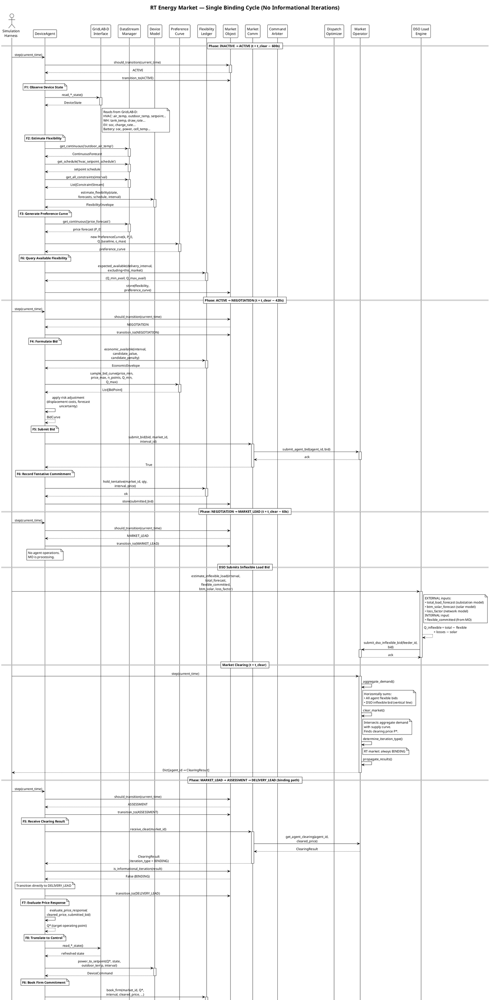
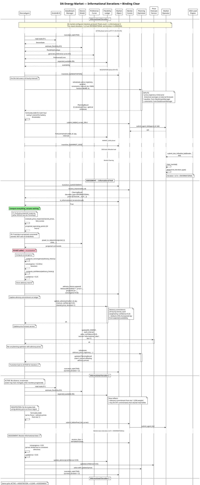
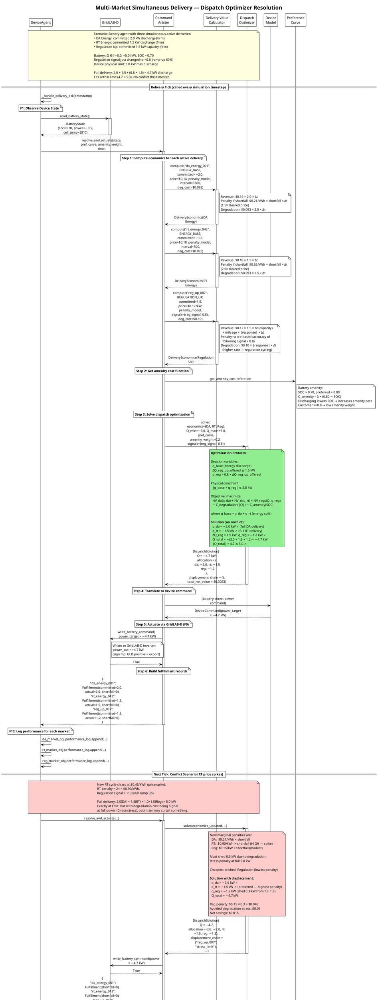
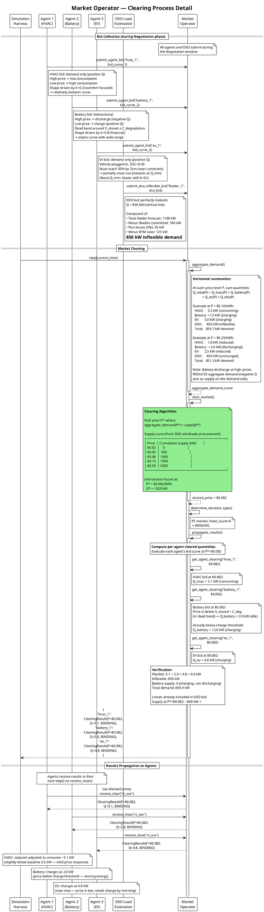
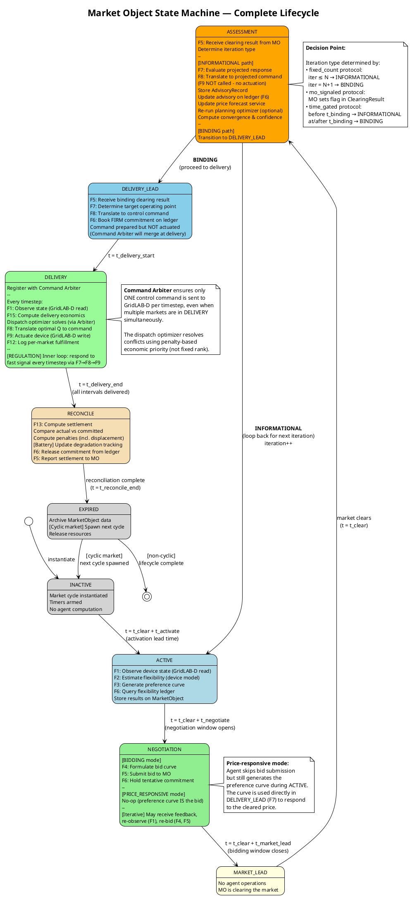
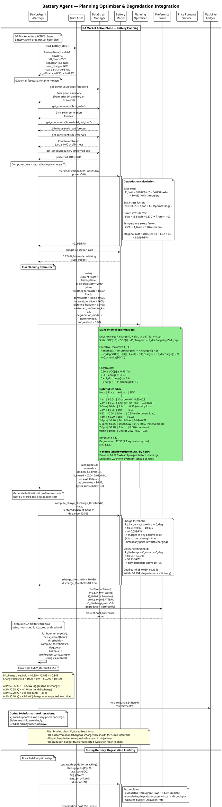
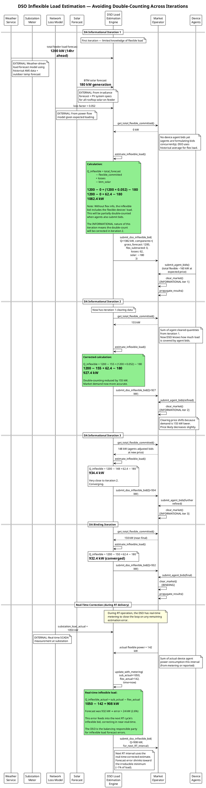
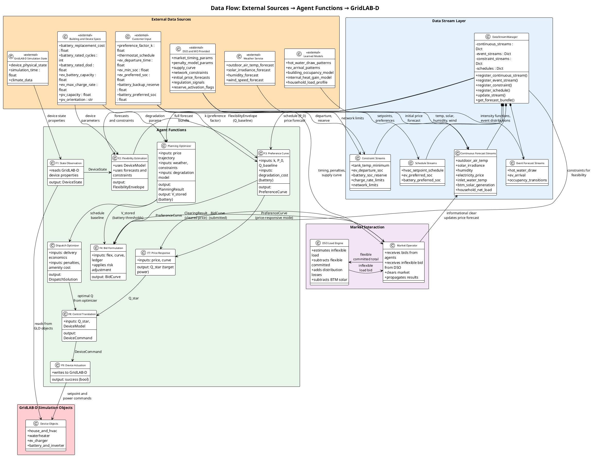

### USER
I need to design a software agent that is responsible for managing the interaction of a physical device (HVAC system, water heater, EV charger) with an electricity retail market. The initial design will use GridLAB-D to simulate the physics of the device and will represent “reality” for the purposes of the broader simulation in which the agent will operate. The agent is responsible for formulating a price-quantity bid curve represented by a list of points based on the current operating state of the device and customer preferences, trading off device amenity (for example, indoor air temperate in the case of an HVAC) for financial benefit and submitting it to a real-time retail energy market operator, also represented as a discrete software entity, the distribution system operator (DSO) market operator (MO). The customer preference should be provided to the device agent as an input as a factor between 0 and 1 with 0 representing preference for amenity and 1 representing the preference for financial benefit. This preference should be translated into the elasticity parameter on an isoelastic curve. The MO takes all the bids from all the device agents and also the supply curve provided to it, clear the retail market, and propagate a cleared price back to all the device agents. The device agents then take this price and change their device control settings in accordance with the provided price and their previous expressed bid.
The device agent code should be modular in a few specific ways:
*   Support the ability for the device to participate in multiple power system markets: for example, real-time energy, day-ahead energy, frequency regulation, spinning reserve.
    
*   Support the ability for the device to skip the bidding process and just respond to provide prices based on the defined isoelastic preference curve. This preference curve is effectively the bid curve.
    
  
Can you define the major software functions of the device agent that are necessary?

### ASSISTANT
<details type="reasoning" done="true" duration="60">
<summary>Thought for 60 seconds</summary>
&gt; The user wants me to design a software agent for managing physical devices (HVAC, water heater, EV charger) interacting with an electricity retail market. Let me think through the major software functions carefully.
&gt; 
&gt; Key requirements:
&gt; 1. Uses GridLAB-D for device physics simulation
&gt; 2. Formulates price-quantity bid curves based on device state and customer preferences
&gt; 3. Customer preference: 0 (amenity) to 1 (financial benefit) → maps to elasticity on isoelastic curve
&gt; 4. Submits bids to DSO Market Operator (MO)
&gt; 5. Receives cleared price and adjusts device control settings
&gt; 6. Modular design:
&gt;    - Support multiple markets (RT energy, DA energy, freq reg, spinning reserve)
&gt;    - Support price-responsive mode (skip bidding, just respond to prices using preference curve)
&gt; 
&gt; The agent runs in a continuous cycle: pulling device state from GridLAB-D, generating bids based on current conditions and customer preferences, submitting those bids to the market, receiving the cleared price, and then translating that price back into device control commands. I need to break this down into distinct software modules that can handle different market types and operate in either bidding mode or pure price-response mode.
&gt; 
&gt; For device observation, I&#x27;m querying GridLAB-D for the relevant state variables—temperature and power for HVAC, tank temperature and demand for water heaters, state of charge and charging rate for EVs—through an abstract interface that each device type implements. Then I maintain an internal model of that state, estimate how it&#x27;ll evolve over time using thermal dynamics or similar physics, and calculate how much flexibility the device actually has and what comfort metrics matter. Finally, I&#x27;m generating the preference curve by taking the customer&#x27;s elasticity parameter and mapping device state to willingness to consume at different price points using an isoelastic demand function.
&gt; 
&gt; The core economic model uses that isoelastic curve to relate quantity to price, then for each market the device participates in, I determine the relevant power range and time horizon, generate price-quantity points from the curve, and package them into the market&#x27;s specific bid format. I&#x27;m maintaining an abstract market interface that handles bid submission, receives cleared prices and quantities, and manages the different clearing intervals across markets. Once a price clears, I look it up on the bid curve to find the corresponding quantity and action, then translate that into device-specific control—adjusting the thermostat setpoint for HVAC or similar commands for other devices.
&gt; 
&gt; The system also needs a market participation manager to orchestrate across multiple markets, handle priority between them, and manage the different timing requirements like day-ahead bids versus real-time updates every five minutes. I&#x27;m loading customer preferences and device parameters during initialization, configuring market connections, and supporting two operating modes: a full bidding cycle where the device observes, bids, receives prices, and acts, or a simpler price-responsive mode that skips bidding and just responds to observed prices using the preference curve. Looking at the core architectural components, I need to map out how the agent orchestrates device flexibility into market participation—starting with how it observes device state, models what&#x27;s possible, translates customer preferences into demand curves, and then generates bids that get submitted to markets and converted back into control signals.
&gt; 
&gt; The tricky part is handling multiple market types simultaneously, since each market has different product definitions: real-time energy wants power quantities at various prices refreshed every five minutes, day-ahead needs hourly blocks for the next day, frequency regulation trades capacity with directional constraints and mileage costs, and spinning reserve is just available capacity within a response window. And then there&#x27;s the price-responsive path where the agent skips bidding entirely and just uses the preference curve as a direct response function when prices arrive.
&gt; 
&gt; Now I&#x27;m thinking through the core software modules needed. The device interface reads the current state from the simulator—temperature, power consumption, battery charge level, and so on. Then the flexibility model estimates what operating range is actually feasible given device constraints and how that translates to comfort or performance trade-offs, which is different for each device type. The preference model converts the customer&#x27;s preference factor into an elasticity parameter and generates the isoelastic demand curve that maps prices to quantities independent of any specific device state. Finally, the bid formulator takes that preference curve and combines it with the current device flexibility to produce actual price-quantity bid points, which shift dynamically as conditions change.
&gt; 
&gt; The market interface abstracts how the agent interacts with any market—formulating bids, submitting them, and receiving cleared prices and quantities. A multi-market coordinator sits above this to manage simultaneous participation across different markets, handling scheduling, resource allocation to avoid overcommitting flexibility, priority ordering, and tracking obligations. Once a price is determined—either from market clearing or an external signal—the price response function evaluates the preference curve to find the optimal operating point. the agent&#x27;s core responsibilities are to observe device state, estimate its flexibility, map customer preferences to an economic curve, formulate and submit bids to markets, receive cleared prices, determine the desired operating point, translate that into control commands, and actuate them on the device—all while coordinating across multiple markets and selecting between bidding or price-responsive modes. Configuration and initialization would handle loading device parameters, customer preferences, and market settings upfront.
&gt; 
&gt; Now I&#x27;m working through how to model the customer preference mathematically using an isoelastic demand curve, where the preference factor k maps to demand elasticity—with k=0 representing amenity-focused behavior (inelastic demand, always maintain comfort) and k=1 representing price-sensitive behavior (elastic demand, highly responsive to price signals). The scaling constant A would be calibrated based on the device&#x27;s physical characteristics.
&gt; 
&gt; For the actual bid curve, I need to combine this elasticity framework with the device&#x27;s current operating state and constraints to generate specific bid points. I&#x27;m thinking through the best way to organize this—breaking it down into distinct functional components like state observation, flexibility estimation, preference mapping, bid formulation, and market interfaces, then showing how they work together across different market types and the multi-market coordination layer.
&gt; 
&gt; Now I&#x27;m adding the remaining pieces: an operating mode manager to handle transitions between different control strategies, and an agent orchestration layer that schedules and coordinates everything across the system.
</details>
# Device Agent — Major Software Functions

Below is a decomposition into discrete, well-bounded functions. I organize them following the agent's natural sense–decide–act loop, then add the cross-cutting coordination and mode-management functions that satisfy your modularity requirements.

---

## 1. Device State Observation

**Purpose:** Acquire the current physical state of the device from the GridLAB-D simulation.

**Inputs:** GridLAB-D object handle / interface reference.

**Outputs:** A device-state structure containing all relevant physical variables.

| Device Type | Example State Variables |
|---|---|
| HVAC | Indoor air temp, outdoor air temp, thermostat setpoint, on/off status, power draw, thermal mass state |
| Water Heater | Tank temperature (upper/lower), hot water draw rate, element status, power draw |
| EV Charger | State of charge, charge rate, arrival/departure time, power draw |

**Notes:** This is an abstract interface with a concrete implementation per device type. It is the *only* function that reads from GridLAB-D. All downstream functions operate on the returned state structure, keeping the rest of the agent simulator-agnostic.

---

## 2. Device Flexibility & Operating Envelope Estimation

**Purpose:** Given the current device state, compute the feasible range of operating points the device can offer and the amenity implications of each.

**Inputs:** Current device state (from Function 1), device physical parameters (thermal time constants, tank capacity, battery size, etc.).

**Outputs:**
- **Quantity range:** \[Q_min, Q_max\] — the minimum and maximum electrical power the device could consume in the upcoming market interval.
- **Amenity mapping:** A function or table mapping each feasible power level to an amenity metric (e.g., predicted indoor temperature deviation from setpoint).
- **Baseline operating point:** The power level the device would consume if it were simply tracking the customer's desired amenity setpoint with no price consideration.

**Notes:** This is the device-type-specific physics model inside the agent. For an HVAC, it is a simplified thermal model predicting how much the indoor temperature will drift for a given power level over the market interval. For an EV, it is a SOC projection. This model need not be high fidelity — it is the agent's *belief* about the device, not the ground truth (which lives in GridLAB-D).

---

## 3. Customer Preference Curve Generation

**Purpose:** Translate the scalar customer preference factor into a parameterized isoelastic demand curve that encodes the customer's willingness to trade amenity for financial benefit.

**Inputs:**
- Customer preference factor *k* ∈ \[0, 1\] (0 = full amenity preference, 1 = full financial preference).
- Reference price *P₀* (e.g., expected/historical average retail price).
- Baseline quantity *Q₀* from Function 2.

**Outputs:** A parameterized isoelastic curve function:

$$Q(P) = Q_0 \left(\frac{P}{P_0}\right)^{-\varepsilon}$$

where the elasticity *ε* is derived from *k*. The mapping *k → ε* must satisfy:
- *k* = 0 ⟹ *ε* ≈ 0 (perfectly inelastic; device tracks amenity setpoint regardless of price)
- *k* = 1 ⟹ *ε* = *ε_max* (highly elastic; device aggressively curtails when price is high)

A reasonable mapping is *ε = ε_max · f(k)* where *f* is monotonically increasing (linear, exponential, or logistic depending on desired sensitivity).

**Notes:** This function is **independent of market type**. It represents the customer's fundamental economic preference and is reused by all downstream bid and response functions. It is also the function used directly in price-responsive mode (Function 10).

---

## 4. Bid Curve Formulation

**Purpose:** Combine the operating envelope (Function 2) with the preference curve (Function 3) to produce a concrete, discretized price-quantity bid curve suitable for submission to a specific market.

**Inputs:**
- Operating envelope and amenity mapping (from Function 2).
- Preference curve Q(P) (from Function 3).
- Market-specific parameters: price range \[P_floor, P_cap\], number of bid points allowed, product type (energy, regulation capacity, reserve capacity), interval duration.

**Outputs:** An ordered list of (price, quantity) points representing the agent's bid curve for that specific market product.

**Key logic:**
1. Sample the isoelastic curve Q(P) at N price points spanning the market's price range.
2. Clamp each Q to the feasible \[Q_min, Q_max\] from the operating envelope.
3. For non-energy products (regulation, reserve), convert the bid into a *capacity* offer: the difference between the baseline operating point and the min or max, along with a minimum compensation price derived from the amenity cost.
4. Return the list of points.

**Notes:** This function is called once per market product per market interval. The market-type-specific logic (energy vs. ancillary services) is parameterized, not hard-coded, allowing new market products to be added.

---

## 5. Market Communication Interface

**Purpose:** Provide an abstract, pluggable interface for submitting bids to and receiving cleared prices/quantities from a market operator.

**Abstract interface (per market connection):**

```
register(market_id, market_type, timing_params) → handle
submit_bid(handle, bid_curve, interval_id) → ack
receive_clear(handle) → (cleared_price, cleared_quantity, interval_id)
```

**Inputs/Outputs:** As defined by the interface above.

**Notes:** Each market the agent participates in gets its own instance of this interface. The interface abstracts away the communication mechanism (could be a function call within a co-simulation, a message bus, or a REST API). This is where the DSO MO interaction boundary lives.

---

## 6. Multi-Market Participation Coordinator

**Purpose:** Orchestrate the agent's simultaneous participation in multiple markets, handling scheduling, resource allocation, and obligation tracking.

**Inputs:**
- Set of active market registrations (from Function 5).
- Current device flexibility (from Function 2).
- Outstanding commitments from previously cleared markets.

**Outputs:**
- Per-market timing schedule (when to formulate and submit bids).
- Per-market available flexibility (after deducting commitments to higher-priority markets).
- Aggregated obligation state.

**Key logic:**
- **Scheduling:** Maintain a timeline of market events (DA bids due 24h ahead, RT bids due every 5 minutes, regulation signal every 2–4 seconds). Trigger the appropriate bid formulation at the right time.
- **Flexibility partitioning:** Before formulating a bid for a given market, subtract any capacity already committed to other markets from the operating envelope. This prevents overcommitment.
- **Priority ordering:** Apply a configurable market priority (e.g., regulation obligations take precedence over energy optimization) to determine deduction order.

**Notes:** This is the central scheduling and resource-accounting function. If the agent participates in only one market, this function reduces to a simple single-market timer.

---

## 7. Price-to-Operating-Point Response

**Purpose:** Given a price signal (either a cleared market price or an exogenous price in price-responsive mode), determine the desired electrical operating point by evaluating the preference/bid curve.

**Inputs:**
- Price signal *P_clear*.
- The bid curve that was submitted (in bidding mode) or the preference curve (in price-responsive mode).

**Outputs:**
- Desired power quantity *Q**.
- For ancillary service signals: desired power adjustment Δ*Q*.

**Key logic:**
1. Look up or interpolate *Q** on the bid/preference curve at *P_clear*.
2. If the agent submitted a bid, honor it exactly (the response must be consistent with the expressed bid). If in price-responsive mode, evaluate the preference curve directly.
3. Clamp to current physical limits.

**Notes:** This function is the **common path** for both operating modes. The only difference is the curve it evaluates against — the committed bid curve or the raw preference curve. This is the key design point that enables the "skip bidding" mode cleanly.

---

## 8. Control Signal Translation

**Purpose:** Convert the desired electrical operating point *Q** (from Function 7) into a device-specific physical control setpoint.

**Inputs:**
- Desired power quantity *Q**.
- Current device state (from Function 1).
- Device physical parameters.

**Outputs:** A device-specific control command:

| Device Type | Control Command |
|---|---|
| HVAC | Thermostat setpoint adjustment (°F or °C) |
| Water Heater | Tank temperature setpoint or on/off command |
| EV Charger | Charge rate (kW) or on/off command |

**Key logic:** This is essentially the inverse of the flexibility model (Function 2). Given that the flexibility model mapped *setpoint → power*, this function maps *power → setpoint*. For an HVAC: "to consume Q* kW over the next interval, set the thermostat to T*."

---

## 9. Device Control Actuation

**Purpose:** Write the control command to the GridLAB-D simulation object.

**Inputs:** Device-specific control command (from Function 8), GridLAB-D object handle.

**Outputs:** Confirmation of successful write.

**Notes:** This is the *only* function that writes to GridLAB-D. Like Function 1, it keeps the GridLAB-D coupling confined to the boundary of the agent.

---

## 10. Operating Mode Manager

**Purpose:** Determine which subset of functions to execute each cycle based on the agent's configured operating mode.

**Defined modes:**

| Mode | Description | Active Functions |
|---|---|---|
| **Bidding** | Full market participation: formulate bids, submit, receive clear, respond. | 1 → 2 → 3 → 4 → 5 → 7 → 8 → 9 |
| **Price-Responsive** | No bid submission. Receive/observe price, respond via preference curve. | 1 → 2 → 3 → (skip 4,5) → 7 → 8 → 9 |
| **Override / Manual** | Ignore market signals; track amenity setpoint directly. | 1 → 9 (with fixed setpoint) |

**Notes:** The mode can be configured at initialization or changed at runtime (e.g., an agent could participate in the DA market in bidding mode but operate in price-responsive mode in real-time). Mode is set *per market product*, not globally, to support hybrid configurations.

---

## 11. Agent Orchestrator (Main Loop)

**Purpose:** Top-level control flow that sequences all of the above on each simulation timestep or market event.

**Pseudocode:**

```
on each timestep or market event:
    state ← observe_device_state()                          # Function 1
    envelope ← estimate_flexibility(state)                  # Function 2
    pref_curve ← generate_preference_curve(k, envelope)     # Function 3

    for each active_market in coordinator.due_markets(now):  # Function 6
        mode ← get_mode(active_market)                      # Function 10

        if mode == BIDDING:
            available ← coordinator.available_flex(active_market)
            bid ← formulate_bid(envelope, pref_curve, active_market, available)  # Function 4
            submit_bid(active_market, bid)                   # Function 5

    for each market with new cleared_price:
        mode ← get_mode(market)
        if mode == BIDDING:
            curve ← last_submitted_bid(market)
        elif mode == PRICE_RESPONSIVE:
            curve ← pref_curve

        Q_star ← evaluate_response(cleared_price, curve)    # Function 7
        command ← translate_to_control(Q_star, state)        # Function 8

    aggregate_command ← coordinator.merge_commands(commands)  # Function 6
    actuate_device(aggregate_command)                         # Function 9
```

---

## Summary Dependency Diagram

```
┌─────────────────────────────────────────────────────────────┐
│                   11. Agent Orchestrator                     │
│                        (main loop)                           │
└────┬──────┬──────┬───────┬───────┬──────┬──────┬──────┬─────┘
     │      │      │       │       │      │      │      │
     ▼      │      │       │       │      │      │      │
┌────────┐  │      │       │       │      │      │      │
│1. State│  │      │       │       │      │      │      │
│  Obs.  │  │      │       │       │      │      │      │
└───┬────┘  │      │       │       │      │      │      │
    │       ▼      │       │       │      │      │      │
    │  ┌────────┐  │       │       │      │      │      │
    ├─▶│2. Flex │  │       │       │      │      │      │
    │  │Estimate│  │       │       │      │      │      │
    │  └───┬────┘  │       │       │      │      │      │
    │      │       ▼       │       │      │      │      │
    │      │  ┌────────┐   │       │      │      │      │
    │      ├─▶│3. Pref │   │       │      │      │      │
    │      │  │ Curve  │   │       │      │      │      │
    │      │  └───┬────┘   │       │      │      │      │
    │      │      │        ▼       │      │      │      │
    │      │      │   ┌────────┐   │      │      │      │
    │      │      ├──▶│4. Bid  │   │      │      │      │
    │      │      │   │Formul. │   │      │      │      │
    │      │      │   └───┬────┘   │      │      │      │
    │      │      │       │        ▼      │      │      │
    │      │      │       │   ┌────────┐  │      │      │
    │      │      │       └──▶│5. Mkt  │  │      │      │
    │      │      │           │ Comm.  │  │      │      │
    │      │      │           └───┬────┘  │      │      │
    │      │      │               │       ▼      │      │
    │      │      │               │  ┌────────┐  │      │
    │      │      │               │  │6. Multi│  │      │
    │      │      │               ├─▶│Market  │  │      │
    │      │      │               │  │ Coord. │  │      │
    │      │      │               │  └───┬────┘  │      │
    │      │      │               │      │       ▼      │
    │      │      │               │      │  ┌────────┐  │
    │      │      ├───────────────┼──────┼─▶│7. Price│  │
    │      │      │               │      │  │Response│  │
    │      │      │               │      │  └───┬────┘  │
    │      │      │               │      │      │       ▼
    │      │      │               │      │      │  ┌────────┐
    ├──────┼──────┼───────────────┼──────┼──────┼─▶│8. Ctrl │
    │      │      │               │      │      │  │ Xlate  │
    │      │      │               │      │      │  └───┬────┘
    │      │      │               │      │      │      │
    │      │      │               │      │      │      ▼
    │      │      │               │      │      │ ┌────────┐
    │      │      │               │      │      │ │9. Ctrl │
    │      │      │               │      │      │ │Actuate │
    │      │      │               │      │      │ └────────┘
    │      │      │               │      │      │
    │      │      │          ┌────────┐   │      │
    │      │      │          │10.Mode │   │      │
    │      │      │          │Manager │───┘      │
    │      │      │          └────────┘          │
    │      │      │                              │
  GridLAB-D (read)                        GridLAB-D (write)
```

---

## Key Design Decisions Reflected

1. **GridLAB-D coupling is confined to Functions 1 and 9.** Replacing GridLAB-D with a real device, a different simulator, or a digital twin requires changing only these two boundary functions.

2. **The preference curve (Function 3) is generated independently of any market.** It is the single source of economic truth for the customer and is consumed by both the bid formulator (Function 4) and the price-response evaluator (Function 7). This is what makes the price-responsive mode a clean subset rather than a separate code path.

3. **Bid formulation (Function 4) is parameterized by market product type**, not specialized per market. Adding a new market product means defining a new parameter set (price range, bid format, capacity vs. energy), not writing a new function.

4. **The multi-market coordinator (Function 6) owns flexibility allocation.** Individual bid formulations never see the full device envelope; they see only the residual after prior commitments. This prevents overcommitment structurally rather than by post-hoc validation.

5. **Operating mode is per-market-product (Function 10)**, enabling configurations like "bid into day-ahead, be price-responsive in real-time, offer regulation capacity" simultaneously on the same device.

### USER
This is good; let’s extend it. The following is a list of markets phases that each agents should implement for each market product in which they participate. These phases should be managed by a state machine as a market object, one for every market product in which they operate.
1.  Inactive - A market object should be instantiated into this state and remains in this state until activated.
    
2.  Active - A market object transitions to this state at a defined time prior to its market clearing and remains in this state for the duration of a defined activation lead time.
    
3.  Negotiation - A market object transitions to this state at a defined time prior to its market clearing and remains in this state for the duration of a defined negotiation lead time. As the name implies, many markets are actively negotiated among agents during this state. In this period the device agent submits bids
    
4.  Market Lead -  A market object transitions to this state a defined time prior to its market clearing and remains in this state until the market object has cleared. The purpose of this state is to provide a duration for calculations and actions that must be completed before a market object clears. The device agent performs no operation during this state.
    
5.  Delivery Lead - A market object transitions to this state when the market object clears and remains in this state until the first market interval must be delivered. The purpose of this state is to provide time for calculations and actions that must be completed between market clearing and delivery. During this time the device agent receives the clearing price from the MO and calculates the device setpoint changes.
    
6.  Delivery - A market object transitions to this state when its time intervals begin to be delivered (a defined time after market clearing) and remains in this state until the last time interval has been delivered. This is when the device agent needs to execute the device setpoint changes.
    
7.  Reconcile - A market object transitions to this state after the last market time interval has been delivered and remains in this state until the outcomes have been reconciled.
    
8.  Expired - A market object transitions to this state after it has been reconciled. This state may directly transition to the “Inactive” state of the next market cycle.

How would you map the outline of the device agent functionality into these market periods? Do you have recommendations on managing the operation of the device agent when moving through multiple market state machines simultaneously? How would you manage the execution of the required functions when multiple markets are in multiple states simultaneously?

### ASSISTANT
<details type="reasoning" done="true" duration="56">
<summary>Thought for 56 seconds</summary>
&gt; The user wants me to:
&gt; 
&gt; 1. Map the 11 device agent functions I previously defined onto the 8 market phases
&gt; 2. Provide recommendations for managing multiple market state machines simultaneously
&gt; 3. Design the execution logic when multiple markets are in multiple states at the same time
&gt; 
&gt; Let me think through this carefully.
&gt; 
&gt; First, let me map the functions to market phases:
&gt; 
&gt; **Inactive** - No device agent operations. Market object exists but is dormant.
&gt; 
&gt; **Active** - This is when the agent should start preparing. Functions 1 (State Observation), 2 (Flexibility Estimation), 3 (Preference Curve Generation) should happen here. 
&gt; 
&gt; Before bidding, the agent needs to observe its current state and understand what flexibility it has available.
&gt; 
&gt; **Negotiation** - This is when bids are formulated and submitted. Function 4 (Bid Formulation) and Function 5 (Market Communication - submit_bid). In iterative markets, there might be multiple rounds of Functions 1→2→3→4→5.
&gt; 
&gt; **Market Lead** - Device agent performs no operation. The MO is processing.
&gt; 
&gt; **Delivery Lead** - Market has cleared. Agent receives cleared price (Function 5 - receive_clear), evaluates the response (Function 7 - Price-to-Operating-Point Response), and translates to control commands (Function 8 - Control Signal Translation). But doesn&#x27;t actuate yet.
&gt; 
&gt; **Delivery** - Device agent executes setpoint changes (Function 9 - Device Control Actuation). Also ongoing monitoring via Function 1.
&gt; 
&gt; **Reconcile** - Need to compare actual performance vs. committed performance. This might be a new function I need to add or extend.
&gt; 
&gt; **Expired** - Cleanup, archival.
&gt; 
&gt; Now for the multi-market coordination challenge. The real complexity emerges when multiple markets operate simultaneously in different phases. The RT market might be delivering while the DA market is still negotiating and a regulation market is active. This means flexibility allocation has to account for commitments already made in cleared markets when bidding into new ones, and control commands from different markets need to merge into a single physical command with clear priority rules when obligations conflict.
&gt; 
&gt; I need to significantly expand the Multi-Market Coordinator (Function 6) to maintain a registry of all market state machines, track each market&#x27;s current phase, manage flexibility budgets as markets clear, merge control commands from simultaneous delivery obligations, and handle conflicts. I should introduce Market Objects as first-class entities with their own state machines, a Flexibility Ledger tracking committed versus available capacity, a Command Arbiter that merges simultaneous delivery obligations, and an Event Dispatcher routing state transitions to the appropriate functions.
&gt; 
&gt; Each market product instance has its own state machine with time-driven transitions based on defined lead times. For a real-time 5-minute market, the timeline flows from Inactive to Active about 10 minutes before clearing, then to Negotiation 7 minutes before, Market Lead 2 minutes before, Delivery Lead at clearing, Delivery 1 minute after, and so on through Reconcile and Expired.
&gt; 
&gt; At any given moment, I could have the RT market cycle N in Delivery, cycle N+1 in Negotiation, cycle N+2 in Active, the DA market spanning multiple RT intervals in Delivery, and regulation also in Delivery. The real challenge is time-multiplexing attention across markets, allocating the flexibility budget, and merging commands.
&gt; 
&gt; The Flexibility Ledger is more nuanced than I initially thought. For energy markets, the cleared quantity sets the operating point. For regulation, it&#x27;s a range around that point. For spinning reserve, it&#x27;s a capacity that might be called. So the ledger needs to track the base operating point from energy commitments, regulation bands around that base, reserve capacity beyond regulation, and remaining flexibility for other markets—essentially a layered stack of commitments on the device&#x27;s operating range.
&gt; 
&gt; During Delivery, the energy market sets the base operating point, regulation modulates around that base based on a signal, and reserve is only called in emergencies. The Command Arbiter needs to understand this layered structure. I should also add a metering and logging function for the Reconcile phase to track actual performance against commitments for settlement purposes.
&gt; 
&gt; I&#x27;m now mapping each market phase to specific agent functions: Inactive has no operations, Active involves observing state and estimating flexibility, Negotiation formulates and submits bids constrained by available capacity, Delivery Lead receives cleared quantities and books commitments, Delivery executes controls and logs performance, Reconcile compares actual vs. committed performance and releases capacity, and Expired archives results. The key is an event-driven architecture where each market state machine generates events on transitions that the agent orchestrates.
&gt; 
&gt; The flexibility ledger acts as centralized accounting—markets tentatively hold capacity when bidding and book it firmly when cleared, then release it during reconciliation. A command arbiter merges commands from simultaneous markets by understanding the layered product model (energy sets the base, regulation modulates around it, reserve provides emergency capacity), with configurable priority rules resolving conflicts when capacity is insufficient. During delivery of one market, another can simultaneously be in negotiation, so the ledger ensures bids account for existing commitments. I should also consider how the Operating Mode Manager handles price-responsive scenarios where the agent skips the negotiation phase entirely but still participates in other phases.
</details>
# Device Agent Functions Mapped to Market Phases & Multi-Market Orchestration

---

## 1. Market Object State Machine

Each market product the agent participates in is represented by a **Market Object** instance that owns its own state machine. The Market Object is the agent's local representation of a specific market cycle — not the market itself, but the agent's participation in it.

### 1.1 State Machine Definition

```
┌──────────┐   activation    ┌──────────┐  negotiation   ┌─────────────┐
│ INACTIVE │───────time─────▶│  ACTIVE  │─────time──────▶│ NEGOTIATION │
└──────────┘                 └──────────┘                └──────┬──────┘
     ▲                                                         │
     │                                                    market lead
     │                                                      time
     │                                                         │
     │                                                         ▼
┌──────────┐  reconcile     ┌──────────┐   delivery     ┌────────────┐
│ EXPIRED  │◀───complete────│RECONCILE │◀───complete────│  DELIVERY  │
└──────────┘                └──────────┘                └────────────┘
                                                              ▲
                                                              │
                                                         delivery
                                                          start
                                                              │
                            ┌──────────────┐  market    ┌────────────┐
                            │DELIVERY LEAD │◀──clears───│MARKET LEAD │
                            └──────────────┘            └────────────┘
```

### 1.2 Timing Parameters (per Market Object)

| Parameter | Definition | Example: RT 5-min | Example: DA Hourly | Example: Regulation |
|---|---|---|---|---|
| `t_activate` | Time before clearing to enter Active | T−10 min | T−14 hr | T−30 sec |
| `t_negotiate` | Time before clearing to enter Negotiation | T−7 min | T−12 hr | T−15 sec |
| `t_market_lead` | Time before clearing to enter Market Lead | T−1 min | T−1 hr | T−4 sec |
| `t_clear` | Market clearing time | T | T | T |
| `t_delivery_start` | Time after clearing to begin delivery | T+0 min | T+variable | T+0 sec |
| `t_delivery_end` | Time when last interval delivered | T+5 min | T+24 hr | T+4 sec |
| `t_reconcile_end` | Time when reconciliation completes | T+10 min | T+48 hr | T+30 sec |

### 1.3 Market Object Data Structure

```
MarketObject:
    market_id               : unique identifier
    market_type             : {RT_ENERGY, DA_ENERGY, REGULATION, SPINNING_RESERVE, ...}
    current_state           : {INACTIVE, ACTIVE, NEGOTIATION, MARKET_LEAD,
                               DELIVERY_LEAD, DELIVERY, RECONCILE, EXPIRED}
    timing_params           : {t_activate, t_negotiate, t_market_lead, t_clear,
                               t_delivery_start, t_delivery_end, t_reconcile_end}
    operating_mode          : {BIDDING, PRICE_RESPONSIVE, OVERRIDE}
    
    # Populated during Active
    observed_state          : DeviceState snapshot
    available_flexibility   : {Q_min_avail, Q_max_avail}
    preference_curve        : ParameterizedCurve
    
    # Populated during Negotiation
    submitted_bid           : List[(price, quantity)]
    negotiation_round       : int
    
    # Populated during Delivery Lead
    cleared_price           : float
    cleared_quantity        : float
    target_operating_point  : float
    control_command         : DeviceCommand
    
    # Populated during Delivery
    actual_performance_log  : List[(timestamp, actual_power)]
    
    # Populated during Reconcile
    deviation               : float
    settlement_record       : SettlementData
```

---

## 2. Function-to-Phase Mapping

The table below maps each of the 11 previously defined device agent functions to the market phases in which they execute. Two new functions (12 and 13) are introduced to cover Reconcile-phase responsibilities.

### 2.1 Master Mapping Table

| Phase | Functions Executed | Description |
|---|---|---|
| **Inactive** | *None* | Market Object exists, timers are armed. Agent performs no work for this market. |
| **Active** | **F1** → **F2** → **F3** → **F6** | Observe device state, estimate full flexibility envelope, generate preference curve, query flexibility ledger for capacity not already committed to other markets. Store results on Market Object. |
| **Negotiation** | **F4** → **F5** (submit), optionally iterate F1→F2→F4→F5 | Formulate bid curve from preference curve and *available* flexibility (not total). Submit to MO. In iterative/negotiation markets, repeat on feedback. In **price-responsive mode**, this phase is a no-op — no bid is submitted. |
| **Market Lead** | *None* | MO is processing. Agent waits. |
| **Delivery Lead** | **F5** (receive) → **F7** → **F8** → **F6** (book commitment) | Receive cleared price. Evaluate bid curve (or preference curve in price-responsive mode) at cleared price to determine target operating point. Translate to device-specific control command. Book firm commitment on flexibility ledger. Command is *prepared* but not yet *actuated*. |
| **Delivery** | **F9**, **F1** (ongoing), **F12** (new: performance monitoring) | Actuate the prepared control command at delivery start. Continue observing device state for monitoring and for other markets that may be in earlier phases. Log actual power consumption vs. commitment for reconciliation. For regulation: continuously cycle through F7→F8→F9 on each regulation signal within the delivery window. |
| **Reconcile** | **F13** (new: reconciliation & settlement) | Compare actual performance log against committed quantities. Compute deviations. Generate settlement data. Release committed capacity from flexibility ledger. Report to MO. |
| **Expired** | *None (cleanup)* | Archive Market Object data for logging/analysis. Release Market Object resources. If cyclic, instantiate next cycle's Market Object in Inactive. |

### 2.2 Detailed Phase-by-Phase Function Specification

#### INACTIVE

```
on_enter_inactive(market_obj):
    market_obj.current_state = INACTIVE
    arm_timer(market_obj.timing_params.t_activate, 
              trigger=transition_to_active)
    # No device agent computation
```

No agent functions execute. The Market Object is instantiated with its timing parameters and waits.

---

#### ACTIVE

```
on_enter_active(market_obj):
    market_obj.current_state = ACTIVE
    
    # F1: Observe device state
    state = observe_device_state()
    market_obj.observed_state = state
    
    # F2: Estimate flexibility envelope
    envelope = estimate_flexibility(state)
    
    # F3: Generate preference curve
    pref_curve = generate_preference_curve(k, envelope)
    market_obj.preference_curve = pref_curve
    
    # F6: Query ledger for available flexibility
    committed = flexibility_ledger.total_committed()
    market_obj.available_flexibility = {
        Q_min_avail: max(envelope.Q_min, envelope.Q_min + committed.reserved_down),
        Q_max_avail: min(envelope.Q_max, envelope.Q_max - committed.reserved_up)
    }
    
    arm_timer(market_obj.timing_params.t_negotiate, 
              trigger=transition_to_negotiation)
```

**Rationale:** The Active phase is preparatory. The agent gathers everything it needs before the negotiation window opens. Critically, it queries the flexibility ledger (Function 6) to learn what capacity is already committed to other markets that are in Delivery or Delivery Lead. This prevents overbidding.

For **day-ahead markets**, the Active phase may also include forecasting functions — predicting flexibility over a 24-hour horizon rather than just the current snapshot. This is a natural extension point.

---

#### NEGOTIATION

```
on_enter_negotiation(market_obj):
    market_obj.current_state = NEGOTIATION
    
    if market_obj.operating_mode == PRICE_RESPONSIVE:
        # No bid to submit; preference curve IS the response function
        pass
    
    elif market_obj.operating_mode == BIDDING:
        # F4: Formulate bid from preference curve + available flexibility
        bid = formulate_bid(
            envelope=market_obj.available_flexibility,
            pref_curve=market_obj.preference_curve,
            market_params=market_obj.market_type.bid_params
        )
        
        # F5: Submit bid
        submit_bid(market_obj.market_id, bid)
        market_obj.submitted_bid = bid
        market_obj.negotiation_round = 1
    
    arm_timer(market_obj.timing_params.t_market_lead, 
              trigger=transition_to_market_lead)


on_negotiation_feedback(market_obj, feedback):
    """Called if MO sends interim feedback during iterative negotiation"""
    # Re-observe if significant time has elapsed
    state = observe_device_state()                        # F1
    envelope = estimate_flexibility(state)                # F2
    
    # Re-formulate with feedback
    bid = formulate_bid(envelope, market_obj.preference_curve,
                        market_obj.market_type.bid_params,
                        prior_feedback=feedback)           # F4
    submit_bid(market_obj.market_id, bid)                  # F5
    
    market_obj.submitted_bid = bid
    market_obj.negotiation_round += 1
```

**Rationale:** This is the only phase where bids are submitted. In **price-responsive mode**, the phase is a no-op — the agent does not submit a bid but will still respond to the cleared price in Delivery Lead using the preference curve generated during Active. The iterative negotiation callback supports markets where multiple bidding rounds occur (e.g., iterative double auctions).

---

#### MARKET LEAD

```
on_enter_market_lead(market_obj):
    market_obj.current_state = MARKET_LEAD
    # Device agent performs no operation
    # MO is clearing the market
    
    arm_event(market_obj.timing_params.t_clear,
              trigger=transition_to_delivery_lead)
```

---

#### DELIVERY LEAD

```
on_enter_delivery_lead(market_obj):
    market_obj.current_state = DELIVERY_LEAD
    
    # F5: Receive cleared price
    cleared = receive_clear(market_obj.market_id)
    market_obj.cleared_price = cleared.price
    market_obj.cleared_quantity = cleared.quantity
    
    # F7: Determine target operating point
    if market_obj.operating_mode == BIDDING:
        curve = market_obj.submitted_bid
    elif market_obj.operating_mode == PRICE_RESPONSIVE:
        curve = market_obj.preference_curve
    
    Q_star = evaluate_response(cleared.price, curve)
    market_obj.target_operating_point = Q_star
    
    # F8: Translate to device control command
    state = observe_device_state()                        # F1 (refresh)
    command = translate_to_control(Q_star, state)
    market_obj.control_command = command
    
    # F6: Book firm commitment on flexibility ledger
    flexibility_ledger.book_commitment(
        market_id=market_obj.market_id,
        market_type=market_obj.market_type,
        quantity=Q_star,
        interval=(market_obj.timing_params.t_delivery_start,
                  market_obj.timing_params.t_delivery_end)
    )
    
    arm_timer(market_obj.timing_params.t_delivery_start,
              trigger=transition_to_delivery)
```

**Rationale:** This phase is the critical bridge between market clearing and physical response. The agent computes exactly what it needs to do but does not yet do it. This separation allows the Command Arbiter (see Section 3) to merge commands from multiple simultaneous deliveries before anything is actuated. The flexibility ledger booking here is *firm* — it was tentative during bidding and is now confirmed.

---

#### DELIVERY

```
on_enter_delivery(market_obj):
    market_obj.current_state = DELIVERY
    
    # F9: Actuate device controls
    # (actual actuation goes through Command Arbiter — see Section 3)
    command_arbiter.register_delivery(
        market_obj.market_id,
        market_obj.market_type,
        market_obj.control_command,
        interval=(market_obj.timing_params.t_delivery_start,
                  market_obj.timing_params.t_delivery_end)
    )
    command_arbiter.resolve_and_actuate()                   # F9 (via arbiter)
    
    # Start performance monitoring
    start_performance_monitor(market_obj)                   # F12


on_delivery_tick(market_obj, timestamp):
    """Called periodically during delivery for monitoring and regulation response"""
    
    # F1: Observe actual state
    state = observe_device_state()
    
    # F12: Log actual performance
    market_obj.actual_performance_log.append(
        (timestamp, state.power_draw)
    )
    
    # For regulation markets: respond to real-time signal
    if market_obj.market_type == REGULATION:
        reg_signal = receive_regulation_signal()
        Q_adj = evaluate_regulation_response(
            reg_signal, market_obj.cleared_quantity,
            market_obj.preference_curve)                   # F7 variant
        command = translate_to_control(Q_adj, state)       # F8
        command_arbiter.update_delivery(
            market_obj.market_id, command)
        command_arbiter.resolve_and_actuate()               # F9


on_delivery_complete(market_obj):
    transition_to_reconcile(market_obj)
```

**Rationale:** During Delivery, the agent is physically executing its commitment. For energy markets this is relatively static (maintain operating point for the interval). For regulation markets, this is a continuous inner loop responding to fast signals. The Command Arbiter mediates all actuations.

---

#### RECONCILE

```
on_enter_reconcile(market_obj):
    market_obj.current_state = RECONCILE
    
    # F13: Reconciliation and settlement
    deviation = compute_deviation(
        committed=market_obj.cleared_quantity,
        actual=market_obj.actual_performance_log,
        interval=(market_obj.timing_params.t_delivery_start,
                  market_obj.timing_params.t_delivery_end)
    )
    market_obj.deviation = deviation
    
    settlement = compute_settlement(
        cleared_price=market_obj.cleared_price,
        cleared_quantity=market_obj.cleared_quantity,
        actual_log=market_obj.actual_performance_log,
        deviation=deviation,
        market_rules=market_obj.market_type.settlement_rules
    )
    market_obj.settlement_record = settlement
    
    # Report to MO
    submit_reconciliation(market_obj.market_id, settlement)  # F5 variant
    
    # F6: Release committed capacity from ledger
    flexibility_ledger.release_commitment(market_obj.market_id)
    
    arm_timer(market_obj.timing_params.t_reconcile_end,
              trigger=transition_to_expired)
```

---

#### EXPIRED

```
on_enter_expired(market_obj):
    market_obj.current_state = EXPIRED
    
    # Archive for logging and analysis
    archive_market_record(market_obj)
    
    # If cyclic market, spawn next cycle
    if market_obj.market_type.is_cyclic:
        next_obj = MarketObject(
            market_type=market_obj.market_type,
            timing_params=compute_next_cycle_timing(market_obj)
        )
        next_obj.current_state = INACTIVE
        market_registry.register(next_obj)
    
    market_registry.deregister(market_obj)
```

---

### 2.3 Mode-Dependent Phase Behavior Summary

| Phase | BIDDING Mode | PRICE-RESPONSIVE Mode | OVERRIDE Mode |
|---|---|---|---|
| Inactive | — | — | — |
| Active | F1, F2, F3, F6 | F1, F2, F3, F6 | — |
| Negotiation | F4, F5 (submit) | *No-op* | — |
| Market Lead | — | — | — |
| Delivery Lead | F5 (receive), F7 against **bid**, F8, F6 (book) | F5 (receive), F7 against **preference curve**, F8, F6 (book) | — |
| Delivery | F9, F1, F12 | F9, F1, F12 | F9 (fixed setpoint) |
| Reconcile | F13 (full) | F13 (metering only) | — |
| Expired | Archive | Archive | — |

---

## 3. Multi-Market Orchestration Architecture

### 3.1 The Core Challenge

At any instant, the agent may have market objects in every possible state simultaneously:

```
Time ──────────────────────────────────────────────────────────────▶

RT Cycle N:    [───DELIVERY───][RECONCILE][EXP]
RT Cycle N+1:       [──NEGO──][ML][─DEL LEAD─][───DELIVERY───]
RT Cycle N+2:            [─────ACTIVE─────][──NEGO──][ML]...
DA (today):    [══════════════════DELIVERY═══════════════════════]
Regulation:    [DEL][R][DEL][R][DEL][R][DEL][R][DEL][R][DEL][R]...
```

The agent must simultaneously:
- **Prepare** bids for upcoming markets while **delivering** on current commitments
- **Allocate** finite device flexibility across overlapping obligations
- **Merge** multiple delivery commands into a single physical actuation

### 3.2 Architectural Components

```
┌──────────────────────────────────────────────────────────┐
│                   Agent Orchestrator (F11)                │
│                                                          │
│  ┌─────────────┐  ┌─────────────┐  ┌─────────────┐     │
│  │  Market Obj  │  │  Market Obj  │  │  Market Obj  │    │
│  │  RT Energy   │  │  DA Energy   │  │  Regulation  │    │
│  │  ┌────────┐  │  │  ┌────────┐  │  │  ┌────────┐ │    │
│  │  │State   │  │  │  │State   │  │  │  │State   │ │    │
│  │  │Machine │  │  │  │Machine │  │  │  │Machine │ │    │
│  │  └───┬────┘  │  │  └───┬────┘  │  │  └───┬────┘ │    │
│  └──────┼───────┘  └──────┼───────┘  └──────┼──────┘    │
│         │                 │                  │           │
│         ▼                 ▼                  ▼           │
│  ┌──────────────────────────────────────────────────┐   │
│  │              Event Dispatcher                     │   │
│  │  (routes state-transition events to functions)    │   │
│  └──────────────────────┬───────────────────────────┘   │
│                         │                                │
│         ┌───────────────┼───────────────┐               │
│         ▼               ▼               ▼               │
│  ┌─────────────┐ ┌─────────────┐ ┌─────────────┐      │
│  │ Flexibility │ │   Command   │ │ Device I/O  │      │
│  │   Ledger    │ │   Arbiter   │ │  (F1, F9)   │      │
│  │    (F6)     │ │   (F6+F9)   │ │             │      │
│  └─────────────┘ └─────────────┘ └─────────────┘      │
└──────────────────────────────────────────────────────────┘
```

### 3.3 Event Dispatcher

The Event Dispatcher is the execution backbone. It subscribes to state-transition events from all Market Object state machines and invokes the appropriate agent functions.

```
EventDispatcher:
    
    on_state_transition(market_obj, old_state, new_state):
        handler = dispatch_table[(market_obj.market_type, new_state)]
        handler(market_obj)
    
    dispatch_table:
        (*, INACTIVE)       → on_enter_inactive
        (*, ACTIVE)         → on_enter_active
        (*, NEGOTIATION)    → on_enter_negotiation
        (*, MARKET_LEAD)    → on_enter_market_lead
        (*, DELIVERY_LEAD)  → on_enter_delivery_lead
        (*, DELIVERY)       → on_enter_delivery
        (*, RECONCILE)      → on_enter_reconcile
        (*, EXPIRED)        → on_enter_expired
        
        # Periodic events during long-lived states
        (REGULATION, DELIVERY) + tick  → on_delivery_tick
        (*, DELIVERY) + monitor_tick   → on_delivery_tick
```

**Key property:** Each Market Object's state transitions are *independent* of other Market Objects. The Event Dispatcher does not enforce ordering across markets — it simply processes events as they arrive. Cross-market coordination is handled by the Flexibility Ledger and Command Arbiter, which are shared resources accessed by the event handlers.

### 3.4 Flexibility Ledger

The Flexibility Ledger is the single source of truth for "how much of the device's operating range is currently spoken for."

```
FlexibilityLedger:
    
    device_envelope:         {Q_min, Q_max}          # Total physical range (from F2)
    
    commitments:             List[Commitment]
        Commitment:
            market_id        : str
            market_type      : MarketType
            product_type     : {ENERGY_BASE, REGULATION_UP, REGULATION_DOWN,
                                RESERVE_UP, RESERVE_DOWN}
            quantity          : float                  # Committed power or capacity
            interval          : (t_start, t_end)
            status            : {TENTATIVE, FIRM, RELEASED}
    
    methods:
        
        hold_tentative(market_id, product_type, quantity, interval):
            """Called during Negotiation when a bid is submitted.
               Tentative holds are visible to other markets querying
               available flexibility but can be revised or released
               if the market doesn't clear."""
        
        book_firm(market_id, product_type, quantity, interval):
            """Called during Delivery Lead when a cleared result is received.
               Converts tentative to firm. Firm commitments cannot be
               unilaterally released."""
        
        release(market_id):
            """Called during Reconcile. Frees the capacity."""
        
        available_flexibility(time_interval, excluding_market=None):
            """Returns the residual flexibility after deducting all
               TENTATIVE and FIRM commitments that overlap the given
               time interval. Optionally excludes a specific market
               (used when re-bidding for the same market)."""
            
            total_up_committed = sum(c.quantity for c in commitments 
                                     if c overlaps time_interval
                                     and c.product_type in {ENERGY_BASE, REG_UP, RESERVE_UP}
                                     and c.market_id != excluding_market
                                     and c.status != RELEASED)
            
            total_down_committed = sum(c.quantity for c in commitments 
                                       if c overlaps time_interval
                                       and c.product_type in {REG_DOWN, RESERVE_DOWN}
                                       and c.market_id != excluding_market
                                       and c.status != RELEASED)
            
            return {
                Q_min_avail: device_envelope.Q_min + total_down_committed,
                Q_max_avail: device_envelope.Q_max - total_up_committed
            }
```

**Layered commitment model:**

```
Device Power Range
├─────────────────────────────────────────────────────┤
Q_min                                              Q_max

After DA energy clears (base operating point = Q_da):
├──────────┤          ◆          ├────────────────────┤
  available          Q_da              available
  down                                   up

After regulation clears (±ΔQ_reg around Q_da):
├─────┤    ├───reg───◆───reg───┤    ├────────────────┤
 avail     ΔQ_reg   Q_da  ΔQ_reg        available
 down       down              up            up

After reserve clears (ΔQ_res above regulation):
├─────┤    ├───reg───◆───reg───┤───res───┤  ├────────┤
 avail     ΔQ_reg   Q_da  ΔQ_reg  ΔQ_res    avail
 down                                          up

Remaining availability → what can be bid into RT market
```

### 3.5 Command Arbiter

The Command Arbiter resolves simultaneous delivery obligations from multiple markets into a single physical device command.

```
CommandArbiter:

    active_deliveries:    Dict[market_id → DeliveryRecord]
        DeliveryRecord:
            market_type    : MarketType
            product_type   : ProductType
            base_command   : DeviceCommand
            priority       : int
    
    methods:
        
        register_delivery(market_id, market_type, command, interval):
            """Called when a market enters Delivery."""
        
        update_delivery(market_id, command):
            """Called when a fast-signal market (regulation) updates
               its command within a delivery period."""
        
        deregister_delivery(market_id):
            """Called when a market exits Delivery."""
        
        resolve_and_actuate():
            """Merge all active delivery commands into one physical command
               and actuate the device (F9)."""
            
            # 1. Start from the energy base operating point
            base = get_energy_base_command()
            
            # 2. Apply regulation adjustment (additive)
            reg_delta = get_regulation_delta()
            
            # 3. Apply reserve activation if called (additive)
            reserve_delta = get_reserve_activation_delta()
            
            # 4. Compose
            composite_Q = base.Q + reg_delta + reserve_delta
            
            # 5. Clamp to physical device limits
            composite_Q = clamp(composite_Q, device_envelope.Q_min,
                                              device_envelope.Q_max)
            
            # 6. Translate and actuate
            state = observe_device_state()                 # F1
            command = translate_to_control(composite_Q, state)  # F8
            actuate_device(command)                         # F9
```

**Resolution priority (configurable):**

| Priority | Product | Resolution Rule |
|---|---|---|
| 1 (highest) | Reserve (if activated) | Override: add to base, respecting limits |
| 2 | Regulation | Modulate: add signal-driven delta to base |
| 3 | RT Energy | Refine: sets the base operating point if more recent than DA |
| 4 (lowest) | DA Energy | Default base: operating point if no RT clear available |

**Key property:** Only the Command Arbiter calls Function 9 (actuate). No individual Market Object handler directly writes to the device. This ensures there is always exactly one consistent command sent to GridLAB-D per simulation timestep.

### 3.6 Execution Timeline — Concrete Example

The following shows a 15-minute window with three simultaneous market products:

```
Time:   00:00    00:02    00:05    00:07    00:10    00:12    00:15
        │        │        │        │        │        │        │
DA:     ║════════════════════DELIVERY════════════════════════════║
        │        │        │        │        │        │        │
RT N:   │[D.LEAD]│[═══════DELIVERY═══════]│[RECON]│           │
        │        │        │        │        │        │        │
RT N+1: │        │[ACTIVE][══NEGO══][ML][D.LEAD][═══DELIVERY══]│
        │        │        │        │        │        │        │
Reg:    │[D][R][D][R][D][R][D][R][D][R][D][R][D][R][D][R][D]│
        │        │        │        │        │        │        │
```

**What happens at t=00:05:**

1. **DA** is in DELIVERY. Its energy base command is registered with the Command Arbiter.
2. **RT Cycle N** is in DELIVERY. Its more recent energy clear *refines* the base operating point in the Command Arbiter (higher priority than DA).
3. **RT Cycle N+1** enters NEGOTIATION. The agent:
   - Calls F1 (observe state).
   - Calls F2 (estimate flexibility).
   - Calls `flexibility_ledger.available_flexibility(interval=00:10–00:15)`, which deducts the firm DA commitment and the firm RT Cycle N commitment (the latter doesn't overlap, so only DA is deducted, plus any regulation capacity).
   - Calls F4 to formulate a bid using only the *residual* flexibility.
   - Calls F5 to submit.
4. **Regulation** is in DELIVERY. A regulation signal arrives. The agent:
   - Calls F7 to compute regulation delta.
   - Calls `command_arbiter.update_delivery(reg_market_id, delta)`.
   - The Command Arbiter composes: RT_N base + reg delta, actuates.

**All of the above happens within the same simulation timestep.** The Event Dispatcher processes multiple events, but the Command Arbiter batches all delivery changes into a single actuation at the end of the timestep.

---

## 4. New Functions (12 and 13)

### Function 12: Performance Monitor

**Purpose:** During Delivery, continuously log actual device power consumption against the committed operating point.

**Inputs:** Current device state (from F1), committed operating point from Market Object.

**Outputs:** Timestamped log entries appended to the Market Object's `actual_performance_log`.

**Key logic:**
- Sample at a configurable monitoring rate (every simulation timestep during delivery).
- Compute instantaneous deviation from commitment.
- Optionally trigger alerts if deviation exceeds a threshold (e.g., device hit a physical limit and cannot maintain commitment).

### Function 13: Reconciliation & Settlement

**Purpose:** After delivery completes, compute the agent's performance against its market commitment and generate settlement data.

**Inputs:** Market Object's `cleared_quantity`, `actual_performance_log`, market-specific settlement rules.

**Outputs:** `deviation` (energy or capacity shortfall), `settlement_record` (financial outcome: revenue, penalties).

**Key logic:**
- For energy markets: integrate actual power over the delivery interval, compare to cleared quantity × interval duration.
- For regulation markets: compute performance score (correlation of actual response with regulation signal, response latency).
- For reserve markets: if activated, did the device deliver? If not activated, was the capacity held available?
- Compute financial settlement per market rules.

---

## 5. Summary of Recommendations

### 5.1 Independence of State Machines

Each Market Object owns its own state machine and transitions independently based on its own timing parameters. **No market's state transition should block or wait on another market's state.** Cross-market awareness is achieved exclusively through the shared Flexibility Ledger and Command Arbiter — not through state machine coupling.

### 5.2 Shared Resources, Not Shared State Machines

The two shared resources that enforce cross-market consistency are:

| Resource | What it prevents | Accessed during |
|---|---|---|
| **Flexibility Ledger** | Overbidding (committing more capacity than the device physically has) | Active (query), Negotiation (tentative hold), Delivery Lead (firm book), Reconcile (release) |
| **Command Arbiter** | Conflicting actuations (two markets trying to set different setpoints) | Delivery (register, update, resolve) |

Both must be designed to be safe under concurrent access if the implementation is multi-threaded. In a single-threaded discrete-event simulation (typical of GridLAB-D co-simulation), sequential processing within a timestep is sufficient.

### 5.3 Single Actuation Point

Regardless of how many markets are in Delivery simultaneously, the device receives **exactly one control command per timestep**, produced by the Command Arbiter. This is both a correctness requirement (a thermostat has one setpoint) and a simplification (no race conditions on the device).

### 5.4 Mode Is Per-Market-Object

A single device agent can have one Market Object in BIDDING mode (e.g., DA energy) and another in PRICE_RESPONSIVE mode (e.g., RT energy) simultaneously. The mode is stored on the Market Object and consulted by the event handlers, not set globally on the agent.

### 5.5 Cyclic Market Object Lifecycle

For repeating markets (RT energy clears every 5 minutes), the Expired handler spawns the next cycle's Market Object in Inactive. This means that at steady state, there are always multiple Market Objects alive for the same market type but in different phases — which is exactly the overlap shown in the timeline diagram above.

### USER
How would you modify this to allow some estimate of market prices to dictate the priority of the dispatch in various market products to the actual device? I’d like to not have a pre-defined dispatch order but rather something that allows the agent to change priorities based on cleared prices being received. This reprioritization needs to account for some kind of penalty for non-delivery in market products that get deprioritized to the extent that they are not fulfilled.

### ASSISTANT
<details type="reasoning" done="true" duration="101">
<summary>Thought for 101 seconds</summary>
&gt; The user wants to replace the fixed priority dispatch order in the Command Arbiter with a dynamic, economically-driven priority system. The key ideas:
&gt; 
&gt; 1. Instead of a static priority (reserve &gt; regulation &gt; RT &gt; DA), the agent should dynamically determine how to allocate its finite physical capacity across simultaneously active deliveries based on the economic value of each.
&gt; 
&gt; 2. The agent needs to account for non-delivery penalties when deprioritizing a market product — i.e., if it can&#x27;t fulfill all obligations simultaneously, it should optimally choose which to partially or fully curtail based on net economic benefit.
&gt; 
&gt; 3. This is essentially a constrained optimization problem at the Command Arbiter level: maximize total economic value (revenue from delivery minus penalties for non-delivery) subject to the device&#x27;s physical constraints.
&gt; 
&gt; 
&gt; 4. The optimization needs to weigh the marginal value of delivering each product (cleared price, regulation payments, reserve availability payments) against the marginal cost of non-delivery (penalty rates that could be multiples of the cleared price or fixed amounts), then solve for the optimal capacity allocation across all active obligations.
&gt; 
&gt; 5. The device operates within a finite range [Q_min, Q_max], and different products have different characteristics — energy is base-load with a specific consumption target, while regulation and reserve are incremental capacity commitments that may conflict when physical limits are reached.
&gt; 
&gt; 6. I need to formalize this as an optimization problem with decision variables for actual energy consumption, regulation capacity provided, and reserve capacity held, then identify the key system modifications: an economic value model tracking delivery value and non-delivery costs per product, an optimal dispatch solver replacing the fixed-priority logic, a penalty model per market product, updates to the flexibility ledger to track partial fulfillment, and feedback mechanisms so future bidding accounts for deprioritization risk.
&gt; 
&gt; 7. The core insight is that the device operates at a single power level Q, and the optimization decomposes this into fulfillment of multiple market obligations — energy markets reward delivering at the committed level with penalties for deviation, regulation rewards the capacity band actually offered plus signal-following with penalties for unmet commitments, and reserve rewards held capacity with penalties for unavailability and energy payments if deployed. the regulation signal)
&gt; - A reserve deployment component: q_res (if activated)
&gt; 
&gt; Q = q_base + q_reg + q_res
&gt; 
&gt; Subject to: Q_min ≤ Q ≤ Q_max
&gt; 
&gt; And the net value function considers:
&gt; - Energy revenue/cost: cleared_price_energy × q_base (minus retail cost if consuming)
&gt; - Energy non-delivery penalty: penalty if q_base ≠ Q_committed_energy
&gt; - Regulation capacity value: reg_capacity_price × (actual capacity band offered)
&gt; - Regulation non-delivery penalty: if actual capacity band &lt; committed band
&gt; - Regulation mileage value: reg_mileage_price × |q_reg| if following signal correctly
&gt; - Reserve capacity value: res_capacity_price × (actual reserve held)
&gt; - Reserve non-delivery penalty: if actual reserve held &lt; committed reserve
&gt; - Reserve deployment value: if activated, energy payment for q_res
&gt; 
&gt; This is getting unwieldy. The cleaner framing is to treat each market product as having a fulfillment level with an associated economic value and a penalty for shortfall, then optimize the total net value subject to the device&#x27;s physical operating constraints.
&gt; 
&gt; The key modifications are a penalty model per market product, an economic value function for each active delivery, and dynamic net value optimization replacing fixed-priority dispatch. This interacts significantly with the Flexibility Ledger — instead of hard constraints preventing overbidding, the ledger now provides softer information about what&#x27;s committed at what value with what penalty, letting the agent decide whether to over-subscribe if the marginal value justifies the risk.
&gt; 
&gt; I&#x27;m thinking a two-tier system makes sense: hard constraints for physical device limits that are never violated, and soft constraints for market commitments that get respected based on economic optimality with penalties for violation. The Flexibility Ledger should track both and present them differently to the bidding functions. Now I need to think through the penalty model more carefully. I&#x27;m realizing the energy and capacity products interact in ways that complicate the simple formulation—the device&#x27;s operating point Q affects both energy delivery and how much regulation or reserve capacity it can actually provide. Let me think through this more systematically by defining the state and constraints at each timestep, then work toward an optimization that picks the best operating point across all active obligations. The core insight is that instead of a fixed dispatch priority, I should treat this like a merit-order problem: for each unit of device capacity, what&#x27;s the highest-value use given the cleared prices and penalty costs? This means building a marginal value stack where energy products, regulation, and reserves compete economically for the device&#x27;s available capacity, with penalties for shortfalls factoring into each product&#x27;s effective value.
</details>
# Economically-Driven Dynamic Dispatch Priority

---

## 1. Core Design Change: From Fixed Priority Stack to Net-Value Optimization

The current Command Arbiter uses a static priority table:

```
Reserve > Regulation > RT Energy > DA Energy          ← REMOVE THIS
```

Replace it with a **single-timestep economic optimization** that chooses the device's operating point by maximizing the total net value across all simultaneously active deliveries, where net value accounts for both the revenue from delivery *and* the penalty for non-delivery of any obligation that gets partially or fully curtailed.

This means the "priority" of a market product is not a fixed rank but an emergent outcome of its current cleared price relative to the non-delivery penalty of every other active product. If the regulation capacity price is low this interval but the RT energy non-delivery penalty is steep, energy gets priority — automatically, without manual reconfiguration.

---

## 2. New and Modified Components

### 2.1 Penalty Model (New — Function 14)

**Purpose:** Define, for each market product type, the economic cost the agent incurs for failing to deliver on a cleared commitment.

```
PenaltyModel:

    market_type         : MarketType
    penalty_structure   : PenaltyStructure

PenaltyStructure:
    
    type                : {PROPORTIONAL, TIERED, SCORED, CUSTOM}
    
    # PROPORTIONAL: penalty = rate × shortfall
    proportional_rate   : float          # $/kWh or $/kW-interval
    rate_reference      : {FIXED, MULTIPLE_OF_CLEARED_PRICE}
    rate_multiplier     : float          # e.g., 1.5× cleared price
    
    # TIERED: different rates for different shortfall bands
    tiers               : List[(threshold_fraction, rate)]
    
    # SCORED: penalty is indirect — poor performance degrades a score
    #         that affects future eligibility and payment rates
    score_function      : Callable(committed, actual) → score ∈ [0, 1]
    score_to_cost       : Callable(score) → $/interval
    
    methods:
        
        compute_penalty(committed_qty, actual_qty, cleared_price,
                        interval_duration) → float:
            """Returns the penalty cost ($) for the given shortfall."""
```

**Concrete penalty configurations:**

| Market Product | Typical Penalty Structure | Rationale |
|---|---|---|
| DA Energy | Proportional at RT price differential | Settlement at RT price for deviations from DA schedule; penalty ≈ \|P_rt − P_da\| × ΔQ |
| RT Energy | Proportional at penalty multiplier of RT price | Balancing penalty, typically 1.0–3.0× cleared price |
| Regulation | Scored: performance score based on signal-following accuracy; poor scores reduce future capacity payments | Regulation markets use accuracy scoring (e.g., PJM's performance score) |
| Spinning Reserve | High fixed penalty for non-delivery if activated; low/zero penalty for capacity shortfall if not activated | Non-delivery during activation is a reliability event |

**Where this is configured:** The Penalty Model is an input to the agent, defined per market product type. It is provided alongside the market registration parameters and may be updated by the MO.

---

### 2.2 Delivery Value Calculator (New — Function 15)

**Purpose:** For each active delivery, compute the **marginal value of delivery** and **marginal cost of non-delivery** at the current timestep, producing a per-product economic profile that feeds the dispatch optimization.

```
DeliveryValueCalculator:

    compute_delivery_economics(delivery_record) → DeliveryEconomics:
        
        DeliveryEconomics:
            market_id           : str
            product_type        : ProductType
            
            # What was committed
            committed_qty       : float        # kW or kW-band
            
            # Current market signals
            cleared_price       : float        # $/kWh or $/kW-interval
            real_time_signal    : float        # regulation signal, reserve 
                                               # activation flag
            
            # Revenue function: R(actual_qty)
            revenue_function    : Callable(actual_qty) → float
            
            # Penalty function: P(committed_qty, actual_qty)
            penalty_function    : Callable(committed_qty, actual_qty) → float
            
            # Net value function: NV(actual_qty) = R(actual_qty) 
            #                                     - P(committed, actual)
            net_value_function  : Callable(actual_qty) → float
            
            # Marginal net value at full delivery (for quick ranking)
            marginal_value_at_full_delivery : float    # $/kW at committed_qty
            
            # Marginal penalty at zero delivery (worst case)
            marginal_penalty_at_zero        : float    # $/kW if nothing delivered
```

**Revenue and penalty functions by product type:**

#### Energy (DA or RT)

```
R_energy(q_base) = cleared_price × q_base × Δt    
    # (may be negative if consuming — depends on sign convention)
    
P_energy(committed, q_base) = penalty_rate × |q_base - committed| × Δt

NV_energy(q_base) = R_energy(q_base) - P_energy(committed, q_base)
```

#### Regulation

```
R_reg(ΔQ_offered, q_response, signal) = 
    capacity_price × ΔQ_offered × Δt                  # capacity payment
    + mileage_price × |q_response| × Δt               # mileage payment
    × performance_score(q_response, signal × ΔQ_committed)  # score multiplier

P_reg(ΔQ_committed, ΔQ_offered) = 
    penalty_fn(ΔQ_committed - ΔQ_offered)              # shortfall on capacity
    + accuracy_penalty(q_response, signal × ΔQ_committed)   # signal-following error
    
NV_reg(ΔQ_offered, q_response) = R_reg(...) - P_reg(...)
```

#### Reserve

```
R_res(ΔQ_offered, activated, q_deployed) = 
    availability_price × ΔQ_offered × Δt              # availability payment
    + (energy_price × q_deployed × Δt  if activated)  # energy payment if called

P_res(ΔQ_committed, ΔQ_offered, activated, q_deployed) = 
    availability_penalty(ΔQ_committed - ΔQ_offered)   # capacity shortfall
    + (activation_penalty(ΔQ_committed - q_deployed)  if activated)  # non-deploy
    
NV_res(...) = R_res(...) - P_res(...)
```

---

### 2.3 Dispatch Optimization (Modified Command Arbiter — Replaces Fixed Priority)

This is the heart of the change. The Command Arbiter's `resolve_and_actuate()` method is replaced by an optimization.

#### 2.3.1 Decision Variables

At each timestep, the optimizer chooses:

```
q_base          : base operating point (kW)              — serves energy obligations
ΔQ_reg_up       : regulation-up capacity offered (kW)     — ≤ committed
ΔQ_reg_down     : regulation-down capacity offered (kW)   — ≤ committed
q_reg           : regulation response this timestep (kW)  — within offered band
ΔQ_res_up       : reserve-up capacity held (kW)           — ≤ committed
ΔQ_res_down     : reserve-down capacity held (kW)         — ≤ committed
q_res           : reserve deployment this timestep (kW)   — if activated
```

The physical operating point: **Q = q_base + q_reg + q_res**

#### 2.3.2 Constraints

```
# Physical limits
Q_min ≤ Q ≤ Q_max

# Regulation capacity feasibility (must be able to reach band edges)
q_base - ΔQ_reg_down ≥ Q_min
q_base + ΔQ_reg_up ≤ Q_max      (when reserve not activated)

# Reserve capacity feasibility
q_base + ΔQ_reg_up + ΔQ_res_up ≤ Q_max
q_base - ΔQ_reg_down - ΔQ_res_down ≥ Q_min

# Regulation response bounded by offered capacity
-ΔQ_reg_down ≤ q_reg ≤ ΔQ_reg_up
# Regulation signal following (soft or hard):
q_reg_target = s_reg × (ΔQ_reg_up if s_reg > 0 else ΔQ_reg_down)

# Reserve deployment bounded by offered capacity
0 ≤ q_res ≤ ΔQ_res_up      (if activated upward)
-ΔQ_res_down ≤ q_res ≤ 0   (if activated downward)

# Offered capacities bounded by commitments
0 ≤ ΔQ_reg_up ≤ ΔQ_reg_up_committed
0 ≤ ΔQ_reg_down ≤ ΔQ_reg_down_committed
0 ≤ ΔQ_res_up ≤ ΔQ_res_up_committed
0 ≤ ΔQ_res_down ≤ ΔQ_res_down_committed
```

#### 2.3.3 Objective Function

```
Maximize:  NV_total(q_base, ΔQ_reg, q_reg, ΔQ_res, q_res) =

    # --- Energy Products ---
    Σ_{e ∈ energy_deliveries} NV_energy_e(q_base)
    
    # --- Regulation Products ---
    + Σ_{r ∈ regulation_deliveries} NV_reg_r(ΔQ_reg_offered, q_reg)
    
    # --- Reserve Products ---
    + Σ_{s ∈ reserve_deliveries} NV_res_s(ΔQ_res_offered, q_res)
    
    # --- Amenity Cost (device comfort impact) ---
    - C_amenity(Q)
```

The **amenity cost term** `C_amenity(Q)` is derived from the customer's preference curve (Function 3). It represents the disutility of operating the device at Q instead of the customer's unconstrained preferred setpoint. This ensures the optimization doesn't ignore the customer's comfort to chase marginal revenue.

```
C_amenity(Q) = customer_preference_weight × |amenity(Q) - amenity(Q_preferred)|
```

Where `customer_preference_weight` is derived from the same k ∈ [0,1] parameter:
- k → 0: high amenity cost, optimizer strongly favors Q near Q_preferred
- k → 1: low amenity cost, optimizer freely moves Q to maximize financial value

#### 2.3.4 Solution Approach

This optimization has a small number of continuous decision variables (typically 4–7) with linear constraints and a piecewise-linear or mildly nonlinear objective. It is tractable by:

1. **Analytical solution** for common cases (≤2 active products): closed-form expressions based on comparing marginal values.
2. **Linear programming** if all penalty and revenue functions are piecewise linear.
3. **Quadratic programming** if penalty functions are quadratic (e.g., squared deviations).
4. **Enumeration of binding constraint sets** for piecewise-linear objectives: the optimum occurs at a vertex of the feasible polytope or a kink in the objective. With few variables, enumerating candidates is fast.

**Performance requirement:** This runs every simulation timestep (potentially sub-second for regulation). It must solve in microseconds, which all of the above approaches achieve for problems of this size.

#### 2.3.5 Modified Command Arbiter

```
CommandArbiter:

    active_deliveries       : Dict[market_id → DeliveryRecord]
    penalty_models          : Dict[market_type → PenaltyModel]       # NEW
    value_calculator        : DeliveryValueCalculator                  # NEW
    dispatch_optimizer      : DispatchOptimizer                       # NEW
    device_envelope         : {Q_min, Q_max}
    preference_curve        : ParameterizedCurve   # from Function 3
    
    methods:
    
        resolve_and_actuate():
            
            # 1. Build economic profiles for all active deliveries
            economics = []
            for market_id, delivery in active_deliveries.items():
                econ = value_calculator.compute_delivery_economics(
                    delivery, 
                    penalty_models[delivery.market_type])
                economics.append(econ)
            
            # 2. Solve dispatch optimization
            solution = dispatch_optimizer.solve(
                economics=economics,
                device_envelope=device_envelope,
                preference_curve=preference_curve,    # for amenity cost
                current_signals={                     # real-time signals
                    reg_signal: get_current_reg_signal(),
                    reserve_activated: get_reserve_activation_status()
                }
            )
            
            # 3. Extract solution
            Q_optimal = solution.Q
            fulfillment_plan = solution.fulfillment_by_market
            # fulfillment_plan: Dict[market_id → {actual_qty, shortfall, 
            #                                      net_value, penalty_incurred}]
            
            # 4. Log the fulfillment plan (for reconciliation)
            for market_id, fulfillment in fulfillment_plan.items():
                active_deliveries[market_id].performance_log.append(
                    (now(), fulfillment))
            
            # 5. Translate and actuate
            state = observe_device_state()                        # F1
            command = translate_to_control(Q_optimal, state)      # F8
            actuate_device(command)                                # F9
            
            # 6. Return fulfillment plan (for other components to inspect)
            return fulfillment_plan
```

---

### 2.4 Risk-Adjusted Bidding (Modified Function 4)

With dynamic dispatch priority, the agent must acknowledge during bidding that a commitment may be partially curtailed if a higher-value obligation arises during delivery. The bid should account for this risk.

#### 2.4.1 Expected Delivery Probability

When formulating a bid for market M during its Negotiation phase, the agent considers what other markets may have overlapping delivery windows and what the probability is that capacity committed to M could be curtailed.

```
risk_adjusted_bid_formulation(market_obj, envelope, pref_curve, 
                               existing_commitments):
    
    # 1. Standard bid formulation (Function 4 as before)
    raw_bid = formulate_bid(envelope, pref_curve, market_obj.market_params)
    
    # 2. For each point on the bid curve, estimate the probability 
    #    that the agent will actually deliver at that quantity
    for (price, quantity) in raw_bid:
        
        # What other deliveries will be active during this market's 
        # delivery window?
        concurrent = flexibility_ledger.commitments_overlapping(
            market_obj.delivery_interval)
        
        # For each concurrent delivery, what is the probability that
        # it will have a higher marginal net value than this bid point?
        # (Based on historical price distributions or forecast)
        p_curtailment = estimate_curtailment_probability(
            this_market_value=price,
            this_market_penalty=penalty_models[market_obj.market_type],
            concurrent_commitments=concurrent,
            price_forecast=get_price_forecast(market_obj.delivery_interval)
        )
        
        # 3. Adjust the bid quantity to reflect expected delivery
        #    Option A: Reduce quantity by expected curtailment
        adjusted_quantity = quantity × (1 - p_curtailment)
        
        #    Option B: Add a risk premium to the price 
        #    (require higher price to compensate for penalty risk)
        risk_premium = p_curtailment × expected_penalty_per_kw(
            penalty_models[market_obj.market_type])
        adjusted_price = price + risk_premium
    
    # 4. Return risk-adjusted bid
    return adjusted_bid
```

#### 2.4.2 Deliberate Oversubscription Decision

The agent may choose to bid capacity that is already tentatively committed to another market if:

```
Net expected value of oversubscription = 
    P(new market clears) × [revenue_new - expected_penalty_existing]
    + P(new market doesn't clear) × [0]
    
If net expected value > 0, oversubscription is rational.
```

This decision is made by comparing the marginal net value of bidding the overlapping capacity into the new market against the expected penalty in the existing market. The Flexibility Ledger (see 2.5) provides the data needed for this calculation.

---

### 2.5 Modified Flexibility Ledger

The Flexibility Ledger evolves from a simple capacity-accounting system to an **economically-annotated capacity book**.

```
FlexibilityLedger:

    device_envelope:         {Q_min, Q_max}

    commitments:             List[EconomicCommitment]
    
    EconomicCommitment:                              # EXTENDED
        market_id            : str
        market_type          : MarketType
        product_type         : ProductType
        quantity             : float
        interval             : (t_start, t_end)
        status               : {TENTATIVE, FIRM, RELEASED}
        
        # --- NEW economic annotations ---
        cleared_price        : float
        penalty_model        : PenaltyModel
        marginal_net_value   : float        # NV per kW of delivery at cleared price
        marginal_penalty     : float        # penalty per kW of non-delivery
    
    methods:
    
        available_flexibility(time_interval, excluding_market=None):
            """HARD availability: physical capacity minus ALL commitments.
               Same as before — used for absolute feasibility checks."""
            ...  # unchanged
        
        economic_availability(time_interval, min_value_threshold, 
                              excluding_market=None):
            """SOFT availability: capacity minus commitments whose
               marginal net value exceeds the threshold.
               Capacity committed to lower-value products is considered
               'available' for higher-value uses, net of penalties."""
            
            displaceable = 0
            for c in commitments_overlapping(time_interval):
                if c.market_id == excluding_market:
                    continue
                if c.marginal_net_value < min_value_threshold:
                    # This commitment could be displaced if the new 
                    # use's marginal value exceeds it, net of penalty
                    net_gain = min_value_threshold - c.marginal_net_value
                    net_of_penalty = net_gain - c.marginal_penalty
                    if net_of_penalty > 0:
                        displaceable += c.quantity
            
            hard_available = self.available_flexibility(
                time_interval, excluding_market)
            
            return {
                Q_min_avail: hard_available.Q_min_avail,
                Q_max_avail: hard_available.Q_max_avail + displaceable,
                displaceable_commitments: [details for transparency]
            }
```

This two-tier query system gives the agent the information it needs:
- **Hard availability:** "What can I commit without any risk of conflict?" → Used for conservative bidding.
- **Economic availability:** "What could I commit if I'm willing to displace lower-value obligations at a penalty?" → Used for aggressive/opportunistic bidding.

The bidding function (modified Function 4) decides which tier to use based on the agent's risk tolerance, which can itself be derived from the customer preference parameter k.

---

## 3. Integration with Market Phases

### 3.1 Modified Phase-Function Mapping

| Phase | Previous Functions | Additional/Modified Functions |
|---|---|---|
| **Inactive** | — | — |
| **Active** | F1, F2, F3, F6 | F6 now provides **both** hard and economic availability. F15 computes delivery economics for existing concurrent commitments (needed for risk assessment). |
| **Negotiation** | F4, F5 | F4 modified to incorporate **risk-adjusted bidding** (§2.4). Queries economic availability to determine if oversubscription is warranted. F14 (penalty model) is consulted. |
| **Market Lead** | — | — |
| **Delivery Lead** | F5 (recv), F7, F8, F6 (book) | F6 books firm commitment **with economic annotations** (cleared price, penalty model, marginal values). F15 recomputes all concurrent delivery economics to prepare for dynamic dispatch during delivery. |
| **Delivery** | F9, F1, F12 | **F9 actuates via the optimizing Command Arbiter** (§2.3). F15 runs every timestep to update delivery economics (prices and signals change). F12 logs per-market fulfillment plan from optimizer output. |
| **Reconcile** | F13 | F13 now uses the **per-market fulfillment log** (which includes any deliberate curtailment) to compute settlement including penalties actually incurred. |
| **Expired** | Archive | Archive includes economic performance data: revenue earned, penalties incurred, dynamic priority decisions made. |

### 3.2 Modified Delivery Phase Detail

```
on_delivery_tick(timestamp):
    """Called every simulation timestep during ANY active delivery."""
    
    # F1: Observe current device state
    state = observe_device_state()
    
    # F15: Recompute delivery economics for ALL active deliveries
    for market_id, delivery in command_arbiter.active_deliveries.items():
        
        # Update real-time signals
        delivery.reg_signal = get_current_reg_signal()
        delivery.reserve_activated = get_reserve_activation_status()
        
        # Recompute economics (prices may have updated, signals change)
        delivery.economics = value_calculator.compute_delivery_economics(
            delivery, penalty_models[delivery.market_type])
    
    # Dispatch optimization: determine optimal Q and per-market fulfillment
    fulfillment_plan = command_arbiter.resolve_and_actuate()
    
    # F12: Log per-market fulfillment
    for market_id, fulfillment in fulfillment_plan.items():
        market_obj = get_market_object(market_id)
        market_obj.actual_performance_log.append(
            PerformanceEntry(
                timestamp=timestamp,
                committed_qty=fulfillment.committed,
                actual_qty=fulfillment.actual,
                shortfall=fulfillment.shortfall,
                penalty_incurred=fulfillment.penalty,
                net_value=fulfillment.net_value,
                was_curtailed=fulfillment.shortfall > 0,
                curtailed_by=fulfillment.displacing_market_id  # which 
                                                # market took this capacity
            )
        )
```

---

## 4. Worked Example: Dynamic Priority Reversal

### Setup

An HVAC agent (Q ∈ [0, 5] kW) participates in RT Energy and Regulation simultaneously.

**RT Energy delivery (cleared 5 minutes ago):**
- Committed: Q_rt = 3.5 kW
- Cleared price: P_rt = $0.08/kWh
- Non-delivery penalty: 2× cleared price = $0.16/kWh

**Regulation delivery (cleared 30 seconds ago):**
- Committed: ±1.5 kW capacity around base = 3.5 kW
- Capacity price: P_reg_cap = $0.03/kW-interval
- Performance score penalty: moderate
- Current signal: s_reg = +1.0 (full ramp up requested)

### Conflict

Full delivery would require: Q = 3.5 (base) + 1.5 (reg up) = 5.0 kW ✓ Feasible.

**Now the regulation signal changes to +1.0 AND a price spike hits RT energy:**

Scenario A: RT price spikes to $0.50/kWh (new RT cycle cleared). Non-delivery penalty = $1.00/kWh.

Now the agent has two overlapping deliveries:
- Old RT (3.5 kW at $0.08) — still in delivery
- New RT (1.0 kW at $0.50) — delivery just started (price spike → MO cleared much less load)
- Regulation (±1.5 kW, signal = +1.0)

Full delivery: q_base = 1.0 (new RT) + reg up 1.5 = 2.5 kW. But old RT committed 3.5 kW.

Actually let me simplify: just one RT and one Regulation.

**Scenario A: Normal prices**

| Product | Committed | Marginal Value of Delivery | Marginal Penalty for Non-Delivery |
|---|---|---|---|
| RT Energy | 3.5 kW | $0.08/kWh | $0.16/kWh |
| Regulation (up) | 1.5 kW at signal=1.0 | $0.03/kW-interval + mileage | Performance score penalty ≈ $0.05/kW |

Optimizer: Both fit within [0, 5] kW. Q = 3.5 + 1.5 = 5.0. Full delivery of both. No conflict.

**Scenario B: Price spike — penalty economics shift**

New RT cycle clears at $0.50/kWh. Non-delivery penalty = $1.00/kWh. Agent committed to consume only 1.0 kW this interval (price spike reduced cleared quantity).

Meanwhile, regulation is still committed at ±1.5 kW with signal = +1.0.

But the customer would prefer to reduce consumption given the high price. The preference curve at P = $0.50 says Q_preferred = 0.5 kW.

| Product | Committed | Full Delivery Q | Marginal Penalty for Non-Delivery |
|---|---|---|---|
| RT Energy | 1.0 kW | 1.0 kW | $1.00/kWh (2× of $0.50) |
| Reg (up at signal=1.0) | +1.5 kW | needs base at 3.5 kW → Q=5.0 | $0.05/kW |

Wait, I need to be more careful. If the RT energy commitment is 1.0 kW and regulation is ±1.5 kW around a base of... actually, the regulation base point might conflict with the energy commitment.

Let me restructure:

The regulation commitment was: ±1.5 kW band, with the regulation base set at the time of clearing. If regulation cleared when RT was at 3.5 kW, the reg base is 3.5 kW. Now the new RT clear says 1.0 kW. Conflict: the reg base assumed 3.5 kW but RT now wants 1.0 kW.

**Optimizer solves:**

Option 1: Honor RT energy (q_base = 1.0 kW), partially curtail regulation
- Regulation: base shifts from 3.5 to 1.0. Signal says ramp up 1.5 kW → Q = 2.5. But the committed reg-up band was from 3.5 to 5.0. Now offering from 1.0 to 2.5 — technically still 1.5 kW of capacity but at the wrong base point.
  
Hmm, this is getting complicated. Let me simplify the example to make the point clearly about priority reversal.

Let me redo the example more simply.

### Simplified Worked Example

HVAC: Q ∈ [0, 5] kW.

Two active deliveries with conflicting requirements that exceed device capacity:

**RT Energy:** committed to consume 4.0 kW at $0.10/kWh.
- Non-delivery penalty: $0.20/kWh (2× cleared price)

**Regulation-Up:** committed to provide 2.0 kW of upward capacity. Signal = +1.0 (full up). So the regulation product wants the device to increase consumption by 2.0 kW above the energy base.
- Regulation capacity price: $0.03/kW per 5-min interval
- Non-delivery penalty: $0.05/kW per interval (performance score degradation)

**Full delivery requires:** Q = 4.0 (energy base) + 2.0 (reg up) = 6.0 kW > Q_max = 5.0 kW.

**Shortfall: 1.0 kW must be shed from somewhere.**

#### Fixed-Priority Answer (old system)

Reserve > Regulation > RT Energy → Regulation wins.

- Reg gets full 2.0 kW up.
- Energy base forced to 3.0 kW (Q = 3.0 + 2.0 = 5.0).
- Energy shortfall: 1.0 kW. Penalty: $0.20/kWh × 1.0 kW = $0.20/interval.

#### Optimized Dispatch Answer

Compare marginal values:

| Shed from... | Saving (avoided delivery cost) | Penalty incurred | Net |
|---|---|---|---|
| RT Energy (1.0 kW) | $0.10/kWh × 1.0 kW | $0.20/kWh × 1.0 kW | −$0.10 |
| Regulation (1.0 kW) | $0.03/kW × 1.0 kW | $0.05/kW × 1.0 kW | −$0.02 |

**Optimizer sheds from regulation** (lower penalty): delivers 1.0 kW of reg-up instead of 2.0 kW. Q = 4.0 + 1.0 = 5.0.

Energy penalty: $0. Regulation penalty: $0.05 × 1.0 = $0.05/interval.
Total penalty: $0.05 (vs. $0.20 under fixed priority).

#### Now Reverse the Scenario

Regulation capacity price jumps to $0.15/kW, non-delivery penalty rises to $0.40/kW (high-value regulation event). RT energy price drops to $0.04/kWh, penalty = $0.08/kWh.

| Shed from... | Penalty incurred |
|---|---|
| RT Energy (1.0 kW) | $0.08/kWh × 1.0 kW = $0.08 |
| Regulation (1.0 kW) | $0.40/kW × 1.0 kW = $0.40 |

**Optimizer now sheds from RT energy** — the priority has reversed based on current economics.

Q = 3.0 (energy base) + 2.0 (reg up) = 5.0. Energy penalty: $0.08. Regulation penalty: $0.

This demonstrates the dynamic priority reversal driven by relative prices and penalties.

OK I think I have a good example. Let me write the complete response now.

Let me restructure everything into a clean, comprehensive answer.

Actually, I think I've been overthinking the structure. Let me just write it up cleanly.
</thinking>

# Economically-Driven Dynamic Dispatch Priority

---

## 1. Core Design Change

Remove the static priority table from the Command Arbiter:

```
Reserve > Regulation > RT Energy > DA Energy          ← DELETE
```

Replace it with a **per-timestep economic optimization** that chooses the device operating point by maximizing total net value across all simultaneously active deliveries, where net value is:

```
Net Value = Σ (revenue from delivery) − Σ (penalty for non-delivery) − amenity cost
```

Priority becomes an emergent, time-varying outcome of the relative magnitudes of cleared prices and non-delivery penalties across products — not a hard-coded rank.

---

## 2. New Components

### 2.1 Penalty Model (New — Function 14)

**Purpose:** Define the economic cost the agent incurs for failing to deliver on a cleared commitment, per market product type.

**Inputs:** Market product type, market rules (provided at registration or updated by the MO).

**Outputs:** A callable penalty function.

```
PenaltyModel:

    market_type             : MarketType

    penalty_structure       : PenaltyStructure

    PenaltyStructure:

        type                : {PROPORTIONAL, TIERED, SCORED, COMPOUND}

        ────────────────────────────────────────────────────────
        PROPORTIONAL
            base_rate       : float              # fixed $/kWh or $/kW-interval
            rate_reference  : {FIXED, CLEARED_PRICE_MULTIPLE}
            multiplier      : float              # e.g. 1.5 × cleared price

        ────────────────────────────────────────────────────────
        TIERED
            tiers           : List[(shortfall_fraction_threshold, rate)]
            # e.g. [(0.10, 1.0×), (0.25, 2.0×), (1.0, 5.0×)]

        ────────────────────────────────────────────────────────
        SCORED
            # For regulation-style products where delivery quality
            # is measured by a continuous performance score
            score_fn        : (committed, actual, signal) → score ∈ [0,1]
            score_to_cost   : (score, capacity_payment) → penalty $

        ────────────────────────────────────────────────────────
        COMPOUND
            # Fixed + proportional (e.g. reserve non-delivery)
            fixed_penalty   : float              # $ per event
            proportional    : ProportionalParams

    methods:

        compute_penalty(committed_qty, actual_qty, cleared_price,
                        interval_duration, **kwargs) → float ($):
            """Returns penalty cost for a given shortfall."""

        marginal_penalty(committed_qty, cleared_price,
                         interval_duration) → float ($/kW):
            """Returns the marginal penalty rate per kW of shortfall
               at the first kW of curtailment.  Used for quick
               comparison across products."""
```

**Typical configurations:**

| Market Product | Structure | Typical Parameterization | Rationale |
|---|---|---|---|
| DA Energy | Proportional / cleared-price-multiple | 1.0–1.5 × \|P_rt − P_da\| | Deviations settled at RT imbalance price |
| RT Energy | Proportional / cleared-price-multiple | 1.5–3.0 × P_rt | Balancing penalty for uninstructed deviation |
| Regulation | Scored | Performance score degrades capacity payment; poor scores → future eligibility loss | Reflects ISO accuracy scoring (e.g., PJM RegD) |
| Spinning Reserve | Compound | Fixed penalty if non-delivery when activated; zero if not activated | Reliability event vs. availability obligation |

**Where configured:** Provided to the agent as part of market registration. May be updated by the MO between market cycles.

---

### 2.2 Delivery Value Calculator (New — Function 15)

**Purpose:** For each active delivery, compute the revenue function, penalty function, and net-value function that the dispatch optimizer will use. This function normalizes the heterogeneous economics of different product types into a common representation.

**Inputs:** A `DeliveryRecord` from the Command Arbiter, the corresponding `PenaltyModel`, current real-time signals (regulation signal value, reserve activation flag).

**Outputs:** A `DeliveryEconomics` structure.

```
DeliveryEconomics:

    market_id               : str
    product_type            : ProductType

    committed_qty           : float          # kW or kW-band
    cleared_price           : float

    # Callable: actual_qty → revenue ($) for this timestep
    revenue_fn              : Callable(float) → float

    # Callable: actual_qty → penalty ($) for this timestep
    penalty_fn              : Callable(float) → float

    # Callable: actual_qty → net_value ($) = revenue − penalty
    net_value_fn            : Callable(float) → float

    # Scalar summary for fast ranking / heuristic fallback
    marginal_value_full     : float    # ∂NV/∂q evaluated at full delivery ($/kW)
    marginal_penalty_zero   : float    # ∂Penalty/∂q at zero delivery ($/kW)
```

**Revenue and penalty functions by product type:**

#### Energy (DA or RT)

```
revenue(q_base, cleared_price, Δt):
    # Revenue is the financial value of having bought energy at cleared price
    # vs. not consuming.  Sign convention: positive = financial benefit of 
    # consuming at committed quantity.
    return cleared_price × q_base × Δt

penalty(committed, actual, cleared_price, Δt, penalty_model):
    shortfall = max(0, committed - actual)  # under-consumption
    excess    = max(0, actual - committed)  # over-consumption
    return penalty_model.compute_penalty(committed, actual, 
                                          cleared_price, Δt)
```

#### Regulation

```
revenue(ΔQ_offered, q_response, signal, Δt, capacity_price, mileage_price):
    perf_score = score_fn(q_response, signal × ΔQ_committed)
    capacity_rev = capacity_price × ΔQ_offered × Δt
    mileage_rev  = mileage_price × |q_response| × Δt × perf_score
    return capacity_rev + mileage_rev

penalty(ΔQ_committed, ΔQ_offered, q_response, signal, ...):
    capacity_shortfall_pen = penalty_model.compute_penalty(
        ΔQ_committed, ΔQ_offered, ...)
    accuracy_pen = penalty_model.score_to_cost(
        score_fn(q_response, signal × ΔQ_committed), 
        capacity_payment)
    return capacity_shortfall_pen + accuracy_pen
```

#### Reserve

```
revenue(ΔQ_offered, activated, q_deployed, Δt, avail_price, energy_price):
    avail_rev = avail_price × ΔQ_offered × Δt
    deploy_rev = (energy_price × q_deployed × Δt) if activated else 0
    return avail_rev + deploy_rev

penalty(ΔQ_committed, ΔQ_offered, activated, q_deployed, ...):
    avail_pen = penalty_model.proportional(ΔQ_committed - ΔQ_offered)
    deploy_pen = penalty_model.fixed_penalty if (activated and 
                 q_deployed < ΔQ_committed) else 0
    return avail_pen + deploy_pen
```

---

## 3. The Dispatch Optimization (Replaces Fixed-Priority Resolution)

### 3.1 Decision Variables

At each simulation timestep, the optimizer chooses:

```
q_base          : base operating point (kW)         — energy obligation
ΔQ_reg_up       : regulation-up capacity offered     — ≤ ΔQ_reg_up_committed
ΔQ_reg_down     : regulation-down capacity offered   — ≤ ΔQ_reg_down_committed
q_reg           : regulation response (kW)           — within offered band
ΔQ_res_up       : reserve-up capacity held           — ≤ ΔQ_res_up_committed
ΔQ_res_down     : reserve-down capacity held         — ≤ ΔQ_res_down_committed
q_res           : reserve deployment (kW)            — if activated
```

The single physical operating point:

**Q = q_base + q_reg + q_res**

### 3.2 Constraints

```
# ── Physical limits ──
Q_min  ≤  q_base + q_reg + q_res  ≤  Q_max

# ── Regulation band feasibility ──
# The device must be ABLE to reach the edges of the offered band
q_base − ΔQ_reg_down  ≥  Q_min
q_base + ΔQ_reg_up    ≤  Q_max        # when reserve NOT activated

# ── Reserve stacking above regulation ──
q_base + ΔQ_reg_up + ΔQ_res_up    ≤  Q_max
q_base − ΔQ_reg_down − ΔQ_res_down  ≥  Q_min

# ── Offered ≤ Committed ──
0  ≤  ΔQ_reg_up    ≤  ΔQ_reg_up_committed
0  ≤  ΔQ_reg_down  ≤  ΔQ_reg_down_committed
0  ≤  ΔQ_res_up    ≤  ΔQ_res_up_committed
0  ≤  ΔQ_res_down  ≤  ΔQ_res_down_committed

# ── Response within offered band ──
−ΔQ_reg_down  ≤  q_reg  ≤  ΔQ_reg_up

# ── Reserve deployment within offered capacity ──
0  ≤  q_res  ≤  ΔQ_res_up       (if activated upward)
−ΔQ_res_down  ≤  q_res  ≤  0    (if activated downward)
q_res = 0                        (if not activated)
```

### 3.3 Objective Function

```
MAXIMIZE   NV_total =

  ┌─────────────────────────────────────────────────────────────┐
  │  Energy Products                                            │
  │  Σ_{e ∈ energy_deliveries}                                  │
  │      revenue_e(q_base)  −  penalty_e(committed_e, q_base)   │
  ├─────────────────────────────────────────────────────────────┤
  │  Regulation Products                                        │
  │  Σ_{r ∈ reg_deliveries}                                     │
  │      revenue_r(ΔQ_reg_offered, q_reg, signal_r)             │
  │    − penalty_r(ΔQ_reg_committed, ΔQ_reg_offered, q_reg)     │
  ├─────────────────────────────────────────────────────────────┤
  │  Reserve Products                                           │
  │  Σ_{s ∈ res_deliveries}                                     │
  │      revenue_s(ΔQ_res_offered, activated_s, q_res)          │
  │    − penalty_s(ΔQ_res_committed, ΔQ_res_offered, q_res)     │
  ├─────────────────────────────────────────────────────────────┤
  │  Amenity Cost                                               │
  │  − C_amenity(Q)                                             │
  └─────────────────────────────────────────────────────────────┘
```

#### Amenity Cost Term

The amenity cost ensures the optimization respects customer comfort. It is derived from the preference curve (Function 3):

```
C_amenity(Q) = λ_amenity × |amenity_metric(Q) − amenity_metric(Q_preferred)|

where:
    amenity_metric(Q) maps power level to physical amenity
                      (e.g., predicted indoor temperature)
    Q_preferred       = unconstrained customer setpoint
    λ_amenity         = amenity cost weight, derived from customer 
                        preference factor k:
                        k → 0:  λ_amenity is large  (comfort dominates)
                        k → 1:  λ_amenity is small  (finance dominates)
```

This term acts as a "phantom penalty" that competes with market revenues. When k = 0 (pure amenity preference), the amenity cost dominates all market incentives and the device stays at the customer's preferred setpoint regardless of prices — consistent with the original isoelastic curve behavior at ε = 0.

### 3.4 Solution Approach

| Problem characteristics | Solver |
|---|---|
| ≤ 2 active products, linear penalties | **Analytical**: compare marginal net values, allocate from highest to lowest. ~10 lines of code, nanoseconds. |
| Any number of products, piecewise-linear penalties | **Linear program**: standard LP with ~10 variables and ~15 constraints. Microseconds with any LP solver; can also be solved by inspection of KKT conditions. |
| Quadratic penalty terms (squared deviations) | **Quadratic program**: small QP, microseconds. |
| Arbitrary penalty functions | **Discretize + enumerate**: sample each decision variable at N points, evaluate objective, pick max. For N=20 and 4 variables: 20⁴ = 160,000 evaluations. Still sub-millisecond. |

**Recommended default:** Analytical for common 2-product cases with LP fallback for 3+ simultaneous products. The problem is small enough that solver choice is a convenience decision, not a performance bottleneck.

### 3.5 Modified Command Arbiter

```
CommandArbiter:

    active_deliveries       : Dict[market_id → DeliveryRecord]
    penalty_models          : Dict[market_type → PenaltyModel]
    value_calculator        : DeliveryValueCalculator
    dispatch_optimizer      : DispatchOptimizer
    device_envelope         : {Q_min, Q_max}
    preference_curve        : ParameterizedCurve
    customer_amenity_weight : float                        # from k

    methods:

        register_delivery(market_id, type, command, interval, 
                          cleared_price, penalty_model):
            """Called on entry to Delivery phase."""

        update_signals(reg_signal, reserve_activated):
            """Called every timestep with latest real-time signals."""

        deregister_delivery(market_id):
            """Called on exit from Delivery phase."""

        resolve_and_actuate() → FulfillmentPlan:

            # 1. Build per-delivery economic profiles
            economics = {}
            for mid, d in active_deliveries.items():
                economics[mid] = value_calculator.compute(
                    d, penalty_models[d.market_type],
                    current_signals)

            # 2. Solve dispatch optimization
            solution = dispatch_optimizer.solve(
                economics       = economics,
                Q_min           = device_envelope.Q_min,
                Q_max           = device_envelope.Q_max,
                pref_curve      = preference_curve,
                amenity_weight  = customer_amenity_weight
            )

            # 3. Log per-market fulfillment
            fulfillment_plan = {}
            for mid, econ in economics.items():
                actual = solution.allocation[mid]
                fulfillment_plan[mid] = FulfillmentRecord(
                    committed   = econ.committed_qty,
                    actual      = actual,
                    shortfall   = max(0, econ.committed_qty - actual),
                    revenue     = econ.revenue_fn(actual),
                    penalty     = econ.penalty_fn(actual),
                    net_value   = econ.net_value_fn(actual),
                    displaced_by = solution.displacement_chain.get(mid)
                )

            # 4. Translate composite operating point and actuate
            Q_opt = solution.Q
            state = observe_device_state()
            command = translate_to_control(Q_opt, state)
            actuate_device(command)

            return fulfillment_plan
```

```
DispatchOptimizer:

    solve(economics, Q_min, Q_max, pref_curve, 
          amenity_weight) → DispatchSolution:

        DispatchSolution:
            Q                   : float          # optimal operating point
            allocation          : Dict[market_id → actual_qty]
            displacement_chain  : Dict[market_id → displacing_market_id]
            total_net_value     : float
            binding_constraints : List[str]
```

---

## 4. Modified Flexibility Ledger: Two-Tier Availability

The Flexibility Ledger evolves from a pure capacity counter to an **economically-annotated book** that supports both hard and soft queries.

### 4.1 Extended Commitment Record

```
EconomicCommitment:

    # ── existing fields (unchanged) ──
    market_id       : str
    market_type     : MarketType
    product_type    : ProductType
    quantity        : float
    interval        : (t_start, t_end)
    status          : {TENTATIVE, FIRM, RELEASED}

    # ── new economic annotations ──
    cleared_price   : float
    penalty_model   : PenaltyModel
    marginal_nv     : float      # net value per kW of delivery at cleared price
    marginal_pen    : float      # marginal penalty per kW of non-delivery
```

### 4.2 Two-Tier Queries

```
FlexibilityLedger:

    ──────────────────────────────────────────────────────────────
    TIER 1: HARD AVAILABILITY  (unchanged semantics)
    ──────────────────────────────────────────────────────────────

    hard_available(time_interval, excluding=None) → Envelope:
        """Physical capacity minus ALL commitments (tentative + firm).
           Guarantees zero conflict risk."""

        committed_up = Σ c.quantity  for c overlapping interval
                       where c.product ∈ {ENERGY, REG_UP, RES_UP}
                       and c.id ≠ excluding and c.status ≠ RELEASED
        committed_dn = Σ ...  (analogous for down)

        return Envelope(
            Q_min_avail = Q_min + committed_dn,
            Q_max_avail = Q_max - committed_up
        )


    ──────────────────────────────────────────────────────────────
    TIER 2: ECONOMIC AVAILABILITY  (new)
    ──────────────────────────────────────────────────────────────

    economic_available(time_interval, candidate_value, 
                       candidate_penalty, excluding=None) 
                       → EconomicEnvelope:
        """Capacity that could be freed by displacing lower-value
           commitments, net of the displacement penalty.
           
           candidate_value:   expected marginal NV of the new use
           candidate_penalty: expected marginal penalty of the new use
        """
        
        displaceable = []
        for c in commitments_overlapping(time_interval):
            if c.id == excluding or c.status == RELEASED:
                continue
            
            # Would displacing this commitment be net-positive?
            #   Gain:  candidate_value (per kW of capacity freed)
            #   Cost:  c.marginal_pen  (penalty for non-delivery of c)
            #          − c.marginal_nv (avoided cost of delivering c)
            displacement_cost = c.marginal_pen - c.marginal_nv
            net_displacement_value = candidate_value - displacement_cost
            
            if net_displacement_value > 0:
                displaceable.append(DisplaceableBlock(
                    source_market    = c.market_id,
                    quantity         = c.quantity,
                    displacement_cost = displacement_cost,
                    net_gain         = net_displacement_value
                ))
        
        # Sort by displacement cost (cheapest to displace first)
        displaceable.sort(key=lambda b: b.displacement_cost)
        
        hard = self.hard_available(time_interval, excluding)
        
        return EconomicEnvelope(
            hard_Q_min_avail     = hard.Q_min_avail,
            hard_Q_max_avail     = hard.Q_max_avail,
            displaceable_blocks  = displaceable,
            total_displaceable   = Σ b.quantity for b in displaceable,
            soft_Q_max_avail     = hard.Q_max_avail 
                                   + Σ b.quantity for b in displaceable
        )
```

### 4.3 Displacement Cost Curve

The displaceable blocks form a **displacement supply curve**: a merit-order stack of capacity that could be freed, ordered by the cost of freeing it.

```
Displacement Cost ($/kW)
│
│              ┌──────┐
│        ┌─────┘      │    Reserve (if not activated)
│   ┌────┘             │
│   │  Regulation      │
│───┘  (low score      │
│       penalty)       │
│                      │
│   DA Energy          │
│   (small P_da-P_rt   │
│    spread)           │
│──────────────────────┴──────── Capacity freed (kW)
```

The bidding function can read this curve to decide how much oversubscription is economically rational for a new market product.

---

## 5. Risk-Adjusted Bidding (Modified Function 4)

### 5.1 Concept

During the **Negotiation** phase, the agent now has two choices:

1. **Conservative bid:** Use only `hard_available` capacity. Zero risk of non-delivery in any market.
2. **Opportunistic bid:** Use `hard_available` + some `displaceable` capacity. Accepts risk of paying penalties on displaced products in exchange for expected higher-value delivery.

The choice is governed by the customer preference parameter k and the displacement economics:

```
risk_tolerance = f(k)
    k → 0: conservative only (customer cares about predictable comfort, 
            which correlates with predictable market behavior)
    k → 1: fully opportunistic (customer wants maximum financial return, 
            accepts volatility)
```

### 5.2 Modified Bid Formulation

```
formulate_bid_risk_adjusted(market_obj, envelope, pref_curve,
                             existing_commitments) → BidCurve:

    # 1. Get hard availability (guaranteed conflict-free)
    hard_env = flexibility_ledger.hard_available(
        market_obj.delivery_interval, 
        excluding=market_obj.market_id)

    # 2. Estimate the value of this bid at various price points
    #    to query economic availability
    price_samples = sample_price_range(market_obj.market_params)

    bid_points = []
    for P in price_samples:

        # Quantity from isoelastic curve at this price
        Q_desired = pref_curve.evaluate(P)

        # How much fits in hard availability?
        Q_hard = clamp(Q_desired, hard_env.Q_min, hard_env.Q_max)
        Q_shortfall = Q_desired - Q_hard

        if Q_shortfall <= 0 or risk_tolerance == 0:
            # No oversubscription needed or allowed
            bid_points.append((P, Q_hard))
            continue

        # 3. Query economic availability for the shortfall
        candidate_value = P       # this market's marginal revenue at P
        candidate_penalty = penalty_models[
            market_obj.market_type].marginal_penalty(
                Q_shortfall, P, market_obj.interval_duration)

        econ_env = flexibility_ledger.economic_available(
            market_obj.delivery_interval,
            candidate_value, candidate_penalty,
            excluding=market_obj.market_id)

        # 4. Walk the displacement curve up to risk tolerance
        Q_displace = 0
        expected_displacement_cost = 0
        for block in econ_env.displaceable_blocks:
            take = min(block.quantity, Q_shortfall - Q_displace)
            Q_displace += take
            expected_displacement_cost += take * block.displacement_cost
            if Q_displace >= Q_shortfall:
                break

        # 5. Scale by risk tolerance
        Q_additional = Q_displace * risk_tolerance

        # 6. Adjust price to include expected displacement cost as risk premium
        if Q_additional > 0:
            risk_premium = expected_displacement_cost / Q_additional
            adjusted_P = P + risk_premium * (1 - risk_tolerance)
            # At full risk tolerance, agent absorbs the premium internally
            # At partial risk tolerance, it demands higher price to compensate
        else:
            adjusted_P = P

        Q_total = Q_hard + Q_additional
        bid_points.append((adjusted_P, Q_total))

    return BidCurve(bid_points)
```

### 5.3 Interaction with the Flexibility Ledger on Submission

When the risk-adjusted bid is submitted, the Flexibility Ledger records a **tentative** commitment annotated with the displacement expectations:

```
flexibility_ledger.hold_tentative(
    market_id        = market_obj.market_id,
    quantity         = bid_quantity,
    interval         = market_obj.delivery_interval,
    cleared_price    = expected_price,       # estimated
    penalty_model    = penalty_models[market_obj.market_type],
    displacement_plan = [
        (source_market_id, displaced_quantity, displacement_cost)
        for each block used
    ]
)
```

This displacement plan is informational. It tells the ledger: "if this clears, I intend to reduce delivery on these other markets." The ledger does **not** preemptively modify the other commitments — that happens dynamically at delivery time via the optimizer.

---

## 6. Integration with Market Phases

### 6.1 Updated Phase-Function Mapping

| Phase | Original Functions | New / Modified Functions |
|---|---|---|
| **Inactive** | — | **F14** (Penalty Model) loaded at market registration and stored on Market Object |
| **Active** | F1, F2, F3, F6 | F6 now provides both `hard_available` and `economic_available`. **F15** computes delivery economics for existing concurrent commitments to inform the economic availability query. |
| **Negotiation** | F4, F5 | **F4 modified** to use risk-adjusted bidding (§5). Queries economic availability. Considers displacement costs. Scales aggression by risk tolerance derived from k. |
| **Market Lead** | — | — |
| **Delivery Lead** | F5 (recv), F7, F8, F6 (book) | F6 books firm commitment **with economic annotations** (cleared price, penalty model, marginal values). **F15** recomputes delivery economics for ALL concurrent deliveries, preparing the optimizer's input. |
| **Delivery** | F9, F1, F12 | **F9 now actuates via the optimizing Command Arbiter.** F15 runs every timestep (prices and signals change). F12 logs per-market fulfillment plan from optimizer output, **including any displacement events.** |
| **Reconcile** | F13 | F13 computes settlement using the **per-market fulfillment log** which now includes deliberate curtailment entries. Penalties for non-delivery are pre-computed (they were part of the optimizer's objective) and are reported in the settlement. |
| **Expired** | Archive | Archive includes economic performance data: displacement events, penalties incurred vs. avoided, optimality of dynamic priority decisions. |

### 6.2 Delivery Phase — Detailed Modified Flow

```
on_delivery_tick(timestamp):
    """Executed every simulation timestep when ANY delivery is active."""

    # ─── F1: Observe physical state ───
    state = observe_device_state()
    device_envelope = estimate_flexibility(state)           # F2 (refresh)

    # ─── F15: Recompute economics for ALL active deliveries ───
    for mid, delivery in command_arbiter.active_deliveries.items():
        delivery.signals = get_current_signals(delivery.market_type)
        delivery.economics = value_calculator.compute(
            delivery, 
            penalty_models[delivery.market_type],
            delivery.signals)

    # ─── Dispatch optimization (§3) ───
    fulfillment_plan = command_arbiter.resolve_and_actuate()
    #   Internally:
    #     - Builds objective from all delivery economics + amenity cost
    #     - Solves for optimal Q and per-product allocation
    #     - Translates to control command (F8)
    #     - Actuates device (F9)
    #     - Returns per-market fulfillment

    # ─── F12: Log per-market fulfillment (extended) ───
    for mid, f in fulfillment_plan.items():
        market_obj = get_market_object(mid)
        market_obj.performance_log.append(
            PerformanceEntry(
                timestamp       = timestamp,
                committed       = f.committed,
                actual          = f.actual,
                shortfall       = f.shortfall,
                revenue         = f.revenue,
                penalty         = f.penalty,
                net_value       = f.net_value,
                was_displaced   = f.shortfall > 0,
                displaced_by    = f.displaced_by,     # which market(s) took 
                                                      # this capacity
                optimizer_shadow = f.shadow_prices     # dual values on 
                                                      # binding constraints
            )
        )
```

### 6.3 Reconcile Phase — Penalty Accounting

```
on_enter_reconcile(market_obj):

    # F13: Reconciliation — now penalty-aware
    
    # 1. Compute total delivered vs committed
    total_delivered = integrate(
        market_obj.performance_log, 'actual', 
        market_obj.delivery_interval)
    total_committed = market_obj.cleared_quantity * interval_duration
    
    # 2. Compute penalty using the actual delivery profile
    #    (not just total — some penalties are path-dependent,
    #     e.g. regulation accuracy scoring)
    total_penalty = penalty_models[market_obj.market_type].compute_penalty(
        committed_profile = market_obj.cleared_quantity,
        actual_profile    = market_obj.performance_log,
        cleared_price     = market_obj.cleared_price,
        interval          = market_obj.delivery_interval
    )
    
    # 3. Compute total revenue earned
    total_revenue = sum(entry.revenue for entry in market_obj.performance_log)
    
    # 4. Net settlement
    net_settlement = total_revenue - total_penalty
    
    # 5. Displacement accounting: log when THIS market displaced others
    #    and when it WAS displaced
    displacement_summary = {
        'times_displaced': count(e for e in performance_log if e.was_displaced),
        'total_shortfall_kWh': sum(e.shortfall * Δt for e in performance_log),
        'total_penalty_incurred': total_penalty,
        'displaced_by_markets': set(e.displaced_by for e in performance_log 
                                     if e.displaced_by),
    }
    
    market_obj.settlement_record = SettlementRecord(
        revenue           = total_revenue,
        penalty           = total_penalty,
        net               = net_settlement,
        displacement_log  = displacement_summary
    )
    
    # 6. Release ledger commitment
    flexibility_ledger.release(market_obj.market_id)
    
    # 7. Report to MO
    submit_reconciliation(market_obj.market_id, market_obj.settlement_record)
```

---

## 7. Worked Example: Dynamic Priority Reversal

### 7.1 Setup

An HVAC device agent with **Q ∈ [0, 5] kW** participates simultaneously in RT Energy and Regulation. Customer preference k = 0.7 (financially oriented).

**RT Energy delivery** (cleared 5 minutes ago):
- Committed: Q_rt = 4.0 kW at P_rt = $0.10/kWh
- Penalty: proportional at 2× cleared price = $0.20/kWh for shortfall

**Regulation delivery** (cleared 30 seconds ago):
- Committed: +2.0 kW upward capacity, signal = +1.0 (full ramp up)
- Capacity price: P_reg = $0.03/kW per interval
- Penalty: scored — performance score degrades; marginal penalty ≈ $0.05/kW per interval

**Full delivery requires:** Q = 4.0 + 2.0 = 6.0 kW > Q_max = 5.0 kW.

**1.0 kW must be shed from one product.**

### 7.2 Scenario A: Regulation Is Cheap, Energy Penalty Is Steep

| Product | Marginal Value of Delivery ($/kW) | Marginal Penalty for 1 kW Shortfall ($/kW) | Net Cost of Shedding 1 kW |
|---|---|---|---|
| RT Energy | $0.10/kWh | $0.20/kWh | $0.20 |
| Regulation (up) | $0.03/interval | $0.05/interval | $0.05 |

**Optimizer sheds from Regulation:** delivers 1.0 kW of reg-up instead of 2.0 kW.

```
Q = 4.0 (energy base) + 1.0 (partial reg) = 5.0 kW
Energy penalty:     $0.00
Regulation penalty: $0.05 × 1.0 kW = $0.05/interval
Total penalty:      $0.05
```

### 7.3 Scenario B: Regulation Becomes Highly Valuable

The grid is stressed. Regulation capacity price jumps to $0.15/kW per interval, and the non-delivery penalty rises to $0.40/kW per interval.

| Product | Marginal Value of Delivery ($/kW) | Marginal Penalty for 1 kW Shortfall ($/kW) | Net Cost of Shedding 1 kW |
|---|---|---|---|
| RT Energy | $0.10/kWh | $0.20/kWh | $0.20 |
| Regulation (up) | $0.15/interval | $0.40/interval | $0.40 |

**Optimizer sheds from RT Energy:** delivers 3.0 kW energy instead of 4.0 kW.

```
Q = 3.0 (reduced energy) + 2.0 (full reg) = 5.0 kW
Energy penalty:     $0.20 × 1.0 kW = $0.20/interval
Regulation penalty: $0.00
Total penalty:      $0.20
```

**Priority has reversed.** Under fixed priority, regulation would always have won in both scenarios. Under economic dispatch, the outcome adapts to the actual price environment.

### 7.4 Scenario C: Customer Amenity Pressure

Same as Scenario B, but the indoor temperature is already 2°F above the comfort setpoint (cooling has been curtailed). The amenity cost term now adds pressure to consume *more* power (run the AC harder), not less.

```
C_amenity(Q=3.0) = λ × |T_indoor(3.0) − T_setpoint|  =  λ × 3.5°F
C_amenity(Q=4.0) = λ × |T_indoor(4.0) − T_setpoint|  =  λ × 2.0°F
C_amenity(Q=5.0) = λ × |T_indoor(5.0) − T_setpoint|  =  λ × 0.5°F
```

With k = 0.7, λ is moderate. The amenity cost gradient favors higher Q, reinforcing the regulation delivery (higher Q means both better comfort and regulation compliance). The optimizer naturally increases the weight toward Q = 5.0.

If k were 0.2 (comfort-prioritized customer), λ would be large, and the optimizer might even deviate from *both* market commitments to run at Q = 5.0 purely for comfort — accepting penalties in both markets.

---

## 8. Complete Updated Function Inventory

| # | Function | Phase(s) | New/Modified |
|---|---|---|---|
| 1 | Device State Observation | Active, Negotiation, Delivery Lead, Delivery | Unchanged |
| 2 | Flexibility & Envelope Estimation | Active, Delivery (refresh) | Unchanged |
| 3 | Customer Preference Curve Generation | Active | Unchanged (also feeds amenity cost) |
| 4 | Bid Curve Formulation | Negotiation | **Modified** — risk-adjusted bidding |
| 5 | Market Communication Interface | Negotiation, Delivery Lead, Reconcile | Unchanged |
| 6 | Multi-Market Coordinator / Flexibility Ledger | Active, Negotiation, Delivery Lead, Reconcile | **Modified** — two-tier availability, economic annotations |
| 7 | Price-to-Operating-Point Response | Delivery Lead | Unchanged (used to set initial target) |
| 8 | Control Signal Translation | Delivery Lead, Delivery | Unchanged |
| 9 | Device Control Actuation | Delivery | Unchanged (but only called via Command Arbiter) |
| 10 | Operating Mode Manager | All | Unchanged |
| 11 | Agent Orchestrator | All | Modified — routes through Event Dispatcher |
| 12 | Performance Monitor | Delivery | **Modified** — logs displacement events |
| 13 | Reconciliation & Settlement | Reconcile | **Modified** — penalty-aware settlement |
| **14** | **Penalty Model** | Configured at registration; consulted in Negotiation, Delivery, Reconcile | **New** |
| **15** | **Delivery Value Calculator** | Active (for econ availability), Delivery Lead (prep), Delivery (every tick) | **New** |
| **16** | **Dispatch Optimizer** | Delivery (every tick, inside Command Arbiter) | **New** — replaces fixed-priority resolution |

### USER
How can the market state machine be modified to allow for non-delivery iterations through the market cycle? Say, for example, that the MO wants to run the market cycle for informational purposes, to help the market participants gain information from each other and converge on a planned future operating state. in that case we wouldn’t want to deliver the product as indicated by this informational clearing price but we do want to consider it the latest best estimate of how the future, final iteration of the market cycle could go. How does that impact things like the flexibility ledger and the dispatch optimizer?

### ASSISTANT
<details type="reasoning" done="true" duration="65">
<summary>Thought for 65 seconds</summary>
&gt; The user is asking about modifying the market state machine to support iterative, non-delivery market cycles — essentially &quot;informational&quot; or &quot;advisory&quot; runs of the market that help participants converge on expectations about future conditions without actually committing to physical delivery. This is conceptually similar to:
&gt; 
&gt; 1. Iterative clearing processes (like some ISO day-ahead markets that run multiple iterations before the final binding clear)
&gt; 2. Advisory/indicative price signals
&gt; 3. Planning iterations for coordination
&gt; 
&gt; Let me think about what changes are needed:
&gt; 
&gt; 1. **State Machine Changes**: Need to distinguish between informational iterations and the final binding iteration. The market cycle needs to loop back from some point (after clearing) to an earlier state, rather than proceeding to delivery.
&gt; 
&gt; 
&gt; 2. **Flexibility Ledger Impact**: Informational clearings shouldn&#x27;t create firm commitments but should update the agent&#x27;s expectations about future prices and quantities, affecting how it bids in other markets and assesses economic availability.
&gt; 3. **Dispatch Optimizer Impact**: The optimizer shouldn&#x27;t respond to informational clears with physical actuation, but should use the information to improve its planning for future delivery periods.
&gt; 
&gt; The key design questions I&#x27;m working through are where the loop-back happens in the state machine, how informational results get stored and used, how tentative commitments from informational rounds interact with the flexibility ledger, and what convergence detection looks like.
&gt; 
&gt; For the state machine, the natural loop point is right after the market clears—instead of moving to Delivery Lead, I&#x27;d loop back to Active or Negotiation for another iteration, with the final binding clear being the only one that proceeds to actual delivery. This means I need to distinguish between informational and binding clears, add a loop-back transition, and store the clearing results to inform future rounds.
&gt; 
&gt; I&#x27;m thinking the cleanest approach is to introduce an &quot;Iteration&quot; concept that wraps the Active → Negotiation → Market Lead cycle, then add a new state like &quot;Cleared&quot; or &quot;Assessment&quot; that sits after the market clears and decides whether to loop back for another informational round or proceed to Delivery Lead for the binding iteration. I could track this with an iteration counter and iteration type (INFORMATIONAL vs BINDING) on the market object.
&gt; 
&gt; For the flexibility ledger, I need to add a softer status like ADVISORY or INDICATIVE that sits between nothing and TENTATIVE—representing the agent&#x27;s best estimate during informational iterations before any firm commitments are made.
&gt; 
&gt; During these informational phases, the dispatch optimizer shouldn&#x27;t actuate, but the advisory clearing prices should feed into risk-adjusted bidding for other markets, economic availability calculations, and expected displacement costs. If the market operator runs multiple informational iterations, I should track how the clearing prices and bids converge to gauge confidence in those advisory signals and determine when to stop updating expectations.
&gt; 
&gt; The core implementation needs a new state—I&#x27;ll call it &quot;Assessment&quot;—to handle informational clearing results, plus iteration tracking on the market object, a new ADVISORY commitment status, modified flexibility ledger queries that account for advisory commitments, and price forecast management that flows into risk-adjusted bidding and dispatch planning.
&gt; 
&gt; Now I&#x27;m thinking about how the market operator signals whether an iteration is informational or binding. The market timing parameters could specify the number of informational iterations upfront, or each iteration could carry that flag explicitly.
&gt; 
&gt; I think the cleanest approach is having the market object know its full iteration schedule at instantiation—informational iterations followed by the binding one. The full Active → Negotiation → Market Lead cycle should repeat for each iteration since device state and available flexibility can change between rounds, so the agent needs to re-observe and re-bid with updated information.
&gt; 
&gt; The informational clearing price becomes a price forecast that informs bidding in other markets and shapes the agent&#x27;s expectations for the final binding iteration.
&gt; 
&gt; Now I&#x27;m working through how the flexibility ledger should evolve with these informational iterations. I&#x27;m introducing an ADVISORY state that captures the best estimate from each informational clearing, while TENTATIVE and FIRM states continue to represent actual negotiation and delivery commitments. This creates a clearer distinction between forecasted flexibility and committed flexibility.
&gt; 
&gt; For availability queries, I&#x27;m thinking the key insight is treating advisory commitments as probabilistic obligations rather than hard constraints. The confidence weight should increase as more informational iterations converge, so `hard_available` only deducts FIRM commitments, while a new `expected_available` query can incorporate probability-weighted advisory and firm deductions to give a more realistic picture of what flexibility will likely be consumed.
&gt; 
&gt; Now I&#x27;m mapping out the state machine more carefully. I want to insert an Assessment state between Market Lead and Delivery Lead that acts as a decision point—after each informational iteration, the agent can either loop back to Active for another round or transition to Delivery Lead once the clearing becomes binding. The market object tracks which iteration is binding, and the assessment state is where the agent processes the informational clearing price and updates its advisory commitment accordingly.
&gt; 
&gt; For the orchestrator, the assessment phase runs the receive, evaluate, and economics update functions but skips control translation and actuation—it&#x27;s purely advisory. I also need to think through how this affects dispatch optimization for markets already in delivery. When the agent gets an informational DA clearing while delivering RT energy, it gains better visibility into tomorrow&#x27;s commitment, which could shift how aggressively it manages current resources.
&gt; 
&gt; This is really a forward-looking planning layer on top of the single-timestep dispatch optimizer, so I&#x27;ll note it as an extension point but keep the core design tight. I&#x27;m going to structure the full response around the state machine modifications, market object extensions, the assessment phase function mapping, the updated flexibility ledger with advisory commitments, how price forecasts feed into bidding, the dispatch optimizer&#x27;s planning updates, convergence tracking, and a worked example to tie it together.
</details>
# Non-Delivery Informational Iterations

---

## 1. Core Concept: Iteration Classification

Every traversal of the Active → Negotiation → Market Lead → Clear cycle is an **iteration**. Each iteration is classified as one of two types:

| Iteration Type | Purpose | Physical Delivery? | Commitment Status | Who Decides? |
|---|---|---|---|---|
| **INFORMATIONAL** | Price discovery, coordination, convergence toward planned state | No | Advisory | MO, via market protocol |
| **BINDING** | Final commitment, triggers delivery | Yes | Firm | MO, final iteration |

A market cycle consists of **N informational iterations followed by exactly 1 binding iteration**. N may be zero (current behavior), fixed (e.g., DA market always runs 3 advisory clears before final), or dynamic (MO signals "binding" when convergence criteria are met).

---

## 2. Modified State Machine

### 2.1 New State: Assessment

A new **Assessment** state is inserted between Market Lead and Delivery Lead. This is the decision point where the iteration type determines the next transition.

```
               ┌────────── informational loop ──────────┐
               │                                         │
               ▼                                         │
┌──────────┐  activation  ┌──────────┐  negotiation  ┌──────────────┐
│ INACTIVE │─────time────▶│  ACTIVE  │─────time─────▶│ NEGOTIATION  │
└──────────┘              └──────────┘               └──────┬───────┘
     ▲                                                      │
     │                                                 market lead
     │                                                   time
     │                                                      │
     │                                                      ▼
     │                                               ┌──────────────┐
     │                                               │ MARKET LEAD  │
     │                                               └──────┬───────┘
     │                                                      │
     │                                                market clears
     │                                                      │
     │                                                      ▼
     │                                            ┌──────────────────┐
     │              informational                 │                  │  binding
     │          ┌─────────────────────────────────│   ASSESSMENT     │──────────┐
     │          │                                 │                  │          │
     │          │                                 └──────────────────┘          │
     │          │                                                              │
     │          │    (loop back to Active for                                  ▼
     │          │     next informational                             ┌──────────────┐
     │          │     iteration)                                    │DELIVERY LEAD │
     │          │                                                   └──────┬───────┘
     │          │                                                          │
     │          └──────────────────────────┐                          delivery
     │                                     │                          start
     │                                     ▼                               │
     │                              ┌──────────┐                          ▼
     │                              │  ACTIVE  │                   ┌──────────┐
     │                              │(iter N+1)│                   │ DELIVERY │
     │                              └──────────┘                   └────┬─────┘
     │                                                                  │
     │                                                             delivery
     │                                                             complete
     │                                                                  │
     │                                                                  ▼
     │                                                           ┌───────────┐
     │                                                           │ RECONCILE │
     │                                                           └─────┬─────┘
     │                                                                 │
     │                            reconcile complete                   │
     │◀────────────────────────────────────────────────────────────────┘
     │
┌────┴─────┐
│ EXPIRED  │
└──────────┘
```

### 2.2 Assessment State Transitions

```
on_enter_assessment(market_obj, clearing_result):

    market_obj.current_state = ASSESSMENT
    iteration_type = clearing_result.iteration_type   # from MO

    if iteration_type == INFORMATIONAL:
        process_informational_clear(market_obj, clearing_result)
        # Transition back to Active for next iteration
        schedule_transition(market_obj, target=ACTIVE,
                            time=next_iteration_activation_time(market_obj))

    elif iteration_type == BINDING:
        process_binding_clear(market_obj, clearing_result)
        # Transition forward to Delivery Lead
        schedule_transition(market_obj, target=DELIVERY_LEAD,
                            time=market_obj.timing_params.t_delivery_lead)
```

### 2.3 How the MO Signals Iteration Type

Three supported protocols, configured per market type:

| Protocol | How It Works | Best For |
|---|---|---|
| **Fixed schedule** | Market Object is instantiated with `n_informational_iterations = K`. Iterations 1..K are informational, iteration K+1 is binding. | DA markets with known iteration count |
| **MO-signaled** | Each clearing result from the MO includes `iteration_type ∈ {INFORMATIONAL, BINDING}`. The agent does not know in advance how many informational rounds there will be. | Iterative auctions where MO determines convergence |
| **Time-gated** | All clears before `t_binding` are informational. The clear at or after `t_binding` is binding. | Simple time-based protocols |

---

## 3. Extended Market Object

```
MarketObject:

    # ── existing fields (unchanged) ──
    market_id, market_type, current_state, timing_params,
    operating_mode, observed_state, available_flexibility,
    preference_curve, submitted_bid, cleared_price,
    cleared_quantity, target_operating_point, control_command,
    actual_performance_log, settlement_record

    # ══════════════════════════════════════════════════
    # NEW: Iteration tracking
    # ══════════════════════════════════════════════════

    iteration_protocol      : {FIXED_COUNT, MO_SIGNALED, TIME_GATED}
    n_informational_planned : int | None     # for FIXED_COUNT protocol
    current_iteration       : int            # starts at 1
    current_iteration_type  : {INFORMATIONAL, BINDING}

    # ══════════════════════════════════════════════════
    # NEW: Advisory history (one entry per informational iteration)
    # ══════════════════════════════════════════════════

    advisory_history        : List[AdvisoryRecord]

    AdvisoryRecord:
        iteration           : int
        timestamp           : float
        cleared_price       : float
        cleared_quantity    : float
        submitted_bid       : BidCurve
        projected_op_point  : float         # what Q* would be if this were binding
        projected_command   : DeviceCommand  # what setpoint change would result
        price_delta         : float         # change from previous iteration
        quantity_delta      : float         # change from previous iteration
        convergence_metric  : float         # see §7

    # ══════════════════════════════════════════════════
    # NEW: Latest advisory estimate (convenience reference)
    # ══════════════════════════════════════════════════

    latest_advisory         : AdvisoryRecord | None
    advisory_confidence     : float ∈ [0, 1]   # increases with iterations,
                                                 # tightens with convergence
```

---

## 4. Assessment Phase — Function Mapping

### 4.1 Informational Clear Processing

```
process_informational_clear(market_obj, clearing_result):

    # ─── F5 (receive): Get informational clearing result ───
    P_info = clearing_result.price
    Q_info = clearing_result.quantity

    # ─── F7 (evaluate, but do NOT actuate): ───
    # Determine what the agent WOULD do if this were binding
    if market_obj.operating_mode == BIDDING:
        curve = market_obj.submitted_bid
    elif market_obj.operating_mode == PRICE_RESPONSIVE:
        curve = market_obj.preference_curve

    Q_star_projected = evaluate_response(P_info, curve)

    # ─── F8 (translate, but do NOT actuate): ───
    state = observe_device_state()
    projected_command = translate_to_control(Q_star_projected, state)

    # ─── Compute convergence metrics ───
    if market_obj.advisory_history:
        prev = market_obj.advisory_history[-1]
        price_delta = abs(P_info - prev.cleared_price)
        quantity_delta = abs(Q_star_projected - prev.projected_op_point)
        convergence = compute_convergence_metric(
            market_obj.advisory_history, P_info, Q_star_projected)
    else:
        price_delta = float('inf')
        quantity_delta = float('inf')
        convergence = 0.0

    # ─── Store advisory record ───
    record = AdvisoryRecord(
        iteration          = market_obj.current_iteration,
        timestamp          = now(),
        cleared_price      = P_info,
        cleared_quantity   = Q_info,
        submitted_bid      = market_obj.submitted_bid,
        projected_op_point = Q_star_projected,
        projected_command  = projected_command,
        price_delta        = price_delta,
        quantity_delta     = quantity_delta,
        convergence_metric = convergence
    )
    market_obj.advisory_history.append(record)
    market_obj.latest_advisory = record

    # ─── Update advisory confidence ───
    market_obj.advisory_confidence = compute_confidence(
        market_obj.advisory_history)

    # ─── Update flexibility ledger with advisory commitment ───
    flexibility_ledger.update_advisory(
        market_id     = market_obj.market_id,
        quantity      = Q_star_projected,
        interval      = market_obj.delivery_interval,
        confidence    = market_obj.advisory_confidence,
        cleared_price = P_info,
        penalty_model = penalty_models[market_obj.market_type],
        iteration     = market_obj.current_iteration
    )

    # ─── Update price forecast for use by other markets ───
    price_forecast_service.update(
        market_type   = market_obj.market_type,
        interval      = market_obj.delivery_interval,
        price         = P_info,
        confidence    = market_obj.advisory_confidence,
        source        = 'informational_clear',
        iteration     = market_obj.current_iteration
    )

    # ─── Increment iteration counter ───
    market_obj.current_iteration += 1
```

### 4.2 Key Principle: Compute Everything, Actuate Nothing

The informational path through Assessment runs the full analytical pipeline — the agent genuinely determines what it *would* do — but stops short of writing to the device. This means:

| Function | Executed? | Output Used For |
|---|---|---|
| F5 (receive) | ✓ | Get informational clearing price |
| F7 (evaluate response) | ✓ | Determine projected operating point |
| F8 (translate to control) | ✓ | Determine projected setpoint (stored, not sent) |
| F9 (actuate) | ✗ | **Not called** — no physical change |
| F6 (ledger book firm) | ✗ | **Not called** — advisory update instead |

### 4.3 Re-entry to Active After Informational Iteration

When the market object transitions back to Active for the next iteration, the standard Active-phase functions execute again, but now with the benefit of the advisory record:

```
on_enter_active(market_obj):

    # Standard: F1, F2, F3, F6 (unchanged)
    state = observe_device_state()
    envelope = estimate_flexibility(state)
    pref_curve = generate_preference_curve(k, envelope)

    # ENHANCED: F6 query now reflects the latest advisory commitment
    # for THIS market (excluded from its own availability calc)
    # AND advisory commitments from OTHER informational markets
    avail = flexibility_ledger.available_flexibility(
        market_obj.delivery_interval,
        excluding=market_obj.market_id)

    market_obj.observed_state = state
    market_obj.available_flexibility = avail
    market_obj.preference_curve = pref_curve
```

The Negotiation phase then re-formulates the bid using updated device state, updated flexibility (which may have changed due to other markets progressing), and potentially an updated bid strategy informed by the advisory price.

### 4.4 Bid Refinement Using Advisory Feedback

During Negotiation of iteration N+1, the agent can use the advisory clearing result from iteration N to improve its bid:

```
formulate_bid_with_advisory(market_obj, envelope, pref_curve):

    if market_obj.latest_advisory is not None:
        advisory = market_obj.latest_advisory

        # The advisory clearing price tells us where the market
        # is likely to clear. We can:

        # 1. Concentrate bid curve resolution around expected price
        price_center = advisory.cleared_price
        bid = formulate_bid(
            envelope, pref_curve,
            market_obj.market_params,
            price_focus_region=(price_center * 0.7, price_center * 1.3)
        )

        # 2. Adjust bid quantity if our flexibility has changed
        #    since last iteration (e.g., another market cleared)
        #    The standard formulation already handles this via the
        #    ledger query in Active, so no special logic needed.

        # 3. If the MO provides aggregate demand/supply feedback
        #    (not just cleared price), adjust bidding strategy
        if advisory.aggregate_feedback is not None:
            bid = adjust_for_aggregate_signal(
                bid, advisory.aggregate_feedback)

    else:
        # First iteration: standard bid formulation
        bid = formulate_bid(envelope, pref_curve, market_obj.market_params)

    return bid
```

---

## 5. Modified Flexibility Ledger: Advisory Commitments

### 5.1 New Commitment Status

The commitment lifecycle now has four statuses:

```
                  informational         binding
                    clear                clear
                      │                    │
    ┌──────────┐      ▼       ┌──────────┐▼      ┌──────────┐     ┌──────────┐
    │TENTATIVE │───▶│ADVISORY│───▶│TENTATIVE│───▶│  FIRM    │───▶│ RELEASED │
    │(iter N   │    │(iter N │    │(iter N+1│    │(binding  │    │(after    │
    │ bid)     │    │ clear) │    │  bid)   │    │  clear)  │    │reconcile)│
    └──────────┘    └────────┘    └─────────┘    └──────────┘    └──────────┘

    One per iteration, replaced on each cycle:

    Negotiation₁ → TENTATIVE₁
    Assessment₁  → ADVISORY₁  (replaces TENTATIVE₁)
    Negotiation₂ → TENTATIVE₂ (replaces ADVISORY₁)
    Assessment₂  → ADVISORY₂  (replaces TENTATIVE₂)
    ...
    NegotiationF → TENTATIVEF (replaces ADVISORY_{F-1})
    AssessmentF  → FIRM       (binding: replaces TENTATIVEF)
    Reconcile    → RELEASED   (replaces FIRM)
```

### 5.2 Advisory Commitment Record

```
AdvisoryCommitment:

    # ── identification ──
    market_id           : str
    market_type         : MarketType
    product_type        : ProductType
    interval            : (t_start, t_end)
    status              : ADVISORY

    # ── quantity and economics ──
    quantity            : float              # projected operating point
    cleared_price       : float              # informational clearing price
    penalty_model       : PenaltyModel

    # ── confidence metadata ──
    iteration           : int                # which iteration produced this
    confidence          : float ∈ [0, 1]     # how stable/converged
    price_volatility    : float              # std dev of prices across iterations
    quantity_volatility : float              # std dev of quantities across iterations
```

### 5.3 Three-Tier Availability Queries

The Flexibility Ledger now supports three tiers of availability, reflecting different levels of conservatism about future obligations:

```
FlexibilityLedger:

    ════════════════════════════════════════════════════════════
    TIER 1: HARD AVAILABILITY
    "What is guaranteed free — ignoring all non-firm obligations"
    ════════════════════════════════════════════════════════════

    hard_available(time_interval, excluding=None) → Envelope:
        """Deducts only FIRM commitments.
           Advisory and tentative commitments are ignored.
           
           Use case: absolute ceiling on what can be physically
           delivered, regardless of other markets' future outcomes."""

        committed = Σ c.quantity
                    for c in FIRM commitments overlapping interval
                    where c.id ≠ excluding

        return Envelope(
            Q_min_avail = Q_min + committed_down,
            Q_max_avail = Q_max - committed_up
        )


    ════════════════════════════════════════════════════════════
    TIER 2: EXPECTED AVAILABILITY  (NEW)
    "What is likely free — accounting for probable future obligations"
    ════════════════════════════════════════════════════════════

    expected_available(time_interval, excluding=None) → Envelope:
        """Deducts FIRM commitments fully.
           Deducts ADVISORY commitments weighted by confidence.
           Deducts TENTATIVE commitments at a baseline probability.
           
           Use case: realistic estimate for bid planning and
           risk assessment."""

        firm_committed = Σ c.quantity
                         for c in FIRM overlapping interval
                         where c.id ≠ excluding

        advisory_committed = Σ c.quantity × c.confidence
                             for c in ADVISORY overlapping interval
                             where c.id ≠ excluding

        tentative_committed = Σ c.quantity × TENTATIVE_WEIGHT
                              for c in TENTATIVE overlapping interval
                              where c.id ≠ excluding
                              # TENTATIVE_WEIGHT ≈ 0.3–0.5
                              # (bid submitted but not yet cleared)

        total_committed = firm_committed 
                        + advisory_committed 
                        + tentative_committed

        return Envelope(
            Q_min_avail = Q_min + total_committed_down,
            Q_max_avail = Q_max - total_committed_up,
            committed_breakdown = {
                'firm': firm_committed,
                'advisory': advisory_committed,
                'tentative': tentative_committed
            }
        )


    ════════════════════════════════════════════════════════════
    TIER 3: ECONOMIC AVAILABILITY  (modified from previous design)
    "What could be freed by displacing lower-value obligations"
    ════════════════════════════════════════════════════════════

    economic_available(time_interval, candidate_value,
                       candidate_penalty, excluding=None)
                       → EconomicEnvelope:
        """Same as before, but now also considers displacing
           ADVISORY commitments.
           
           Advisory commitments are easier to displace than firm ones
           because the penalty for non-delivery is discounted by
           (1 - confidence): if the advisory commitment may not
           become binding, the expected penalty is lower."""

        displaceable = []

        for c in all_commitments_overlapping(interval):
            if c.id == excluding or c.status == RELEASED:
                continue

            if c.status == FIRM:
                displacement_cost = c.marginal_penalty - c.marginal_nv
                # Full penalty applies

            elif c.status == ADVISORY:
                # Expected penalty: probability that this advisory
                # becomes a firm commitment × penalty if firm
                p_becomes_firm = c.confidence
                expected_penalty = p_becomes_firm * c.marginal_penalty
                expected_nv = p_becomes_firm * c.marginal_nv
                displacement_cost = expected_penalty - expected_nv
                # Lower displacement cost than firm — easier to displace

            elif c.status == TENTATIVE:
                # Tentative bids haven't cleared; penalty is speculative
                p_clears = TENTATIVE_CLEAR_PROBABILITY
                displacement_cost = p_clears * (c.marginal_penalty 
                                                - c.marginal_nv)

            net = candidate_value - displacement_cost
            if net > 0:
                displaceable.append(DisplaceableBlock(
                    source_market     = c.market_id,
                    source_status     = c.status,
                    quantity          = c.quantity,
                    displacement_cost = displacement_cost,
                    net_gain          = net
                ))

        displaceable.sort(key=lambda b: b.displacement_cost)

        hard = self.hard_available(interval, excluding)

        return EconomicEnvelope(
            hard_Q_max_avail    = hard.Q_max_avail,
            displaceable_blocks = displaceable,
            soft_Q_max_avail    = hard.Q_max_avail 
                                + Σ b.quantity for b in displaceable
        )
```

### 5.4 Advisory Update Method

```
FlexibilityLedger:

    update_advisory(market_id, quantity, interval, confidence,
                    cleared_price, penalty_model, iteration):
        """Called during Assessment phase of an informational iteration.
           Creates or replaces the advisory commitment for this market."""

        # Remove any existing TENTATIVE or ADVISORY for this market
        self.commitments = [c for c in self.commitments
                            if c.market_id != market_id
                            or c.status == FIRM]  # never remove firm

        # Insert new advisory commitment
        marginal_nv = cleared_price  # simplified
        marginal_pen = penalty_model.marginal_penalty(
            quantity, cleared_price, interval_duration(interval))

        self.commitments.append(AdvisoryCommitment(
            market_id     = market_id,
            quantity      = quantity,
            interval      = interval,
            status        = ADVISORY,
            cleared_price = cleared_price,
            penalty_model = penalty_model,
            confidence    = confidence,
            marginal_nv   = marginal_nv,
            marginal_pen  = marginal_pen,
            iteration     = iteration
        ))
```

### 5.5 Availability Tier Usage by Phase and Context

| Context | Tier Used | Rationale |
|---|---|---|
| Active phase: querying available flexibility for informational bid formulation | **Expected** | Should account for likely future obligations but not overcommit to uncertain ones |
| Negotiation: conservative bid for binding iteration | **Expected** | Realistic planning that accounts for advisory commitments from other markets' informational iterations |
| Negotiation: aggressive/risk-adjusted bid | **Economic** | Willing to displace, with advisory commitments being cheaper to displace than firm |
| Delivery Lead: final feasibility check before firm booking | **Hard** | Must verify physical feasibility ignoring all non-firm |
| Dispatch optimizer: constraint setup during delivery | **Hard** (device envelope only) | Physical limits are absolute |
| Risk-adjusted bidding: displacement cost estimation | **Economic** | Needs the full displacement supply curve |

---

## 6. Price Forecast Service

Informational clears produce the agent's best evolving estimate of future prices. This information is valuable beyond the specific market that produced it. A dedicated service manages these forecasts and makes them available to all agent functions.

```
PriceForecastService:

    forecasts: Dict[(market_type, interval) → PriceForecast]

    PriceForecast:
        market_type         : MarketType
        interval            : (t_start, t_end)
        price_estimate      : float
        confidence          : float ∈ [0, 1]
        source              : {INFORMATIONAL_CLEAR, HISTORICAL, 
                               EXTERNAL_FORECAST, PRIOR}
        iteration           : int
        history             : List[(iteration, price)]   # convergence track
        last_updated        : float

    methods:

        update(market_type, interval, price, confidence, 
               source, iteration):
            """Called after each informational clear."""
            key = (market_type, interval)
            if key in forecasts:
                f = forecasts[key]
                f.history.append((iteration, price))
                f.price_estimate = price
                f.confidence = confidence
                f.iteration = iteration
                f.last_updated = now()
            else:
                forecasts[key] = PriceForecast(...)

        get_forecast(market_type, interval) → PriceForecast | None:
            """Called by bidding functions, risk assessment, etc."""

        get_price(market_type, interval, 
                  default=None) → float:
            """Convenience: returns the point estimate or default."""
```

### 6.1 Consumers of the Price Forecast

| Consumer | How It Uses the Forecast |
|---|---|
| **Risk-adjusted bidding (F4)** | Estimates the probable clearing price of other concurrent markets during this market's delivery window. This feeds the curtailment probability calculation and displacement cost estimation. Better forecast → better risk management. |
| **Flexibility Ledger — economic availability** | When assessing displacement cost of an advisory commitment, uses the forecasted price to estimate the advisory commitment's marginal net value. |
| **Delivery Value Calculator (F15)** | For markets not yet in delivery, uses forecasted prices to project future obligations when estimating current-timestep dispatch flexibility. |
| **Customer preference curve (F3)** | The reference price P₀ in the isoelastic curve can be updated with the latest forecasted price for the relevant market, keeping the curve calibrated to current market conditions. |

---

## 7. Convergence Tracking

### 7.1 Convergence Metric

The advisory history on the Market Object enables computation of convergence, which drives the confidence parameter.

```
compute_convergence_metric(advisory_history) → float ∈ [0, 1]:
    """0 = no convergence (prices jumping around),
       1 = fully converged (price has stabilized)."""

    if len(advisory_history) < 2:
        return 0.0

    # Price convergence: exponentially-weighted volatility
    prices = [r.cleared_price for r in advisory_history]
    recent_deltas = [abs(prices[i] - prices[i-1]) 
                     for i in range(1, len(prices))]
    
    # Weight recent deltas more heavily
    weights = [decay_factor ** (len(recent_deltas) - 1 - i) 
               for i in range(len(recent_deltas))]
    weighted_volatility = (Σ w × d for w, d in zip(weights, recent_deltas)
                          ) / Σ weights

    # Normalize: 0 volatility → convergence 1.0
    #            high volatility → convergence → 0.0
    convergence = exp(-volatility_sensitivity × weighted_volatility 
                      / mean(prices))

    return convergence


compute_confidence(advisory_history) → float ∈ [0, 1]:
    """Combines iteration count with convergence quality."""

    convergence = compute_convergence_metric(advisory_history)
    n_iterations = len(advisory_history)

    # Confidence grows with iterations and convergence
    iteration_factor = 1 - exp(-iteration_growth_rate × n_iterations)
    confidence = iteration_factor × convergence

    return confidence
```

### 7.2 How Confidence Affects the Ledger

The confidence value directly scales how much an advisory commitment "counts" against available flexibility:

```
Effective deduction = advisory_quantity × confidence

After 1 informational iteration (low convergence):
    confidence ≈ 0.2
    5 kW advisory commitment → deducts 1.0 kW from expected availability

After 4 iterations (converging):
    confidence ≈ 0.75
    5 kW advisory commitment → deducts 3.75 kW from expected availability

After 6 iterations (fully converged):
    confidence ≈ 0.95
    5 kW advisory commitment → deducts 4.75 kW from expected availability
```

This means that early informational iterations have minimal impact on the agent's willingness to commit capacity to other markets, while later, converged iterations are treated almost like firm commitments.

---

## 8. Impact on the Dispatch Optimizer

### 8.1 No Direct Impact During Informational Iterations

The dispatch optimizer runs only during **Delivery** phases. Informational iterations do not create deliveries and therefore do not affect the optimizer's immediate behavior.

However, informational iterations affect the optimizer **indirectly** through two channels:

### 8.2 Channel 1: Updated Constraint Envelope

When the optimizer solves its dispatch problem, it queries the device's physical envelope. This envelope is unaffected by advisory commitments — the optimizer always sees the full physical range. But the optimizer's *objective function* includes the net-value terms for all active deliveries, and these are informed by the advisory data.

Specifically, the optimizer considers ancillary products' marginal values and penalties when deciding displacement. If an informational clear has updated the expected price of a future market (via the price forecast service), and that future market has an advisory commitment on the ledger, the displacement cost of that advisory commitment (as seen during risk-adjusted bidding or the next time the optimizer needs to evaluate tradeoffs) is more accurate.

### 8.3 Channel 2: Forward-Looking Planning Value

The informational clearing results create an evolving picture of the agent's future obligations. The dispatch optimizer itself is myopic (single timestep), but the **bid formulation** functions that run during Negotiation phases are forward-looking. They use advisory data to make better bidding decisions, which in turn shape the commitments that the optimizer will eventually need to honor.

```
                    Informational clears
                           │
                           ▼
                  ┌────────────────┐
                  │ Price Forecast │
                  │   Service      │
                  └───────┬────────┘
                          │
              ┌───────────┼────────────┐
              ▼           ▼            ▼
     ┌──────────────┐ ┌────────┐ ┌──────────┐
     │ Flexibility  │ │  Bid   │ │ Advisory │
     │ Ledger       │ │Formul. │ │Confidence│
     │ (expected    │ │(risk-  │ │Weighting │
     │  avail.)     │ │adjusted│ │          │
     └──────┬───────┘ └───┬────┘ └────┬─────┘
            │             │           │
            │     ┌───────┘           │
            ▼     ▼                   ▼
     ┌─────────────────────────────────────┐
     │  Better bidding decisions in        │
     │  concurrent and subsequent markets  │
     └──────────────────┬──────────────────┘
                        │
                        ▼
     ┌─────────────────────────────────────┐
     │  Dispatch optimizer (delivery time) │
     │  - Operates on firm commitments     │
     │    that were shaped by better bids  │
     │  - Has more accurate displacement   │
     │    costs thanks to price forecasts  │
     └─────────────────────────────────────┘
```

### 8.4 Optional Extension: Planning-Horizon Optimizer

For devices with significant storage characteristics (water heaters, EVs, thermal mass in buildings), informational clears unlock a powerful extension: a **multi-interval planning optimizer** that uses the advisory price trajectory to pre-position the device's stored energy.

```
PlanningOptimizer:

    """Runs during Assessment phase. Uses the full trajectory of
       informational clearing prices to compute an optimal schedule
       for the device across the planning horizon (e.g., 24 hours
       for a DA market).

       Outputs: a planned trajectory of operating points that
       the per-timestep dispatch optimizer should target."""

    solve(advisory_price_trajectory, device_model, 
          comfort_constraints, current_state) → PlannedTrajectory:

        PlannedTrajectory:
            intervals   : List[(t_start, t_end, target_Q, target_amenity)]
            total_cost  : float
            total_revenue : float

    # Example: DA market informational iteration 3 produces
    # 24 hourly advisory prices.  The planning optimizer determines:
    #   - Pre-cool the house during cheap hours 2-5am
    #   - Let temperature drift up during expensive hours 3-7pm
    #   - Pre-heat the water tank before the morning peak
    #   - Charge the EV during the overnight valley
    #
    # This plan is stored and used as the "baseline" that the
    # real-time dispatch optimizer tries to track, adjusted by
    # actual conditions.
```

This planning optimizer is **only meaningful with informational iterations**. Without them, the agent has no trajectory of future prices to plan against.

---

## 9. Worked Example: DA Market with 3 Informational Iterations

### Setup

HVAC agent, Q ∈ [0, 5] kW. DA market clears for 24 hourly intervals. The MO runs 3 informational iterations before the binding clear.

The agent also participates in RT energy (5-minute clears) simultaneously.

### Timeline

```
Time:   06:00   08:00   10:00   12:00   14:00   16:00   18:00

DA:  [ACT₁][NEG₁][ML₁][ASS₁][ACT₂][NEG₂][ML₂][ASS₂][ACT₃][NEG₃][ML₃][ASS₃=BIND]
                                                                              │
                                                                        [DEL LEAD]
                                                                              │
     Next day: ════════════════════DELIVERY══════════════════════════

RT:  [...|DEL|R|DEL|R|DEL|R|DEL|R|DEL|R|DEL|R|DEL|R|DEL|R|DEL|R|...]
     (continuous 5-minute cycles, each cycle is binding)
```

### Iteration 1 (06:00–08:00)

**Active₁:** Agent observes device state, estimates 24-hour flexibility envelope (using thermal model to project indoor temp trajectory). Generates preference curve. Queries flexibility ledger — no DA advisory exists yet, only RT firm commitments for the immediate 5-minute intervals.

**Negotiation₁:** Agent formulates 24 hourly bid curves based on preference curve and full flexibility. Submits to MO.

**Market Lead₁:** MO aggregates all agents' bids with supply, clears.

**Assessment₁:** Agent receives informational prices for all 24 hours:

```
Advisory prices: [0.04, 0.04, 0.03, 0.03, 0.05, 0.06, 0.08, 0.12, 
                  0.10, 0.08, 0.07, 0.06, 0.08, 0.15, 0.20, 0.25,
                  0.22, 0.18, 0.12, 0.08, 0.06, 0.05, 0.04, 0.04]
```

Agent evaluates its preference curve at each price → projected hourly operating points. Stores as advisory commitments on ledger with **confidence = 0.25** (first iteration, no convergence data).

Price forecast service updated: "DA prices for tomorrow are approximately these values, confidence 0.25."

**Impact on concurrent RT bidding:** When the RT market's Active phase queries expected availability at 3pm tomorrow (for information purposes — RT is only 5 minutes ahead, but suppose we're thinking about how the DA advisory affects the agent's self-model), the advisory commitment for hour 15 ($0.25, Q ≈ 1.0 kW) contributes 0.25 × 1.0 = 0.25 kW of expected deduction. Negligible at this confidence level.

### Iteration 2 (08:00–10:00)

**Active₂:** Re-observe device state (outdoor temp forecast may have updated). Re-estimate flexibility. Query flexibility ledger — now includes advisory commitments from iteration 1.

**Negotiation₂:** Re-formulate bids using:
- Updated device state and flexibility.
- Advisory price from iteration 1 as a focus region for bid curve resolution.
- Expected availability that now accounts for the iteration-1 advisory (at 25% weight).

**Assessment₂:** New informational prices:

```
Advisory prices: [0.04, 0.04, 0.03, 0.03, 0.05, 0.06, 0.09, 0.13, 
                  0.11, 0.09, 0.07, 0.06, 0.09, 0.16, 0.22, 0.28,
                  0.24, 0.19, 0.13, 0.09, 0.06, 0.05, 0.04, 0.04]
```

Prices shifted up slightly in peak hours (other agents adjusted their bids too). Convergence metric: moderate (prices moved but in same direction). **Confidence → 0.55.**

Advisory commitments updated on ledger. Price forecast service updated.

**Impact on concurrent RT bidding:** Advisory commitment at hour 15 is now $0.28, Q ≈ 0.8 kW. Expected deduction: 0.55 × 0.8 = 0.44 kW. Starting to meaningfully affect the RT bidding flexibility calculation for that future interval.

### Iteration 3 (10:00–12:00)

**Active₃–Negotiation₃:** Same process, now with two prior advisory records. Agent's bid is more refined — it concentrates bid curve resolution around the advisory prices and adjusts quantities based on convergence.

**Assessment₃ (BINDING):** MO signals this is the binding iteration.

```
process_binding_clear(market_obj, clearing_result):
    # Standard Delivery Lead processing
    # Advisory commitments → FIRM
    # Transition to Delivery Lead → Delivery
```

Final prices:

```
Binding prices: [0.04, 0.04, 0.03, 0.03, 0.05, 0.06, 0.09, 0.13, 
                 0.11, 0.09, 0.08, 0.07, 0.09, 0.16, 0.22, 0.27,
                 0.23, 0.19, 0.13, 0.09, 0.06, 0.05, 0.04, 0.04]
```

Very close to iteration 2 (convergence was achieved). The agent's firm commitment is close to what it was already planning. The flexibility ledger now has 24 FIRM commitments for DA.

**Immediate impact on RT bidding:** All subsequent RT bid formulations see firm DA commitments deducted from hard availability. The transition from advisory (weighted) to firm (full weight) is smooth because convergence had already driven the advisory confidence to ~0.9 by iteration 3.

---

## 10. Summary of All Changes

### 10.1 New Components

| Component | Purpose |
|---|---|
| **Assessment state** | Decision point after each clear: loop (informational) or proceed (binding) |
| **Advisory commitment status** | Confidence-weighted ledger entry for non-binding clears |
| **Three-tier availability queries** | Hard / Expected / Economic — reflecting firm, advisory, and displaceable capacity |
| **Price Forecast Service** | Maintains and distributes evolving price estimates from informational clears |
| **Convergence tracker** | Measures price stability across iterations, drives advisory confidence |
| **Planning optimizer** (optional) | Multi-interval schedule optimization using advisory price trajectories |

### 10.2 Modified Components

| Component | Modification |
|---|---|
| **State machine** | Assessment state inserted; conditional transition based on iteration type |
| **Market Object** | Iteration tracking, advisory history, convergence metadata |
| **Flexibility Ledger** | New ADVISORY status; confidence-weighted deductions; three-tier queries |
| **Bid formulation (F4)** | Uses advisory clearing prices to focus bid resolution; risk assessment uses confidence-weighted displacement costs |
| **Event Dispatcher** | New handler for Assessment state; loop-back transition scheduling |

### 10.3 Unchanged Components

| Component | Why Unchanged |
|---|---|
| **Dispatch optimizer** | Operates only during Delivery on firm commitments; advisory data flows to it indirectly through better bids and forecasts |
| **Command Arbiter** | Only handles active deliveries; informational iterations never reach delivery |
| **Device I/O (F1, F9)** | Physical interaction unchanged; Assessment reads state (F1) but never actuates (F9) |
| **Penalty Model (F14)** | Penalty structure is the same; it just gets evaluated probabilistically for advisory commitments |
| **Reconciliation (F13)** | Only runs after binding delivery; informational iterations are never reconciled |

### USER
Let’s add a few data streams that are going to be necessary to make this work well:
*   Outdoor air temperature forecast
    
*   HVAC setpoint schedule - the customer’s desired setpoint independent the the price signal. This accounts for things like thermostat setback during the day or at night.
    
*   EV use forecast - Expected energy needed in the car by a given point in time. For example, the EV owner needs at least half the capacity of the EV by 7am. Is this really a forecast? It seems more like a constraint but maybe it makes sense to treat it as a forecast?
    
*   Hot water use forecast - amenity provided by hot water heaters
    
What other forecast signals would be useful?

### ASSISTANT
<details type="reasoning" done="true" duration="31">
<summary>Thought for 31 seconds</summary>
&gt; The user wants to think through the data streams (forecasts, schedules, constraints) that the device agent needs to operate effectively. They&#x27;ve identified four and want me to:
&gt; 
&gt; 1. Formalize the four they&#x27;ve named
&gt; 2. Address the EV use question (forecast vs. constraint)
&gt; 3. Identify additional forecast signals that would be useful
&gt; 
&gt; Let me think comprehensively about what a device agent participating in multiple electricity markets would need to know about the future.
&gt; 
&gt; Categories of information:
&gt; - Weather/environmental (outdoor temp, solar irradiance, humidity)
&gt; - Customer behavior/preferences (setpoint schedules, occupancy, hot water usage patterns, EV driving patterns)
&gt; 
&gt; 
&gt; - Building/device physics (thermal parameters, equipment characteristics)
&gt; - Market/grid signals (price forecasts from informational iterations, grid stress indicators)
&gt; - Device state projections (battery degradation, equipment efficiency curves)
&gt; 
&gt; On the EV question, I&#x27;m realizing the user&#x27;s distinction is sharp: &quot;I need 50% SOC by 7am&quot; is a hard constraint, but the arrival time and SOC when they get home are genuine forecasts with real uncertainty. The optimizer needs both the probabilistic forecasts of when they&#x27;ll arrive and how depleted the battery will be, plus the deterministic constraints on what they need by departure.
&gt; 
&gt; For the multi-interval planning optimizer, I need to think about what forecasts would actually drive better decisions across HVAC, water heating, and EV charging. Looking at each device type, I can map out the specific signals: HVAC needs outdoor temperature, solar irradiance, humidity, occupancy patterns, and wind speed; water heaters need hot water draw patterns and incoming water temperature; EV chargers need arrival/departure forecasts and driving distance estimates. There are also cross-cutting forecasts that matter for all devices.
&gt; 
&gt; I should formalize the distinction between forecasts (uncertain exogenous variables like weather and usage), schedules (customer-declared intentions like thermostat setpoints), and constraints (hard limits like minimum EV SOC). Then I need to think about the data model for each stream—what metadata matters like horizon, resolution, uncertainty bounds, and update frequency—and how these feed into the existing agent functions, particularly how flexibility estimation and preference curves depend on having good forecasts and schedules to work with.
&gt; 
&gt; Looking at the most impactful additional forecasts beyond what I&#x27;ve already outlined, solar irradiance is critical for HVAC load prediction, building occupancy affects all device operations, behind-the-meter solar generation directly impacts net load, and internal heat gains significantly influence thermal dynamics. These four are the highest-leverage additions to recommend.
</details>
# Exogenous Data Streams: Forecasts, Schedules, and Constraints

---

## 1. A Framework for Classifying Data Streams

Before cataloging streams, it is worth formalizing the distinction the EV question raises. The agent consumes three fundamentally different types of forward-looking information, and conflating them leads to modeling errors:

| Type | Definition | Uncertainty | Violation Allowed? | Example |
|---|---|---|---|---|
| **Forecast** | Best estimate of an exogenous variable the agent cannot control | Yes — characterized by confidence intervals or distributions | N/A (reality will be what it will be; the question is how wrong the forecast is) | Outdoor air temperature tomorrow at 3pm |
| **Schedule** | Customer-declared intended state or preference, subject to revision | Mild — the customer may deviate, but the declaration represents intent | Yes, by the customer (they change the thermostat) but not by the agent unilaterally | HVAC setpoint: 72°F from 6am–10pm, 68°F overnight |
| **Constraint** | Hard boundary that the agent must not violate | No — it is a bright line | No — the optimizer must treat it as an inviolable bound | EV must have ≥ 50% SOC at 7:00am departure |

The EV case is instructive because it contains all three:

- The **departure time** (7:00am) and **minimum SOC at departure** (50%) are **constraints**. The optimizer must guarantee them, reducing its feasible set.
- The **arrival time** and **arrival SOC** are **forecasts** — they depend on when the driver gets home and how far they drove. They have real uncertainty.
- The driver's **preferred charge level** (e.g., "I'd like 90% by morning but I can live with 50%") is a **schedule** — a preference that the agent can trade off against price.

This three-way classification propagates through the agent's functions:

| Stream Type | How It Enters the Optimization |
|---|---|
| **Forecast** | Parameters in the device physics model (F2) and planning optimizer. Uncertainty feeds risk assessment. |
| **Schedule** | Defines the baseline amenity target in the preference curve (F3). Deviations from schedule are what generate amenity cost. |
| **Constraint** | Hard constraint in the dispatch optimizer and planning optimizer. Cannot be relaxed for financial benefit. |

---

## 2. Data Stream Architecture

### 2.1 Common Stream Interface

Every data stream, regardless of type, is accessed through a common interface:

```
DataStream:

    stream_id           : str
    stream_type         : {FORECAST, SCHEDULE, CONSTRAINT}
    device_type         : {HVAC, WATER_HEATER, EV_CHARGER, CROSS_CUTTING}
    variable            : str               # e.g., "outdoor_air_temp"
    unit                : str               # e.g., "°F", "kW", "fraction"
    
    # ── Current observation ──
    current_value       : float | None      # latest measured value
    current_timestamp   : float
    
    # ── Forward-looking series ──
    horizon             : timedelta         # how far ahead the stream extends
    resolution          : timedelta         # temporal granularity of forecast
    series              : List[DataPoint]   # time-ordered forward-looking values
    
    DataPoint:
        timestamp       : float
        value           : float
        lower_bound     : float | None      # confidence interval (forecasts)
        upper_bound     : float | None
        confidence      : float | None      # ∈ [0,1]
    
    # ── Metadata ──
    source              : {WEATHER_SERVICE, CUSTOMER_INPUT, LEARNED_MODEL,
                           TELEMETRY, MARKET_OPERATOR, BUILDING_MODEL}
    update_frequency    : timedelta         # how often the stream refreshes
    last_updated        : float

    # ── Methods ──
    
    get_value_at(t) → DataPoint:
        """Interpolate or look up the value at time t."""
    
    get_series(t_start, t_end, resolution=None) → List[DataPoint]:
        """Return the series over an interval, optionally resampled."""
    
    get_uncertainty_at(t) → (lower, upper, confidence):
        """Return the uncertainty envelope at time t."""
```

### 2.2 Constraint Stream Extension

Constraints get additional structure:

```
ConstraintStream(DataStream):

    stream_type         = CONSTRAINT
    
    constraint_type     : {MINIMUM, MAXIMUM, EQUALITY, BY_TIME}
    
    # For BY_TIME constraints (e.g., "50% SOC by 7am"):
    deadline            : float             # time by which constraint must be met
    required_value      : float             # minimum/maximum at deadline
    
    # For ongoing constraints (e.g., "tank temp never below 110°F"):
    continuous          : bool              # applies at all times, not just a deadline
    
    methods:
    
        is_feasible(planned_trajectory) → bool:
            """Check if a planned device trajectory satisfies this constraint."""
        
        feasibility_margin(planned_trajectory, t) → float:
            """How much slack exists at time t. 
               Positive = feasible with room. 
               Negative = constraint violated."""
```

---

## 3. Complete Stream Catalog

### 3.1 HVAC Streams

#### 3.1.1 Outdoor Air Temperature Forecast

```
Stream: outdoor_air_temperature
Type:   FORECAST
Device: HVAC (also CROSS_CUTTING)

Purpose: 
    Primary driver of HVAC thermal load. Determines how much 
    energy is needed to maintain indoor temperature at setpoint.
    
Impacts:
    F2 (Flexibility):  Hotter outdoor temp → higher cooling load → 
                        Q_min increases (can't turn off AC as long 
                        without indoor temp excursion)
    F4 (Bidding):       Affects quantity at each price point across 
                        the planning horizon
    Planning optimizer: Enables load-shifting — pre-cool before a 
                        hot afternoon when prices will be high

Typical characteristics:
    Source:      Weather service API or MO-provided forecast
    Horizon:     48–72 hours
    Resolution:  1 hour (DA planning), 15 min (near-term)
    Uncertainty: ±2°F at 6hr, ±5°F at 24hr, ±8°F at 48hr
    Update:      Every 1–6 hours
```

#### 3.1.2 HVAC Setpoint Schedule

```
Stream: hvac_setpoint_schedule
Type:   SCHEDULE
Device: HVAC

Purpose:
    The customer's desired indoor temperature trajectory independent 
    of any price signal.  This is the "amenity baseline" — the 
    temperature the customer wants when they are not being 
    compensated for deviation.

Impacts:
    F3 (Preference curve): Defines Q_preferred (the baseline operating 
                           point that corresponds to zero amenity cost).
                           The isoelastic curve is anchored to the power 
                           consumption required to maintain schedule.
    Dispatch optimizer:    C_amenity(Q) is computed as the cost of 
                           deviating from THIS schedule.
    Planning optimizer:    The schedule defines the "zero-cost" 
                           trajectory.  Deviations in either direction 
                           (pre-cooling, temperature drift) are valued 
                           against the preference curve.

Typical characteristics:
    Source:      Customer input (smart thermostat program)
    Horizon:     7 days (repeating weekly pattern)
    Resolution:  15–30 minutes (thermostat schedule granularity)
    Uncertainty: Low — customer-declared. But may be revised.
    Update:      On customer edit; otherwise static for weeks.

Example:
    Mon–Fri: 72°F 6:00am–8:00am (morning comfort)
             78°F 8:00am–5:00pm (daytime setback, unoccupied)
             72°F 5:00pm–10:00pm (evening comfort)
             68°F 10:00pm–6:00am (overnight setback)
    Sat–Sun: 72°F 8:00am–11:00pm
             68°F 11:00pm–8:00am
```

#### 3.1.3 Solar Irradiance Forecast

```
Stream: solar_irradiance
Type:   FORECAST
Device: HVAC (also CROSS_CUTTING — see §3.5)

Purpose:
    Solar radiation on the building envelope is a major component 
    of cooling load, often comparable in magnitude to the outdoor 
    air temperature differential.  Without it, the agent's thermal 
    model systematically underestimates afternoon cooling demand.

Impacts:
    F2 (Flexibility):  High irradiance → higher cooling load → 
                        narrower flexibility envelope
    Planning optimizer: Cloud cover transitions cause rapid load 
                        changes.  Forecasting them enables proactive 
                        positioning.
    Behind-the-meter solar: See §3.5.2

Typical characteristics:
    Source:      Weather service (GHI/DNI/DHI), or derived from 
                 cloud cover forecast
    Horizon:     48 hours
    Resolution:  1 hour (DA), 15 min (near-term)
    Uncertainty: High intra-day (cloud transients), moderate day-ahead
    Update:      Every 1–6 hours
```

#### 3.1.4 Building Occupancy Forecast

```
Stream: building_occupancy
Type:   FORECAST (with SCHEDULE characteristics)
Device: HVAC (also WATER_HEATER)

Purpose:
    Occupancy determines:
    1. Internal heat gains (people, cooking, electronics) — affects 
       thermal load
    2. Amenity relevance — temperature deviations matter less in an 
       unoccupied building. The agent can be more aggressive about 
       load-shifting when no one is home.

Impacts:
    F2 (Flexibility):  Unoccupied → wider acceptable temperature 
                        band → larger flexibility envelope
    F3 (Preference):   The amenity cost function can be modulated 
                        by occupancy:
                        C_amenity(Q, occupied=false) << C_amenity(Q, occupied=true)
    Planning optimizer: Key enabler of pre-conditioning strategies.
                        "Nobody home 8am–5pm, so let the house warm 
                        up and pre-cool before 5pm arrival."

Typical characteristics:
    Source:      Combination of customer schedule (work hours) and 
                 learned patterns (phone geofencing, motion sensors)
    Horizon:     24–48 hours
    Resolution:  30 min – 1 hour
    Uncertainty: Low for regular patterns, high for exceptions
    Update:      Daily pattern + real-time override from sensors

Note on classification:
    This is a hybrid.  The regular weekly pattern is a SCHEDULE 
    (customer-declared: "I leave at 8, return at 5").  
    Deviations from it (early return, vacation) are FORECAST 
    (inferred from sensors or geofencing).  
    The stream provides both: a baseline schedule overlaid with 
    probabilistic real-time updates.
```

#### 3.1.5 Internal Heat Gain Forecast

```
Stream: internal_heat_gain
Type:   FORECAST
Device: HVAC

Purpose:
    Heat generated inside the building by occupants, lighting, 
    appliances, and cooking.  Typically 1–5 kW for a residence.
    Strongly correlated with occupancy but not identical 
    (a running oven generates heat regardless of occupancy status).

Impacts:
    F2 (Flexibility):  Higher internal gains → more cooling needed → 
                        shifts flexibility envelope
    Planning optimizer: Cooking-related heat gains are somewhat 
                        predictable (dinner time) and can be 
                        anticipated.

Typical characteristics:
    Source:      Learned model from historical data; 
                 correlated with occupancy stream
    Horizon:     24 hours
    Resolution:  1 hour
    Uncertainty: Moderate — daily patterns are regular, 
                 specific events (oven, dryer) are hard to predict
    Update:      Daily
```

#### 3.1.6 Humidity Forecast

```
Stream: outdoor_humidity
Type:   FORECAST
Device: HVAC

Purpose:
    In humid climates, a significant fraction of HVAC energy 
    consumption goes to dehumidification (latent load) rather 
    than temperature reduction (sensible load).  Ignoring 
    humidity causes the agent to underestimate cooling energy 
    in humid conditions and overestimate flexibility.

Impacts:
    F2 (Flexibility):  High humidity → higher total cooling load 
                        → reduced flexibility
    Amenity model:      Comfort is a function of both temperature 
                        and humidity.  The amenity cost function 
                        should ideally be defined on an "effective 
                        temperature" that includes humidity.

Typical characteristics:
    Source:      Weather service (dew point or relative humidity)
    Horizon:     48 hours
    Resolution:  1 hour
    Uncertainty: Similar to temperature forecast
    Update:      Every 1–6 hours

Note: This stream is important in the southeastern US, Gulf Coast, 
and similar climates.  In arid climates it can be omitted.
```

---

### 3.2 Water Heater Streams

#### 3.2.1 Hot Water Use Forecast

```
Stream: hot_water_draw
Type:   FORECAST
Device: WATER_HEATER

Purpose:
    Predicts when and how much hot water will be drawn from the 
    tank.  This is the primary driver of water heater energy 
    consumption and the key to exploiting the tank as thermal 
    storage for load-shifting.

Impacts:
    F2 (Flexibility):  A large expected draw in 2 hours means the 
                        agent should ensure the tank is hot by then.
                        Current flexibility is constrained by future 
                        draw obligations.
    Planning optimizer: The classic water heater optimization: heat 
                        the tank during cheap hours before the morning 
                        shower, let it coast during expensive hours 
                        when no draws are expected.
    Amenity model:      Amenity failure = running out of hot water 
                        during a draw.  The forecast enables the agent 
                        to avoid this while still load-shifting.

Typical characteristics:
    Source:      Learned model from flow sensor data; 
                 correlated with occupancy
    Horizon:     24 hours
    Resolution:  15 min – 1 hour
    Uncertainty: High for individual draw events, moderate for 
                 daily aggregate volume
    Update:      Daily pattern + real-time update as draws occur

Typical daily profile (residential):
    06:00–08:00  Morning showers     (60–80% of daily hot water)
    12:00–13:00  Midday (dishes)     (5–10%)
    18:00–20:00  Evening (cooking, cleanup, baths)  (20–30%)
    Overnight    Minimal draws
```

#### 3.2.2 Inlet Cold Water Temperature

```
Stream: cold_water_inlet_temperature
Type:   FORECAST
Device: WATER_HEATER

Purpose:
    The temperature of water entering the tank from the municipal 
    supply.  This varies seasonally (40°F in winter, 70°F in summer 
    in northern climates) and directly affects the energy required 
    to heat a given volume of water.

    A winter gallon of hot water costs roughly 2× the energy of a 
    summer gallon.  Ignoring this causes systematic errors in 
    flexibility estimation.

Impacts:
    F2 (Flexibility):  Colder inlet water → more energy per draw → 
                        less flexible the tank is after a draw
    Planning optimizer: Seasonal calibration of the energy budget

Typical characteristics:
    Source:      Seasonal model (function of ground temperature), 
                 or direct measurement if sensor available
    Horizon:     Seasonal — slow-moving
    Resolution:  Daily (temperature changes slowly)
    Uncertainty: Low — highly predictable from seasonal curves
    Update:      Weekly or on measurement
```

#### 3.2.3 Water Heater Minimum Temperature Constraint

```
Stream: tank_temperature_minimum
Type:   CONSTRAINT
Device: WATER_HEATER

Purpose:
    Health and safety constraint: tank temperature must remain above 
    a minimum (typically 120°F / 49°C) to prevent Legionella bacteria 
    growth.  Some jurisdictions mandate periodic heat cycles to 
    140°F+ for sanitization.

Impacts:
    Dispatch optimizer:  Hard lower bound on tank state.  The agent 
                         cannot let the tank cool below this limit 
                         to save energy, regardless of price.
    Planning optimizer:  Must schedule periodic sanitization cycles 
                         in the least-cost time slot.

Typical characteristics:
    Source:      Building code / utility requirement / customer setting
    Type:        Continuous constraint (120°F at all times) + 
                 periodic constraint (140°F for 1 hour every 48 hours)
    Uncertainty: None — regulatory
    Update:      Static unless regulation changes
```

---

### 3.3 EV Charger Streams

#### 3.3.1 EV Departure Schedule and Minimum SOC Constraint

```
Stream: ev_departure_constraint
Type:   CONSTRAINT
Device: EV_CHARGER

Purpose:
    The customer declares: "I need the car ready to go with at 
    least X% state of charge by time T."  This is a hard constraint 
    that the agent must guarantee.

    This is genuinely a constraint, not a forecast.  The customer 
    is declaring a requirement, and the agent failing to meet it 
    means the customer cannot drive where they need to go.  
    No amount of financial compensation makes that acceptable.

Impacts:
    Dispatch optimizer:  Hard BY_TIME constraint:
                         SOC(t_departure) ≥ SOC_required
    Planning optimizer:  Defines the "must-charge-by" envelope.
                         The optimizer works backward from the 
                         deadline to find the latest possible start 
                         time, then fills the cheapest hours within 
                         the feasible window.
    F2 (Flexibility):    Flexibility decreases as t_departure 
                         approaches and remaining charge need grows.
                         At some point, the charger becomes 
                         must-run — zero flexibility.

Typical characteristics:
    Source:      Customer input (app, vehicle interface)
    Horizon:     Variable (set when customer plugs in, 
                 typically 8–16 hours overnight)
    Uncertainty: None for the constraint itself.  
                 But see note below.
    Update:      Per charging session (on plug-in)

Note on "soft" vs "hard" components:
    The departure TIME may have uncertainty ("I usually leave at 
    7am but sometimes 6:30").  The agent should treat the customer's 
    declared time as hard, but an inferred model of the customer's 
    actual departure distribution (see §3.3.2) can be used to set 
    a safety margin.

Example:
    deadline: 7:00am
    required_value: 0.50  (50% SOC)
    constraint_type: BY_TIME, MINIMUM
```

#### 3.3.2 EV Arrival Forecast

```
Stream: ev_arrival_forecast
Type:   FORECAST
Device: EV_CHARGER

Purpose:
    Predicts WHEN the vehicle will arrive home and at WHAT SOC.
    Until the vehicle is plugged in, the agent has no charging 
    session to manage.  This forecast enables pre-planning:
    the DA market needs to know what the EV will be doing tonight 
    even though the car isn't home yet.

Impacts:
    F2 (Flexibility):  Before arrival: flexibility = 0 
                        (charger idle).  Forecast of arrival time 
                        lets the DA planning optimizer reserve 
                        flexibility for post-arrival.
    Planning optimizer: Earlier arrival + lower arrival SOC = 
                        more energy needed = more hours of charging 
                        to schedule.
    Risk-adjusted bidding: Uncertainty in arrival time creates 
                           uncertainty in which market intervals 
                           will have EV flexibility.

Typical characteristics:
    Source:      Learned model from historical charging sessions;
                 real-time update from vehicle telematics/phone GPS
    Horizon:     24 hours (for DA planning)
    Resolution:  30 min
    Uncertainty: ±30 min on arrival time, ±10% on arrival SOC 
                 for regular commuters; much higher for irregular use
    Update:      Daily baseline + real-time refinement as driver 
                 approaches home
```

#### 3.3.3 EV Preferred SOC Schedule

```
Stream: ev_preferred_soc
Type:   SCHEDULE
Device: EV_CHARGER

Purpose:
    Beyond the hard minimum SOC constraint, the customer has a 
    PREFERENCE for higher charge.  "I need 50% but I'd like 90%."
    The difference between the constraint (50%) and the preference 
    (90%) is the elastic range — the agent can trade this band 
    against price.

Impacts:
    F3 (Preference curve): 
        Q_preferred corresponds to the charge rate that would 
        achieve the preferred SOC by departure.
        The isoelastic curve trades off between:
        - Cheap charging (high Q when P is low → approach 90%)
        - Expensive avoidance (low Q when P is high → accept 50%)
    Amenity model:
        C_amenity is proportional to (preferred_SOC − actual_SOC), 
        with zero cost at or above preferred SOC.

Typical characteristics:
    Source:      Customer input
    Uncertainty: None — customer-declared preference
    Update:      Per session or persistent default
```

#### 3.3.4 EV Battery Degradation Constraint

```
Stream: ev_charge_rate_limits
Type:   CONSTRAINT
Device: EV_CHARGER

Purpose:
    Battery management system constraints on charge rate as a 
    function of current SOC and temperature.  Charge rate must 
    taper at high SOC (typically above 80%).  Some customers also 
    set a maximum SOC limit (e.g., 80%) to extend battery life.

Impacts:
    F2 (Flexibility):  At high SOC, maximum charge rate decreases.
                        Flexibility envelope narrows as battery fills.
    Dispatch optimizer: Q_max becomes a function of SOC, not a constant.

Typical characteristics:
    Source:      Vehicle BMS specifications, customer setting
    Continuous:  Yes — applies at all times during charging
    Update:      Static (from vehicle specs) + SOC-dependent lookup
```

---

### 3.4 Cross-Cutting Streams

These streams are relevant to multiple device types or to the agent's market participation regardless of device.

#### 3.4.1 Electricity Price Forecast

```
Stream: electricity_price_forecast
Type:   FORECAST
Device: CROSS_CUTTING

Purpose:
    The agent's best estimate of future market clearing prices.
    This is the stream that informational market iterations 
    (§previous discussion) populate.  But it also has a role 
    before any informational iteration occurs — as a prior based 
    on historical data or external forecasts.

Impacts:
    F3 (Preference curve): Reference price P₀ calibration.
    F4 (Bidding):          Risk-adjusted bidding uses price 
                           forecasts for concurrent markets.
    Planning optimizer:    Primary input for multi-interval 
                           scheduling.  Without this, the optimizer 
                           has no price trajectory to plan against.

Typical characteristics:
    Source:      Informational market clears (highest quality), 
                 MO-provided forecasts, historical patterns, 
                 external markets (wholesale)
    Horizon:     24–48 hours
    Resolution:  Market-interval-matched (5 min for RT, 1 hour for DA)
    Uncertainty: Wide at long horizons, narrows with informational 
                 iterations
    Update:      After each informational clear; 
                 also on wholesale price publication
```

#### 3.4.2 Behind-the-Meter Solar Generation Forecast

```
Stream: btm_solar_generation
Type:   FORECAST
Device: CROSS_CUTTING

Purpose:
    If the customer has rooftop solar PV, the net load seen by 
    the meter (and hence the energy purchased from the market) 
    is gross consumption minus solar generation.

    The agent's market bids should be for NET consumption.  
    A 3 kW AC running behind 4 kW of solar production is a 
    1 kW net export, not a 3 kW purchase.

Impacts:
    F2 (Flexibility):  Solar generation shifts the device's 
                        effective operating range as seen by the 
                        market.  High solar → the device can 
                        consume more without increasing net load.
    F4 (Bidding):      Bids are in net metered quantities.
    Planning optimizer: Aligning consumption with solar production 
                        (self-consumption) is often economically 
                        optimal, especially under net billing 
                        (vs. net metering) tariff structures.

Typical characteristics:
    Source:      Derived from solar irradiance forecast + 
                 PV system specifications (capacity, orientation, 
                 tilt, inverter efficiency)
    Horizon:     48 hours
    Resolution:  15 min – 1 hour
    Uncertainty: Mirrors solar irradiance uncertainty
    Update:      Every 1–6 hours; real-time from inverter telemetry
```

#### 3.4.3 Grid Carbon Intensity Forecast

```
Stream: grid_carbon_intensity
Type:   FORECAST
Device: CROSS_CUTTING

Purpose:
    Marginal carbon intensity of grid electricity (gCO₂/kWh) 
    varies with the generation mix.  Some customers have 
    carbon-reduction goals and want the agent to shift 
    consumption to low-carbon hours.

Impacts:
    F3 (Preference curve): Can be incorporated as a second 
                           dimension of customer preference:
                           k_financial ∈ [0,1] (price sensitivity)
                           k_carbon ∈ [0,1] (carbon sensitivity)
    Dispatch optimizer:    Carbon cost can be added as an additional 
                           term in the objective, weighted by 
                           customer preference.
    Planning optimizer:    Shift consumption to overnight (often 
                           wind-heavy, low-carbon) or midday 
                           (solar-heavy, low-carbon) hours.

Typical characteristics:
    Source:      ISO/RTO data, third-party providers 
                 (e.g., WattTime, Electricity Maps)
    Horizon:     24–48 hours
    Resolution:  5 min – 1 hour
    Uncertainty: Moderate — depends on generation dispatch forecast
    Update:      Every 5–15 minutes (real-time), 
                 hourly (day-ahead forecast)

Note: This is optional — only relevant if the customer or 
program has expressed a carbon preference.  Including it 
requires extending the preference model from a single k 
to a multi-objective preference structure.
```

#### 3.4.4 Distribution Network Constraint Signals

```
Stream: distribution_network_constraints
Type:   CONSTRAINT (or FORECAST of future constraints)
Device: CROSS_CUTTING

Purpose:
    The DSO or MO may communicate feeder-level or transformer-level 
    constraints that limit how much the device can consume 
    (or export) regardless of market price.  These are physical 
    grid constraints, not economic signals.

Impacts:
    Dispatch optimizer:    Adds an external Q_max (or Q_min for 
                           export-capable devices) that may be 
                           tighter than the device's own physical 
                           limits.
    F4 (Bidding):          Agent should not bid quantities that 
                           would violate network constraints.

Typical characteristics:
    Source:      MO / DSO via market communication interface
    Horizon:     1–24 hours
    Resolution:  5 min – 1 hour
    Uncertainty: Low when issued as firm constraints; 
                 moderate when issued as forecasts
    Update:      On network condition change
```

#### 3.4.5 Retail Tariff Structure

```
Stream: retail_tariff
Type:   SCHEDULE (with CONSTRAINT-like time-of-use boundaries)
Device: CROSS_CUTTING

Purpose:
    Even with real-time market participation, the customer may 
    be on a retail tariff with demand charges, time-of-use 
    periods, or ratcheted peak demand charges.  These create 
    additional economic signals beyond the real-time market price.

    A demand charge of $15/kW on the monthly peak 15-minute 
    interval creates a strong incentive to avoid setting a new 
    peak — even if the real-time price is low.

Impacts:
    Dispatch optimizer:    Demand charge avoidance adds a 
                           state-dependent penalty for consuming 
                           above the current monthly peak.
    Planning optimizer:    Shapes the long-run strategy — the 
                           agent should coordinate with other 
                           devices to manage the aggregate 
                           household peak.
    F4 (Bidding):          The agent's willingness to consume at 
                           a given price is affected by whether 
                           doing so would set a new peak.

Typical characteristics:
    Source:      Utility tariff schedule (known, static for 
                 rate period); current month's peak demand (metered)
    Horizon:     Billing cycle (monthly)
    Resolution:  Matches demand charge interval (typically 15 min)
    Update:      On tariff change (rare); current peak updates 
                 in real-time from metering
```

#### 3.4.6 Wind Speed Forecast

```
Stream: wind_speed
Type:   FORECAST
Device: HVAC

Purpose:
    Wind speed affects building infiltration rate — the rate at 
    which outside air leaks into the building.  In leaky buildings, 
    high wind speeds can significantly increase heating/cooling load.

    Secondary importance compared to outdoor temperature and solar 
    irradiance, but non-negligible for older or poorly sealed 
    buildings.

Typical characteristics:
    Source:      Weather service
    Horizon:     48 hours
    Resolution:  1 hour
    Uncertainty: Moderate to high
    Update:      Every 1–6 hours

Note: May be omitted for well-sealed modern construction.  
Include if the building thermal model has an infiltration 
component that is wind-dependent.
```

---

## 4. Catalog Summary

### 4.1 By Device Type

```
┌─────────────────────────────────────────────────────────────────────────┐
│                              HVAC                                       │
├─────────────────────────────┬──────────┬────────────────────────────────┤
│ Stream                      │ Type     │ Criticality                    │
├─────────────────────────────┼──────────┼────────────────────────────────┤
│ Outdoor air temperature     │ FORECAST │ ■■■■■ Essential                │
│ HVAC setpoint schedule      │ SCHEDULE │ ■■■■■ Essential                │
│ Solar irradiance            │ FORECAST │ ■■■■□ High (cooling-dominated) │
│ Building occupancy          │ FORECAST │ ■■■■□ High                     │
│ Internal heat gains         │ FORECAST │ ■■■□□ Moderate                 │
│ Outdoor humidity            │ FORECAST │ ■■■□□ Moderate (humid climates)│
│ Wind speed                  │ FORECAST │ ■■□□□ Low (leaky buildings)    │
└─────────────────────────────┴──────────┴────────────────────────────────┘

┌─────────────────────────────────────────────────────────────────────────┐
│                          WATER HEATER                                   │
├─────────────────────────────┬──────────┬────────────────────────────────┤
│ Hot water draw forecast     │ FORECAST │ ■■■■■ Essential                │
│ Tank temperature minimum    │CONSTRAINT│ ■■■■■ Essential (safety)       │
│ Inlet cold water temp       │ FORECAST │ ■■■□□ Moderate (seasonal)      │
│ Building occupancy          │ FORECAST │ ■■■□□ Moderate (correlate)     │
└─────────────────────────────┴──────────┴────────────────────────────────┘

┌─────────────────────────────────────────────────────────────────────────┐
│                          EV CHARGER                                     │
├─────────────────────────────┬──────────┬────────────────────────────────┤
│ Departure time + min SOC    │CONSTRAINT│ ■■■■■ Essential                │
│ Preferred SOC schedule      │ SCHEDULE │ ■■■■□ High                     │
│ Arrival forecast            │ FORECAST │ ■■■■□ High (for DA planning)   │
│ Charge rate limits (BMS)    │CONSTRAINT│ ■■■□□ Moderate (high SOC only) │
└─────────────────────────────┴──────────┴────────────────────────────────┘

┌─────────────────────────────────────────────────────────────────────────┐
│                         CROSS-CUTTING                                   │
├─────────────────────────────┬──────────┬────────────────────────────────┤
│ Electricity price forecast  │ FORECAST │ ■■■■■ Essential                │
│ BTM solar generation        │ FORECAST │ ■■■■□ High (if solar present)  │
│ Retail tariff structure     │ SCHEDULE │ ■■■□□ Moderate (if demand chg) │
│ Distribution network limits │CONSTRAINT│ ■■■□□ Moderate (if DSO issues) │
│ Grid carbon intensity       │ FORECAST │ ■■□□□ Low (if customer cares)  │
└─────────────────────────────┴──────────┴────────────────────────────────┘
```

### 4.2 By Agent Function Consumer

| Agent Function | Streams Consumed | How |
|---|---|---|
| **F2** (Flexibility) | Outdoor temp, solar irradiance, humidity, wind, occupancy, internal gains, hot water draw, inlet water temp, EV arrival, charge rate limits, BTM solar, network limits | Parameters in the device physics model that determine Q_min/Q_max over the planning horizon |
| **F3** (Preference curve) | Setpoint schedule, preferred SOC schedule, price forecast (for P₀), carbon intensity (optional) | Define the amenity baseline (schedule) and the reference price (forecast) that anchor the isoelastic curve |
| **F4** (Bid formulation) | All of the above indirectly (via F2, F3), plus price forecast directly for risk assessment | Risk-adjusted bidding uses price forecasts for concurrent market intervals |
| **Dispatch optimizer** | All constraints (tank temp min, EV departure, charge rate limits, network limits) as hard bounds; tariff structure as demand-charge penalty term | Hard constraints reduce feasible set; tariff structure adds to objective |
| **Planning optimizer** | All forecasts (full horizon), all schedules, all constraints | Complete forward-looking picture for multi-interval scheduling |

---

## 5. Integration into Agent Architecture

### 5.1 Data Stream Manager (New Component)

A centralized component that owns all data streams, handles updates, and provides queries to agent functions.

```
DataStreamManager:

    streams         : Dict[stream_id → DataStream]

    methods:

        register_stream(stream_id, stream_config) → DataStream:
            """Register a new data stream with its source and 
               update configuration."""

        update_stream(stream_id, new_data):
            """Called when new data arrives (weather update, 
               customer schedule change, sensor reading, 
               informational market clear)."""

        get_stream(stream_id) → DataStream:
            """Access a stream by ID."""

        get_streams_for_device(device_type) → List[DataStream]:
            """All streams relevant to a device type."""

        get_forecasts(t_start, t_end) → ForecastBundle:
            """Package all forecast streams for a time interval 
               into a single bundle for the planning optimizer."""
            return ForecastBundle(
                outdoor_temp = streams['outdoor_air_temp']
                                .get_series(t_start, t_end),
                solar        = streams['solar_irradiance']
                                .get_series(t_start, t_end),
                occupancy    = streams['building_occupancy']
                                .get_series(t_start, t_end),
                hot_water    = streams.get('hot_water_draw', None)
                                ?.get_series(t_start, t_end),
                ev_arrival   = streams.get('ev_arrival', None)
                                ?.get_series(t_start, t_end),
                price        = streams['price_forecast']
                                .get_series(t_start, t_end),
                btm_solar    = streams.get('btm_solar', None)
                                ?.get_series(t_start, t_end),
                ...
            )

        get_constraints(t_start, t_end) → List[ConstraintStream]:
            """All active constraints over an interval."""

        get_schedules(t_start, t_end) → ScheduleBundle:
            """All customer schedules over an interval."""
```

### 5.2 Where Streams Enter the Agent's Execution Flow

```
┌────────────────────────────────────────────────────────────────┐
│                     Data Stream Manager                         │
│  ┌──────┐ ┌──────┐ ┌──────┐ ┌──────┐ ┌──────┐ ┌──────┐      │
│  │OATemp│ │Setpt │ │Solar │ │HWDraw│ │EVArr │ │Price │ ...   │
│  │Fcst  │ │Sched │ │Fcst  │ │Fcst  │ │Fcst  │ │Fcst  │      │
│  └──┬───┘ └──┬───┘ └──┬───┘ └──┬───┘ └──┬───┘ └──┬───┘      │
└─────┼────────┼────────┼────────┼────────┼────────┼────────────┘
      │        │        │        │        │        │
      │ ┌──────┘        │        │        │        │
      │ │   ┌───────────┘        │        │        │
      │ │   │   ┌────────────────┘        │        │
      │ │   │   │   ┌─────────────────────┘        │
      │ │   │   │   │           ┌──────────────────┘
      ▼ ▼   ▼   ▼   ▼           ▼
  ┌───────────────────────────────────────┐
  │   F2: Flexibility Estimation          │◄── Forecasts drive the
  │   (device physics model)              │    thermal/SOC/tank model
  └────────────────┬──────────────────────┘
                   │
      ┌────────────┤
      ▼            ▼
  ┌────────┐  ┌────────────┐
  │F3: Pref│  │F4: Bid     │◄── Price forecast for risk assessment
  │ Curve  │  │Formulation │
  │        │  │            │
  │◄Sched  │  │◄Constraints│   (hard limits in bid feasibility check)
  │◄Price  │  │◄Econ avail │
  └────────┘  └────────────┘
                   │
                   ▼
           ┌───────────────┐
           │   Planning    │◄── ALL streams: forecasts, schedules,
           │   Optimizer   │    constraints, price trajectory
           │  (optional)   │
           └───────────────┘
                   │
                   ▼
           ┌───────────────┐
           │   Dispatch    │◄── Constraints as hard bounds
           │   Optimizer   │◄── Tariff as demand-charge penalty
           └───────────────┘
```

### 5.3 Market Phase Integration

| Market Phase | Stream Interactions |
|---|---|
| **Active** | DataStreamManager.get_forecasts() feeds F2. DataStreamManager.get_schedules() feeds F3. DataStreamManager.get_constraints() feeds the planning optimizer if running. |
| **Negotiation** | Price forecast (from prior informational clears or external) feeds risk-adjusted bidding. |
| **Assessment (informational)** | Informational clearing price updates the price forecast stream via DataStreamManager.update_stream('price_forecast', ...). Planning optimizer re-runs with updated price trajectory. |
| **Delivery Lead** | Constraints are queried to verify feasibility of the cleared commitment before booking firm. |
| **Delivery** | Real-time stream observations (current outdoor temp, current SOC, current tank temp) feed F1 (state observation). Constraint streams are enforced as hard bounds in the dispatch optimizer. |

---

## 6. Forecast Uncertainty and the Preference Curve

### 6.1 The Connection Between Forecast Uncertainty and Flexibility

A key subtlety: the flexibility envelope (F2) should account for forecast uncertainty, not just the point forecast.

```
Example — HVAC on a partly cloudy day:

Point forecast at 3pm:  85°F, moderate solar irradiance
    → Flexibility envelope: Q ∈ [2.0, 5.0] kW

But if clouds clear (upper bound):  85°F, high solar irradiance
    → Cooling load increases, actual Q_min = 3.5 kW
    → If agent bid flexibility down to Q = 2.0, it can't maintain 
      indoor temp and violates its amenity commitment.

Conservative flexibility (accounting for uncertainty):
    Q_min_conservative = 3.5 kW  (worst-case cooling load)
    Q_max_conservative = 5.0 kW
    Available flexibility: 1.5 kW instead of 3.0 kW
```

The agent should **shrink the flexibility envelope** by the forecast uncertainty when formulating bids, especially for binding market iterations. The customer preference factor k can modulate how much shrinkage to apply:

```
Q_min_bid = Q_min_forecast + uncertainty_margin × (1 - k)
Q_max_bid = Q_max_forecast - uncertainty_margin × (1 - k)

k → 0 (amenity-focused):  Full uncertainty margin applied.
                           Agent bids conservatively to protect comfort.

k → 1 (finance-focused):  Minimal uncertainty margin.
                           Agent bids aggressively, accepting risk of 
                           amenity degradation if forecasts are wrong.
```

This creates a natural coupling between the customer preference parameter, forecast uncertainty, and market bidding aggressiveness — all flowing from a single scalar input.

### USER
In the forecasts that are outlined here, do you account for forecast uncertainty as a function of how far out the forecasted period is? That is, I would expect there to be less uncertainty about the outdoor air temperature one hour from now versus 48 hours from now. You talk about it qualitatively but I’m interested in seeing a more quantitative treatment around forecast uncertainty. Relatedly, what would you recommend be done about things that are hard to forecast in general or things that are hard to forecast hour-by-hour. For example, I don’t think I could meaningfully predict when I’m going to take a shower but I’m pretty certain I’m going to take a shower today. Do we make a forecast that I’ll take a shower at all hours of the day with low certainty for each one?

### ASSISTANT
<details type="reasoning" done="true" duration="35">
<summary>Thought for 35 seconds</summary>
&gt; The user is asking two related but distinct questions:
&gt; 
&gt; 1. A more quantitative treatment of forecast uncertainty as a function of forecast horizon (lead time)
&gt; 2. How to handle things that are inherently hard to forecast at fine temporal resolution but predictable at coarser aggregations (like shower timing)
&gt; 
&gt; Let me think deeply about both.
&gt; 
&gt; For (1), I need to formalize how uncertainty grows with lead time and how different streams have different uncertainty growth characteristics. I should provide mathematical models for uncertainty envelopes.
&gt; 
&gt; For (2), this is a really interesting modeling question. The shower example is perfect - you know you&#x27;ll shower today (high probability), you know it&#x27;s probably in the morning (medium probability for any given morning hour), but you can&#x27;t pinpoint it to a specific 15-minute interval (low probability per interval). 
&gt; 
&gt; The key insight is that discrete events like showers need a fundamentally different approach than continuous variables. I&#x27;m distinguishing between whether an event occurs at all, when it occurs, and how intense it is - these are separate forecasting problems. Temperature works well with a point forecast and confidence interval because it&#x27;s a continuous, slowly-varying signal, but discrete events like showers or EV arrivals are better modeled as stochastic point processes where I need to forecast the probability of occurrence separately from the timing distribution.
&gt; 
&gt; For the agent&#x27;s planning, I shouldn&#x27;t try predicting individual shower times. Instead, I need to maintain a probability distribution over when draws might occur across the planning horizon, then use that to compute the expected energy requirement and the distribution of possible tank states. This lets me size the flexibility envelope based on the full distribution rather than point forecasts.
&gt; 
&gt; The mathematical frameworks differ by type: temperature uncertainty grows with lead time following a power law or exponential saturation model, while hot water draws follow a marked point process with a clear daily intensity profile - the agent needs the cumulative probability distribution of total hot water drawn by any given time, since that&#x27;s what determines tank state. For EV arrivals, it&#x27;s a single-event point process where arrival time and state of charge are separate random variables to model.
&gt; 
&gt; The crucial insight is that the agent doesn&#x27;t need to predict specific events like &quot;shower at 2:47pm&quot; - it needs the distribution of device states (tank temperature, battery SOC) that emerge from the stochastic event process. I can derive this through Monte Carlo simulation or analytical convolution of the event process with the device physics.
</details>
# Quantitative Treatment of Forecast Uncertainty

---

## 1. Two Fundamentally Different Forecasting Problems

The streams from the previous discussion fall into two categories that require different mathematical treatment:

| Category | Nature of the Variable | Examples | Right Question to Ask |
|---|---|---|---|
| **Continuous process** | A smoothly varying physical quantity that always has a defined value at every point in time | Outdoor air temperature, solar irradiance, humidity, wind speed, inlet water temperature, electricity price | "What is the value of X at time t?" |
| **Event process** | Discrete occurrences that happen at random times with random magnitudes | Hot water draws (showers, dishes), EV arrival/departure, cooking events, occupancy transitions | "When does event E occur, and how big is it?" |

These are not just different in degree of difficulty — they are different in kind. Applying a continuous-process forecast model (point estimate + confidence interval at each timestep) to an event process produces the pathology the question identifies: predicting a small probability of showering at every hour, which is technically correct but operationally useless.

The following sections develop the right mathematical framework for each.

---

## 2. Continuous Process Forecasts: Horizon-Dependent Uncertainty

### 2.1 General Uncertainty Growth Model

For a continuous variable X, the forecast at lead time τ (time until the forecasted moment) is:

```
X̂(t) = point forecast of X at future time t
τ = t - t_now = lead time (hours)
σ(τ) = forecast standard deviation as a function of lead time
```

The uncertainty envelope is:

```
X̂(t) ± z_α · σ(τ)

where z_α is the quantile for the desired confidence level
(z_0.05 = 1.96 for 95% confidence interval)
```

The key modeling question is: **how does σ(τ) grow with lead time?**

### 2.2 Uncertainty Growth Functions

Three canonical models, in order of sophistication:

#### Model A: Saturating Exponential

```
σ(τ) = σ_∞ · (1 − e^{−τ/τ_c})

where:
    σ_∞  = climatological standard deviation (maximum possible 
            uncertainty — what you'd have with no forecast at all, 
            just knowing "it's July in Phoenix")
    τ_c  = correlation time constant (how quickly forecast skill 
            decays toward climatology)
```

**Behavior:**
- At τ = 0: σ(0) = 0 (perfect knowledge of current state)
- At τ = τ_c: σ(τ_c) = 0.63 · σ_∞ (forecast has lost ~63% of its skill)
- At τ → ∞: σ(τ) → σ_∞ (no forecast skill left; only climatology)

**Advantages:** One function fits the full range from nowcast to long-range. Physically sensible — uncertainty is bounded by climate variability.

#### Model B: Power Law Growth with Saturation

```
σ(τ) = min(σ_∞,  σ_0 + α · τ^β)

where:
    σ_0  = observation/measurement uncertainty at τ = 0
    α    = growth rate coefficient
    β    = growth exponent (typically 0.5–1.0)
    σ_∞  = climatological cap
```

**Behavior:**
- β = 0.5: diffusive growth (root-time), typical of chaotic systems at short lead times
- β = 1.0: linear growth, typical of systematic drift errors
- Capped at σ_∞ to prevent unrealistic divergence

#### Model C: Empirical Piecewise (Calibrated from Historical Forecast Errors)

```
σ(τ) defined by a lookup table:

    τ (hours)  │  σ
    ───────────┼──────
    0          │  σ_measured
    1          │  σ_1hr
    3          │  σ_3hr
    6          │  σ_6hr
    12         │  σ_12hr
    24         │  σ_24hr
    48         │  σ_48hr

Interpolated between points.
```

This is the most accurate if the agent has access to historical forecast verification data. It captures nonlinear features that the parametric models miss (e.g., the diurnal cycle creating periods of higher and lower forecast skill).

### 2.3 Calibrated Parameters by Stream

| Stream | σ_∞ | τ_c (Model A) | σ at 1hr | σ at 6hr | σ at 24hr | σ at 48hr | Source Basis |
|---|---|---|---|---|---|---|---|
| **Outdoor air temp** (°F) | 8–12 | 18–36 hr | 0.5–1.0 | 2.0–3.0 | 3.5–5.0 | 5.0–8.0 | NWP verification studies |
| **Solar irradiance** (W/m²) | 200–300 | 4–8 hr | 30–80 | 100–200 | 150–250 | 200–300 | Highly variable; cloud transients dominate |
| **Humidity** (°F dewpoint) | 6–10 | 18–30 hr | 0.5–1.0 | 1.5–3.0 | 3.0–5.0 | 5.0–8.0 | Similar skill to temperature |
| **Wind speed** (m/s) | 3–5 | 6–12 hr | 0.5–1.0 | 1.5–3.0 | 2.5–4.0 | 3.0–5.0 | Lower predictability than temp |
| **Electricity price** ($/MWh) | 20–50 | 2–6 hr | 3–8 | 10–25 | 15–40 | 20–50 | Highly regime-dependent; spikes are hard to forecast |
| **Inlet water temp** (°F) | 5–8 | 720 hr (seasonal) | ≈0 | ≈0 | 0.1 | 0.2 | Quasi-static; changes on weekly/seasonal timescale |

### 2.4 Representing Uncertainty in the DataStream

Extend the DataPoint structure:

```
DataPoint:
    timestamp           : float
    value               : float             # point forecast
    lead_time           : float             # τ = timestamp - forecast_issue_time
    
    # ── Parametric uncertainty ──
    sigma               : float             # σ(τ) from the growth model
    distribution_type   : {GAUSSIAN, LOGNORMAL, TRUNCATED_GAUSSIAN, EMPIRICAL}
    distribution_params : Dict              # any additional shape parameters
    
    # ── Quantile representation (more general) ──
    quantiles           : Dict[float → float]
    # e.g., {0.05: 78.2, 0.25: 81.0, 0.50: 83.5, 0.75: 86.0, 0.95: 88.8}
    
    # ── Derived convenience fields ──
    ci_90_lower         : float             # 5th percentile
    ci_90_upper         : float             # 95th percentile
    ci_50_lower         : float             # 25th percentile
    ci_50_upper         : float             # 75th percentile
```

**Why quantiles rather than just σ?** Many streams are not Gaussian:
- Electricity prices are heavily right-skewed (price spikes)
- Solar irradiance is bimodal on partly-cloudy days (clear sky vs. overcast)
- Wind speed is Weibull-distributed

Quantiles are distribution-free and can represent any shape. The agent functions consume them accordingly.

### 2.5 Visualization: Forecast Fan Chart

```
                    Outdoor Air Temperature Forecast
    °F
    100│                                              ░░░░░░░░░
       │                                         ░░░░░▒▒▒▒▒░░░░
    95 │                                    ░░░░░▒▒▒▒▒▓▓▓▓▒▒▒░░░
       │                               ░░░░▒▒▒▒▓▓▓▓▓▓████▓▓▒▒░░░
    90 │                          ░░░▒▒▒▓▓▓▓████████████████▓▓▒░░
       │                     ░░▒▒▒▓▓▓██████████████████████▓▓▒░░
    85 │               ░░▒▒▓▓▓██████████████████████████▓▓▒░░
       │          ░▒▒▓▓████████████████████████████▓▓▒░░
    80 │     ░▒▓▓████████████████████████████▓▓▒░░
       │  ▓████████████████████████████▓▓▒░░░
    75 │●████████████████████████▓▒░░░
       │  current                     
    70 ┼─────────┬─────────┬─────────┬─────────┬─────────┬──────
       now      +6hr     +12hr     +24hr     +36hr     +48hr
    
    Legend:  ● observed  █ 50% CI  ▓ 70% CI  ▒ 90% CI  ░ 99% CI
```

---

## 3. Event Process Forecasts: Intensity Functions and Cumulative Distributions

### 3.1 Why Point-in-Time Forecasting Fails for Events

Consider a hot water draw (shower). Attempting a continuous-process forecast:

```
"Forecast: hot water draw rate at 7:15am = 0.3 GPM ± 2.0 GPM"

This says almost nothing useful. The confidence interval is wider than 
the forecast. The expected value (0.3 GPM) is not a real operating 
state — the draw is either happening (~2.5 GPM) or not (0 GPM). 
The forecast is smearing a discrete event across time.
```

The problem is that showers are not a continuous process with a value at every time. They are **events** — discrete occurrences with:
- A **time of occurrence** (random, drawn from a distribution)
- A **duration** (random, drawn from a distribution)
- A **magnitude** (flow rate or energy, drawn from a distribution)

The right mathematical tool is a **stochastic point process**, not a time series forecast.

### 3.2 Event Intensity Model

For each event type, define an **intensity function** λ(t) that gives the expected rate of event occurrence at time t:

```
λ(t) : expected number of events per unit time at time t
       (units: events/hour)

P(event in [t, t+Δt]) ≈ λ(t) · Δt   for small Δt
```

The intensity function captures the daily pattern (showers are more likely in the morning) without committing to a specific event time.

#### Hot Water Draw Events

```
HotWaterEventModel:

    # ── Event type definitions ──
    event_types:
        SHOWER:
            duration_dist:      LogNormal(μ=8 min, σ=3 min)
            flow_rate_dist:     Normal(μ=2.3 GPM, σ=0.4 GPM)
            energy_per_event:   derived from duration × flow_rate × ΔT
            typical_energy:     3.0–5.0 kWh per event
            
        DISHWASHING:
            duration_dist:      Normal(μ=10 min, σ=3 min)
            flow_rate_dist:     Normal(μ=1.5 GPM, σ=0.3 GPM)
            typical_energy:     1.0–2.0 kWh per event
            
        HANDWASH:
            duration_dist:      Normal(μ=1 min, σ=0.5 min)
            flow_rate_dist:     Normal(μ=1.0 GPM, σ=0.3 GPM)
            typical_energy:     0.05–0.15 kWh per event
            
        LAUNDRY:
            duration_dist:      Normal(μ=15 min, σ=5 min)
            flow_rate_dist:     Normal(μ=2.0 GPM, σ=0.5 GPM)
            typical_energy:     2.0–4.0 kWh per event

    # ── Intensity function (events per hour) ──
    # Defined per event type, per household profile
    
    λ_shower(t):
        Hour  │ λ (events/hr)
        ──────┼──────────────
        0–5   │ 0.01
        5–6   │ 0.10
        6–7   │ 0.45          ← peak morning shower window
        7–8   │ 0.35
        8–9   │ 0.15
        9–17  │ 0.02
        17–18 │ 0.05
        18–20 │ 0.10          ← secondary evening peak
        20–22 │ 0.08
        22–24 │ 0.02
        
        Daily expected count: ∫₀²⁴ λ(t)dt ≈ 1.8 showers/day
        
    λ_handwash(t):
        Correlated with occupancy. Approximately uniform when 
        occupied, ~4 events/hour. Zero when unoccupied.
        
        Daily expected count: ≈ 30–40 handwashes/day
```

### 3.3 From Event Intensity to What the Agent Actually Needs

The agent does not care about shower timing per se. It cares about the **distribution of tank temperature** (or equivalently, stored thermal energy) at each future point in time. This is the quantity that determines:

- Whether the agent can reduce power consumption without running out of hot water (flexibility)
- Whether a customer comfort violation will occur (amenity constraint)

The chain from event intensity to state distribution:

```
Event intensity     Event energy         Cumulative energy    Tank state
function λ(t)   →   distribution    →    drawn by time T  →  distribution
                     per event                                at time T

λ(t), event         E_event ~            E_cum(T) =          T_tank(T) = f(
energy dist     →   LogNormal(...)  →    stochastic     →    T_tank(0),
                                         integral of         E_cum(T),
                                         marked point        heater input,
                                         process             standby loss)
```

### 3.4 Cumulative Energy Draw Distribution

The quantity the agent needs is:

```
E_drawn(T) = total hot water energy drawn from now until time T

This is NOT a point forecast. It is a random variable with a 
distribution that depends on the event intensity function and 
the per-event energy distributions.
```

For a non-homogeneous Poisson process (events are independent, intensity varies with time), the distribution of the cumulative drawn energy can be computed analytically or by Monte Carlo.

#### Analytical Approximation (Compound Poisson)

```
Expected cumulative draws by time T:
    E[N(T)] = ∫₀ᵀ λ(t) dt                    (expected event count)
    E[E_drawn(T)] = E[N(T)] · E[E_per_event]  (expected energy drawn)

Variance:
    Var[E_drawn(T)] = E[N(T)] · E[E²_per_event]
    (this is the compound Poisson variance, accounting for both 
     random event count and random event size)

Distribution:
    For large E[N(T)] (many small events — handwashes):
        E_drawn(T) ≈ Normal(E[E_drawn], √Var[E_drawn])
        (central limit theorem applies)
        
    For small E[N(T)] (few large events — showers):
        The distribution is discrete-mixture shaped.
        Cannot use Gaussian approximation.
```

#### The Shower Problem, Quantified

This is the crux of the question. Let's work through the shower example concretely.

**Scenario:** It is 5:00am. The agent is planning for the next 4 hours (for an RT or DA market that covers 5am–9am).

```
Expected shower count by hour:
    By 6am: E[N] = ∫₅⁶ λ(t)dt = 0.10 showers
    By 7am: E[N] = ∫₅⁷ λ(t)dt = 0.55 showers
    By 8am: E[N] = ∫₅⁸ λ(t)dt = 0.90 showers
    By 9am: E[N] = ∫₅⁹ λ(t)dt = 1.05 showers

Energy per shower: E[E_shower] = 4.0 kWh, σ = 1.0 kWh

Distribution of cumulative shower energy drawn:

    By 6am:
        P(0 showers) = e^{-0.10} = 0.90     → E_drawn = 0 kWh
        P(1 shower)  = 0.10 × e^{-0.10} = 0.09  → E_drawn ≈ 4.0 kWh
        P(≥2)        ≈ 0.01
        
        E[E_drawn] = 0.40 kWh
        This is a BIMODAL distribution: 90% chance of 0, 
        10% chance of ~4 kWh. The "expected value" of 0.4 kWh 
        is NOT a useful point forecast — no one draws 0.4 kWh 
        of shower water.

    By 8am:
        P(0 showers) = e^{-0.90} = 0.41     → E_drawn = 0 kWh
        P(1 shower)  = 0.90 × 0.41 = 0.37   → E_drawn ≈ 4.0 kWh
        P(2 showers) = 0.16                  → E_drawn ≈ 8.0 kWh
        P(≥3)        ≈ 0.06
        
        E[E_drawn] = 3.6 kWh
        Still multimodal, but starting to spread out.

    By 9am (most showers have happened):
        P(0 showers) = e^{-1.05} = 0.35
        P(1 shower)  = 0.37
        P(2 showers) = 0.19
        P(≥3)        = 0.09
        
        E[E_drawn] = 4.2 kWh
```

**The point:** At 5am, the forecast for "how much shower energy by 7am" is genuinely bimodal — either 0 or ~4 kWh, nothing in between. A point forecast of 2.2 kWh with σ = 2.0 kWh is statistically correct but misleading. The agent should reason about the *scenarios*, not the mean.

### 3.5 Scenario-Based State Distribution

Instead of propagating a single point forecast through the device physics model, the agent propagates the **event probability distribution** through the model to produce a **distribution of device states**.

```
TankStateDistribution:

    """At each future time T, the agent maintains a distribution 
       over tank temperature (or equivalently, stored energy)."""
    
    Computed by:
    
    Option A: Analytical (for simple event structures)
    ─────────────────────────────────────────────────
        For each possible event count n = 0, 1, 2, ..., N_max:
            P(N(T) = n) = Poisson PMF
            E_drawn_n = n × E[E_per_event]     (or convolution for 
                                                 variable event sizes)
            T_tank_n = thermal_model(T_tank_now, E_drawn_n, 
                                     heater_input, standby_loss, T)
            
        Result: discrete distribution over T_tank at time T
            {(T_tank_0, P_0), (T_tank_1, P_1), ..., (T_tank_N, P_N)}
    
    
    Option B: Monte Carlo (for complex, interacting event structures)
    ────────────────────────────────────────────────────────────────
        For s = 1 to N_samples:
            # Sample event sequence from intensity function
            events_s = sample_nonhomogeneous_poisson(λ(t), [now, T])
            for each event:
                event_energy = sample(energy_distribution)
            
            # Simulate tank physics with this event sequence
            T_tank_s(T) = simulate_tank(T_tank_now, events_s, 
                                         heater_schedule, T)
        
        Result: empirical distribution of T_tank at time T
            {T_tank_1, T_tank_2, ..., T_tank_N_samples}
        
        Quantiles: sort and read off percentiles
```

#### Visualization: Tank State Distribution Fan

```
Tank Temperature (°F)
    │
140 │──────────────────────────────────────────
    │  ░░░░░░░░                 ░░░░░░░░░░░░░░░ ← reheating after draws
    │  ░▒▒▒▒▒░░             ░░░▒▒▒▒▒▒▒▒▒░░░░░
135 │  ░▒▓▓▓▒░░          ░░▒▒▒▓▓▓▓▓▓▓▒▒░░░░░░
    │  ░▒▓██▓▒░         ░▒▒▓▓██████▓▓▒░░░░░░░
130 │──░▒▓██▓▒░───────░▒▓▓███████▓▒░░────────── ← no-draw scenario 
    │  ░▒▓██▓▒░     ░▒▓▓████▓▓▒░░               (tank barely cools)
    │  ░▒▓▓▓▒░░   ░▒▓███▓▒░░░
125 │  ░▒▒▒▒░░░  ░▒▓██▓▒░░
    │  ░░░░░░░  ░▒▓█▓▒░░
120 │──────────░▒▓█▒░───────────────────────── minimum constraint
    │         ░▒▓▒░░   ← 1-shower scenario
115 │        ░▒▒░░       (tank drops, then reheats)
    │       ░░░░    ← 2-shower scenario (tank drops deeply)
110 │      ░░
    ┼──────────┬─────────┬─────────┬─────────
    5am       6am       7am       8am       9am
    
    Heater: ON during cheap hours → tank pre-heated to 140°F
            Available for load-shed during expensive hours 
            IF tank has margin above 120°F
```

**The width of the distribution at each time is driven by the discreteness of shower events, not by measurement error.** At 6am, the distribution is bimodal: either the first shower has happened (tank is cooling/reheating) or it hasn't (tank is still at pre-heat level). By 9am, most scenarios have converged because the morning shower block is largely over.

### 3.6 Event Forecast Data Structure

```
EventForecast:

    event_type          : {SHOWER, DISHWASH, HANDWASH, LAUNDRY, 
                           EV_ARRIVAL, EV_DEPARTURE, COOKING,
                           OCCUPANCY_TRANSITION}
    
    # ── Intensity function ──
    intensity           : TimeSeries          # λ(t) in events/hour
                                              # resolution: 15 min
    
    # ── Per-event distributions ──
    duration_dist       : Distribution        # minutes
    magnitude_dist      : Distribution        # GPM, kW, kWh, etc.
    energy_dist         : Distribution        # kWh per event (derived)
    
    # ── Cumulative distribution (pre-computed) ──
    cumulative_count    : TimeSeriesDistribution
        # At each future time T:
        #   P(N events have occurred by T) for N = 0, 1, 2, ...
    
    cumulative_energy   : TimeSeriesDistribution
        # At each future time T:
        #   Distribution of total energy drawn/consumed by T
        #   Represented as quantiles:
        #   {T: {0.05: ..., 0.25: ..., 0.50: ..., 0.75: ..., 0.95: ...}}
    
    # ── Aggregate daily quantities ──
    daily_expected_count    : float
    daily_expected_energy   : float
    daily_energy_sigma      : float
    
    # ── Conditional forecasts ──
    # Updated in real-time as events are observed
    # "Given that a shower happened at 6:30am, update the 
    #  distribution of remaining events"
    events_observed_today   : List[ObservedEvent]
    remaining_intensity     : TimeSeries     # λ(t) after conditioning 
                                             # on observed events

    methods:

        condition_on_observation(event):
            """Update the forecast when an event is observed.
               For a household that typically takes 2 showers/morning,
               observing the first one shifts the distribution of the 
               second."""
            self.events_observed_today.append(event)
            self.remaining_intensity = recompute_intensity(
                base_intensity=self.intensity,
                observed=self.events_observed_today,
                model=self.conditional_model
            )
            self.cumulative_energy = recompute_cumulative(
                self.remaining_intensity, self.energy_dist)
```

### 3.7 Conditioning on Observations — The Key to Real-Time Improvement

This is where the event forecast model becomes powerful. As the day progresses, events either happen or don't, and each observation dramatically updates the forecast.

```
Example: Two-shower household

Prior (at 5:00am):
    P(shower₁ by 8am) = 0.65
    P(shower₂ by 8am) = 0.35
    P(total shower energy by 8am) → bimodal distribution

At 6:30am, shower₁ is observed (flow sensor detects 8-minute draw):
    
    Posterior:
    P(shower₁ by 8am) = 1.0     ← already happened
    P(shower₂ by 8am) = 0.40    ← updated: second shower often 
                                    follows 30–60 min after first
    
    Tank state is now KNOWN to be lower by ~4 kWh.
    Uncertainty in tank state by 8am is REDUCED — 
    only shower₂ is uncertain.

At 7:30am, no shower₂ has occurred:
    
    Posterior:
    P(shower₂ by 8am | not yet happened by 7:30) ≈ 0.15
    
    Remaining uncertainty is small.
    Agent can confidently bid the tank's current stored energy 
    as available flexibility for the 8am market interval.
```

**This real-time Bayesian updating is why the event model is superior to a continuous forecast.** A point-estimate model ("predicted hot water draw at 7:30am = 0.8 GPM") cannot meaningfully update when a shower is observed because it was already wrong about the timing. The event model naturally absorbs observations and narrows uncertainty.

---

## 4. Hybrid Streams: Occupancy and EV Arrival

Some streams are single-event processes where the agent is forecasting one transition:

### 4.1 EV Arrival as a Single-Event Forecast

```
EVArrivalForecast(EventForecast):

    event_type          = EV_ARRIVAL
    
    # This is a single event, not a recurring process.
    # The intensity function is the hazard rate:
    #   λ(t) = P(arrival at t | not yet arrived by t)
    
    arrival_distribution : Distribution
        # e.g., Normal(μ=6:15pm, σ=35 min) for regular commuter
        # or mixture: 0.8 × Normal(6:15pm, 20min) + 
        #             0.2 × Normal(8:00pm, 45min)   [sometimes stops]
    
    arrival_soc_distribution : Distribution
        # Conditional on arrival time (longer trip → later, lower SOC)
        # e.g., arrival_soc | arrival_time ~ 
        #        Normal(μ=0.65 - 0.05×(arr_hr - 17), σ=0.08)
    
    # ── Joint: (arrival_time, arrival_SOC) ──
    joint_distribution  : JointDistribution
    
    # ── Derived: charging window availability ──
    # Given arrival_dist and departure_constraint:
    charging_window_dist : Distribution
        # How many hours of charging are available?
        # = departure_time - arrival_time
    
    # ── Real-time update ──
    # As departure time approaches without arrival, the distribution
    # shifts and narrows:
    
    condition_on_not_arrived(current_time):
        """If it's 7pm and the car isn't home yet, update:
           the distribution shifts rightward (later arrival),
           and may shift to the 'went somewhere unusual' component."""
        ...
```

### 4.2 Occupancy as a Transition Process

```
OccupancyForecast:

    # Occupancy has a small number of states: HOME, AWAY, SLEEPING
    # Transitions between states are events.
    
    state_at_t          : TimeSeries of P(state) for each state
    
    # e.g., at 7:30am on a workday:
    #   P(HOME) = 0.6   (haven't left yet)
    #   P(AWAY) = 0.4   (already left for work)
    #   P(SLEEPING) = 0.0
    
    # By 9:00am:
    #   P(HOME) = 0.1
    #   P(AWAY) = 0.9
    #   P(SLEEPING) = 0.0
    
    transition_intensities:
        λ_home→away(t)      # e.g., peaks at 7:30am workdays
        λ_away→home(t)      # e.g., peaks at 5:30pm workdays
        λ_home→sleeping(t)  # e.g., peaks at 10:00pm
        λ_sleeping→home(t)  # e.g., peaks at 6:30am
    
    # Real-time update: door sensor, phone GPS, motion detector
    condition_on_observation(state, time):
        """E.g., motion detected at 5:15pm → P(HOME) = 1.0,
           immediately updates all downstream forecasts (HVAC 
           comfort requirements, hot water draw intensity, etc.)"""
```

---

## 5. How the Agent Consumes These Forecasts

### 5.1 Flexibility Estimation (F2) — Using the State Distribution

The flexibility estimation function now works with state distributions rather than point forecasts:

```
estimate_flexibility(state, forecasts, constraints, 
                     planning_horizon) → FlexibilityEnvelope:

    # For each future time interval in the planning horizon:
    for interval in planning_horizon.intervals:
        
        t = interval.midpoint
        τ = t - now()          # lead time
        
        # ─── Get state distribution at time t ───
        # (computed from event processes + continuous forecasts)
        
        state_dist = propagate_state_distribution(
            current_state   = state,
            weather_forecast = forecasts.outdoor_temp.get_at(t),
            event_forecasts  = forecasts.events.cumulative_energy.get_at(t),
            heater_schedule  = current_plan,     # planned heater input
            Δt               = t - now()
        )
        
        # state_dist is now a distribution over device state at time t
        # e.g., for water heater: distribution over tank temperature
        # e.g., for HVAC: distribution over indoor temperature
        # e.g., for EV: distribution over SOC
        
        # ─── Apply constraints ───
        constraint_at_t = constraints.evaluate_at(t)
        # e.g., T_tank ≥ 120°F, SOC ≥ 50% if departure imminent
        
        # ─── Compute flexibility at different confidence levels ───
        
        # Q_max: maximum power the device could consume
        # (constrained by physics: e.g., tank already at max temp)
        # This is typically deterministic (device rating)
        
        # Q_min: minimum power needed to avoid constraint violation
        # THIS is where the state distribution matters.
        
        # At the α confidence level:
        # "What is the minimum heater input needed such that
        #  P(constraint violation) ≤ α?"
        
        Q_min_p50 = compute_min_power_for_constraint(
            state_dist, constraint_at_t, confidence=0.50)
        Q_min_p90 = compute_min_power_for_constraint(
            state_dist, constraint_at_t, confidence=0.90)
        Q_min_p99 = compute_min_power_for_constraint(
            state_dist, constraint_at_t, confidence=0.99)
        
        interval.flexibility = FlexibilityInterval(
            t             = t,
            Q_max         = device_rating,
            Q_min_p50     = Q_min_p50,     # 50% chance of maintaining comfort
            Q_min_p90     = Q_min_p90,     # 90% chance
            Q_min_p99     = Q_min_p99,     # 99% chance (near-guaranteed)
            
            # The usable flexibility range depends on the 
            # risk tolerance (driven by customer preference k):
            Q_min_effective = interpolate(
                k, 
                {0: Q_min_p99,    # k=0: maximize comfort certainty
                 0.5: Q_min_p90,  # k=0.5: balance
                 1.0: Q_min_p50}  # k=1: accept comfort risk for 
                                  #       financial opportunity
            ),
            
            lead_time     = τ,
            state_distribution = state_dist
        )
```

### 5.2 The Key Insight: Flexibility Grows with Uncertainty at Different Rates

```
Flexibility Width = Q_max − Q_min_effective

For the water heater:

    Short lead time (τ = 1 hr):
        State distribution is narrow (few events, small weather error)
        → Q_min_p50 and Q_min_p99 are close together
        → Flexibility is similar regardless of risk tolerance
        → k doesn't matter much
    
    Medium lead time (τ = 6 hr, covers morning shower block):
        State distribution is WIDE (shower may or may not have happened)
        → Q_min_p50 is much lower than Q_min_p99
        → Gap between conservative and aggressive flexibility is large
        → k matters A LOT
        
        Agent with k=0 (comfort): plans as if worst-case draws occur
            → reserves capacity to handle them → less flexibility to bid
        Agent with k=1 (financial): plans for expected draws
            → more flexibility to bid → but risk of running out of 
              hot water if draws are heavier than expected
    
    Long lead time (τ = 24 hr):
        State distribution is very wide, but also:
        the agent has many future control actions to compensate
        → The value of flexibility information degrades
        → Uncertainty matters less because the agent will re-plan
           multiple times before delivery
```

```
Flexibility Width (kW)
    │
    │     k=1.0 (aggressive)
  4 │     ╱───────────────────────────── • • •
    │    ╱                                  
  3 │   ╱   k=0.5 (balanced)                ← gap is the "value of 
    │  ╱    ╱─────────────────────── • • •     risk tolerance"
  2 │ ╱    ╱   
    │╱    ╱     k=0.0 (conservative)
  1 │    ╱     ╱──────────────────── • • •
    │   ╱     ╱
  0 ├──╱─────╱───────┬──────────┬──────────
    now    +6hr     +12hr      +24hr
                lead time τ
```

### 5.3 Bid Formulation (F4) — Scenario-Aware Bidding

For markets with long delivery windows (DA energy), the bid should reflect the event process uncertainty across the entire window:

```
formulate_da_bid(market_obj, state_distributions, pref_curve):

    # DA market: 24 hourly intervals
    bids_by_hour = []
    
    for hour in range(24):
        t = delivery_start + hour * 3600
        state_dist = state_distributions[hour]
        
        # The bid for this hour must account for:
        # 1. The uncertain device state at hour h (event-driven)
        # 2. The uncertain weather at hour h (continuous forecast)
        # 3. The coupling between hours (if I pre-cool in hour h,
        #    I need less cooling in hour h+1)
        
        # For the isoelastic bid curve at this hour:
        # Q_0 (baseline quantity) should be the EXPECTED consumption,
        # not the point forecast of consumption in a specific scenario
        
        Q_baseline_scenarios = state_dist.expected_power_consumption
        Q_uncertainty = state_dist.power_consumption_std
        
        # The bid curve's width (price range over which Q varies 
        # significantly) should reflect the flexibility, which 
        # itself accounts for event uncertainty per §5.1
        
        flex = state_dist.flexibility_at_confidence(
            confidence = risk_confidence_from_k(k))
        
        bid_curve = formulate_bid(
            envelope = flex,
            pref_curve = pref_curve,
            market_params = market_obj.market_params
        )
        
        bids_by_hour.append(bid_curve)
    
    return bids_by_hour
```

---

## 6. Unified Forecast Data Structure

Bringing it all together, the DataStream interface is extended to handle both paradigms:

```
DataStream:
    stream_id, stream_type, device_type, variable, unit
    
    forecast_paradigm   : {CONTINUOUS, EVENT, HYBRID}
    
    # ════════════════════════════════════════════
    # CONTINUOUS paradigm (temperature, price, ...)
    # ════════════════════════════════════════════
    
    continuous_forecast  : ContinuousForecast | None
    
    ContinuousForecast:
        series              : List[ContinuousDataPoint]
        uncertainty_model   : UncertaintyModel
        
        ContinuousDataPoint:
            timestamp       : float
            lead_time       : float
            value           : float          # point forecast
            sigma           : float          # from uncertainty model
            quantiles       : Dict[float → float]
        
        UncertaintyModel:
            model_type      : {SATURATING_EXP, POWER_LAW, EMPIRICAL}
            params          : Dict
            # SATURATING_EXP: {sigma_inf, tau_c}
            # POWER_LAW: {sigma_0, alpha, beta, sigma_inf}
            # EMPIRICAL: {lead_time_sigma_table}
            
            sigma_at(lead_time) → float
    
    # ════════════════════════════════════════════
    # EVENT paradigm (showers, EV arrival, ...)
    # ════════════════════════════════════════════
    
    event_forecast       : EventForecast | None
    
    EventForecast:
        event_types         : List[EventTypeDefinition]
        intensity_function  : TimeSeries     # λ(t) events/hr
        
        # Pre-computed cumulative distributions
        cumulative_count    : TimeQuantileSeries
        cumulative_energy   : TimeQuantileSeries
        
        TimeQuantileSeries:
            """At each timestamp, a set of quantiles."""
            series : List[QuantilePoint]
            QuantilePoint:
                timestamp   : float
                lead_time   : float
                quantiles   : Dict[float → float]
                # {0.05: 0.0, 0.25: 0.0, 0.50: 4.0, 
                #  0.75: 4.2, 0.95: 8.5}  kWh cumulative drawn
                expected    : float
                variance    : float
        
        # Conditioning
        observed_events     : List[ObservedEvent]
        condition_on(event) : updates intensity and cumulative dists
    
    # ════════════════════════════════════════════
    # Common interface (both paradigms)
    # ════════════════════════════════════════════
    
    methods:
    
        get_expected_at(t) → float:
            """Point estimate at time t (mean of distribution)."""
            if self.forecast_paradigm == CONTINUOUS:
                return continuous_forecast.interpolate(t).value
            elif self.forecast_paradigm == EVENT:
                return event_forecast.cumulative_energy
                       .interpolate(t).expected
        
        get_uncertainty_at(t) → UncertaintyEnvelope:
            """Full distributional information at time t."""
            if self.forecast_paradigm == CONTINUOUS:
                dp = continuous_forecast.interpolate(t)
                return UncertaintyEnvelope(
                    expected = dp.value,
                    sigma    = dp.sigma,
                    quantiles = dp.quantiles,
                    distribution_type = 'gaussian-like'
                )
            elif self.forecast_paradigm == EVENT:
                qp = event_forecast.cumulative_energy.interpolate(t)
                return UncertaintyEnvelope(
                    expected = qp.expected,
                    sigma    = sqrt(qp.variance),
                    quantiles = qp.quantiles,
                    distribution_type = 'discrete-mixture'
                )
        
        get_quantile_at(t, q) → float:
            """Single quantile value at time t."""
            return self.get_uncertainty_at(t).quantiles[q]
        
        get_confidence_interval(t, level=0.90) → (lower, upper):
            """Symmetric confidence interval at time t."""
            α = (1 - level) / 2
            return (self.get_quantile_at(t, α), 
                    self.get_quantile_at(t, 1 - α))
```

---

## 7. Summary: Answers to the Two Questions

### Question 1: Does forecast uncertainty account for lead-time dependence?

**Yes, now explicitly.** Every continuous-process forecast carries an `UncertaintyModel` that defines σ(τ) as a function of lead time. Three functional forms are supported (saturating exponential, power law, empirical lookup), calibrated per stream type. Quantile forecasts at each timestep reflect the lead-time-appropriate uncertainty. The flexibility estimation function (F2) consumes these quantiles to produce confidence-conditional flexibility envelopes, and the customer preference parameter k selects which confidence level governs the effective flexibility.

### Question 2: How do you forecast inherently unpredictable discrete events?

**You don't forecast them as continuous time series.** You model them as **event processes** with:
- An **intensity function** λ(t) that captures when events are more or less likely
- **Per-event energy distributions** that capture how big each event is
- **Cumulative energy distributions** that aggregate event count uncertainty and event size uncertainty into a distribution of total energy impact by each future time
- **Real-time Bayesian conditioning** that dramatically narrows uncertainty as events are observed or fail to occur

The agent's physics model propagates these cumulative energy distributions (not point forecasts) through the device state equations to produce a **distribution of device states** at each future time. The flexibility envelope is derived from quantiles of this state distribution, not from a single predicted trajectory.

The shower at 7:15am is not predicted. What is predicted is: "there is a 65% probability that between 0 and 8 kWh of hot water energy will be drawn by 8am, with the distribution concentrated at 0 kWh (no shower yet) and 4 kWh (one shower). Given this, the tank temperature at 8am has a 90th-percentile lower bound of 118°F, which means the agent needs to reserve at least 0.5 kW of heating capacity to stay above the 120°F safety limit with 90% confidence."

### USER
If a customer owned a battery and wanted to participate in a market, is there any amenity that battery provides? Maybe we could think of it as having some amount of capacity that is reserved for emergency energy (just for the home-owner) and the rest can be used in the market. Does this existing structure accommodate batteries very well? How would you recommend accounting for cycle-based battery degradation in the bid formation and/or dispatch optimizer?

### ASSISTANT
<details type="reasoning" done="true" duration="69">
<summary>Thought for 69 seconds</summary>
&gt; The user is asking about how batteries fit into the existing agent framework. There are several aspects to address:
&gt; 
&gt; 1. Does a battery provide amenity? They&#x27;re suggesting emergency backup capacity as the amenity.
&gt; 2. Does the existing structure accommodate batteries well?
&gt; 3. How to account for cycle-based battery degradation in bid formation and dispatch optimization?
&gt; 
&gt; Let me think through this carefully.
&gt; 
&gt; **Battery Amenity:**
&gt; The battery is interesting because unlike HVAC (temperature comfort), water heater (hot water availability), or EV (transportation readiness), a home battery&#x27;s primary &quot;amenity&quot; is:
&gt; - Backup power during grid outages (resilience)
&gt; - Self-consumption of solar (if they have solar PV)
&gt; 
&gt; 
&gt; - Potentially demand charge reduction
&gt; 
&gt; The emergency reserve concept is the most natural amenity—customers want assurance that if the grid fails, they have X hours of backup power, which is similar to how an EV maintains a minimum SOC but driven by different needs.
&gt; 
&gt; **How well does the existing structure fit?**
&gt; Batteries actually map onto the framework quite naturally: the state variable is SOC like an EV, they have standard constraints around min/max SOC and charge/discharge rates, the backup reserve amenity translates directly to a minimum SOC constraint, and they can participate in markets as both load and supply.
&gt; 
&gt; The key differences are that batteries are bidirectional assets with no inherent load to serve—unlike HVAC systems, they only exist for economic arbitrage and backup purposes. This means degradation costs become a critical operational factor that needs to influence bidding decisions, since each cycle causes wear that depends on depth of discharge, C-rate, temperature, and storage conditions. Without a natural amenity-price tradeoff like other devices have, the preference curve structure works fundamentally differently.
&gt; 
&gt; Now I&#x27;m thinking through how to actually incorporate degradation into the bidding and dispatch logic. The minimum discharge price and maximum charge price both need to account for the per-kWh degradation cost, which naturally creates a bid-ask spread. In the dispatch optimizer, degradation becomes a penalty term in the objective function that discourages excessive cycling. I&#x27;m considering a simplified model based on rated cycle life—if a battery is rated for 5000 cycles at full depth of discharge, I can scale the degradation cost based on actual depth of discharge and cycle count.
&gt; 
&gt; For a typical home battery like a Tesla Powerwall, the math works out to roughly $0.074/kWh of throughput, which is substantial—the battery needs at least a $0.15/kWh price spread just to break even on arbitrage. The preference curve framework actually maps well here: the backup reserve acts as the amenity, and the preference parameter k trades off between maintaining that reserve and participating in markets. The isoelastic curve naturally handles the bidding behavior—charging at low prices, discharging at high prices, with the backup constraint preventing discharge below a minimum SOC threshold. I&#x27;m also realizing the framework needs to handle bidirectionality properly for batteries. consume power. A battery can both consume (charge) and produce (discharge). This requires extending the bid curve to include negative quantities (generation/export).
&gt; 
&gt; Let me think about how to structure this response:
&gt; 
&gt; 1. Battery amenity model - backup energy as amenity
&gt; 2. How the existing structure accommodates batteries - what works, what needs extension
&gt; 3. Bidirectional operation
&gt; 4. Degradation model - quantitative
&gt; 5. How degradation enters bid formation
&gt; 6. How degradation enters the dispatch optimizer
&gt; 7. Interaction with other streams and forecasts
&gt; 
&gt; Let me write this up.
&gt; 
&gt; Actually, I want to think more carefully about the degradation model and how it interacts with the optimization.
&gt; 
&gt; **Degradation as marginal cost:**
&gt; 
&gt; The key insight is that degradation cost is fundamentally a **throughput cost** - a cost per kWh that flows through the battery. This is analogous to fuel cost for a generator. Just as a generator won&#x27;t run unless the price exceeds its fuel cost, a battery won&#x27;t cycle unless the price spread exceeds its degradation cost.
&gt; 
&gt; But degradation isn&#x27;t uniform - it varies with depth of discharge, C-rate, state of charge level, and temperature. In the bid curve, this creates a dead band where the battery stays idle because arbitrage revenue doesn&#x27;t justify the wear. The dispatch optimizer then incorporates degradation as an additional cost term, weighing market revenue against the cost of cycling.
&gt; 
&gt; The real challenge is that degradation depends on full cycle patterns, not just instantaneous power - a single 50% charge-discharge cycle causes different wear than five 10% cycles. For real-time optimization, I need a marginal degradation cost function that works at each timestep, accounting for current state of charge and proposed power output. A practical approach is using a throughput-based model with a state-of-charge-dependent stress factor that estimates the expected marginal degradation cost of the next kWh flowing through the battery.
&gt; 
&gt; Now I&#x27;m formulating how this degradation cost feeds into the bidding strategy. The battery&#x27;s bid curve has a natural threshold structure: it will discharge when the market price exceeds the expected energy price plus the degradation cost and a profit margin, and similarly for charging when prices fall below a threshold.
&gt; 
&gt; The dead band width is controlled by the degradation cost itself, and the customer preference parameter k modulates how aggressively the battery participates. I&#x27;m realizing k works differently here than for HVAC—for batteries, it&#x27;s really about whether the customer values having stored energy available versus maximizing financial returns from cycling. At k=0, the battery stays near a preferred state of charge and barely participates in markets, while at k=1 it aggressively chases price opportunities. The degradation cost acts as an additional penalty that keeps cycling in check even when k is high, preventing the battery from arbitraging away all profitable opportunities.
&gt; 
&gt; Now I&#x27;m organizing the full response into sections covering the amenity model, structural fit, bidirectional extensions, the quantitative degradation model, how degradation affects bidding and dispatch, the forecast streams needed, and a worked example.
</details>
# Battery Integration: Amenity, Structure Fit, and Degradation Economics

---

## 1. What Amenity Does a Battery Provide?

A battery is unique among the device types because it has **no intrinsic load to serve**. An HVAC must maintain temperature, a water heater must provide hot water, an EV must deliver transportation readiness. A battery sitting in a garage has no physical obligation — it is pure optionality.

But optionality itself is the amenity. There are three distinct amenity components:

### 1.1 Backup Resilience (Primary Amenity)

The customer's dominant reason for owning a home battery (beyond arbitrage) is **knowing they can ride through a grid outage**. This is an insurance product. The amenity is not consumed continuously (the customer doesn't "use" backup capacity the way they use cool air), but its value is felt continuously as peace of mind, and its absence would be felt catastrophically during an outage.

```
Resilience amenity = f(SOC, critical_load, expected_outage_duration)

The customer wants:
    SOC ≥ SOC_reserve  at all times

Where:
    SOC_reserve = critical_load_kW × desired_backup_hours / E_capacity

Example:
    Critical load:        2.0 kW (refrigerator, lights, router, 
                          medical equipment)
    Desired backup hours: 4 hours
    Battery capacity:     13.5 kWh (Powerwall)
    
    SOC_reserve = 2.0 × 4 / 13.5 = 0.59 → 60%
```

This maps directly to a **constraint** in the existing framework: `SOC(t) ≥ SOC_reserve` at all times. It is the battery's analog of the water heater's minimum temperature constraint or the EV's departure SOC constraint.

But unlike those hard safety/functionality constraints, the backup reserve has a more nuanced economic character. The customer is implicitly pricing the outage risk:

```
Value of backup reserve = P(outage) × Duration(outage) × Cost_of_outage
                        = P(outage) × VOLL × backup_hours

Where VOLL = Value of Lost Load ($/kWh of unserved energy)

For a residential customer:
    P(outage in next hour) ≈ 0.0001–0.001 (depends on grid reliability)
    VOLL ≈ $5–50/kWh (depends on what's at stake — 
           much higher with medical equipment)
    
    Expected value of 1 kWh of backup in the next hour:
    = P(outage) × VOLL ≈ $0.0005–$0.05/kWh-hour

This is usually small — but the customer's PERCEIVED value is much 
higher because they are risk-averse about outages.  The preference 
parameter k captures this:
    k → 0: customer values backup at far above actuarial expectation 
            (risk-averse)
    k → 1: customer values backup at close to actuarial expectation 
            (risk-neutral, willing to trade backup for revenue)
```

### 1.2 Solar Self-Consumption Value (Secondary Amenity, If BTM Solar Present)

For customers with rooftop solar and a battery, storing midday solar generation for evening use avoids export at a low feed-in tariff and displaces evening import at a high retail rate. This is an economic amenity — the customer values the battery being available (empty) during solar hours and full during evening hours.

This is not a separate amenity function in the agent — it emerges naturally from the price forecast. The price differential between midday (low, with solar) and evening (high, without solar) drives the optimizer to charge during solar hours and discharge during evening hours. No special treatment is needed beyond accurate price and solar generation forecasts.

### 1.3 Demand Charge Reduction Value (Tertiary Amenity, If Applicable)

If the customer is on a tariff with demand charges, the battery can shave household peak demand. The amenity is a lower electricity bill. Again, this emerges from the tariff structure stream rather than requiring a separate amenity model.

### 1.4 Mapping to the Existing Amenity Framework

| Battery Amenity Component | Existing Framework Analog | Implementation |
|---|---|---|
| Backup resilience | **Constraint** (like EV departure SOC, water heater minimum temp) | `SOC(t) ≥ SOC_reserve` at all times. Hard constraint in dispatch optimizer. |
| Available stored energy above reserve | **Amenity** (like indoor temperature comfort) | Amenity metric = SOC. Preference curve trades SOC level against price. Deviations from "preferred SOC" incur amenity cost. |
| Solar self-consumption | Emergent from price optimization | No special treatment. |
| Demand charge reduction | Captured by tariff structure stream | Demand charge penalty term in optimizer (already designed). |

The key insight: **the battery's amenity metric is its state of charge.** Just as the HVAC's amenity metric is indoor temperature and the water heater's is tank temperature, the battery's amenity is "how much energy is stored." The customer has a preferred SOC (their comfort level of backup readiness), a minimum SOC (their hard constraint), and the space between them is the elastic range that the preference parameter k governs.

```
Battery Amenity Model:

    SOC_min         = 0.10      # battery management system hard floor
    SOC_reserve     = 0.60      # customer's desired backup reserve
    SOC_preferred   = 0.80      # customer's "comfortable" level
    SOC_max         = 0.95      # BMS hard ceiling (protect cell life)

    ├───────┤ BMS floor     ├─────────────────┤ reserve zone
    0.10    │               0.60               │
            │    NEVER       │   MARKET         │  
            │    TOUCH       │   ELASTIC        │
            │    THIS        │   RANGE          │
            │               │                  │
            │               ├──────────────────┤
            │               0.80 preferred     0.95 BMS ceiling
            │               │                  │
            │               │  MARKET + AMENITY│
            │               │  ELASTIC RANGE   │
```

```
C_amenity(SOC):
    if SOC ≥ SOC_preferred:
        return 0                              # no discomfort
    elif SOC_reserve ≤ SOC < SOC_preferred:
        return λ_amenity × (SOC_preferred - SOC) / 
               (SOC_preferred - SOC_reserve)   # linear discomfort ramp
    elif SOC_min ≤ SOC < SOC_reserve:
        return ∞  (or very large)              # constraint violation
    elif SOC < SOC_min:
        return ∞                               # BMS hard limit
```

---

## 2. Structural Fit Assessment

### 2.1 What Works Without Modification

| Existing Component | Battery Fit | Notes |
|---|---|---|
| State observation (F1) | ✓ Excellent | SOC, charge/discharge rate, temperature — direct analog to other devices |
| Preference curve (F3) | ✓ Good | Isoelastic curve with SOC as amenity metric, k trading backup comfort for revenue |
| Market state machine | ✓ Excellent | Informational iterations, binding clears, delivery — all apply identically |
| Flexibility ledger | ✓ Good | Capacity commitments, advisory/tentative/firm — works as designed |
| Penalty model (F14) | ✓ Excellent | Non-delivery penalties are the same concept |
| Reconciliation (F13) | ✓ Excellent | Compare committed vs. actual delivery |
| Forecast framework | ✓ Good | Price forecasts, solar forecasts, grid signals — all apply |
| Constraint streams | ✓ Good | SOC_reserve as constraint, BMS limits as constraints |
| Planning optimizer | ✓ Excellent | Multi-interval SOC trajectory optimization is the canonical battery use case |

### 2.2 What Needs Extension

Three areas require meaningful extension:

#### Extension 1: Bidirectional Operation

All previous devices are **loads** — they consume power, and the bid curve maps price to consumption quantity (positive kW). A battery can both **consume** (charge) and **produce** (discharge). The bid curve must extend into negative quantities.

#### Extension 2: Degradation as Operational Cost

No previous device has a significant operating cost that is a function of how much it is used. Running an HVAC doesn't wear it out in a way that the agent needs to account for in real-time bidding. A battery's cycle life is directly consumed by market participation, and this cost is material — often comparable to the arbitrage revenue.

#### Extension 3: Temporal Coupling of Value

For an HVAC, the value of consuming 1 kWh now is largely independent of what the agent did an hour ago (aside from thermal mass effects). For a battery, consuming 1 kWh now (charging) only has value if the agent can discharge it later at a higher price. The value of any single-interval action is fundamentally coupled to future prices. This makes the planning optimizer not just useful but essential.

---

## 3. Bidirectional Operation

### 3.1 Extended Bid Curve

The bid curve is extended to include negative quantities representing generation (discharge):

```
Standard device bid curve:

Price ($/kWh)
    │
    │  ●
    │    ●
    │      ●
    │        ●
    │          ●●●●●
    │
    ┼──────────────────── Quantity (kW)
    0                     Q_max (consumption)


Battery bid curve:

Price ($/kWh)
    │
    │  ●                              ← high price: discharge (sell)
    │    ●
    │      ●
    │        ●
    │          ●
    │            ●                    ← dead band: do nothing
    │              ●●
    │                 ●
    │                   ●
    │                     ●
    │                       ●         ← low price: charge (buy)
    │                         ●
    ┼───────────┼─────────────────── Quantity (kW)
  -P_max        0            P_max
  (discharge)              (charge)
```

### 3.2 Flexibility Envelope Extension

```
BatteryFlexibilityEnvelope:

    Q_max_charge      : float    # maximum charging power (positive, kW)
    Q_max_discharge   : float    # maximum discharging power (positive, kW)
    
    # The operating range is [-Q_max_discharge, +Q_max_charge]
    # where negative = exporting to grid, positive = importing from grid
    
    # SOC-dependent limits (BMS enforced)
    Q_max_charge_at_soc(SOC)     : float   # tapers near SOC_max
    Q_max_discharge_at_soc(SOC)  : float   # tapers near SOC_min
    
    # Energy limits (can't charge more than remaining capacity)
    E_charge_available    = (SOC_max - SOC_current) × E_capacity
    E_discharge_available = (SOC_current - SOC_reserve) × E_capacity
    
    # Time-constrained: for a market interval of duration Δt
    Q_max_charge_interval    = min(Q_max_charge_at_soc(SOC), 
                                   E_charge_available / Δt)
    Q_max_discharge_interval = min(Q_max_discharge_at_soc(SOC), 
                                    E_discharge_available / Δt)
```

### 3.3 Isoelastic Curve for Bidirectional Device

The standard isoelastic curve Q(P) = Q₀(P/P₀)^{-ε} is defined for positive Q. For a battery, we need a curve that crosses zero:

```
Battery preference curve:

    Q(P) = Q_charge_max × (1 − (P / P_threshold)^ε) / 
            (1 + (P / P_threshold)^ε)

    This is a sigmoid-like function that:
    - Approaches +Q_charge_max as P → 0  (charge at max rate when cheap)
    - Passes through Q = 0 at P = P_threshold  (idle at threshold price)
    - Approaches -Q_discharge_max as P → ∞  (discharge at max when expensive)
    
    P_threshold is the price at which the battery is indifferent between 
    charging and discharging.  It is set by the planning optimizer based 
    on the expected future price trajectory and degradation cost.
    
    ε (from customer preference k) controls the steepness:
    - k → 0, ε → 0: flat curve, battery barely responds to price 
                      (stays near preferred SOC)
    - k → 1, ε → ε_max: steep curve, battery aggressively cycles 
                          on small price movements

    The degradation cost widens the dead band around P_threshold:
    - Effective charge threshold:    P_threshold - C_degradation
    - Effective discharge threshold: P_threshold + C_degradation
    
    At any price between these two thresholds, the battery idles 
    because the arbitrage revenue doesn't cover the degradation cost.
```

```
Price
($/kWh)
    │
0.25│                              ●    ← discharge at max: price is
    │                           ●         far above threshold + C_deg
0.20│                        ●
    │                      ●
0.15│─ ─ ─ ─ ─ ─ ─ ─ ─ ●─ ─ ─ ─ ─ ─ ← P_threshold + C_deg
    │                 ●●                  (discharge threshold)
0.12│              ●●●                 ← dead band: degradation cost
    │            ●●                       exceeds arbitrage revenue
0.10│─ ─ ─ ─ ●● ─ ─ ─ ─ ─ ─ ─ ─ ─ ─ ← P_threshold (expected avg price)
    │       ●●
0.08│─ ─ ●●─ ─ ─ ─ ─ ─ ─ ─ ─ ─ ─ ─ ← P_threshold - C_deg
    │    ●                                (charge threshold)
0.05│   ●
    │  ●
0.02│ ●
    │●                                 ← charge at max: price is
    ┼──────────┼──────────────────────    far below threshold - C_deg
  -5 kW       0 kW              +5 kW
  discharge   idle               charge
```

---

## 4. Battery Degradation: Quantitative Model

### 4.1 Degradation Mechanisms

Battery degradation has two components:

```
Total degradation = Calendar aging + Cycle aging

Calendar aging:  Occurs regardless of use.  Function of:
                 - Time
                 - Temperature
                 - Average SOC (higher SOC → faster aging)
                 
                 The agent cannot avoid this.  It can minimize it 
                 by keeping average SOC lower and temperature lower, 
                 but the effect is small on an hourly timescale.

Cycle aging:     Occurs due to charge/discharge cycling.  Function of:
                 - Throughput (total kWh cycled)
                 - Depth of discharge per cycle
                 - C-rate (charge/discharge power relative to capacity)
                 - Temperature during cycling
                 - SOC level during cycling
                 
                 The agent directly controls this through its 
                 market participation decisions.
```

The agent needs to account for cycle aging in its bidding and dispatch. Calendar aging is a background process that does not change the optimal real-time dispatch.

### 4.2 Cycle Aging Model

#### 4.2.1 Throughput-Based Model (Simplest, Recommended Starting Point)

```
DegradationModel_Throughput:

    """Each kWh of energy throughput (charge or discharge) consumes 
       a fraction of the battery's total cycle life.
       
       The cost is computed as:
       C_deg = C_replacement / Total_lifetime_throughput
       
       Where total lifetime throughput is derived from the 
       manufacturer's cycle life specification."""
    
    # ── Battery specifications ──
    E_capacity          : float     # kWh (e.g., 13.5)
    C_replacement       : float     # $ (e.g., $10,000 installed)
    N_cycles_rated      : int       # at reference DoD (e.g., 5000 at 80% DoD)
    DoD_rated           : float     # reference DoD for cycle life rating (e.g., 0.80)
    
    # ── Derived: lifetime throughput ──
    E_per_cycle_rated   = E_capacity × DoD_rated              # kWh per rated cycle
    E_lifetime          = N_cycles_rated × E_per_cycle_rated  # total kWh throughput
    # Example: 5000 × 13.5 × 0.80 = 54,000 kWh
    
    # ── Base degradation cost per kWh throughput ──
    C_deg_base          = C_replacement / (2 × E_lifetime)
    # Factor of 2: each cycle has both a charge and discharge leg,
    # so lifetime throughput counts each kWh twice
    # Example: $10,000 / (2 × 54,000) = $0.093/kWh
    
    methods:
    
        marginal_cost(throughput_kWh) → float:
            """Cost of cycling throughput_kWh through the battery."""
            return C_deg_base × throughput_kWh
        
        marginal_cost_rate(power_kW, duration_hr) → float:
            """Cost rate for operating at power_kW for duration."""
            throughput = abs(power_kW) × duration_hr
            return self.marginal_cost(throughput)
```

**For a typical residential battery (Tesla Powerwall):**

```
E_capacity      = 13.5 kWh
C_replacement   = $10,000
N_cycles_rated  = 5,000 (at 80% DoD)
E_lifetime      = 5,000 × 13.5 × 0.80 = 54,000 kWh

C_deg_base = $10,000 / (2 × 54,000) = $0.093/kWh throughput

This means:
- Every kWh discharged costs $0.093 in battery life
- Every kWh charged costs $0.093 in battery life
- A full charge-discharge cycle (10.8 kWh charge + 10.8 kWh discharge)
  costs: 2 × 10.8 × $0.093 = $2.01
- Plus round-trip efficiency loss: if η = 0.90, then 
  12.0 kWh charged → 10.8 kWh discharged, losing 1.2 kWh × price

Total cost of one cycle:
  Degradation: $2.01
  Efficiency loss: 1.2 kWh × $0.10/kWh = $0.12
  Total: $2.13

  This cycle is only profitable if the price spread 
  (P_discharge − P_charge) exceeds:
  $2.13 / 10.8 kWh = $0.197/kWh ≈ $0.20/kWh minimum spread
```

#### 4.2.2 Stress-Factor Enhanced Model (More Accurate)

The throughput model assumes each kWh of cycling is equally damaging. In reality, degradation per kWh depends on operating conditions. The enhanced model applies multiplicative stress factors:

```
DegradationModel_StressFactor:

    C_deg(SOC, P, T_cell) = C_deg_base 
                           × f_soc(SOC) 
                           × f_rate(|P| / P_rated) 
                           × f_temp(T_cell)

    ────────────────────────────────────────────────────
    f_soc(SOC): SOC stress factor
    ────────────────────────────────────────────────────
    Cycling at extreme SOC (very high or very low) causes 
    more degradation than cycling at moderate SOC.
    
    f_soc(SOC):
        SOC     │ f_soc
        ────────┼──────
        0.0–0.1 │ 1.5      ← deep discharge stress
        0.1–0.2 │ 1.2
        0.2–0.4 │ 1.0      ← optimal operating range
        0.4–0.6 │ 1.0
        0.6–0.8 │ 1.0
        0.8–0.9 │ 1.1
        0.9–1.0 │ 1.4      ← high-SOC stress
    
    Functional form: f_soc(SOC) = 1 + a₁·e^{-b₁·SOC} + a₂·e^{b₂·(SOC-1)}
    (U-shaped: elevated at both extremes)


    ────────────────────────────────────────────────────
    f_rate(C_rate): C-rate stress factor
    ────────────────────────────────────────────────────
    Higher power (relative to capacity) causes more degradation 
    per kWh due to increased internal resistance heating and 
    lithium plating risk.
    
    C_rate = |P| / E_capacity    (hr⁻¹)
    
    f_rate(C_rate):
        C_rate  │ f_rate
        ────────┼──────
        0.0     │ 1.0
        0.2     │ 1.0      ← gentle cycling
        0.5     │ 1.05
        0.7     │ 1.15
        1.0     │ 1.3      ← full power charge/discharge
        1.5     │ 1.6
        2.0     │ 2.0      ← aggressive (if hardware allows)
    
    Functional form: f_rate(C) = 1 + α·C^β
    Typical: α ≈ 0.2, β ≈ 2.0


    ────────────────────────────────────────────────────
    f_temp(T_cell): Temperature stress factor
    ────────────────────────────────────────────────────
    Degradation accelerates at high temperatures following 
    Arrhenius kinetics, and also increases at very low 
    temperatures (lithium plating).
    
    f_temp(T_cell):
        T_cell (°C)│ f_temp
        ───────────┼──────
        0          │ 1.5      ← cold stress (Li plating)
        10         │ 1.1
        20         │ 0.9
        25         │ 1.0      ← reference temperature
        30         │ 1.1
        35         │ 1.3
        40         │ 1.6
        45         │ 2.0      ← hot stress (SEI growth)
    
    Functional form: Arrhenius + cold penalty
    f_temp(T) = exp(E_a/R × (1/T_ref - 1/T)) + cold_penalty(T)
```

#### 4.2.3 Full Cycle Depth Accounting (Most Accurate, Highest Complexity)

The throughput model treats all cycles equally at a given SOC/rate/temperature. In reality, one deep cycle (80% DoD) causes more degradation than two shallow cycles (40% DoD each) despite the same throughput.

This is captured by the **Wöhler curve** (S-N curve from fatigue analysis):

```
N(DoD) = N_ref × (DoD_ref / DoD)^κ

Where:
    N(DoD)  = cycle life at depth of discharge DoD
    N_ref   = rated cycle life at reference DoD
    κ       = Wöhler exponent (typically 1.1–2.0 for Li-ion)
    
For κ = 1.5:
    DoD    │  N(DoD)    │  Lifetime throughput   │ C_deg per kWh
    ───────┼────────────┼───────────────────────┼──────────────
    1.0    │  3,150     │  42,500 kWh           │  $0.118
    0.8    │  4,400     │  47,500 kWh           │  $0.105
    0.5    │  8,900     │  60,000 kWh           │  $0.083
    0.2    │  28,000    │  75,600 kWh           │  $0.066
    0.1    │  79,000    │  107,000 kWh          │  $0.047
    
    Shallow cycles are disproportionately cheap!
```

**The problem:** The agent doesn't know at the time of dispatch whether the current action is the beginning of a deep cycle or a shallow cycle. A 1 kWh discharge could be:
- The start of a full 10 kWh discharge (deep cycle, expensive)
- A brief response to a 5-minute price spike that will reverse (shallow cycle, cheap)

**Practical resolution:** Use the throughput model (§4.2.1 or §4.2.2) as the real-time marginal cost, with a periodic **retrospective correction** based on actual cycle depth analysis.

```
RealTimeVsRetrospectiveDegradation:

    Real-time (per timestep):
        Use C_deg_base × f_soc × f_rate × f_temp
        as the marginal cost in the optimizer.
        
        This is an approximation that assumes "average" cycle depth.
    
    Retrospective (per delivery period or daily):
        Run rainflow cycle counting on the actual SOC trajectory.
        Compute actual degradation cost using Wöhler curve.
        Compare to the sum of real-time estimates.
        
        Adjust C_deg_base for future periods:
        If retrospective > real-time sum: 
            cycles are deeper than assumed → raise C_deg_base
        If retrospective < real-time sum: 
            cycles are shallower than assumed → lower C_deg_base
        
        This is a self-calibrating feedback loop.
```

### 4.3 Recommended Degradation Model by Application

| Application | Model | Rationale |
|---|---|---|
| Initial implementation, RT energy only | Throughput (§4.2.1) | Simple, one parameter, captures the dominant effect |
| Multi-market participation (energy + ancillary) | Stress-factor enhanced (§4.2.2) | C-rate stress matters for regulation; SOC stress matters for reserve |
| High-accuracy economic analysis | Full cycle depth (§4.2.3) with retrospective correction | Captures the significant difference between deep and shallow cycles; self-calibrates |

---

## 5. Degradation in Bid Formation (Modified F4)

### 5.1 Degradation Cost as Bid-Ask Spread

The degradation cost creates a **minimum profitable spread** that the bid curve must encode:

```
BatteryBidFormulation:

    formulate_bid(envelope, pref_curve, market_params, 
                  degradation_model, planning_context):

        # 1. Get current degradation marginal cost
        SOC_current = state.SOC
        T_cell = state.cell_temperature
        
        C_deg_charge = degradation_model.marginal_cost_per_kWh(
            SOC=SOC_current, 
            P=envelope.Q_max_charge, 
            T=T_cell,
            direction='charge')
        
        C_deg_discharge = degradation_model.marginal_cost_per_kWh(
            SOC=SOC_current, 
            P=envelope.Q_max_discharge, 
            T=T_cell,
            direction='discharge')
        
        # 2. Get round-trip efficiency loss
        η_rt = battery_params.round_trip_efficiency    # e.g., 0.90
        C_efficiency = (1 - η_rt) × P_expected        # per kWh
        
        # 3. Compute thresholds
        P_expected = price_forecast.get_expected_at(
            market_params.delivery_interval.midpoint)
        
        # Future value of stored energy (from planning optimizer)
        # "What is 1 kWh in the battery worth, given the forecast 
        #  price trajectory and remaining cycle budget?"
        V_stored = planning_context.marginal_value_of_stored_energy
        
        # Discharge threshold: only discharge if price exceeds 
        # the stored value plus degradation cost
        P_discharge_threshold = V_stored + C_deg_discharge
        
        # Charge threshold: only charge if price is below 
        # the stored value minus degradation cost and efficiency loss
        P_charge_threshold = V_stored - C_deg_charge - C_efficiency
        
        # Dead band width:
        dead_band = P_discharge_threshold - P_charge_threshold
        # = C_deg_charge + C_deg_discharge + C_efficiency
        # ≈ $0.093 + $0.093 + $0.01 = $0.196/kWh for the Powerwall example
        
        # 4. Generate bid curve
        price_points = sample_price_range(market_params)
        bid_points = []
        
        for P in price_points:
            if P > P_discharge_threshold:
                # Discharge: evaluate preference curve in discharge region
                Q = pref_curve.evaluate_discharge(P, P_discharge_threshold,
                                                   envelope.Q_max_discharge)
                # Q is negative (generation)
                
            elif P < P_charge_threshold:
                # Charge: evaluate preference curve in charge region
                Q = pref_curve.evaluate_charge(P, P_charge_threshold,
                                               envelope.Q_max_charge)
                # Q is positive (consumption)
                
            else:
                # Dead band: no action
                Q = 0.0
            
            bid_points.append((P, Q))
        
        return BidCurve(bid_points)
```

### 5.2 How k Affects the Dead Band

The customer preference parameter k modulates the dead band, but it does not eliminate the degradation cost — it modulates the agent's willingness to operate within the economically marginal zone near the thresholds:

```
For k = 0 (amenity/conservative):
    ε ≈ 0 (inelastic)
    → Curve is nearly flat near thresholds
    → Battery only charges/discharges at extreme prices far from 
      thresholds
    → Effective dead band is WIDER than the economic minimum
    → Battery cycles very little, preserves life and backup reserve
    → Revenue: low

For k = 1 (financial/aggressive):
    ε = ε_max (highly elastic)
    → Curve is steep near thresholds
    → Battery ramps to max charge/discharge power immediately once 
      price crosses threshold
    → Effective dead band equals the economic minimum (degradation cost)
    → Battery cycles heavily whenever profitable
    → Revenue: maximum possible given degradation cost
    → Battery life consumed faster

For k = 0.5 (balanced):
    → Moderate curve steepness
    → Battery participates when prices are moderately beyond thresholds
    → Moderate cycling, moderate revenue, moderate life consumption
```

```
Price ($/kWh)    k=0 (conservative)    k=0.5 (balanced)    k=1 (aggressive)
                 
    0.25│        ●                     ●                    ●
        │                                ●                    ●
    0.20│          ●                       ●                    ●
        │            ●                      ●                    ●
    0.15│─ ─ ─ ─ ─ ─ ●● ─ ─ ─ ─ ─ ─ ─ ─ ─●─ ─ ─ ─ ─ ─ ─ ─ ─●── P_discharge
        │               ●●●                 ●●                  │
    0.12│                  ●●●●●●●            ●●●               │← dead band
        │                        ●●●●●          ●●●             │   (same width,
    0.10│─ ─ ─ ─ ─ ─ ─ ─ ─ ─ ─ ─ ─ ─ ─ ─ ─ ─ ─ ─ ─ ─ ─ ─ ─ ─   different
        │                              ●●●●●       ●●●         │   steepness)
    0.08│─ ─ ─ ─ ─ ─ ─ ─ ─ ─ ─ ─ ●● ─ ─ ─●─ ─ ─ ─ ─●─ ─ ─ ─── P_charge
        │                       ●●            ●         ●
    0.05│                    ●●                 ●         ●
        │                  ●                     ●          ●
    0.02│               ●                         ●           ●
        │             ●                            ●            ●
        ┼─────────────┼────────────┼──────────────┼─────────────┼──
      -5kW          0kW         -5kW            0kW          -5kW  0kW
       (discharge)               (discharge)                 (discharge)
```

### 5.3 Degradation Budget Awareness in Bidding

Beyond per-kWh marginal cost, the agent should be aware of cumulative degradation consumption relative to the battery's total life budget:

```
DegradationBudgetTracker:

    """Tracks cumulative degradation and remaining battery life.
       Allows the agent to adjust bidding aggressiveness based on 
       how much life has been consumed relative to expectations."""

    total_capacity_loss     : float     # fraction of original capacity lost
    estimated_remaining_life: float     # years or equivalent full cycles
    budget_utilization_rate : float     # actual degradation rate vs planned
    
    # If the customer expects 10 years of battery life and the agent 
    # is consuming cycles at a rate that would exhaust the battery in 7:
    
    budget_ratio = actual_rate / planned_rate
    
    # budget_ratio > 1.0: cycling too aggressively
    #   → increase C_deg_base to slow down participation
    # budget_ratio < 1.0: cycling conservatively
    #   → could decrease C_deg_base to capture more revenue
    # budget_ratio = 1.0: on track
    
    methods:
    
        adjusted_degradation_cost(C_deg_base) → float:
            """Scale degradation cost by budget utilization."""
            if budget_ratio > 1.0:
                # Cycling too fast — raise costs to slow down
                return C_deg_base × budget_ratio^γ
            else:
                # Under-utilizing — could lower costs
                return C_deg_base × budget_ratio^γ
            # γ controls sensitivity (typically 1.0–2.0)
```

---

## 6. Degradation in the Dispatch Optimizer

### 6.1 Modified Objective Function

The dispatch optimizer's objective function gains a degradation cost term:

```
MAXIMIZE   NV_total =

  ┌─────────────────────────────────────────────────────────────┐
  │  Market Revenue and Penalty Terms (unchanged)               │
  │  Σ revenue_m(Q_m) − Σ penalty_m(committed_m, actual_m)     │
  ├─────────────────────────────────────────────────────────────┤
  │  Amenity Cost (unchanged)                                   │
  │  − C_amenity(SOC)                                           │
  ├─────────────────────────────────────────────────────────────┤
  │  Degradation Cost (NEW for battery)                         │
  │  − C_degradation(|P_battery| × Δt, SOC, |P_battery|, T)    │
  └─────────────────────────────────────────────────────────────┘
```

The degradation term is a function of **absolute throughput**, so both charging and discharging incur cost. Idling incurs no degradation cost (only calendar aging, which is not decision-variable-dependent).

### 6.2 Impact on Dispatch Decisions

```
Example: RT energy delivery, battery committed to discharge 3 kW.

Without degradation cost:
    Revenue from discharge: 3 kW × $0.15/kWh × (5/60)hr = $0.0375
    Penalty for non-delivery: 3 kW × $0.30/kWh × (5/60)hr = $0.075
    → Always delivers (revenue > 0, and penalty is even larger)

With degradation cost:
    Revenue: $0.0375
    Degradation: 3 kW × $0.093/kWh × (5/60)hr = $0.023
    Net revenue: $0.0375 − $0.023 = $0.0145
    
    If the dispatch optimizer is considering diverting this capacity 
    to regulation (which might pay more), the degradation cost of 
    regulation cycling is:
    
    Regulation throughput (signal-following): varies, but typically 
    higher effective C-rate → f_rate stress → higher degradation cost.
    
    The optimizer naturally penalizes high-throughput regulation 
    responses more than steady energy delivery.
```

### 6.3 Dead Band Emergence in Optimizer

When no market obligation exists (or when the agent is in price-responsive mode), the degradation cost creates an emergent dead band in the optimizer's behavior:

```
Optimizer decision at each timestep (no prior commitment):

    NV(P_charge) = −P_market × P_charge × Δt          # cost of buying
                   + V_stored × P_charge × η × Δt      # future discharge value
                   − C_deg × |P_charge| × Δt            # degradation

    NV(P_discharge) = +P_market × P_discharge × Δt     # revenue of selling
                      − V_stored × P_discharge × Δt     # lost stored value
                      − C_deg × |P_discharge| × Δt      # degradation

    NV(idle) = 0                                         # no cost, no revenue

    Charge profitable when:
        −P_market + V_stored × η − C_deg > 0
        P_market < V_stored × η − C_deg
        
    Discharge profitable when:
        P_market − V_stored − C_deg > 0
        P_market > V_stored + C_deg
        
    Idle when:
        V_stored × η − C_deg  ≤  P_market  ≤  V_stored + C_deg
        
    Dead band width = V_stored × (1 + 1/η) + 2 × C_deg − V_stored × η
                    ≈ C_deg / η + C_deg + V_stored × (1 − η)
```

This dead band emerges from the optimization without being hard-coded. It widens when:
- Degradation cost is high (old battery, high-stress conditions)
- Efficiency is low
- The stored energy has high future value (price spike expected later)

It narrows when:
- Degradation cost is low (new battery, gentle conditions)
- Efficiency is high
- The stored energy has low future value (prices expected to be flat)

---

## 7. The Planning Optimizer: Why It Is Essential for Batteries

### 7.1 Marginal Value of Stored Energy

The per-timestep dispatch optimizer needs a quantity that no single-interval analysis can provide: **the marginal value of 1 kWh stored in the battery right now, given the full trajectory of future prices.**

This is the `V_stored` term that determines the charge/discharge thresholds. Without it, the battery has no basis for deciding whether to discharge now or save the energy for a better price later.

```
V_stored = ∂(Total_future_revenue) / ∂(SOC_now)

This is the shadow price of the SOC constraint in the multi-interval 
planning optimization.  It represents:
"If I had 1 more kWh in the battery right now, how much additional 
 profit could I extract over the remaining planning horizon?"
```

### 7.2 Planning Optimizer for Battery

```
BatteryPlanningOptimizer:

    """Solve a multi-interval optimization over the planning horizon 
       to determine:
       1. Optimal SOC trajectory (when to charge, when to discharge)
       2. Marginal value of stored energy at each interval (V_stored)
       3. Expected revenue, degradation cost, and net value"""

    solve(price_forecast, solar_forecast, load_forecast,
          constraints, degradation_model, current_SOC,
          planning_horizon) → PlanningResult:

        # ── Decision variables ──
        # P_charge[t], P_discharge[t] for each interval t
        # SOC[t] = state variable, linked by:
        #   SOC[t+1] = SOC[t] + (P_charge[t]×η_charge − P_discharge[t]/η_discharge) × Δt / E_capacity

        # ── Objective ──
        # Maximize: Σ_t [ P_market[t] × (P_discharge[t] − P_charge[t]) × Δt
        #                  − C_deg(|P_charge[t]| + |P_discharge[t]|, SOC[t], ...) × Δt
        #                  − C_amenity(SOC[t]) ]

        # ── Constraints ──
        # SOC_min ≤ SOC[t] ≤ SOC_max  ∀t
        # SOC[t] ≥ SOC_reserve  ∀t              (backup constraint)
        # 0 ≤ P_charge[t] ≤ Q_max_charge(SOC[t])
        # 0 ≤ P_discharge[t] ≤ Q_max_discharge(SOC[t])
        # P_charge[t] × P_discharge[t] = 0      (can't charge and discharge 
        #                                         simultaneously)

        # ── Solution ──
        # This is a linear program (if degradation cost is linear in throughput)
        # or a convex QP (if degradation has quadratic stress factors).
        # For 24 hourly intervals: 48 decision variables, 120 constraints.
        # Solves in milliseconds.

        PlanningResult:
            soc_trajectory      : List[float]    # optimal SOC at each interval
            charge_schedule     : List[float]    # optimal charge power
            discharge_schedule  : List[float]    # optimal discharge power
            V_stored            : List[float]    # marginal value of stored energy 
                                                 # at each interval (shadow price 
                                                 # of SOC constraint)
            expected_revenue    : float
            expected_degradation: float
            expected_net_value  : float
            cycles_consumed     : float          # equivalent full cycles used
```

### 7.3 V_stored Dynamics

```
V_stored ($/kWh)
    │
0.25│                     ●
    │                    ● ●
0.20│                   ●   ●         ← V_stored peaks before 
    │                  ●     ●           the evening price peak:
0.15│                 ●       ●          "energy stored now is 
    │                ●         ●          very valuable because 
0.10│── ● ● ● ● ● ●─ ─ ─ ─ ─ ─● ●──    I'll sell it at 5pm"
    │                               ● ●
0.05│                                  ● ● ● ●
    │
    ┼────┬────┬────┬────┬────┬────┬────┬────┬────
    12am  3am  6am  9am 12pm  3pm  6pm  9pm 12am

    At 2am (cheap electricity, evening peak ahead):
        V_stored is high → battery charges aggressively
        Charge threshold = V_stored × η − C_deg ≈ $0.10×0.9 − $0.09 = $0.00
        → charges at any price below $0.00 (essentially: charges at any 
          price because the stored energy is worth much more than the 
          electricity cost)

    At 5pm (at the peak, stored energy being discharged):
        V_stored drops rapidly as discharge occurs
        Discharge threshold = V_stored + C_deg ≈ $0.10 + $0.09 = $0.19
        → discharges only if price > $0.19

    At 10pm (past the peak, flat prices overnight):
        V_stored is low → battery is indifferent
        → idles or charges slowly if price is low
```

### 7.4 Connection to Informational Market Iterations

The advisory price trajectory from DA informational iterations is the primary input to the planning optimizer. This is the complete loop:

```
DA informational clear (iteration N)
    │
    ▼
24-hour advisory price trajectory
    │
    ▼
Planning optimizer produces:
    - Optimal SOC trajectory
    - V_stored at each hour
    │
    ▼
V_stored feeds into:
    - RT bid formulation (charge/discharge thresholds)
    - Dispatch optimizer (marginal value term)
    - Next DA iteration bid (informed by optimal plan)
    │
    ▼
DA informational clear (iteration N+1) with better bids
    │
    ▼
Updated planning optimizer → updated V_stored → ...
(converges over iterations)
```

---

## 8. Battery-Specific Data Streams

### 8.1 New Streams

```
┌─────────────────────────────────────────────────────────────────────────┐
│                         BATTERY                                         │
├─────────────────────────────────┬──────────┬────────────────────────────┤
│ Stream                          │ Type     │ Notes                      │
├─────────────────────────────────┼──────────┼────────────────────────────┤
│ Backup reserve SOC minimum      │CONSTRAINT│ Customer-set hard floor.   │
│                                 │          │ May vary: higher during    │
│                                 │          │ storm season, lower when   │
│                                 │          │ grid is reliable.          │
├─────────────────────────────────┼──────────┼────────────────────────────┤
│ Preferred SOC schedule          │ SCHEDULE │ Customer's desired SOC     │
│                                 │          │ trajectory. "Full by       │
│                                 │          │ evening" or "80% always."  │
├─────────────────────────────────┼──────────┼────────────────────────────┤
│ Cell temperature                │ FORECAST │ Affects degradation rate   │
│                                 │          │ and charge/discharge       │
│                                 │          │ limits. Correlated with    │
│                                 │          │ outdoor temp + cycling     │
│                                 │          │ self-heating.              │
├─────────────────────────────────┼──────────┼────────────────────────────┤
│ Battery state of health (SOH)   │ FORECAST │ Slow-moving estimate of    │
│                                 │          │ remaining capacity and     │
│                                 │          │ power capability.          │
│                                 │          │ Degrades over months/years.│
│                                 │          │ Feeds degradation budget.  │
├─────────────────────────────────┼──────────┼────────────────────────────┤
│ Grid outage probability         │ FORECAST │ Conditional on weather,    │
│                                 │          │ grid stress, wildfire risk.│
│                                 │          │ Modulates the value of     │
│                                 │          │ backup reserve. High       │
│                                 │          │ outage risk → agent holds  │
│                                 │          │ more reserve → less market │
│                                 │          │ participation.             │
├─────────────────────────────────┼──────────┼────────────────────────────┤
│ Household net load forecast     │ FORECAST │ Expected consumption net   │
│                                 │          │ of solar. Determines       │
│                                 │          │ whether self-consumption   │
│                                 │          │ arbitrage is available.    │
│                                 │          │ Aggregated from HVAC, WH,  │
│                                 │          │ EV, and other loads.       │
├─────────────────────────────────┼──────────┼────────────────────────────┤
│ BMS charge/discharge limits     │CONSTRAINT│ SOC-dependent and          │
│                                 │          │ temperature-dependent      │
│                                 │          │ power limits from battery  │
│                                 │          │ management system.         │
└─────────────────────────────────┴──────────┴────────────────────────────┘
```

### 8.2 Dynamic Backup Reserve

The grid outage probability stream enables a sophisticated treatment of the backup reserve — rather than a fixed SOC floor, the reserve becomes a dynamic constraint that responds to conditions:

```
DynamicBackupReserve:

    base_reserve        = customer_setting      # e.g., 60% SOC normally
    
    adjusted_reserve(t) = base_reserve 
                        × outage_risk_multiplier(t)
                        × duration_multiplier(t)
    
    outage_risk_multiplier(t):
        Normal conditions:           1.0
        Severe weather approaching:  1.3    (hold more reserve)
        Active wildfire nearby:      1.5
        Grid emergency declared:     1.8    (hold nearly full capacity)
        Post-outage recovery:        0.7    (outage just happened,
                                             unlikely to happen again 
                                             immediately)
    
    duration_multiplier(t):
        If expected outage duration is longer (e.g., hurricane vs 
        momentary fault), the customer needs more kWh of reserve.
        
        Standard: 4 hours × 2 kW = 8 kWh → 60% of 13.5 kWh
        Hurricane season: 12 hours × 2 kW = 24 kWh → exceeds 
            battery capacity → battery holds 95%, barely participates
```

This stream affects market participation dynamically. During fair weather, the battery has 40% of its capacity available for markets. During a severe weather warning, it may withdraw from markets entirely to hold full backup reserve — an automatic, economically rational decision.

---

## 9. Complete Battery Agent Integration

### 9.1 Function Modifications for Battery

| Function | Battery-Specific Modification |
|---|---|
| **F1** (State observation) | Read SOC, power, cell temperature, BMS limits from GridLAB-D battery model |
| **F2** (Flexibility) | Bidirectional envelope: \[−Q_max_discharge, +Q_max_charge\]. SOC-dependent limits. Forecast uncertainty propagated through SOC model. |
| **F3** (Preference curve) | Bidirectional isoelastic curve. SOC is the amenity metric. Backup reserve defines the amenity baseline. Dead band from degradation cost embedded in curve shape. |
| **F4** (Bid formulation) | Generates bidirectional bid curve. Degradation cost sets minimum spread. V_stored from planning optimizer sets charge/discharge thresholds. Risk-adjusted using price forecast uncertainty. |
| **F7** (Price response) | Evaluates bidirectional preference curve. Dead band causes idle response for prices near V_stored. |
| **F8** (Control translation) | Translates target power to battery charge/discharge command. Respects BMS limits. |
| **Planning optimizer** | **Essential** — provides V_stored trajectory. Without it, the battery has no basis for intertemporal arbitrage decisions. |
| **F14** (Penalty model) | Standard — non-delivery penalties are the same for all device types |
| **F15** (Delivery value) | Includes degradation cost in the net value calculation for each active delivery |
| **Dispatch optimizer** | Degradation cost added to objective. Dead band emerges naturally. SOC constraints enforced (backup reserve, BMS limits). |
| **Degradation budget tracker** (new) | Monitors cumulative life consumption. Adjusts C_deg_base via feedback loop. Reports to reconciliation. |

### 9.2 How It All Fits Together — Battery Market Cycle

```
DA Informational Iteration 1:
    Active:     Read SOC, cell temp, BMS limits.
                Forecast: 24hr price, solar, household load, 
                outage probability.
                Compute bidirectional flexibility for each hour.
                Compute backup reserve (dynamic, based on outage risk).
                
    Negotiation: Planning optimizer runs on advisory prices →
                 SOC trajectory, V_stored per hour.
                 Bid formulation: for each hour, bidirectional bid 
                 curve with degradation-aware dead band, 
                 anchored by V_stored.
                 
    Assessment:  Receive informational clear. Update advisory.
                 Re-run planning optimizer with cleared prices.
                 V_stored updates. Advisory confidence increases.

DA Informational Iteration 2–N:
    Same loop.  V_stored converges as prices converge.
    Battery's bid curve stabilizes.

DA Binding Iteration:
    Delivery Lead: Firm commitment booked.
                   Final V_stored computed.
                   
    Delivery:   Dispatch optimizer runs each timestep.
                Objective = market revenue − degradation − amenity.
                If RT price spike: optimizer may discharge beyond 
                DA plan if net value (including penalty on DA 
                deviation and degradation cost) is positive.
                Dead band prevents unprofitable cycling.
                
    Reconcile:  Settlement computed. Degradation budget tracker 
                updated with actual cycles consumed. C_deg_base 
                adjusted if needed.
```

### 9.3 Complete Device Type Comparison

```
                    HVAC        Water Heater    EV Charger      Battery
                    ────        ────────────    ──────────      ───────
State variable      T_indoor    T_tank          SOC             SOC

Amenity metric      Temperature Hot water       Transport       Backup
                    comfort     availability    readiness       resilience

Amenity baseline    Setpoint    Draw forecast   Departure SOC   Reserve SOC
                    schedule    satisfaction    + preferred SOC  + preferred SOC

Hard constraint     None*       T_tank ≥ 120°F  SOC ≥ X% by    SOC ≥ reserve
                                                departure       at all times

Bidirectional       No          No              No**            YES

Has natural load    Yes         Yes             Yes             No
                    (thermal)   (draws)         (transportation)

Operating cost      Negligible  Negligible      Negligible      DEGRADATION
of cycling                                                      (significant)

Planning optimizer  Useful      Useful          Important       ESSENTIAL
importance          (pre-cool)  (pre-heat)      (charge         (arbitrage
                                                scheduling)     requires it)

Preference curve    T_indoor    T_tank          SOC             SOC
anchor              at setpoint at setpoint     at preferred    at preferred

Dead band driver    None        None            None            Degradation
                                                                cost

Forecast paradigm   Continuous  Event           Event +         Continuous
                    (weather)   (draws)         Constraint      (price-driven)
                                                (arrival/dept)

* HVAC has comfort bounds but they are soft/preference-driven, not hard
** EV V2G would be bidirectional, same framework as battery
```

### USER
You mentioned behind-the-meter (customer-owned) solar; does that device need an agent? I would assume the owner would always just sell any excess energy he or she doesn’t need at whatever the current market price is and that there isn’t a need for a agent since it only participates in the market as a price taker. Similarly, there are many other loads a customer owns that I’m not going to consider controllable; do they need an agent? In the past we’ve assumed that that DSO is responsible for bidding all of that non-price-responsive energy into the retail market on behalf of customers but maybe there’s a reason to have the customer’s bid their inflexible load? One advantage of having the DSO bid this load is that it can use substation metering and other historical data to better estimate the entire load of the neighborhood which includes line losses.

### ASSISTANT
<details type="reasoning" done="true" duration="29">
<summary>Thought for 29 seconds</summary>
&gt; The user is asking about two categories of devices/loads that don&#x27;t need full agents:
&gt; 
&gt; 1. Behind-the-meter (BTM) solar - always generates what it generates, sells excess at market price, pure price-taker
&gt; 2. Non-controllable loads (lights, refrigerators, TVs, etc.) - not price-responsive
&gt; 
&gt; They&#x27;re questioning whether these need agents and noting the prior approach of having the DSO bid this non-responsive load.
&gt; 
&gt; Let me think through this carefully:
&gt; 
&gt; **BTM Solar:**
&gt; - No control decisions to make (aside from rare curtailment)
&gt; - Always produces what sun dictates
&gt; - Is a price-taker
&gt; 
&gt; 
&gt; - Its output affects the customer&#x27;s net load, which the controllable device agents already factor in as a forecast
&gt; - So solar doesn&#x27;t need its own agent for market participation, though someone still needs to bid it
&gt; 
&gt; **Non-controllable loads:**
&gt; - They&#x27;re inelastic demand that needs to be accounted for in market clearing
&gt; - The question is whether each customer bids their own inflexible load or the DSO bids the aggregate
&gt; 
&gt; The DSO has real advantages here—better metering data, visibility into line losses and load diversity, and the ability to include unmetered loads—but customers might have more granular knowledge of their own behavior. The core architectural question is really about where the boundary should be between what customer-side agents handle versus what the DSO manages.
&gt; 
&gt; I think the right approach is: the DSO should bid the aggregate non-responsive load because it can forecast more accurately at scale, naturally accounts for losses, and reduces market complexity. But there&#x27;s a critical detail—the customer&#x27;s device agents still need local forecasts of their own non-controllable load and solar for demand charge management and self-consumption optimization. And we need to be careful about the seam: if the DSO is bidding total load minus what the device agents are bidding themselves as responsive, we can&#x27;t double-count anything.
&gt; 
&gt; As for whether solar ever needs its own agent, curtailment capability or export constraints could theoretically justify it, but that&#x27;s rarely relevant for residential systems.
&gt; 
&gt; The DSO&#x27;s real advantage here is that it understands the network topology and can convert substation measurements into retail-level bids with proper loss factors—something individual customers can&#x27;t do. This architectural boundary between DSO-bid load and agent-bid load is where the real complexity lives.
</details>
# BTM Solar, Inflexible Load, and the DSO–Agent Boundary

---

## 1. BTM Solar Does Not Need an Agent

A behind-the-meter solar installation has no meaningful decision space. At each moment its output is determined by irradiance, cell temperature, and panel orientation — none of which the customer or an agent controls in real time. The output is not dispatchable, not curtailable (for practical residential purposes), and not storable (that is the battery's job). It is a weather-driven exogenous input, not an economic actor.

What it produces, it produces. What the household consumes of that production is determined by the household's loads. What remains flows to the grid. The customer is a price-taker on the export: the market clears, a price emerges, and the customer receives that price for whatever they exported. There is no bid to formulate, no preference to express, no tradeoff to optimize.

### 1.1 Where Solar Output Does Appear in the Architecture

Solar is not absent from the system — it appears in three places, all as data, not as a decision-making entity:

| Where | Role | Consumed By |
|---|---|---|
| **BTM solar generation forecast** (data stream) | Predicts generation for the planning horizon | Controllable device agents (battery, HVAC, EV, water heater) for self-consumption optimization and net-load-aware bidding |
| **Real-time solar measurement** (telemetry) | Actual current output from inverter | Device agents (for net metering awareness in current-timestep dispatch), DSO (for aggregate net load estimation) |
| **DSO aggregate supply model** | Solar net export aggregated across all customers on a feeder, subtracted from feeder gross load or added to feeder supply | DSO market operator, for constructing the net load that must be served by wholesale procurement |

### 1.2 The One Edge Case: Curtailment as a Grid Service

In some networks with very high solar penetration, the DSO may need to curtail rooftop solar to manage voltage or backfeed limits. If the retail market design allows the DSO to pay customers for voluntary curtailment, then curtailable solar could participate in a market. But this is a DSO-initiated constraint, not a customer-initiated optimization. It would be modeled as a **constraint stream** from the DSO to the customer's device agents (specifically the battery, which could absorb excess solar instead of curtailing), not as a solar agent bidding into a market.

### 1.3 Recommendation

**No agent for BTM solar.** Maintain the solar generation forecast as a data stream. All relevant optimization is performed by the controllable device agents and the DSO, each consuming the solar data stream for their respective purposes.

---

## 2. Inflexible Load Does Not Need a Customer-Side Agent

Inflexible loads — lighting, refrigerators, entertainment systems, cooking appliances, plug loads — share the key characteristic that makes an agent unnecessary: **there is no decision to make.** The customer turns on what they turn on. There is no price at which they will not watch television tonight, and no price at which they will run their dishwasher a second time. The load is what it is.

### 2.1 But Someone Must Represent This Load in the Market

An energy market clears by intersecting supply and demand. If inflexible load is not bid into the market, the demand side is understated. The market clears at a price that is too low, and the supply procured is insufficient. Physical balance requires that all consumption, including the price-insensitive portion, appear somewhere in the demand stack.

This load must be bid as **perfectly inelastic demand** — a vertical line on the price-quantity curve at the expected consumption quantity:

```
Price
  │
  │  │
  │  │
  │  │
  │  │
  │  │      ← "I will consume Q_inflexible at ANY price"
  │  │
  │  │
  │  │
  ┼──┼──────────── Quantity
     Q_inflexible
```

The question is: who constructs this vertical bid?

---

## 3. The Case for DSO-Bid Inflexible Load

### 3.1 Arguments for DSO Responsibility

#### 3.1.1 Superior Aggregate Estimation

The DSO has access to data that no individual customer has:

```
DSO data sources for inflexible load estimation:

    Substation metering (real-time):
        - Total feeder load, measured every few seconds
        - This is ACTUAL load, not a forecast — for the current moment
        - Subtract the known responsive device commitments 
          → remaining = inflexible load (by difference)
    
    AMI / smart meter data (historical):
        - Per-customer load profiles at 15-min or hourly resolution
        - Years of history → seasonal, day-of-week, holiday patterns
        - Correlations with weather, daylight, economic activity
    
    Network model:
        - Topology: which customers are on which feeder
        - Line impedances → loss factors by location and loading level
        - Transformer ratings → capacity constraints
    
    Demographics / housing stock:
        - Building types, sizes, ages → base load estimates
        - Appliance saturation data
```

No individual customer can forecast their own inflexible load as well as the DSO can forecast the aggregate. A customer does not know when they will open the refrigerator door or how long they will leave the porch light on. But the DSO, looking at thousands of customers on a feeder, sees a smooth, predictable aggregate that follows well-characterized patterns:

```
Individual customer load:
    Extremely spiky, hard to predict hour-by-hour
    
    kW
  4 │    ██          ██ █ 
  3 │    ██ █      █ ██ ██    ██
  2 │  █ ██ ██   █ █ ██ ██  █ ██
  1 │█ █ ██ ████ █ █ ██ ███ █ ████
  0 ┼─────────────────────────────
    6am  9am  12pm  3pm  6pm  9pm

Aggregate of 500 customers on a feeder:
    Smooth, highly predictable
    
    MW
1.5 │            ████████
    │         ███        ███
1.0 │      ███              ████
    │    ██                     ██
0.5 │████                         ████
    │                                 ██
  0 ┼─────────────────────────────────────
    6am  9am  12pm  3pm  6pm  9pm
```

The **law of large numbers** is doing the forecasting work. Individual unpredictability averages out. The DSO's aggregate forecast error is far smaller (as a percentage) than any individual customer's.

#### 3.1.2 Line Loss Accounting

This is a critical and often overlooked point. Retail energy consumption at the meter is not the same as the wholesale energy that must be procured at the substation. Losses on the distribution feeder — resistive losses in lines and transformers — mean that more energy must be supplied at the substation than is consumed at the meters.

```
Energy balance:

    E_substation = Σ E_customer_meters + E_losses

    E_losses = f(line impedances, loading level, power factor, topology)
    
    Typical distribution losses: 3–7% of energy
    At peak loading: can reach 10–15%
    
    Loss factor is:
    - Load-dependent (I²R losses scale quadratically with current)
    - Location-dependent (customers at feeder end have higher losses)
    - Time-dependent (losses are highest at peak loading)
```

The DSO has the network model to compute these losses. Individual customers do not know the loss factor applicable to their location, and it changes with aggregate loading conditions that no single customer can observe.

**If customers bid their own inflexible load at the meter, someone still needs to gross it up for losses.** The DSO is the only entity with the information to do this. It is simpler and more accurate for the DSO to bid the gross quantity (meters + losses) directly.

#### 3.1.3 Operational Simplicity

Having thousands of customers each submit a vertical inelastic bid for their own inflexible load creates a large volume of bids that convey almost no information. The market operator receives N identical-looking vertical lines, sums them, and gets the same aggregate that the DSO could have submitted as a single bid. The computational overhead is pure waste.

#### 3.1.4 Avoids a Difficult Customer-Facing Problem

Asking customers (or their agents) to forecast their own inflexible consumption accurately creates a responsibility without a capability. If the customer's inflexible bid is wrong (they consumed 2 kW more than bid), who is responsible for the imbalance? If the answer is the customer, you are penalizing them for the inherent unpredictability of plugging in a toaster. If the answer is "no one," then the bids are not meaningful.

The DSO, by bidding the aggregate, takes on the balancing responsibility at the level where it is manageable — the aggregate forecast error is small and insurable through normal procurement practices.

### 3.2 Arguments for Customer-Bid Inflexible Load

There is one scenario where customer-side bidding of inflexible load could have value:

#### 3.2.1 Demand Charge and Net Metering Awareness

If the customer has controllable devices, those devices' agents need to know the household's total load (not just their own consumption) for demand charge management and solar self-consumption optimization. The agents already consume a household net load forecast as a data stream.

But this is a **local planning need**, not a market bidding need. The device agents use the inflexible load forecast internally to plan their own flexible bidding. They do not need to submit the inflexible load to the market — they need to know about it so their *flexible* bids are correctly sized.

#### 3.2.2 Customer-Specific Knowledge

A customer may know something the DSO does not: "I'm having a party tonight, so my load will be 3 kW above normal." But this edge case does not justify building an agent — it justifies allowing the customer to submit a schedule override to the DSO's estimation system.

### 3.3 Recommendation

**The DSO bids all inflexible load into the retail market on behalf of customers.** This includes:

1. Non-controllable customer load (the bulk of it)
2. BTM solar net export (subtracted from gross load, or equivalently, added to supply)
3. Distribution losses (added to gross load)
4. Any non-participating customers (customers without smart devices)

The DSO's inflexible load bid is constructed from substation metering, AMI data, weather forecasts, and the network loss model. It is a single aggregate bid per feeder or pricing zone.

---

## 4. The Seam: Avoiding Double-Counting

If the DSO bids the aggregate inflexible load and individual device agents bid their flexible load, there is a risk of double-counting. The DSO's substation measurement includes the consumption of the controllable devices. If both the DSO and the device agents bid that consumption, demand is overstated.

### 4.1 The Accounting Identity

```
Total feeder load (measured at substation) =
    Inflexible load (all customers) 
    + Flexible load (controllable devices)
    + Losses

The market must see:
    Demand = Inflexible (DSO bid) + Flexible (device agent bids)
    Supply = Wholesale procurement + BTM solar export

For this to balance:
    DSO inflexible bid = Total measured load 
                       − Σ device agent committed loads 
                       + Losses
```

### 4.2 The DSO Estimation Process

```
DSO Inflexible Load Estimation:

    Step 1: Forecast total feeder gross load
        Q_total_forecast(t) = f(weather, time-of-day, day-of-week, 
                                historical patterns, AMI data)
    
    Step 2: Subtract expected flexible device consumption
        Q_flexible_forecast(t) = Σ (advisory or firm commitments 
                                    from all device agents on this feeder)
        
        Source: The DSO MO has access to all device agent bids 
        and cleared quantities. The sum of flexible commitments 
        (energy market commitments from device agents) is known 
        to the MO.
    
    Step 3: Add losses
        Q_losses(t) = loss_model(Q_total_forecast(t), network_state)
    
    Step 4: Construct inflexible bid
        Q_inflexible(t) = Q_total_forecast(t) 
                        − Q_flexible_forecast(t) 
                        + Q_losses(t)
    
    Step 5: Bid into market as perfectly inelastic demand
        Bid: (P = P_cap, Q = Q_inflexible(t))
        This is a vertical line — will buy at any price up to the cap.
```

### 4.3 Timing and Iteration Interaction

The seam interacts with the informational iteration mechanism:

```
DA Market Informational Iteration 1:
    
    Device agents: Submit initial bids based on their own forecasts.
    DSO: Estimates total feeder load. 
         Doesn't yet know device agent bids (they're being submitted 
         concurrently).
         Uses historical average for flexible load fraction.
         Submits inflexible bid.
    
    MO: Clears market with all bids. Informational result.
    
DA Market Informational Iteration 2:
    
    Device agents: Receive advisory prices. Refine bids.
    DSO: Now has device agent bid quantities from iteration 1.
         Subtracts them from total forecast.
         Submits refined inflexible bid.
    
    MO: Clears again. Better result — less double-counting.
    
    ... iterations continue, converging ...

DA Market Binding Iteration:
    
    Device agents: Submit final bids based on converged prices.
    DSO: Has near-final device agent quantities from penultimate 
         iteration. Inflexible bid is well-calibrated.
    
    MO: Final clear. Minimal double-counting.
```

The informational iteration mechanism naturally resolves the seam problem through convergence. Early iterations may have some double-counting, but each iteration refines the DSO's estimate of how much load is already covered by device agent bids.

### 4.4 Real-Time Correction

During delivery (RT market), the DSO has an even better tool: real-time substation measurement.

```
RT Market (5-minute intervals):

    DSO observes: Q_substation_actual (measured, real-time)
    DSO knows:    Q_flexible_committed (sum of RT device agent 
                  cleared quantities for this interval)
    DSO computes: Q_inflexible_actual = Q_substation_actual 
                                      − Q_flexible_committed
    
    If Q_inflexible_actual ≠ Q_inflexible_bid (forecast was wrong):
        The difference is an imbalance that the DSO manages through 
        its next RT procurement adjustment.
        
    This is the standard balancing mechanism — the DSO is the 
    balancing responsible party for the inflexible load, just as 
    a traditional LSE is today.
```

---

## 5. Architectural Diagram: What Participates in the Market vs. What Is a Data Stream

```
┌─────────────────────────── CUSTOMER PREMISES ──────────────────────────┐
│                                                                        │
│   ┌──────────────────────────────────────────────────────────┐        │
│   │               Controllable Devices                        │        │
│   │                                                          │        │
│   │   ┌─────────┐  ┌─────────┐  ┌─────────┐  ┌─────────┐  │        │
│   │   │  HVAC   │  │  Water  │  │   EV    │  │ Battery │  │        │
│   │   │  Agent  │  │ Heater  │  │ Charger │  │  Agent  │  │        │
│   │   │         │  │  Agent  │  │  Agent  │  │         │  │        │
│   │   │ ◄─bids──┼──┼──bids──►┼──┼──bids──►┼──┼──bids──►│  │        │
│   │   └────┬────┘  └────┬────┘  └────┬────┘  └────┬────┘  │        │
│   │        │            │            │            │        │        │
│   └────────┼────────────┼────────────┼────────────┼────────┘        │
│            │            │            │            │                  │
│            └──────────┬─┴────────────┴───┬────────┘                  │
│                       │  Market Bids     │                           │
│                       │  (flexible,      │                           │
│                       │   price-elastic) │                           │
│                       ▼                  │                           │
│   ┌──────────────────────────────────────┼───────────────────┐      │
│   │         Data Streams (no agent)      │                   │      │
│   │                                      │                   │      │
│   │   ┌─────────┐  ┌─────────────┐       │                   │      │
│   │   │  BTM    │  │ Inflexible  │       │                   │      │
│   │   │  Solar  │  │   Loads     │       │                   │      │
│   │   │(forecast│  │ (forecast   │       │                   │      │
│   │   │ + meas) │  │  + meas)    │       │                   │      │
│   │   └────┬────┘  └──────┬──────┘       │                   │      │
│   │        │              │              │                   │      │
│   └────────┼──────────────┼──────────────┼───────────────────┘      │
│            │              │              │                           │
│            │  Telemetry   │  Telemetry   │                           │
│            │  & forecast  │  & forecast  │                           │
│            ▼              ▼              │                           │
│         ┌────────────────────┐           │                           │
│         │   Smart Meter /    │           │                           │
│         │   Home Gateway     │           │                           │
│         └─────────┬──────────┘           │                           │
│                   │                      │                           │
└───────────────────┼──────────────────────┼───────────────────────────┘
                    │                      │
                    │ Meter data,          │ Market bids
                    │ solar generation,    │ (price-elastic)
                    │ forecasts            │
                    │                      │
┌───────────────────┼──────────────────────┼───────────────────────────┐
│                   │        DSO / MO      │                           │
│                   ▼                      ▼                           │
│   ┌──────────────────────────┐  ┌──────────────────────┐            │
│   │   Inflexible Load        │  │    Market Clearing    │            │
│   │   Estimation Engine      │  │       Engine          │            │
│   │                          │  │                       │            │
│   │  • Substation metering   │  │  Demand side:         │            │
│   │  • AMI / meter history   │  │  • Inflexible bid     │            │
│   │  • Weather forecast      │  │    (from DSO, left)   │            │
│   │  • Network loss model    │  │  • Flexible bids      │            │
│   │  • BTM solar aggregate   │  │    (from agents,      │            │
│   │  • Subtract flexible     │  │     above)            │            │
│   │    commitments           │  │                       │            │
│   │                          │  │  Supply side:         │            │
│   │  Output: Q_inflexible(t) │  │  • Wholesale          │            │
│   │  (perfectly inelastic    │──│►   procurement curve  │            │
│   │   demand bid)            │  │  • BTM solar export   │            │
│   │                          │  │    (if net export)    │            │
│   └──────────────────────────┘  └──────────┬────────────┘            │
│                                            │                         │
│                                    Cleared prices                    │
│                                            │                         │
│                                            ▼                         │
│                                   To device agents                   │
│                                   and settlement                     │
└──────────────────────────────────────────────────────────────────────┘
```

### 5.1 Entity Classification Summary

| Entity | Has Agent? | Participates in Market? | How Represented |
|---|---|---|---|
| HVAC | Yes | Yes — elastic demand bids | Device agent submits price-quantity curves |
| Water heater | Yes | Yes — elastic demand bids | Device agent submits price-quantity curves |
| EV charger | Yes | Yes — elastic demand bids | Device agent submits price-quantity curves |
| Battery | Yes | Yes — elastic demand AND supply bids | Device agent submits bidirectional curves |
| BTM solar | No | No (directly) — output appears in DSO net load estimate and as supply if net exporter | Data stream consumed by device agents and DSO |
| Inflexible loads | No | Yes — via DSO proxy bid as inelastic demand | DSO estimation engine constructs and submits bid |
| Distribution losses | No | Yes — included in DSO inflexible bid | DSO loss model adds loss quantity to inflexible bid |
| Non-participating customers | No | Yes — via DSO proxy bid | Included in DSO's total feeder load estimate |

### 5.2 What the Customer's Device Agents Still Need to Know

Even though inflexible load and solar are not agents, the controllable device agents still need forecasts of these quantities for internal planning:

| Data Stream | Why Device Agents Need It | Source |
|---|---|---|
| Household inflexible load forecast | Demand charge management: agents must keep total household load (flexible + inflexible) below the demand charge threshold. Self-consumption optimization: agents schedule flexible consumption to absorb solar that would otherwise be exported at low value. | Learned model from meter data; provided to agents as data stream |
| BTM solar generation forecast | Same as above, plus: battery agent needs to know when solar generation is available for charging. | Weather-based model + inverter specifications; provided as data stream |
| Household net load = inflexible load − solar generation | This is the net non-controllable power flow. Device agents use it to understand the "background" against which they are optimizing. | Derived stream: difference of the two above |

These forecasts are consumed by the device agents' flexibility estimation (F2) and planning optimizer, but are **not submitted to the market** by the customer. The market sees only the flexible bids from device agents and the aggregate inflexible bid from the DSO.

---

## 6. How This Simplifies the Customer-Side Architecture

The decision to delegate inflexible load and solar to the DSO meaningfully simplifies what must exist at the customer premises:

```
Customer premises needs:
    ✓  Device agents for controllable devices (HVAC, WH, EV, battery)
    ✓  Data stream manager (forecasts for agent planning)
    ✓  Smart meter / home gateway (telemetry to DSO)
    ✓  Market communication interface (bids and clears)

Customer premises does NOT need:
    ✗  Inflexible load forecasting agent
    ✗  Solar generation agent  
    ✗  Loss factor estimation
    ✗  Aggregate household bid construction
    ✗  Balancing responsibility for forecast errors 
       on non-controllable consumption
```

The customer's agents are responsible only for the devices they control. Everything else is the DSO's problem, and the DSO is better equipped to handle it.

### 6.1 One Caveat: The Customer Needs a Good Inflexible Load Forecast Locally

While the customer does not bid inflexible load into the market, the device agents need a local estimate of inflexible consumption for their own planning. This forecast can be:

1. **Provided by the DSO** as a data stream back to the customer (the DSO has the historical meter data and can run a per-customer load model)
2. **Computed locally** from the smart meter's own historical data
3. **A hybrid**: DSO provides a baseline profile, customer's gateway adjusts it based on real-time observations (occupancy, time of day, recent patterns)

Option 3 is the most practical and is consistent with the event forecasting framework already designed. The inflexible load forecast is consumed as a data stream by the device agents — specifically, it is a continuous-process forecast with horizon-dependent uncertainty, exactly as described in the outdoor temperature treatment. The forecast is used internally for planning. It is never submitted to the market.

---

## 7. The BTM Solar Export Question

One nuance deserves explicit treatment: what happens to solar energy that exceeds the household's total consumption (inflexible + flexible)?

### 7.1 In a Net Metering Regime

Under traditional net metering, excess solar runs the meter backward at the retail rate. There is no market transaction — the tariff structure handles it. The DSO sees negative net load on the customer's meter and accounts for it in the aggregate feeder load. No bid is needed.

### 7.2 In a Retail Market Regime

If the customer is participating in the retail market designed here, excess solar export is economically equivalent to a price-taker supply bid:

```
Solar export bid:
    "I will sell up to Q_solar_excess kWh at any price ≥ $0"
    
    This is perfectly inelastic supply — the inverse of 
    perfectly inelastic demand.
```

This bid could be submitted by:
- **The DSO**, as part of its aggregate net load estimation (subtracting solar from gross load, which is equivalent to adding it to supply)
- **The customer's battery agent**, which has visibility into solar output and can decide whether to absorb solar into the battery (if profitable given V_stored and degradation) or let it export

In practice, the DSO's aggregate treatment handles this cleanly: the DSO's substation measurement already reflects the net effect of solar export, so it naturally appears in the aggregate bid. No separate solar bid is needed.

### 7.3 When the Battery Agent Matters for Solar

The interesting case is when the customer has both solar and a battery. The battery agent's dispatch optimizer naturally handles the solar interaction:

```
At each timestep, the battery agent's optimizer sees:

    Current household situation:
        Solar generation:     4.0 kW
        Inflexible load:      1.5 kW
        Net available solar:  2.5 kW (would be exported)
    
    Options:
        A) Let 2.5 kW export at current market price P_market
        B) Charge battery at 2.5 kW, storing it for later discharge
        
    Decision:
        Compare P_market (export revenue now) 
        vs. V_stored − C_degradation (value of storing for later)
        
        If V_stored − C_deg > P_market: charge (store for later)
        If V_stored − C_deg < P_market: let it export (sell now)
```

This decision is already handled by the battery agent's existing optimization framework. No solar agent is needed. The solar generation forecast feeds into the battery agent's planning optimizer, which determines the optimal charge schedule. The market sees only the battery agent's net bid (which may be less charging during solar hours if prices are high enough to make export more valuable than storage).

---

## 8. Final Accounting: What Submits Bids to the Market

```
Retail Market Demand Side:
    ┌─────────────────────────────────────────────────┐
    │                                                 │
    │  DSO Inflexible Bid (one per feeder/zone):      │
    │  ├─ Non-controllable customer load              │
    │  ├─ Non-participating customer total load       │
    │  ├─ Distribution losses                         │
    │  └─ Net of aggregate BTM solar                  │
    │     (perfectly inelastic demand)                │
    │                                                 │
    │  Device Agent Flexible Bids (one per device):   │
    │  ├─ HVAC agents (elastic demand)                │
    │  ├─ Water heater agents (elastic demand)        │
    │  ├─ EV charger agents (elastic demand)          │
    │  └─ Battery agents (elastic demand AND supply)  │
    │     (price-responsive curves)                   │
    │                                                 │
    └─────────────────────────────────────────────────┘

Retail Market Supply Side:
    ┌─────────────────────────────────────────────────┐
    │                                                 │
    │  DSO Wholesale Procurement Curve:               │
    │  ├─ Wholesale market energy cost                │
    │  ├─ Transmission charges                        │
    │  └─ Capacity and ancillary service allocations  │
    │     (supply curve reflecting wholesale costs)   │
    │                                                 │
    │  Battery Agent Supply Bids:                     │
    │  └─ Battery discharge bids (elastic supply)     │
    │     (already included in battery agent's        │
    │      bidirectional bid curve)                   │
    │                                                 │
    └─────────────────────────────────────────────────┘

Market Clearing:
    MO intersects total demand (DSO inflexible + 
    device agent flexible) with total supply 
    (DSO wholesale + battery discharge) → cleared price.
```

This design results in a market with a manageable number of participants: one DSO bid per feeder plus one bid per controllable device. The DSO bid captures everything that is not actively managed by a device agent. The seam is managed by the DSO subtracting known flexible commitments from its total load estimate, with informational iterations providing the convergence mechanism to resolve any initial double-counting.

### USER
This is all sounding good. Can you start by creating stub versions of all the necessary functions in Python. Include docstrings that describe what each class, function, and method do along with descriptions for each parameters. Include a “main” method or script that acts as a reference implementation to show how each of the classes would be instantiated and the methods or functions are called. Indicate which function or method inputs come from other classes, functions or methods you are creating stubs for and which need to be provided by some other source (I’m thinking of forecasts, schedules, and events in particular but there could be others).
Please create stubs for agents to manage an HVAC system (both heat-pump and air-conditioner only), EV charger, electric water heater and battery.  Please be clear about the interface points to GridLAB-D so I can understand what data they will need to get from that simulator. Please also be clear about any internal device model the agents will need to implement and the necessary interfaces with the rest of the code.
Lastly, please include stubs for the MO to define how it interacts with all the agents and the DSO for its bidding of the inelastic load into the MO.

### ASSISTANT
This is a substantial codebase. I'll organize it into logical modules, each in its own file, with comprehensive docstrings and type hints. I'll mark every external data dependency clearly and document all GridLAB-D interface points.

```python
# ============================================================================
# FILE: enums_and_constants.py
# PURPOSE: Shared enumerations and constants used across all modules
# ============================================================================

from enum import Enum, auto


class MarketType(Enum):
    """Classification of market products the agent can participate in."""
    RT_ENERGY = auto()          # Real-time energy (e.g., 5-minute intervals)
    DA_ENERGY = auto()          # Day-ahead energy (e.g., hourly intervals)
    REGULATION = auto()         # Frequency regulation (fast signal-following)
    SPINNING_RESERVE = auto()   # Spinning reserve (capacity held for contingency)


class MarketPhase(Enum):
    """States of the market object state machine.
    
    Lifecycle: INACTIVE -> ACTIVE -> NEGOTIATION -> MARKET_LEAD -> 
               ASSESSMENT -> (loop back to ACTIVE if informational, 
               or forward to DELIVERY_LEAD if binding) ->
               DELIVERY_LEAD -> DELIVERY -> RECONCILE -> EXPIRED
    """
    INACTIVE = auto()
    ACTIVE = auto()
    NEGOTIATION = auto()
    MARKET_LEAD = auto()
    ASSESSMENT = auto()         # Decision point: informational vs binding
    DELIVERY_LEAD = auto()
    DELIVERY = auto()
    RECONCILE = auto()
    EXPIRED = auto()


class OperatingMode(Enum):
    """How the device agent interacts with a given market product.
    
    BIDDING: Full participation — formulates and submits bid curves,
             responds to cleared price consistent with submitted bid.
    PRICE_RESPONSIVE: No bid submission — responds to cleared/observed
                      prices using the preference curve directly.
    OVERRIDE: Ignores market signals — tracks customer amenity setpoint.
    """
    BIDDING = auto()
    PRICE_RESPONSIVE = auto()
    OVERRIDE = auto()


class IterationType(Enum):
    """Classification of a market clearing iteration.
    
    INFORMATIONAL: Price discovery only. No delivery obligation.
                   Results stored as advisory data.
    BINDING: Final iteration. Creates firm delivery obligation.
    """
    INFORMATIONAL = auto()
    BINDING = auto()


class CommitmentStatus(Enum):
    """Lifecycle status of a capacity commitment on the flexibility ledger.
    
    TENTATIVE: Bid submitted but market not yet cleared.
    ADVISORY: Informational clear received; commitment is probabilistic.
    FIRM: Binding clear received; commitment is obligatory.
    RELEASED: Delivery complete and reconciled; capacity freed.
    """
    TENTATIVE = auto()
    ADVISORY = auto()
    FIRM = auto()
    RELEASED = auto()


class DeviceType(Enum):
    """Types of physical devices the agent can manage."""
    HVAC_HEAT_PUMP = auto()
    HVAC_AC_ONLY = auto()
    WATER_HEATER = auto()
    EV_CHARGER = auto()
    BATTERY = auto()


class ProductType(Enum):
    """Classification of what a commitment represents."""
    ENERGY_BASE = auto()        # Base energy consumption/production
    REGULATION_UP = auto()      # Upward regulation capacity
    REGULATION_DOWN = auto()    # Downward regulation capacity
    RESERVE_UP = auto()         # Upward reserve capacity
    RESERVE_DOWN = auto()       # Downward reserve capacity


class ForecastParadigm(Enum):
    """How a data stream represents forward-looking information."""
    CONTINUOUS = auto()         # Smoothly varying physical quantity
    EVENT = auto()              # Discrete occurrences at random times
    HYBRID = auto()             # Combination (e.g., occupancy)


class StreamType(Enum):
    """Classification of exogenous data streams."""
    FORECAST = auto()           # Best estimate of uncontrollable variable
    SCHEDULE = auto()           # Customer-declared intent/preference
    CONSTRAINT = auto()         # Hard boundary that must not be violated


class PenaltyStructureType(Enum):
    """How non-delivery penalties are calculated."""
    PROPORTIONAL = auto()       # Linear penalty per unit shortfall
    TIERED = auto()             # Different rates for different shortfall bands
    SCORED = auto()             # Performance score degrades payment
    COMPOUND = auto()           # Fixed + proportional
```

```python
# ============================================================================
# FILE: data_types.py
# PURPOSE: Shared data structures used across all modules.
#          These are plain data containers (dataclasses) with no business logic.
# ============================================================================

from dataclasses import dataclass, field
from typing import Dict, List, Optional, Callable, Tuple, Any
from enums_and_constants import (
    MarketType, MarketPhase, OperatingMode, IterationType,
    CommitmentStatus, DeviceType, ProductType, ForecastParadigm,
    StreamType, PenaltyStructureType
)


# ---------------------------------------------------------------------------
# Device State Structures
# ---------------------------------------------------------------------------

@dataclass
class HVACState:
    """Current physical state of an HVAC system, read from GridLAB-D.
    
    GridLAB-D Interface:
        All fields are read from the GridLAB-D house/HVAC object properties.
        Specific property names depend on the GridLAB-D model version.
    
    Attributes:
        indoor_air_temp: Current indoor air temperature (°F).
        outdoor_air_temp: Current outdoor air temperature (°F).
            SOURCE: GridLAB-D climate object.
        thermostat_setpoint: Current thermostat setpoint (°F).
        hvac_mode: Current operating mode ('heating', 'cooling', 'off').
        power_draw: Current electrical power consumption (kW).
        hvac_on: Whether the HVAC unit is currently running.
        thermal_mass_temp: Temperature of the building thermal mass (°F).
            Represents the effective temperature of walls, furniture, etc.
        air_mass: Thermal capacitance of the indoor air (Btu/°F).
        thermal_mass: Thermal capacitance of the building mass (Btu/°F).
        UA_envelope: Overall heat transfer coefficient of the building
            envelope (Btu/hr·°F). Determines heat loss/gain rate.
        UA_mass: Heat transfer coefficient between air and thermal mass
            (Btu/hr·°F).
        cooling_COP: Coefficient of performance in cooling mode.
        heating_COP: Coefficient of performance in heating mode.
        rated_cooling_capacity: Maximum cooling output (Btu/hr).
        rated_heating_capacity: Maximum heating output (Btu/hr).
        has_heat_pump: Whether heating is provided by heat pump (True)
            or resistive/gas backup only (False).
        solar_gain: Current solar heat gain into the building (Btu/hr).
            SOURCE: GridLAB-D house object, derived from climate.
        internal_gain: Current internal heat gain from occupants,
            appliances, etc. (Btu/hr).
    """
    indoor_air_temp: float = 72.0
    outdoor_air_temp: float = 85.0
    thermostat_setpoint: float = 72.0
    hvac_mode: str = "cooling"
    power_draw: float = 0.0
    hvac_on: bool = False
    thermal_mass_temp: float = 72.0
    air_mass: float = 1500.0
    thermal_mass: float = 5000.0
    UA_envelope: float = 500.0
    UA_mass: float = 1500.0
    cooling_COP: float = 3.5
    heating_COP: float = 3.0
    rated_cooling_capacity: float = 36000.0
    rated_heating_capacity: float = 36000.0
    has_heat_pump: bool = False
    solar_gain: float = 0.0
    internal_gain: float = 0.0


@dataclass
class WaterHeaterState:
    """Current physical state of an electric water heater, read from GridLAB-D.
    
    GridLAB-D Interface:
        Read from the GridLAB-D waterheater object properties.
    
    Attributes:
        tank_temp_upper: Temperature of upper tank zone (°F).
        tank_temp_lower: Temperature of lower tank zone (°F).
        thermostat_setpoint: Current tank thermostat setpoint (°F).
        element_on: Whether the heating element is currently active.
        power_draw: Current electrical power consumption (kW).
        tank_volume: Tank volume (gallons).
        tank_UA: Tank heat loss coefficient (Btu/hr·°F).
        element_power: Rated power of heating element (kW).
        inlet_water_temp: Temperature of incoming cold water (°F).
            SOURCE: GridLAB-D waterheater object or climate-derived.
        current_draw_rate: Current hot water draw rate (gallons/min).
            SOURCE: GridLAB-D waterheater demand schedule.
        tank_height: Height of tank (ft). Used for stratification model.
    """
    tank_temp_upper: float = 130.0
    tank_temp_lower: float = 125.0
    thermostat_setpoint: float = 130.0
    element_on: bool = False
    power_draw: float = 0.0
    tank_volume: float = 50.0
    tank_UA: float = 2.0
    element_power: float = 4.5
    inlet_water_temp: float = 60.0
    current_draw_rate: float = 0.0
    tank_height: float = 4.0


@dataclass
class EVChargerState:
    """Current physical state of an EV charger, read from GridLAB-D.
    
    GridLAB-D Interface:
        Read from a GridLAB-D EV charger object. Note that GridLAB-D's
        native EV models may require custom objects or FNCS/HELICS
        co-simulation to represent the vehicle battery state.
    
    Attributes:
        soc: Current state of charge (fraction 0.0–1.0).
        charge_rate: Current charging power (kW). Always >= 0.
        battery_capacity: Total EV battery capacity (kWh).
        max_charge_rate: Maximum charge rate allowed by EVSE (kW).
        charger_efficiency: Charger AC-to-DC efficiency (fraction).
        vehicle_plugged_in: Whether a vehicle is currently connected.
        min_charge_rate: Minimum non-zero charge rate if charging (kW).
            Many EVSEs cannot modulate below a threshold; they are
            either off or at/above this minimum.
        soc_at_max_taper: SOC above which charge rate tapers (fraction).
            BMS-imposed taper to protect battery at high SOC.
    """
    soc: float = 0.5
    charge_rate: float = 0.0
    battery_capacity: float = 60.0
    max_charge_rate: float = 7.2
    charger_efficiency: float = 0.90
    vehicle_plugged_in: bool = False
    min_charge_rate: float = 1.0
    soc_at_max_taper: float = 0.80


@dataclass
class BatteryState:
    """Current physical state of a home battery system, read from GridLAB-D.
    
    GridLAB-D Interface:
        Read from GridLAB-D battery or inverter object. GridLAB-D's
        battery model tracks SOC, charge/discharge rates, and
        inverter behavior. Some fields may come from the inverter
        object rather than the battery directly.
    
    Attributes:
        soc: Current state of charge (fraction 0.0–1.0).
        power: Current power flow (kW). Positive = charging (consuming
            from grid), negative = discharging (exporting to grid).
        energy_capacity: Total usable energy capacity (kWh).
        max_charge_rate: Maximum charging power (kW).
        max_discharge_rate: Maximum discharging power (kW).
        round_trip_efficiency: Round-trip AC-AC efficiency (fraction).
        cell_temperature: Battery cell temperature (°C).
        soc_min_bms: BMS hard minimum SOC (fraction). Below this
            the BMS will not allow discharge.
        soc_max_bms: BMS hard maximum SOC (fraction). Above this
            the BMS will not allow charge.
        inverter_rated_power: Inverter continuous power rating (kW).
        state_of_health: Remaining capacity fraction (1.0 = new).
    """
    soc: float = 0.50
    power: float = 0.0
    energy_capacity: float = 13.5
    max_charge_rate: float = 5.0
    max_discharge_rate: float = 5.0
    round_trip_efficiency: float = 0.90
    cell_temperature: float = 25.0
    soc_min_bms: float = 0.10
    soc_max_bms: float = 0.95
    inverter_rated_power: float = 5.0
    state_of_health: float = 1.0


# ---------------------------------------------------------------------------
# Market and Bidding Structures
# ---------------------------------------------------------------------------

@dataclass
class BidPoint:
    """A single point on a price-quantity bid curve.
    
    Attributes:
        price: Price in $/kWh (or $/kW for capacity products).
        quantity: Power quantity in kW. Positive = consumption (demand),
            negative = production/export (supply, for battery discharge).
    """
    price: float
    quantity: float


@dataclass
class BidCurve:
    """A complete price-quantity bid curve as an ordered list of points.
    
    The points must be ordered by decreasing price (highest price first).
    At higher prices, the agent consumes less (demand curve slopes down).
    For batteries, quantity may be negative at high prices (discharge/sell).
    
    Attributes:
        points: Ordered list of (price, quantity) points.
        market_id: ID of the market this bid is intended for.
        interval_id: ID of the delivery interval this bid covers.
        timestamp: Time the bid was formulated.
    """
    points: List[BidPoint] = field(default_factory=list)
    market_id: str = ""
    interval_id: str = ""
    timestamp: float = 0.0


@dataclass
class ClearingResult:
    """Result of a market clearing, received from the Market Operator.
    
    Attributes:
        market_id: ID of the market that cleared.
        interval_id: ID of the delivery interval.
        cleared_price: Clearing price ($/kWh or $/kW).
        cleared_quantity: Quantity cleared for this agent (kW).
        iteration: Which iteration of the market cycle this is.
        iteration_type: INFORMATIONAL or BINDING.
        timestamp: Time of clearing.
        aggregate_demand: Total demand at cleared price (kW).
            SOURCE: Provided by MO. Optional.
        aggregate_supply: Total supply at cleared price (kW).
            SOURCE: Provided by MO. Optional.
    """
    market_id: str = ""
    interval_id: str = ""
    cleared_price: float = 0.0
    cleared_quantity: float = 0.0
    iteration: int = 0
    iteration_type: IterationType = IterationType.BINDING
    timestamp: float = 0.0
    aggregate_demand: Optional[float] = None
    aggregate_supply: Optional[float] = None


@dataclass
class MarketTimingParams:
    """Timing parameters defining when each market phase begins.
    
    All times are expressed as offsets (in seconds) relative to
    the market clearing time t_clear. Negative values mean 
    "before clearing." Positive values mean "after clearing."
    
    Attributes:
        t_activate: Seconds before clearing to enter Active phase.
        t_negotiate: Seconds before clearing to enter Negotiation.
        t_market_lead: Seconds before clearing to enter Market Lead.
        t_clear: The clearing time (reference point, always 0 offset).
        t_delivery_start: Seconds after clearing when delivery begins.
        t_delivery_end: Seconds after clearing when delivery ends.
        t_reconcile_end: Seconds after clearing when reconciliation ends.
    """
    t_activate: float = -600.0
    t_negotiate: float = -420.0
    t_market_lead: float = -60.0
    t_clear: float = 0.0
    t_delivery_start: float = 0.0
    t_delivery_end: float = 300.0
    t_reconcile_end: float = 600.0


# ---------------------------------------------------------------------------
# Flexibility and Commitment Structures
# ---------------------------------------------------------------------------

@dataclass
class FlexibilityEnvelope:
    """Feasible operating range for a device over a time interval.
    
    Attributes:
        Q_min: Minimum feasible power consumption (kW).
            For loads, this is the power if the device is off or at
            minimum operating point. For batteries, may be negative
            (discharge).
        Q_max: Maximum feasible power consumption (kW).
        Q_baseline: Power consumption if tracking customer amenity
            setpoint with no price consideration (kW).
        Q_min_p50: Minimum power with 50% confidence of maintaining
            amenity constraints. Used for aggressive bidding.
        Q_min_p90: Minimum power with 90% confidence. Balanced.
        Q_min_p99: Minimum power with 99% confidence. Conservative.
        interval_start: Start time of the interval this envelope covers.
        interval_end: End time of the interval.
    """
    Q_min: float = 0.0
    Q_max: float = 5.0
    Q_baseline: float = 3.0
    Q_min_p50: float = 0.0
    Q_min_p90: float = 0.5
    Q_min_p99: float = 1.0
    interval_start: float = 0.0
    interval_end: float = 300.0


@dataclass
class EconomicCommitment:
    """A capacity commitment recorded on the flexibility ledger.
    
    Attributes:
        market_id: ID of the market this commitment is for.
        market_type: Type of market product.
        product_type: What the commitment represents (energy, reg, etc.).
        quantity: Committed power (kW) or capacity band (kW).
        interval: (start_time, end_time) of the delivery interval.
        status: Current lifecycle status of the commitment.
        cleared_price: Price at which the commitment was cleared ($/kWh).
        penalty_model_id: Reference to the applicable penalty model.
        marginal_nv: Marginal net value per kW of delivery ($/kW).
        marginal_pen: Marginal penalty per kW of non-delivery ($/kW).
        confidence: For ADVISORY status, the convergence confidence.
        iteration: Iteration number that produced this commitment.
        displacement_plan: Markets that may be displaced by this
            commitment, with expected displacement costs.
    """
    market_id: str = ""
    market_type: MarketType = MarketType.RT_ENERGY
    product_type: ProductType = ProductType.ENERGY_BASE
    quantity: float = 0.0
    interval: Tuple[float, float] = (0.0, 300.0)
    status: CommitmentStatus = CommitmentStatus.TENTATIVE
    cleared_price: float = 0.0
    penalty_model_id: str = ""
    marginal_nv: float = 0.0
    marginal_pen: float = 0.0
    confidence: float = 0.0
    iteration: int = 0
    displacement_plan: List[Dict[str, Any]] = field(default_factory=list)


# ---------------------------------------------------------------------------
# Forecast and Data Stream Structures
# ---------------------------------------------------------------------------

@dataclass
class ContinuousDataPoint:
    """A single point in a continuous-process forecast.
    
    Attributes:
        timestamp: Time this point refers to (seconds, simulation time).
        lead_time: How far ahead of current time this point is (seconds).
        value: Point forecast value.
        sigma: Standard deviation from the uncertainty model.
        quantiles: Mapping of quantile level to value. 
            E.g., {0.05: 78.2, 0.50: 83.5, 0.95: 88.8}.
    """
    timestamp: float = 0.0
    lead_time: float = 0.0
    value: float = 0.0
    sigma: float = 0.0
    quantiles: Dict[float, float] = field(default_factory=dict)


@dataclass
class EventDefinition:
    """Definition of a discrete event type for event-process forecasting.
    
    Attributes:
        event_type: Name of the event type (e.g., 'shower', 'dishwash').
        duration_mean: Mean event duration (minutes).
        duration_std: Standard deviation of event duration (minutes).
        magnitude_mean: Mean event magnitude (flow rate in GPM, or kW).
        magnitude_std: Standard deviation of event magnitude.
        energy_mean: Mean energy per event (kWh). Derived from duration
            and magnitude if not set directly.
        energy_std: Standard deviation of energy per event.
    """
    event_type: str = ""
    duration_mean: float = 0.0
    duration_std: float = 0.0
    magnitude_mean: float = 0.0
    magnitude_std: float = 0.0
    energy_mean: float = 0.0
    energy_std: float = 0.0


@dataclass
class QuantilePoint:
    """Quantile representation of a random variable at a specific time.
    
    Attributes:
        timestamp: Time this refers to.
        lead_time: Lead time from current time (seconds).
        quantiles: Mapping of quantile level to value.
        expected: Expected (mean) value.
        variance: Variance of the distribution.
    """
    timestamp: float = 0.0
    lead_time: float = 0.0
    quantiles: Dict[float, float] = field(default_factory=dict)
    expected: float = 0.0
    variance: float = 0.0


@dataclass
class UncertaintyEnvelope:
    """Full distributional information at a point in time.
    
    Attributes:
        expected: Expected (mean) value.
        sigma: Standard deviation.
        quantiles: Quantile mapping.
        distribution_type: Description of distribution shape.
    """
    expected: float = 0.0
    sigma: float = 0.0
    quantiles: Dict[float, float] = field(default_factory=dict)
    distribution_type: str = "gaussian"


# ---------------------------------------------------------------------------
# Delivery and Settlement Structures
# ---------------------------------------------------------------------------

@dataclass
class FulfillmentRecord:
    """Per-market delivery performance at a single timestep.
    
    Attributes:
        market_id: Which market this fulfillment is for.
        committed: Committed power (kW).
        actual: Actual delivered power (kW).
        shortfall: max(0, committed - actual) in kW.
        revenue: Revenue earned this timestep ($).
        penalty: Penalty incurred this timestep ($).
        net_value: revenue - penalty ($).
        displaced_by: Market ID that displaced this delivery, if any.
    """
    market_id: str = ""
    committed: float = 0.0
    actual: float = 0.0
    shortfall: float = 0.0
    revenue: float = 0.0
    penalty: float = 0.0
    net_value: float = 0.0
    displaced_by: Optional[str] = None


@dataclass
class PerformanceEntry:
    """Timestamped performance log entry during delivery.
    
    Attributes:
        timestamp: Simulation time of this entry.
        committed: Committed power (kW).
        actual: Actual power (kW).
        shortfall: kW shortfall.
        revenue: $ revenue.
        penalty: $ penalty.
        net_value: $ net.
        was_displaced: Whether this market's delivery was curtailed.
        displaced_by: ID of the displacing market, if any.
    """
    timestamp: float = 0.0
    committed: float = 0.0
    actual: float = 0.0
    shortfall: float = 0.0
    revenue: float = 0.0
    penalty: float = 0.0
    net_value: float = 0.0
    was_displaced: bool = False
    displaced_by: Optional[str] = None


@dataclass
class SettlementRecord:
    """Final settlement for a completed market delivery.
    
    Attributes:
        market_id: Which market this settlement is for.
        total_revenue: Total revenue earned during delivery ($).
        total_penalty: Total penalty incurred ($).
        net_settlement: revenue - penalty ($).
        total_energy_committed: kWh committed over delivery window.
        total_energy_delivered: kWh actually delivered.
        total_shortfall: kWh shortfall.
        displacement_count: Number of timesteps where this market
            was displaced by a higher-value market.
        degradation_cost: For batteries, the degradation cost incurred
            during this delivery ($).
    """
    market_id: str = ""
    total_revenue: float = 0.0
    total_penalty: float = 0.0
    net_settlement: float = 0.0
    total_energy_committed: float = 0.0
    total_energy_delivered: float = 0.0
    total_shortfall: float = 0.0
    displacement_count: int = 0
    degradation_cost: float = 0.0


@dataclass
class AdvisoryRecord:
    """Record of one informational market clearing iteration.
    
    Attributes:
        iteration: Iteration number.
        timestamp: Time of the informational clear.
        cleared_price: Informational clearing price ($/kWh).
        cleared_quantity: Cleared quantity for this agent (kW).
        submitted_bid: The bid curve that was submitted for this iteration.
        projected_op_point: What the operating point would be if binding.
        projected_command: What control command would have been issued.
        price_delta: |price - previous iteration price|.
        quantity_delta: |quantity - previous iteration quantity|.
        convergence_metric: Convergence quality metric (0–1).
    """
    iteration: int = 0
    timestamp: float = 0.0
    cleared_price: float = 0.0
    cleared_quantity: float = 0.0
    submitted_bid: Optional[BidCurve] = None
    projected_op_point: float = 0.0
    projected_command: Optional[Any] = None
    price_delta: float = float('inf')
    quantity_delta: float = float('inf')
    convergence_metric: float = 0.0


@dataclass
class DeliveryEconomics:
    """Economic profile of an active delivery for the dispatch optimizer.
    
    Attributes:
        market_id: Which market.
        product_type: Energy, regulation, or reserve.
        committed_qty: Committed kW or kW-band.
        cleared_price: $/kWh or $/kW.
        revenue_fn: Callable mapping actual_qty -> revenue ($).
        penalty_fn: Callable mapping actual_qty -> penalty ($).
        net_value_fn: Callable mapping actual_qty -> net value ($).
        marginal_value_full: $/kW at full delivery.
        marginal_penalty_zero: $/kW at zero delivery.
    """
    market_id: str = ""
    product_type: ProductType = ProductType.ENERGY_BASE
    committed_qty: float = 0.0
    cleared_price: float = 0.0
    revenue_fn: Optional[Callable[[float], float]] = None
    penalty_fn: Optional[Callable[[float], float]] = None
    net_value_fn: Optional[Callable[[float], float]] = None
    marginal_value_full: float = 0.0
    marginal_penalty_zero: float = 0.0


@dataclass
class DispatchSolution:
    """Output of the dispatch optimizer.
    
    Attributes:
        Q: Optimal device operating point (kW). For batteries,
            negative means discharging.
        allocation: Per-market actual delivered quantity.
        displacement_chain: Which market displaced which.
        total_net_value: Total objective function value ($).
        binding_constraints: List of constraints that are binding.
    """
    Q: float = 0.0
    allocation: Dict[str, float] = field(default_factory=dict)
    displacement_chain: Dict[str, str] = field(default_factory=dict)
    total_net_value: float = 0.0
    binding_constraints: List[str] = field(default_factory=list)


@dataclass
class DeviceCommand:
    """A device-specific control command to be sent to GridLAB-D.
    
    GridLAB-D Interface:
        This structure is translated into GridLAB-D property writes.
        The specific properties depend on the device type.
    
    Attributes:
        device_type: Which kind of device this command targets.
        setpoint: New setpoint value (°F for HVAC/WH, fraction for 
            SOC targets, kW for charge/discharge rates).
        mode: Operating mode to set (e.g., 'cooling', 'heating', 'off').
        power_target: Target power consumption/production (kW).
        auxiliary: Any device-specific additional parameters.
    """
    device_type: DeviceType = DeviceType.HVAC_AC_ONLY
    setpoint: float = 72.0
    mode: str = ""
    power_target: float = 0.0
    auxiliary: Dict[str, Any] = field(default_factory=dict)


@dataclass
class PlanningResult:
    """Output of the multi-interval planning optimizer.
    
    Attributes:
        intervals: List of (t_start, t_end, target_Q, target_amenity).
        V_stored: For batteries, marginal value of stored energy at
            each interval ($/kWh). Shadow price of SOC constraint.
        total_cost: Expected total cost over planning horizon ($).
        total_revenue: Expected total revenue ($).
        cycles_consumed: For batteries, equivalent full cycles used.
    """
    intervals: List[Tuple[float, float, float, float]] = field(
        default_factory=list)
    V_stored: List[float] = field(default_factory=list)
    total_cost: float = 0.0
    total_revenue: float = 0.0
    cycles_consumed: float = 0.0
```

```python
# ============================================================================
# FILE: gridlabd_interface.py
# PURPOSE: Abstraction layer for all GridLAB-D reads and writes.
#          This is the ONLY module that directly interacts with GridLAB-D.
#          All other modules interact with devices through this interface.
#
# EXTERNAL DEPENDENCY:
#     Requires a GridLAB-D co-simulation connection. This could be:
#     - FNCS (Framework for Network Co-Simulation)
#     - HELICS (Hierarchical Engine for Large-scale Infrastructure Co-Sim)
#     - Direct GridLAB-D Python API
#     The specific connection mechanism is injected at construction time.
# ============================================================================

from typing import Any, Optional
from data_types import (
    HVACState, WaterHeaterState, EVChargerState, BatteryState, DeviceCommand
)
from enums_and_constants import DeviceType


class GridLABDInterface:
    """Abstraction layer for reading device state from and writing control
    commands to GridLAB-D simulation objects.
    
    This class encapsulates ALL GridLAB-D interaction. No other module
    in the agent should read from or write to GridLAB-D directly.
    
    The interface pattern is:
        read:  GridLAB-D object properties -> Python state dataclass
        write: Python DeviceCommand -> GridLAB-D object properties
    
    Args:
        connection: The GridLAB-D co-simulation connection object.
            This is an opaque handle whose type depends on the
            co-simulation framework (FNCS, HELICS, direct API).
            EXTERNAL: Must be provided by the simulation harness.
        object_name: The name of the GridLAB-D object this interface
            manages (e.g., "house_1", "waterheater_1").
            EXTERNAL: Must match the GridLAB-D model.
        device_type: The type of device, determines which properties
            are read/written.
    """

    def __init__(
        self,
        connection: Any,
        object_name: str,
        device_type: DeviceType
    ):
        self._connection = connection
        self._object_name = object_name
        self._device_type = device_type

    def read_hvac_state(self) -> HVACState:
        """Read all HVAC-relevant properties from the GridLAB-D house object.
        
        GridLAB-D Properties Read:
            - air_temperature (°F)
            - outdoor_temperature (°F) [from climate object]
            - heating_setpoint / cooling_setpoint (°F)
            - system_mode (OFF, HEAT, COOL, AUX)
            - hvac_power (kW) [from meter or house]
            - hvac_load (Btu/hr)
            - mass_temperature (°F)
            - Ua (Btu/hr·°F) [envelope conductance]
            - Hm (Btu/hr·°F) [mass-air conductance]
            - Ca (Btu/°F) [air thermal capacitance]
            - Cm (Btu/°F) [mass thermal capacitance]
            - cooling_COP, heating_COP
            - design_cooling_capacity (Btu/hr)
            - design_heating_capacity (Btu/hr)
            - solar_heatgain (Btu/hr)
            - internal_heatgain (Btu/hr)
        
        Returns:
            HVACState populated from GridLAB-D properties.
        """
        raise NotImplementedError

    def read_water_heater_state(self) -> WaterHeaterState:
        """Read all water-heater-relevant properties from GridLAB-D.
        
        GridLAB-D Properties Read:
            - temperature (°F) [may be single or upper/lower]
            - Tset (°F) [thermostat setpoint]
            - is_waterheater_on (boolean)
            - waterheater_power (kW) [from meter]
            - tank_volume (gal)
            - tank_UA (Btu/hr·°F)
            - heating_element_capacity (kW)
            - inlet_water_temperature (°F)
            - water_demand (gal/min)
            - tank_height (ft)
        
        Returns:
            WaterHeaterState populated from GridLAB-D properties.
        """
        raise NotImplementedError

    def read_ev_charger_state(self) -> EVChargerState:
        """Read EV charger properties from GridLAB-D.
        
        GridLAB-D Properties Read:
            Note: GridLAB-D may not have a native EV charger model.
            This may require a custom GridLAB-D object or a 
            co-simulated external EV model. Properties expected:
            - battery_SOC (fraction)
            - charge_rate (kW)
            - battery_capacity (kWh)
            - max_charge_rate (kW)
            - charger_efficiency (fraction)
            - vehicle_connected (boolean)
        
        Returns:
            EVChargerState populated from GridLAB-D properties.
        """
        raise NotImplementedError

    def read_battery_state(self) -> BatteryState:
        """Read battery/inverter properties from GridLAB-D.
        
        GridLAB-D Properties Read:
            From the battery object:
            - state_of_charge (fraction)
            - battery_capacity (kWh)
            - rated_power (kW) [max charge/discharge]
            - round_trip_efficiency (fraction)
            - battery_type, battery_state
            From the inverter object:
            - power_out (kW) [positive = export, negative = import]
            - rated_power (kW)
            Additional (if modeled):
            - cell_temperature (°C)
            - state_of_health (fraction)
        
        Returns:
            BatteryState populated from GridLAB-D properties.
        """
        raise NotImplementedError

    def write_hvac_command(self, command: DeviceCommand) -> bool:
        """Write HVAC control command to GridLAB-D house object.
        
        GridLAB-D Properties Written:
            - cooling_setpoint (°F) [if cooling mode]
            - heating_setpoint (°F) [if heating mode]
            
        The agent controls the HVAC by adjusting the thermostat
        setpoint. GridLAB-D's internal HVAC model then determines
        whether the unit turns on or off based on the setpoint
        and current indoor temperature.
        
        Args:
            command: DeviceCommand with setpoint and mode.
        
        Returns:
            True if write succeeded.
        """
        raise NotImplementedError

    def write_water_heater_command(self, command: DeviceCommand) -> bool:
        """Write water heater control command to GridLAB-D.
        
        GridLAB-D Properties Written:
            - Tset (°F) [tank thermostat setpoint]
            OR
            - re_override (ON/OFF) [direct element control]
        
        Args:
            command: DeviceCommand with setpoint.
        
        Returns:
            True if write succeeded.
        """
        raise NotImplementedError

    def write_ev_charger_command(self, command: DeviceCommand) -> bool:
        """Write EV charger control command to GridLAB-D.
        
        GridLAB-D Properties Written:
            - charge_rate (kW) [target charging power]
            OR
            - charger_state (ON/OFF)
        
        Args:
            command: DeviceCommand with power_target.
        
        Returns:
            True if write succeeded.
        """
        raise NotImplementedError

    def write_battery_command(self, command: DeviceCommand) -> bool:
        """Write battery/inverter control command to GridLAB-D.
        
        GridLAB-D Properties Written:
            To the inverter object:
            - power_out (kW) [positive = discharge/export,
              negative = charge/import]
            OR
            - P_Out (kW), Q_Out (kVAR) [for four-quadrant inverter]
        
        Note: Sign conventions may differ between the agent
        (positive = consuming from grid) and GridLAB-D 
        (positive = exporting to grid). This method handles
        the conversion.
        
        Args:
            command: DeviceCommand with power_target.
                Positive = charge, Negative = discharge.
        
        Returns:
            True if write succeeded.
        """
        raise NotImplementedError

    def read_simulation_time(self) -> float:
        """Read the current simulation time from GridLAB-D.
        
        Returns:
            Current simulation time in seconds since epoch.
        """
        raise NotImplementedError
```

```python
# ============================================================================
# FILE: data_streams.py
# PURPOSE: Forecast, schedule, and constraint data stream management.
#          Provides the exogenous information that device agents need
#          for flexibility estimation, bid formulation, and planning.
#
# EXTERNAL DEPENDENCIES:
#     All data stream content must be provided by external sources:
#     - Weather forecasts: weather service API or MO-provided
#     - Customer schedules: thermostat program, EV app, etc.
#     - Customer constraints: EV departure requirements, etc.
#     - Price forecasts: MO informational clears, historical data
#     - Occupancy: customer schedule, learned patterns, sensors
#     - Event models: learned from historical meter/sensor data
# ============================================================================

from typing import Dict, List, Optional, Tuple, Callable
from data_types import (
    ContinuousDataPoint, EventDefinition, QuantilePoint,
    UncertaintyEnvelope
)
from enums_and_constants import ForecastParadigm, StreamType


class UncertaintyModel:
    """Models how forecast uncertainty grows with lead time.
    
    Supports three functional forms:
    - SATURATING_EXP: σ(τ) = σ_∞ · (1 - e^{-τ/τ_c})
    - POWER_LAW: σ(τ) = min(σ_∞, σ_0 + α·τ^β)
    - EMPIRICAL: σ(τ) interpolated from a lookup table
    
    Args:
        model_type: One of 'saturating_exp', 'power_law', 'empirical'.
        params: Dictionary of model parameters.
            EXTERNAL: Must be calibrated from historical forecast
            verification data or set to reasonable defaults.
            
            For saturating_exp:
                sigma_inf: Climatological std dev (maximum uncertainty).
                tau_c: Correlation time constant (seconds).
            For power_law:
                sigma_0: Measurement uncertainty at τ=0.
                alpha: Growth rate coefficient.
                beta: Growth exponent (0.5-1.0 typical).
                sigma_inf: Climatological cap.
            For empirical:
                lead_time_sigma_table: List of (lead_time_seconds, sigma).
    """

    def __init__(self, model_type: str, params: Dict):
        self._model_type = model_type
        self._params = params

    def sigma_at(self, lead_time: float) -> float:
        """Compute forecast standard deviation at a given lead time.
        
        Args:
            lead_time: Time from forecast issue to forecast valid time
                (seconds).
        
        Returns:
            Standard deviation of the forecast error at this lead time.
        """
        raise NotImplementedError


class ContinuousForecast:
    """Forecast of a continuously-varying quantity (temperature, price, etc.).
    
    Provides point forecasts with horizon-dependent uncertainty envelopes
    at each timestep across the forecast horizon.
    
    Args:
        variable_name: What is being forecasted (e.g., 'outdoor_air_temp').
        unit: Physical unit (e.g., '°F', '$/kWh').
        uncertainty_model: The UncertaintyModel governing how σ grows.
            EXTERNAL: Must be provided with calibrated parameters.
        series: Initial forecast time series.
            EXTERNAL: Must be provided by a weather service, price
            forecasting model, or other external source.
    """

    def __init__(
        self,
        variable_name: str,
        unit: str,
        uncertainty_model: UncertaintyModel,
        series: Optional[List[ContinuousDataPoint]] = None
    ):
        self._variable_name = variable_name
        self._unit = unit
        self._uncertainty_model = uncertainty_model
        self._series = series or []

    def update(self, new_series: List[ContinuousDataPoint]) -> None:
        """Replace the forecast series with updated data.
        
        Args:
            new_series: New forecast data points.
                EXTERNAL: From weather service update, new price 
                forecast, or informational market clear.
        """
        raise NotImplementedError

    def get_at(self, timestamp: float) -> ContinuousDataPoint:
        """Interpolate or look up the forecast at a specific time.
        
        Args:
            timestamp: Simulation time to query.
        
        Returns:
            ContinuousDataPoint with value, sigma, and quantiles
            at the requested time.
        """
        raise NotImplementedError

    def get_series(
        self,
        t_start: float,
        t_end: float,
        resolution: Optional[float] = None
    ) -> List[ContinuousDataPoint]:
        """Return forecast series over an interval.
        
        Args:
            t_start: Start of the interval.
            t_end: End of the interval.
            resolution: Optional resampling interval (seconds).
                If None, returns data at native resolution.
        
        Returns:
            List of ContinuousDataPoint covering the interval.
        """
        raise NotImplementedError


class EventForecast:
    """Forecast of discrete random events (showers, EV arrivals, etc.).
    
    Uses an intensity function λ(t) and per-event energy distributions
    to produce cumulative energy draw distributions over the forecast
    horizon. Supports Bayesian conditioning on observed events.
    
    Args:
        event_types: List of event type definitions.
            EXTERNAL: Learned from historical data (meter, flow sensors).
        intensity_function: Time series of event intensity λ(t) in
            events/hour. 
            EXTERNAL: Learned from historical patterns.
        daily_expected_count: Expected number of events per day.
        daily_expected_energy: Expected total energy from events per day.
    """

    def __init__(
        self,
        event_types: List[EventDefinition],
        intensity_function: Optional[List[Tuple[float, float]]] = None,
        daily_expected_count: float = 0.0,
        daily_expected_energy: float = 0.0
    ):
        self._event_types = event_types
        self._intensity_function = intensity_function or []
        self._daily_expected_count = daily_expected_count
        self._daily_expected_energy = daily_expected_energy
        self._observed_events: List[Dict] = []

    def get_intensity_at(self, timestamp: float) -> float:
        """Get event intensity (events/hour) at a specific time.
        
        Args:
            timestamp: Simulation time to query.
        
        Returns:
            λ(t) in events per hour.
        """
        raise NotImplementedError

    def get_cumulative_energy_distribution(
        self,
        t_start: float,
        t_end: float
    ) -> QuantilePoint:
        """Compute the distribution of cumulative energy drawn by events
        over a time interval.
        
        This is the core output of the event forecast: not "when will
        events happen?" but "how much total energy will events consume
        between t_start and t_end?"
        
        The distribution is computed analytically (compound Poisson)
        or by Monte Carlo sampling from the intensity function and
        per-event energy distributions.
        
        Args:
            t_start: Start of interval.
            t_end: End of interval.
        
        Returns:
            QuantilePoint with expected value, variance, and quantiles
            of total energy drawn.
        """
        raise NotImplementedError

    def condition_on_observation(
        self,
        event_type: str,
        timestamp: float,
        energy: float
    ) -> None:
        """Update the forecast by conditioning on an observed event.
        
        When an event is observed (e.g., a shower is detected by a
        flow sensor), this method updates the remaining intensity
        function and cumulative distributions using Bayesian updating.
        
        For example, observing a first morning shower shifts the
        distribution of the second shower's timing and reduces
        overall uncertainty in the daily energy budget.
        
        Args:
            event_type: Type of observed event (e.g., 'shower').
            timestamp: When the event occurred.
            energy: Energy consumed by the event (kWh).
                SOURCE: From real-time metering/sensing.
        """
        raise NotImplementedError

    def reset_observations(self) -> None:
        """Clear observed events (e.g., at the start of a new day).
        
        Resets the conditioning state so the forecast reverts to
        the prior daily pattern.
        """
        raise NotImplementedError


class ConstraintStream:
    """A hard constraint that the agent must not violate.
    
    Constraints may be continuous (apply at all times) or deadline-based
    (must be satisfied by a specific time).
    
    Args:
        constraint_id: Unique identifier for this constraint.
        variable: What variable is constrained (e.g., 'soc', 'tank_temp').
        constraint_type: 'minimum', 'maximum', 'equality', 'by_time'.
        continuous: Whether the constraint applies at all times.
        deadline: For by_time constraints, the time by which the
            constraint must be satisfied.
            EXTERNAL: From customer input (e.g., EV departure time).
        required_value: The threshold or target value.
            EXTERNAL: From customer input (e.g., minimum SOC at departure).
    """

    def __init__(
        self,
        constraint_id: str,
        variable: str,
        constraint_type: str,
        continuous: bool = False,
        deadline: Optional[float] = None,
        required_value: float = 0.0
    ):
        self._constraint_id = constraint_id
        self._variable = variable
        self._constraint_type = constraint_type
        self._continuous = continuous
        self._deadline = deadline
        self._required_value = required_value

    def is_feasible(self, value_at_time: float, timestamp: float) -> bool:
        """Check if a given value satisfies this constraint at a given time.
        
        Args:
            value_at_time: The current or projected value of the
                constrained variable.
            timestamp: The time at which to check.
        
        Returns:
            True if the constraint is satisfied.
        """
        raise NotImplementedError

    def feasibility_margin(
        self,
        value_at_time: float,
        timestamp: float
    ) -> float:
        """How much slack exists at a given time.
        
        Args:
            value_at_time: Current or projected value.
            timestamp: Time of evaluation.
        
        Returns:
            Positive = feasible with room. Negative = violated.
        """
        raise NotImplementedError


class DataStreamManager:
    """Central registry and access point for all exogenous data streams.
    
    Owns all forecast, schedule, and constraint streams. Provides 
    queries to agent functions that need forward-looking information.
    
    All data content in the streams must be provided by external sources.
    This manager handles storage, interpolation, and bundled access,
    but does not generate forecasts.
    
    Args:
        device_type: The device type this manager serves. Determines
            which streams are expected to be registered.
    """

    def __init__(self, device_type: DeviceType):
        self._device_type = device_type
        self._continuous_streams: Dict[str, ContinuousForecast] = {}
        self._event_streams: Dict[str, EventForecast] = {}
        self._constraint_streams: Dict[str, ConstraintStream] = {}
        self._schedules: Dict[str, ContinuousForecast] = {}

    def register_continuous_stream(
        self,
        stream_id: str,
        forecast: ContinuousForecast
    ) -> None:
        """Register a continuous-process forecast stream.
        
        Args:
            stream_id: Unique identifier (e.g., 'outdoor_air_temp').
            forecast: The ContinuousForecast object.
                EXTERNAL: The forecast content must be populated
                from an external source (weather API, price model).
        """
        raise NotImplementedError

    def register_event_stream(
        self,
        stream_id: str,
        forecast: EventForecast
    ) -> None:
        """Register an event-process forecast stream.
        
        Args:
            stream_id: Unique identifier (e.g., 'hot_water_draw').
            forecast: The EventForecast object.
                EXTERNAL: Intensity functions and event distributions
                must be learned from historical data.
        """
        raise NotImplementedError

    def register_constraint(
        self,
        stream_id: str,
        constraint: ConstraintStream
    ) -> None:
        """Register a constraint stream.
        
        Args:
            stream_id: Unique identifier (e.g., 'ev_departure_soc').
            constraint: The ConstraintStream object.
                EXTERNAL: Constraint values come from customer input.
        """
        raise NotImplementedError

    def register_schedule(
        self,
        stream_id: str,
        schedule: ContinuousForecast
    ) -> None:
        """Register a customer schedule stream.
        
        Args:
            stream_id: Unique identifier (e.g., 'hvac_setpoint_schedule').
            schedule: Represented as a ContinuousForecast with very low
                uncertainty (customer-declared values).
                EXTERNAL: From customer's thermostat program, EV app, etc.
        """
        raise NotImplementedError

    def update_stream(self, stream_id: str, new_data: Any) -> None:
        """Push new data to an existing stream.
        
        Called when external data is refreshed (e.g., new weather
        forecast, informational market clear updates price forecast,
        customer changes thermostat schedule).
        
        Args:
            stream_id: Which stream to update.
            new_data: The new data. Format depends on stream type.
                EXTERNAL: The caller is responsible for providing
                data in the correct format.
        """
        raise NotImplementedError

    def get_continuous(self, stream_id: str) -> Optional[ContinuousForecast]:
        """Retrieve a continuous forecast stream by ID.
        
        Args:
            stream_id: Stream identifier.
        
        Returns:
            The ContinuousForecast, or None if not registered.
        """
        raise NotImplementedError

    def get_event(self, stream_id: str) -> Optional[EventForecast]:
        """Retrieve an event forecast stream by ID."""
        raise NotImplementedError

    def get_constraint(self, stream_id: str) -> Optional[ConstraintStream]:
        """Retrieve a constraint stream by ID."""
        raise NotImplementedError

    def get_schedule(self, stream_id: str) -> Optional[ContinuousForecast]:
        """Retrieve a schedule stream by ID."""
        raise NotImplementedError

    def get_all_constraints(
        self,
        t_start: float,
        t_end: float
    ) -> List[ConstraintStream]:
        """Get all constraints active over a time interval.
        
        Args:
            t_start: Start of interval.
            t_end: End of interval.
        
        Returns:
            List of ConstraintStream objects active in the interval.
        """
        raise NotImplementedError

    def get_forecast_bundle(
        self,
        t_start: float,
        t_end: float
    ) -> Dict[str, Any]:
        """Package all forecast streams for a time interval.
        
        Returns a dictionary of stream_id -> forecast series, suitable
        for passing to the planning optimizer.
        
        Args:
            t_start: Start of planning horizon.
            t_end: End of planning horizon.
        
        Returns:
            Dictionary mapping stream IDs to their data over the interval.
        """
        raise NotImplementedError
```

```python
# ============================================================================
# FILE: device_models.py
# PURPOSE: Internal physics models used by device agents for flexibility
#          estimation and control translation. These are simplified models
#          representing the agent's BELIEF about device physics. The ground
#          truth lives in GridLAB-D; these models need not be high fidelity.
#
# INTERNAL: These models are used by agent functions F2 (flexibility
#           estimation) and F8 (control signal translation). They do NOT
#           read from or write to GridLAB-D.
# ============================================================================

from typing import Dict, List, Optional, Tuple
from data_types import (
    HVACState, WaterHeaterState, EVChargerState, BatteryState,
    FlexibilityEnvelope, DeviceCommand, ContinuousDataPoint,
    QuantilePoint
)
from enums_and_constants import DeviceType


class HVACModel:
    """Simplified thermal model of a building with HVAC system.
    
    Implements a 2-node (air + thermal mass) equivalent thermal
    parameter (ETP) model. This is the agent's internal belief
    about how the building responds to HVAC operation and weather.
    
    The ETP model equations:
        Ca · dTa/dt = UA_env·(To - Ta) + UA_mass·(Tm - Ta) + Qhvac + Qsolar + Qinternal
        Cm · dTm/dt = UA_mass·(Ta - Tm)
    
    Where:
        Ta = indoor air temperature
        Tm = thermal mass temperature
        To = outdoor air temperature
        Ca = air thermal capacitance
        Cm = mass thermal capacitance
        UA_env = envelope conductance
        UA_mass = mass-air conductance
        Qhvac = HVAC heat input/removal (negative for cooling)
        Qsolar = solar heat gain
        Qinternal = internal heat gain
    
    Args:
        device_type: HVAC_HEAT_PUMP or HVAC_AC_ONLY.
    """

    def __init__(self, device_type: DeviceType):
        self._device_type = device_type

    def predict_temperature(
        self,
        state: HVACState,
        hvac_power_kw: float,
        outdoor_temp_forecast: List[ContinuousDataPoint],
        solar_gain_forecast: Optional[List[ContinuousDataPoint]],
        internal_gain_forecast: Optional[List[ContinuousDataPoint]],
        duration_seconds: float,
        timestep_seconds: float = 60.0
    ) -> List[Tuple[float, float]]:
        """Predict indoor air temperature trajectory given HVAC power input.
        
        Integrates the ETP model forward in time from the current state,
        assuming a constant or scheduled HVAC power input and the
        provided weather forecasts.
        
        Args:
            state: Current HVAC state from GridLAB-D (F1 output).
                INTERNAL: Provided by the agent's state observation.
            hvac_power_kw: HVAC electrical power consumption (kW).
                The thermal output is power × COP.
            outdoor_temp_forecast: Outdoor temperature over the
                prediction horizon.
                INTERNAL: From DataStreamManager.
            solar_gain_forecast: Solar heat gain forecast (Btu/hr).
                INTERNAL: From DataStreamManager. Optional.
            internal_gain_forecast: Internal heat gain forecast (Btu/hr).
                INTERNAL: From DataStreamManager. Optional.
            duration_seconds: How far ahead to predict.
            timestep_seconds: Integration timestep.
        
        Returns:
            List of (time_offset_seconds, predicted_indoor_temp_F).
        """
        raise NotImplementedError

    def estimate_flexibility(
        self,
        state: HVACState,
        outdoor_temp_forecast: List[ContinuousDataPoint],
        solar_gain_forecast: Optional[List[ContinuousDataPoint]],
        internal_gain_forecast: Optional[List[ContinuousDataPoint]],
        setpoint_schedule: List[ContinuousDataPoint],
        interval_duration: float,
        comfort_band: float = 2.0
    ) -> FlexibilityEnvelope:
        """Estimate the feasible power range for the upcoming interval.
        
        Determines Q_min, Q_max, and Q_baseline by evaluating what
        power levels keep the indoor temperature within the comfort
        band around the setpoint over the interval.
        
        Args:
            state: Current HVAC state.
                INTERNAL: From agent's state observation (F1).
            outdoor_temp_forecast: Outdoor temp over interval.
                INTERNAL: From DataStreamManager.
            solar_gain_forecast: Solar gain over interval.
                INTERNAL: From DataStreamManager.
            internal_gain_forecast: Internal gain over interval.
                INTERNAL: From DataStreamManager.
            setpoint_schedule: Customer's desired setpoint over interval.
                INTERNAL: From DataStreamManager schedule stream.
            interval_duration: Length of the market interval (seconds).
            comfort_band: Acceptable deviation from setpoint (°F).
                INTERNAL: Derived from customer preference k.
        
        Returns:
            FlexibilityEnvelope with Q_min, Q_max, Q_baseline, and
            confidence-level variants.
        """
        raise NotImplementedError

    def power_to_setpoint(
        self,
        target_power_kw: float,
        state: HVACState,
        outdoor_temp: float,
        interval_duration: float
    ) -> float:
        """Convert a target power consumption to a thermostat setpoint.
        
        This is the inverse of the flexibility model: given that we
        want the HVAC to consume target_power_kw over the interval,
        what thermostat setpoint achieves that?
        
        Used by F8 (control signal translation).
        
        Args:
            target_power_kw: Desired electrical power (kW).
                INTERNAL: From F7 (price response evaluation).
            state: Current HVAC state.
                INTERNAL: From F1.
            outdoor_temp: Current outdoor temperature (°F).
                INTERNAL: From state or forecast.
            interval_duration: Market interval length (seconds).
        
        Returns:
            Thermostat setpoint (°F) that would result in approximately
            the target power consumption over the interval.
        """
        raise NotImplementedError

    def setpoint_to_power(
        self,
        setpoint: float,
        state: HVACState,
        outdoor_temp: float,
        interval_duration: float
    ) -> float:
        """Convert a thermostat setpoint to expected power consumption.
        
        Given a setpoint, predict the average power the HVAC will
        consume over the interval. This is the forward model that
        power_to_setpoint inverts.
        
        Args:
            setpoint: Thermostat setpoint (°F).
            state: Current HVAC state.
            outdoor_temp: Outdoor temperature (°F).
            interval_duration: Market interval (seconds).
        
        Returns:
            Expected average power consumption (kW).
        """
        raise NotImplementedError


class WaterHeaterModel:
    """Simplified thermal model of a stratified electric water heater.
    
    Models the tank as two thermal zones (upper and lower) with:
    - Heat loss to ambient through tank insulation
    - Cold water inlet mixing during draws
    - Electric element heating
    - Natural convection between zones
    
    Args:
        None. Physical parameters come from WaterHeaterState.
    """

    def predict_tank_temperature(
        self,
        state: WaterHeaterState,
        element_power_kw: float,
        draw_forecast: QuantilePoint,
        inlet_temp_forecast: Optional[ContinuousDataPoint],
        ambient_temp: float,
        duration_seconds: float,
        timestep_seconds: float = 60.0
    ) -> List[Tuple[float, float, float]]:
        """Predict tank temperature trajectory given element power.
        
        Args:
            state: Current water heater state from GridLAB-D.
                INTERNAL: From F1.
            element_power_kw: Heating element electrical power (kW).
                0 = element off, element_power = element at rated capacity.
            draw_forecast: Cumulative hot water draw distribution.
                INTERNAL: From DataStreamManager event forecast.
            inlet_temp_forecast: Inlet cold water temperature.
                INTERNAL: From DataStreamManager.
            ambient_temp: Ambient temperature around the tank (°F).
            duration_seconds: Prediction horizon.
            timestep_seconds: Integration timestep.
        
        Returns:
            List of (time_offset, upper_temp, lower_temp) tuples.
        """
        raise NotImplementedError

    def estimate_flexibility(
        self,
        state: WaterHeaterState,
        draw_forecast: QuantilePoint,
        inlet_temp_forecast: Optional[ContinuousDataPoint],
        ambient_temp: float,
        min_tank_temp: float,
        interval_duration: float
    ) -> FlexibilityEnvelope:
        """Estimate feasible power range for the upcoming interval.
        
        Q_min: minimum power to keep tank above min_tank_temp given
            worst-case draws (high quantile of draw forecast).
        Q_max: element rated power (or 0 if tank is already at max).
        Q_baseline: power needed to maintain current setpoint temp.
        
        Args:
            state: Current water heater state.
                INTERNAL: From F1.
            draw_forecast: Hot water draw energy distribution.
                INTERNAL: From DataStreamManager event forecast.
            inlet_temp_forecast: Inlet water temperature.
                INTERNAL: From DataStreamManager.
            ambient_temp: Ambient air temperature around tank (°F).
            min_tank_temp: Hard minimum tank temperature constraint (°F).
                INTERNAL: From DataStreamManager constraint stream.
            interval_duration: Market interval length (seconds).
        
        Returns:
            FlexibilityEnvelope.
        """
        raise NotImplementedError

    def power_to_setpoint(
        self,
        target_power_kw: float,
        state: WaterHeaterState,
        interval_duration: float
    ) -> float:
        """Convert target power to tank thermostat setpoint.
        
        Args:
            target_power_kw: Desired power (kW). 0 = off, 
                state.element_power = full on.
                INTERNAL: From F7.
            state: Current water heater state.
                INTERNAL: From F1.
            interval_duration: Market interval (seconds).
        
        Returns:
            Tank thermostat setpoint (°F).
        """
        raise NotImplementedError


class EVChargerModel:
    """Model of EV charging behavior including SOC-dependent taper.
    
    Models the charging process as constant-power up to the taper
    SOC, then linearly decreasing power above the taper point
    (CCCV charging profile approximation).
    """

    def predict_soc(
        self,
        state: EVChargerState,
        charge_power_kw: float,
        duration_seconds: float,
        timestep_seconds: float = 60.0
    ) -> List[Tuple[float, float]]:
        """Predict SOC trajectory at a given charge power.
        
        Args:
            state: Current EV charger state from GridLAB-D.
                INTERNAL: From F1.
            charge_power_kw: Target charging power (kW).
                Applied as min(charge_power_kw, BMS-limited max at 
                current SOC).
            duration_seconds: Prediction horizon.
            timestep_seconds: Integration timestep.
        
        Returns:
            List of (time_offset_seconds, predicted_soc).
        """
        raise NotImplementedError

    def estimate_flexibility(
        self,
        state: EVChargerState,
        departure_constraint: Optional[Tuple[float, float]],
        preferred_soc: float,
        interval_duration: float,
        time_until_departure: Optional[float] = None
    ) -> FlexibilityEnvelope:
        """Estimate feasible charging power range.
        
        Q_min: minimum charge rate to meet departure SOC constraint
            in the remaining time (may be > 0 if deadline is close).
        Q_max: maximum charge rate allowed by EVSE and BMS.
        Q_baseline: charge rate to reach preferred SOC by departure.
        
        Args:
            state: Current EV charger state.
                INTERNAL: From F1.
            departure_constraint: (departure_time, min_soc) tuple.
                INTERNAL: From DataStreamManager constraint stream.
                EXTERNAL origin: Customer EV app input.
            preferred_soc: Customer's desired SOC (fraction).
                INTERNAL: From DataStreamManager schedule stream.
                EXTERNAL origin: Customer setting.
            interval_duration: Market interval (seconds).
            time_until_departure: Seconds until departure. If None,
                no departure constraint is applied.
        
        Returns:
            FlexibilityEnvelope. Q_min = 0 if no vehicle plugged in.
        """
        raise NotImplementedError

    def power_to_command(
        self,
        target_power_kw: float,
        state: EVChargerState
    ) -> float:
        """Convert target power to actual charge rate command.
        
        Applies BMS taper limits and EVSE min/max constraints.
        
        Args:
            target_power_kw: Desired power (kW).
                INTERNAL: From F7.
            state: Current state.
                INTERNAL: From F1.
        
        Returns:
            Actual charge rate to command (kW). May differ from
            target due to BMS limits.
        """
        raise NotImplementedError


class BatteryModel:
    """Model of a home battery storage system with degradation tracking.
    
    Handles:
    - SOC dynamics with charge/discharge efficiency
    - SOC-dependent power limits (BMS taper)
    - Degradation cost calculation (throughput-based with stress factors)
    - Marginal value of stored energy (from planning optimizer)
    """

    def __init__(
        self,
        replacement_cost: float = 10000.0,
        rated_cycles: int = 5000,
        rated_dod: float = 0.80,
        wohler_exponent: float = 1.5
    ):
        """Initialize battery model with degradation parameters.
        
        Args:
            replacement_cost: Cost to replace the battery ($).
                EXTERNAL: From battery specifications / installer quote.
            rated_cycles: Cycle life at rated DoD.
                EXTERNAL: From manufacturer datasheet.
            rated_dod: Depth of discharge for rated cycle life (fraction).
                EXTERNAL: From manufacturer datasheet.
            wohler_exponent: Fatigue curve exponent for cycle depth
                adjustment. Higher values mean shallow cycles are
                disproportionately cheaper.
                EXTERNAL: From battery characterization data.
        """
        self._replacement_cost = replacement_cost
        self._rated_cycles = rated_cycles
        self._rated_dod = rated_dod
        self._wohler_exponent = wohler_exponent
        self._cumulative_throughput_kwh: float = 0.0
        self._cumulative_degradation_cost: float = 0.0

    def predict_soc(
        self,
        state: BatteryState,
        power_kw: float,
        duration_seconds: float,
        timestep_seconds: float = 60.0
    ) -> List[Tuple[float, float]]:
        """Predict SOC trajectory at a given power level.
        
        Args:
            state: Current battery state from GridLAB-D.
                INTERNAL: From F1.
            power_kw: Power flow (kW). Positive = charging,
                negative = discharging.
            duration_seconds: Prediction horizon.
            timestep_seconds: Integration timestep.
        
        Returns:
            List of (time_offset_seconds, predicted_soc).
        """
        raise NotImplementedError

    def estimate_flexibility(
        self,
        state: BatteryState,
        soc_reserve: float,
        soc_preferred: float,
        interval_duration: float
    ) -> FlexibilityEnvelope:
        """Estimate feasible charge/discharge power range.
        
        Returns a bidirectional envelope where Q_min is negative
        (maximum discharge) and Q_max is positive (maximum charge).
        
        Args:
            state: Current battery state.
                INTERNAL: From F1.
            soc_reserve: Hard minimum SOC (backup reserve).
                INTERNAL: From DataStreamManager constraint stream.
                EXTERNAL origin: Customer setting, dynamic outage risk.
            soc_preferred: Customer's comfortable SOC level.
                INTERNAL: From DataStreamManager schedule stream.
                EXTERNAL origin: Customer setting.
            interval_duration: Market interval (seconds).
        
        Returns:
            FlexibilityEnvelope. Q_min < 0 (discharge), Q_max > 0 (charge).
        """
        raise NotImplementedError

    def marginal_degradation_cost(
        self,
        state: BatteryState,
        power_kw: float
    ) -> float:
        """Compute the marginal degradation cost of cycling at given power.
        
        Accounts for:
        - Base throughput cost (replacement_cost / lifetime_throughput)
        - SOC stress factor (elevated at extreme SOC)
        - C-rate stress factor (elevated at high power)
        - Temperature stress factor (elevated at temperature extremes)
        
        Args:
            state: Current battery state (SOC, temperature).
                INTERNAL: From F1.
            power_kw: Absolute power magnitude (kW).
        
        Returns:
            Marginal degradation cost ($/kWh of throughput).
        """
        raise NotImplementedError

    def compute_charge_discharge_thresholds(
        self,
        state: BatteryState,
        V_stored: float,
        degradation_cost: float
    ) -> Tuple[float, float]:
        """Compute the price thresholds for charging and discharging.
        
        Charge threshold: price below which charging is profitable.
        Discharge threshold: price above which discharging is profitable.
        The gap between them is the degradation-driven dead band.
        
        Args:
            state: Current battery state.
                INTERNAL: From F1.
            V_stored: Marginal value of stored energy ($/kWh).
                INTERNAL: From PlanningOptimizer output.
            degradation_cost: Current marginal degradation cost ($/kWh).
                INTERNAL: From self.marginal_degradation_cost().
        
        Returns:
            (charge_threshold, discharge_threshold) in $/kWh.
        """
        raise NotImplementedError

    def update_degradation_tracking(
        self,
        throughput_kwh: float,
        avg_soc: float,
        avg_power_kw: float,
        avg_temperature: float,
        duration_seconds: float
    ) -> float:
        """Update cumulative degradation tracking after delivery.
        
        Called during reconciliation (F13) to track actual battery
        life consumption.
        
        Args:
            throughput_kwh: Total energy throughput in the period.
            avg_soc: Average SOC during the period.
            avg_power_kw: Average absolute power during the period.
            avg_temperature: Average cell temperature (°C).
            duration_seconds: Length of the period.
        
        Returns:
            Degradation cost incurred in this period ($).
        """
        raise NotImplementedError

    @property
    def budget_utilization_rate(self) -> float:
        """Ratio of actual degradation rate to planned rate.
        
        > 1.0 means cycling faster than expected (raise costs).
        < 1.0 means cycling slower than expected (could lower costs).
        
        Returns:
            Budget utilization ratio.
        """
        raise NotImplementedError
```

```python
# ============================================================================
# FILE: preference_curve.py
# PURPOSE: Customer preference curve generation (Agent Function F3).
#          Translates the customer preference factor k into a parameterized
#          isoelastic demand curve. This module is device-type-agnostic.
# ============================================================================

from typing import Optional, Tuple
from data_types import BidPoint, FlexibilityEnvelope
from enums_and_constants import DeviceType


class PreferenceCurve:
    """Parameterized isoelastic demand curve encoding customer willingness
    to trade amenity for financial benefit.
    
    For standard (load-only) devices:
        Q(P) = Q_0 · (P / P_0)^{-ε}
    
    For bidirectional devices (battery):
        Q(P) = Q_charge_max · (1 - (P/P_threshold)^ε) / (1 + (P/P_threshold)^ε)
        
        This sigmoid crosses Q=0 at P=P_threshold and extends to negative
        quantities (discharge) at high prices.
    
    The elasticity ε is derived from the customer preference factor k:
        k=0 → ε≈0 (perfectly inelastic, tracks amenity regardless of price)
        k=1 → ε=ε_max (highly elastic, aggressively responds to price)
    
    Args:
        k: Customer preference factor (0=amenity, 1=financial).
            EXTERNAL: Provided as a customer setting/input.
        P_0: Reference price ($/kWh). Expected or historical average
            retail price. Used to anchor the curve.
            INTERNAL: From DataStreamManager price forecast or MO.
        Q_0: Baseline quantity (kW). Power consumption when tracking
            customer amenity setpoint with no price consideration.
            INTERNAL: From FlexibilityEnvelope.Q_baseline (F2 output).
        epsilon_max: Maximum elasticity parameter. Controls how
            responsive the most financially-motivated customer is.
            EXTERNAL: System design parameter.
        device_type: If BATTERY, uses the bidirectional sigmoid form.
        Q_discharge_max: For batteries, maximum discharge power (kW).
            INTERNAL: From FlexibilityEnvelope.Q_min (negative).
        degradation_cost: For batteries, marginal degradation cost
            ($/kWh) to embed in the dead band.
            INTERNAL: From BatteryModel.marginal_degradation_cost().
    """

    def __init__(
        self,
        k: float,
        P_0: float,
        Q_0: float,
        epsilon_max: float = 5.0,
        device_type: DeviceType = DeviceType.HVAC_AC_ONLY,
        Q_discharge_max: float = 0.0,
        degradation_cost: float = 0.0
    ):
        self._k = k
        self._P_0 = P_0
        self._Q_0 = Q_0
        self._epsilon_max = epsilon_max
        self._device_type = device_type
        self._Q_discharge_max = Q_discharge_max
        self._degradation_cost = degradation_cost

    @property
    def epsilon(self) -> float:
        """Compute the elasticity parameter from customer preference k.
        
        The mapping k → ε can be linear, exponential, or logistic.
        
        Returns:
            Elasticity parameter ε.
        """
        raise NotImplementedError

    def evaluate(self, price: float) -> float:
        """Evaluate the preference curve at a given price.
        
        For standard devices: returns desired power consumption (kW).
        For batteries: returns desired power (positive=charge, 
            negative=discharge).
        
        Args:
            price: Market price ($/kWh).
        
        Returns:
            Desired power quantity (kW).
        """
        raise NotImplementedError

    def evaluate_with_bounds(
        self,
        price: float,
        Q_min: float,
        Q_max: float
    ) -> float:
        """Evaluate the preference curve, clamped to feasible bounds.
        
        Args:
            price: Market price ($/kWh).
            Q_min: Minimum feasible power (kW).
                INTERNAL: From FlexibilityEnvelope.
            Q_max: Maximum feasible power (kW).
                INTERNAL: From FlexibilityEnvelope.
        
        Returns:
            Desired power, clamped to [Q_min, Q_max].
        """
        raise NotImplementedError

    def get_amenity_cost(
        self,
        Q_actual: float,
        Q_preferred: float
    ) -> float:
        """Compute the amenity cost of operating at Q_actual instead of
        Q_preferred.
        
        This is the "discomfort cost" that enters the dispatch optimizer
        objective function. It is scaled by the customer preference k:
        k→0: high amenity cost (comfort-focused customer)
        k→1: low amenity cost (financially-focused customer)
        
        Args:
            Q_actual: Actual operating point (kW).
            Q_preferred: Customer's preferred operating point (kW).
                INTERNAL: From FlexibilityEnvelope.Q_baseline.
        
        Returns:
            Amenity cost in $ for this timestep.
        """
        raise NotImplementedError

    def sample_bid_curve(
        self,
        price_min: float,
        price_max: float,
        n_points: int,
        Q_min: float,
        Q_max: float,
        price_focus: Optional[float] = None
    ) -> list:
        """Sample the preference curve at N price points to create a bid curve.
        
        Args:
            price_min: Minimum price to sample ($/kWh).
                INTERNAL: From market parameters.
            price_max: Maximum price to sample ($/kWh).
                INTERNAL: From market parameters.
            n_points: Number of points on the bid curve.
            Q_min: Minimum feasible power (kW).
                INTERNAL: From FlexibilityEnvelope.
            Q_max: Maximum feasible power (kW).
                INTERNAL: From FlexibilityEnvelope.
            price_focus: If set, concentrate more sample points near
                this price for better resolution. Used when an advisory
                price from an informational iteration is available.
                INTERNAL: From AdvisoryRecord.cleared_price.
        
        Returns:
            List of BidPoint (price, quantity) pairs.
        """
        raise NotImplementedError
```

```python
# ============================================================================
# FILE: penalty_model.py
# PURPOSE: Non-delivery penalty models (Agent Function F14).
#          Defines the economic cost of failing to deliver on a market 
#          commitment.
#
# EXTERNAL DEPENDENCIES:
#     Penalty structures and parameters are defined by market rules,
#     provided as part of market registration by the MO.
# ============================================================================

from typing import Dict, Optional, List, Tuple, Callable
from enums_and_constants import PenaltyStructureType, MarketType


class PenaltyModel:
    """Defines the penalty function for non-delivery of a market commitment.
    
    Each market product type has its own penalty model, provided by the
    Market Operator as part of market registration.
    
    Args:
        market_type: The market product this penalty applies to.
        structure_type: How penalties are calculated.
        params: Structure-specific parameters.
            EXTERNAL: Provided by the MO / market rules.
            
            For PROPORTIONAL:
                base_rate (float): Fixed penalty rate ($/kWh or $/kW).
                rate_reference (str): 'fixed' or 'cleared_price_multiple'.
                multiplier (float): If rate_reference='cleared_price_multiple',
                    penalty_rate = multiplier × cleared_price.
            For TIERED:
                tiers (List[Tuple[float, float]]): List of 
                    (shortfall_fraction_threshold, penalty_rate).
            For SCORED:
                score_function: Callable(committed, actual, signal) -> score.
                score_to_cost: Callable(score, capacity_payment) -> penalty.
            For COMPOUND:
                fixed_penalty (float): Fixed $ penalty per event.
                proportional_rate (float): Additional proportional rate.
    """

    def __init__(
        self,
        market_type: MarketType,
        structure_type: PenaltyStructureType,
        params: Dict
    ):
        self._market_type = market_type
        self._structure_type = structure_type
        self._params = params

    def compute_penalty(
        self,
        committed_qty: float,
        actual_qty: float,
        cleared_price: float,
        interval_duration: float,
        **kwargs
    ) -> float:
        """Compute the penalty for a given shortfall.
        
        Args:
            committed_qty: What was committed (kW).
            actual_qty: What was actually delivered (kW).
            cleared_price: The clearing price ($/kWh or $/kW).
            interval_duration: Duration of the delivery interval (seconds).
            **kwargs: Additional arguments for scored penalties
                (regulation signal, etc.).
        
        Returns:
            Penalty cost ($).
        """
        raise NotImplementedError

    def marginal_penalty(
        self,
        committed_qty: float,
        cleared_price: float,
        interval_duration: float
    ) -> float:
        """Marginal penalty rate at the first kW of shortfall.
        
        Used for quick comparison across products in the dispatch
        optimizer and flexibility ledger displacement calculations.
        
        Args:
            committed_qty: Committed quantity (kW).
            cleared_price: Clearing price.
            interval_duration: Interval duration (seconds).
        
        Returns:
            Marginal penalty rate ($/kW).
        """
        raise NotImplementedError
```

```python
# ============================================================================
# FILE: flexibility_ledger.py
# PURPOSE: Capacity commitment tracking and availability queries 
#          (Agent Function F6).
#          Provides three-tier availability: hard, expected, economic.
# ============================================================================

from typing import Dict, List, Optional, Tuple
from data_types import EconomicCommitment, FlexibilityEnvelope
from enums_and_constants import CommitmentStatus, MarketType, ProductType


class DisplaceableBlock:
    """A block of capacity that could be freed by displacing an existing
    commitment, along with the cost of doing so.
    
    Attributes:
        source_market: Market ID of the commitment that could be displaced.
        source_status: Current status of that commitment.
        quantity: How much capacity could be freed (kW).
        displacement_cost: Net cost of displacing ($/kW).
            = marginal_penalty - marginal_net_value of the displaced commitment.
        net_gain: Expected net gain from displacement ($/kW).
            = candidate_value - displacement_cost.
    """

    def __init__(
        self,
        source_market: str,
        source_status: CommitmentStatus,
        quantity: float,
        displacement_cost: float,
        net_gain: float
    ):
        self.source_market = source_market
        self.source_status = source_status
        self.quantity = quantity
        self.displacement_cost = displacement_cost
        self.net_gain = net_gain


class EconomicEnvelope:
    """Extended flexibility envelope including displaceable capacity.
    
    Attributes:
        hard_Q_min_avail: Hard minimum (all commitments deducted).
        hard_Q_max_avail: Hard maximum (all commitments deducted).
        displaceable_blocks: Sorted list of capacity that could be freed.
        total_displaceable: Sum of all displaceable kW.
        soft_Q_max_avail: hard_Q_max + total_displaceable.
    """

    def __init__(
        self,
        hard_Q_min_avail: float,
        hard_Q_max_avail: float,
        displaceable_blocks: Optional[List[DisplaceableBlock]] = None,
        total_displaceable: float = 0.0,
        soft_Q_max_avail: float = 0.0
    ):
        self.hard_Q_min_avail = hard_Q_min_avail
        self.hard_Q_max_avail = hard_Q_max_avail
        self.displaceable_blocks = displaceable_blocks or []
        self.total_displaceable = total_displaceable
        self.soft_Q_max_avail = soft_Q_max_avail


class FlexibilityLedger:
    """Tracks capacity commitments across all markets and provides
    three-tier availability queries.
    
    This is the single source of truth for "how much of the device's
    operating range is currently spoken for."
    
    The three tiers:
    1. HARD: Physical capacity minus ALL commitments (tentative, 
       advisory, and firm). Guarantees zero conflict.
    2. EXPECTED: Deducts firm fully, advisory weighted by confidence,
       tentative at a baseline probability. Realistic planning estimate.
    3. ECONOMIC: Capacity that could be freed by displacing lower-value
       commitments, net of penalty costs.
    
    Args:
        Q_min_device: Physical minimum power (kW). For batteries, negative.
        Q_max_device: Physical maximum power (kW).
    """

    def __init__(self, Q_min_device: float, Q_max_device: float):
        self._Q_min = Q_min_device
        self._Q_max = Q_max_device
        self._commitments: List[EconomicCommitment] = []
        self._tentative_weight: float = 0.4

    def hold_tentative(
        self,
        market_id: str,
        market_type: MarketType,
        product_type: ProductType,
        quantity: float,
        interval: Tuple[float, float],
        cleared_price: float = 0.0,
        penalty_model_id: str = ""
    ) -> None:
        """Record a tentative commitment when a bid is submitted.
        
        Replaces any existing tentative/advisory for the same market_id.
        
        Args:
            market_id: ID of the market.
            market_type: Type of market product.
            product_type: Energy, reg up/down, reserve up/down.
            quantity: Bid quantity (kW).
            interval: (start_time, end_time) of delivery.
            cleared_price: Expected price (for economic calculations).
            penalty_model_id: Reference to applicable penalty model.
        """
        raise NotImplementedError

    def update_advisory(
        self,
        market_id: str,
        quantity: float,
        interval: Tuple[float, float],
        confidence: float,
        cleared_price: float,
        penalty_model_id: str,
        iteration: int,
        marginal_nv: float = 0.0,
        marginal_pen: float = 0.0
    ) -> None:
        """Create or update an advisory commitment after informational clear.
        
        Replaces any existing tentative/advisory for the same market_id.
        
        Args:
            market_id: ID of the market.
            quantity: Projected operating point (kW).
            interval: Delivery interval.
            confidence: Convergence confidence (0–1).
                INTERNAL: From convergence tracker computation.
            cleared_price: Informational clearing price.
                INTERNAL: From MO clearing result.
            penalty_model_id: Penalty model reference.
            iteration: Iteration number.
            marginal_nv: Marginal net value ($/kW).
            marginal_pen: Marginal penalty ($/kW).
        """
        raise NotImplementedError

    def book_firm(
        self,
        market_id: str,
        quantity: float,
        interval: Tuple[float, float],
        cleared_price: float,
        penalty_model_id: str,
        marginal_nv: float = 0.0,
        marginal_pen: float = 0.0
    ) -> None:
        """Convert a commitment to firm status after binding clear.
        
        Args:
            market_id: ID of the market.
            quantity: Cleared quantity (kW).
            interval: Delivery interval.
            cleared_price: Binding clearing price.
                INTERNAL: From MO binding clearing result.
            penalty_model_id: Penalty model reference.
            marginal_nv: Marginal net value at cleared price.
            marginal_pen: Marginal penalty rate.
        """
        raise NotImplementedError

    def release(self, market_id: str) -> None:
        """Release a commitment after reconciliation.
        
        Args:
            market_id: ID of the market to release.
        """
        raise NotImplementedError

    def hard_available(
        self,
        time_interval: Tuple[float, float],
        excluding: Optional[str] = None
    ) -> Tuple[float, float]:
        """TIER 1: Hard availability. Deducts ALL commitments.
        
        Args:
            time_interval: (start, end) of the query interval.
            excluding: Market ID to exclude from the calculation.
                Used when re-bidding for the same market.
        
        Returns:
            (Q_min_avail, Q_max_avail) in kW.
        """
        raise NotImplementedError

    def expected_available(
        self,
        time_interval: Tuple[float, float],
        excluding: Optional[str] = None
    ) -> Tuple[float, float]:
        """TIER 2: Expected availability. Weights advisory by confidence.
        
        Args:
            time_interval: Query interval.
            excluding: Market ID to exclude.
        
        Returns:
            (Q_min_avail, Q_max_avail) in kW.
        """
        raise NotImplementedError

    def economic_available(
        self,
        time_interval: Tuple[float, float],
        candidate_value: float,
        candidate_penalty: float,
        excluding: Optional[str] = None
    ) -> EconomicEnvelope:
        """TIER 3: Economic availability including displaceable capacity.
        
        Args:
            time_interval: Query interval.
            candidate_value: Marginal value of the proposed new use ($/kW).
            candidate_penalty: Marginal penalty of the proposed new use.
            excluding: Market ID to exclude.
        
        Returns:
            EconomicEnvelope with hard availability plus displacement options.
        """
        raise NotImplementedError

    def get_commitments_overlapping(
        self,
        time_interval: Tuple[float, float]
    ) -> List[EconomicCommitment]:
        """Get all commitments that overlap a time interval.
        
        Args:
            time_interval: (start, end) to check.
        
        Returns:
            List of overlapping EconomicCommitment records.
        """
        raise NotImplementedError
```

```python
# ============================================================================
# FILE: market_object.py
# PURPOSE: Market state machine and per-market-cycle data tracking.
#          One MarketObject is instantiated per market product per cycle.
# ============================================================================

from typing import Dict, List, Optional, Any, Tuple
from data_types import (
    BidCurve, ClearingResult, AdvisoryRecord, SettlementRecord,
    PerformanceEntry, MarketTimingParams, DeviceCommand
)
from enums_and_constants import (
    MarketType, MarketPhase, OperatingMode, IterationType,
    CommitmentStatus
)


class MarketObject:
    """State machine and data container for one market cycle.
    
    Each market product the agent participates in is represented by
    a MarketObject instance. The object tracks its own state machine
    (INACTIVE → ACTIVE → ... → EXPIRED) independently of other
    market objects.
    
    For cyclic markets (RT energy every 5 minutes), a new MarketObject
    is created for each cycle. Multiple MarketObjects for the same
    market type may be alive simultaneously in different phases.
    
    Args:
        market_id: Unique identifier for this market cycle.
            Format suggestion: "{market_type}_{clearing_time}".
        market_type: Type of market product.
        timing_params: When each phase begins and ends.
            EXTERNAL: Defined by market rules, provided at registration.
        operating_mode: BIDDING, PRICE_RESPONSIVE, or OVERRIDE.
            EXTERNAL: Configured per market product by the agent operator.
        iteration_protocol: How informational iterations are managed.
            'fixed_count': n_informational iterations then binding.
            'mo_signaled': MO indicates iteration type in clearing result.
            'time_gated': All clears before t_binding are informational.
            EXTERNAL: Defined by market rules.
        n_informational_planned: For 'fixed_count' protocol, how many
            informational iterations before the binding one.
            EXTERNAL: Defined by market rules.
    """

    def __init__(
        self,
        market_id: str,
        market_type: MarketType,
        timing_params: MarketTimingParams,
        operating_mode: OperatingMode = OperatingMode.BIDDING,
        iteration_protocol: str = "mo_signaled",
        n_informational_planned: Optional[int] = None
    ):
        self.market_id = market_id
        self.market_type = market_type
        self.timing_params = timing_params
        self.operating_mode = operating_mode
        self.iteration_protocol = iteration_protocol
        self.n_informational_planned = n_informational_planned

        # State machine
        self.current_phase: MarketPhase = MarketPhase.INACTIVE
        self.current_iteration: int = 0
        self.current_iteration_type: IterationType = IterationType.INFORMATIONAL

        # Data populated during Active phase
        self.available_flexibility: Optional[Any] = None
        self.preference_curve: Optional[Any] = None

        # Data populated during Negotiation
        self.submitted_bid: Optional[BidCurve] = None
        self.negotiation_round: int = 0

        # Data populated during Delivery Lead
        self.cleared_price: float = 0.0
        self.cleared_quantity: float = 0.0
        self.target_operating_point: float = 0.0
        self.control_command: Optional[DeviceCommand] = None

        # Data populated during Delivery
        self.performance_log: List[PerformanceEntry] = []

        # Data populated during Reconcile
        self.settlement_record: Optional[SettlementRecord] = None

        # Advisory history (informational iterations)
        self.advisory_history: List[AdvisoryRecord] = []
        self.latest_advisory: Optional[AdvisoryRecord] = None
        self.advisory_confidence: float = 0.0

    def transition_to(self, new_phase: MarketPhase) -> None:
        """Execute a state transition.
        
        Validates that the transition is legal per the state machine
        definition, then updates current_phase.
        
        Args:
            new_phase: The target phase.
        
        Raises:
            ValueError: If the transition is not legal from the 
                current phase.
        """
        raise NotImplementedError

    def get_next_event_time(self, current_time: float) -> Optional[float]:
        """Compute when the next state transition should occur.
        
        Based on current_phase and timing_params, returns the
        simulation time at which the next transition should fire.
        
        Args:
            current_time: Current simulation time.
        
        Returns:
            Time of next transition, or None if in terminal state.
        """
        raise NotImplementedError

    def should_transition(self, current_time: float) -> Optional[MarketPhase]:
        """Check if a transition should occur at the current time.
        
        Args:
            current_time: Current simulation time.
        
        Returns:
            Target phase if a transition should occur, None otherwise.
        """
        raise NotImplementedError

    def is_informational_iteration(self, clearing_result: ClearingResult) -> bool:
        """Determine if a clearing result is informational or binding.
        
        Uses the configured iteration_protocol to make the determination.
        
        Args:
            clearing_result: The clearing result from the MO.
                INTERNAL: From market communication interface (F5).
        
        Returns:
            True if this is an informational iteration.
        """
        raise NotImplementedError
```

```python
# ============================================================================
# FILE: market_communication.py
# PURPOSE: Abstract interface for agent-MO communication (Agent Function F5).
#          Handles bid submission and clearing result reception.
#
# EXTERNAL DEPENDENCY:
#     The communication mechanism depends on the simulation framework:
#     - In-process function calls (for single-process simulation)
#     - Message bus (FNCS, HELICS)
#     - REST API (for distributed deployment)
#     The specific transport is injected at construction time.
# ============================================================================

from typing import Any, Optional, Callable
from data_types import BidCurve, ClearingResult, SettlementRecord
from enums_and_constants import MarketType


class MarketCommunicationInterface:
    """Abstract interface for submitting bids to and receiving results
    from a Market Operator.
    
    Each market the agent participates in gets its own instance of
    this interface.
    
    Args:
        transport: The communication transport object.
            EXTERNAL: Provided by the simulation harness.
            Could be a direct reference to the MO object (in-process),
            a FNCS/HELICS endpoint, or an HTTP client.
        agent_id: Unique identifier for this agent.
        market_type: Type of market this interface connects to.
    """

    def __init__(
        self,
        transport: Any,
        agent_id: str,
        market_type: MarketType
    ):
        self._transport = transport
        self._agent_id = agent_id
        self._market_type = market_type
        self._on_clear_callback: Optional[Callable] = None

    def submit_bid(
        self,
        bid: BidCurve,
        market_id: str,
        interval_id: str
    ) -> bool:
        """Submit a bid curve to the Market Operator.
        
        Args:
            bid: The price-quantity bid curve.
                INTERNAL: From bid formulation (F4).
            market_id: ID of the specific market cycle.
            interval_id: ID of the delivery interval.
        
        Returns:
            True if submission was acknowledged by MO.
        """
        raise NotImplementedError

    def receive_clear(self, market_id: str) -> Optional[ClearingResult]:
        """Receive a clearing result from the Market Operator.
        
        This may be blocking (poll) or non-blocking (check for
        available results). Behavior depends on the transport.
        
        Args:
            market_id: ID of the market cycle to check for results.
        
        Returns:
            ClearingResult if available, None otherwise.
        """
        raise NotImplementedError

    def submit_reconciliation(
        self,
        market_id: str,
        settlement: SettlementRecord
    ) -> bool:
        """Submit reconciliation/settlement data to the MO.
        
        Args:
            market_id: ID of the market cycle.
            settlement: Settlement record with performance data.
                INTERNAL: From reconciliation function (F13).
        
        Returns:
            True if accepted by MO.
        """
        raise NotImplementedError

    def register_clear_callback(
        self,
        callback: Callable[[ClearingResult], None]
    ) -> None:
        """Register a callback to be invoked when a clearing result arrives.
        
        For event-driven architectures. The callback is invoked with
        the ClearingResult as its argument.
        
        Args:
            callback: Function to call on clearing result arrival.
        """
        raise NotImplementedError
```

```python
# ============================================================================
# FILE: price_forecast_service.py
# PURPOSE: Maintains and distributes evolving price estimates from
#          informational market clears and external sources.
# ============================================================================

from typing import Dict, List, Optional, Tuple
from data_types import ContinuousDataPoint
from enums_and_constants import MarketType


class PriceForecast:
    """Price forecast for a specific market type and time interval.
    
    Attributes:
        market_type: Which market's price this forecasts.
        interval: (start, end) of the interval.
        price_estimate: Current best estimate ($/kWh or $/kW).
        confidence: How confident the estimate is (0–1).
        source: Where the estimate came from.
        iteration: Which informational iteration produced it.
        history: List of (iteration, price) showing convergence.
    """

    def __init__(
        self,
        market_type: MarketType,
        interval: Tuple[float, float],
        price_estimate: float = 0.0,
        confidence: float = 0.0,
        source: str = "prior",
        iteration: int = 0
    ):
        self.market_type = market_type
        self.interval = interval
        self.price_estimate = price_estimate
        self.confidence = confidence
        self.source = source
        self.iteration = iteration
        self.history: List[Tuple[int, float]] = []


class PriceForecastService:
    """Central service for maintaining price forecasts across all markets.
    
    Updated by informational market clears and external forecast sources.
    Consumed by bid formulation, risk assessment, preference curve 
    calibration, and the planning optimizer.
    """

    def __init__(self):
        self._forecasts: Dict[Tuple[MarketType, Tuple[float, float]], 
                              PriceForecast] = {}

    def update(
        self,
        market_type: MarketType,
        interval: Tuple[float, float],
        price: float,
        confidence: float,
        source: str,
        iteration: int = 0
    ) -> None:
        """Update the price forecast for a market-interval combination.
        
        Called after each informational clear, or when an external
        price forecast is received.
        
        Args:
            market_type: Which market.
            interval: Time interval this price applies to.
            price: Price estimate ($/kWh).
                INTERNAL: From ClearingResult.cleared_price after
                    informational iteration.
                OR EXTERNAL: From wholesale market data, MO forecast.
            confidence: Confidence in this estimate (0–1).
                INTERNAL: From convergence tracker.
            source: Where this came from ('informational_clear', 
                'external', 'historical').
            iteration: Iteration number (for informational clears).
        """
        raise NotImplementedError

    def get_forecast(
        self,
        market_type: MarketType,
        interval: Tuple[float, float]
    ) -> Optional[PriceForecast]:
        """Get the price forecast for a specific market and interval.
        
        Args:
            market_type: Which market.
            interval: Time interval.
        
        Returns:
            PriceForecast or None if no forecast exists.
        """
        raise NotImplementedError

    def get_price(
        self,
        market_type: MarketType,
        interval: Tuple[float, float],
        default: float = 0.0
    ) -> float:
        """Convenience: get the point estimate price.
        
        Args:
            market_type: Which market.
            interval: Time interval.
            default: Value to return if no forecast exists.
        
        Returns:
            Price estimate or default.
        """
        raise NotImplementedError

    def get_trajectory(
        self,
        market_type: MarketType,
        t_start: float,
        t_end: float,
        resolution: float = 3600.0
    ) -> List[Tuple[Tuple[float, float], float]]:
        """Get a price trajectory over a planning horizon.
        
        Used by the planning optimizer to optimize battery schedules
        and pre-conditioning strategies.
        
        Args:
            market_type: Which market.
            t_start: Start of horizon.
            t_end: End of horizon.
            resolution: Interval length (seconds).
        
        Returns:
            List of (interval, price_estimate) tuples.
        """
        raise NotImplementedError
```

```python
# ============================================================================
# FILE: dispatch_optimizer.py
# PURPOSE: Single-timestep economic dispatch optimization.
#          Replaces fixed-priority resolution in the Command Arbiter.
#          Determines optimal device operating point by maximizing total
#          net value across simultaneously active deliveries.
#
# INTERNAL: Consumed by CommandArbiter.resolve_and_actuate().
# ============================================================================

from typing import Dict, List, Optional, Tuple
from data_types import (
    DeliveryEconomics, DispatchSolution, FlexibilityEnvelope
)
from preference_curve import PreferenceCurve


class DispatchOptimizer:
    """Solves the per-timestep dispatch optimization.
    
    Maximizes:
        Σ revenue_m(Q_m) - Σ penalty_m(committed_m, actual_m) - C_amenity(Q)
    
    Subject to:
        Q_min ≤ Q ≤ Q_max
        Regulation and reserve capacity constraints
        Signal-following constraints for regulation
    
    For ≤2 simultaneous products: solved analytically.
    For 3+ products: solved as LP/QP.
    """

    def solve(
        self,
        economics: Dict[str, DeliveryEconomics],
        Q_min: float,
        Q_max: float,
        preference_curve: PreferenceCurve,
        amenity_weight: float,
        current_signals: Optional[Dict[str, float]] = None
    ) -> DispatchSolution:
        """Solve the dispatch optimization for the current timestep.
        
        Args:
            economics: Per-market delivery economics.
                INTERNAL: From DeliveryValueCalculator (F15).
                Keys are market_ids, values are DeliveryEconomics.
            Q_min: Physical minimum operating point (kW).
                For batteries, negative (max discharge).
                INTERNAL: From device state / FlexibilityEnvelope.
            Q_max: Physical maximum operating point (kW).
                INTERNAL: From device state / FlexibilityEnvelope.
            preference_curve: Customer preference curve for amenity cost.
                INTERNAL: From PreferenceCurve (F3).
            amenity_weight: Weight on amenity cost, derived from k.
                INTERNAL: From customer preference.
            current_signals: Real-time signals for fast-response products.
                Keys: 'regulation_signal' (float, -1 to +1),
                      'reserve_activated' (bool as float).
                EXTERNAL: From MO or ISO signal feed.
        
        Returns:
            DispatchSolution with optimal Q, per-market allocation,
            displacement chain, and total net value.
        """
        raise NotImplementedError


class DeliveryValueCalculator:
    """Computes per-delivery economic profiles for the dispatch optimizer
    (Agent Function F15).
    
    Normalizes the heterogeneous economics of different product types
    (energy, regulation, reserve) into a common DeliveryEconomics
    representation.
    """

    def compute(
        self,
        market_id: str,
        product_type: str,
        committed_qty: float,
        cleared_price: float,
        penalty_model: 'PenaltyModel',
        interval_duration: float,
        signals: Optional[Dict[str, float]] = None,
        degradation_cost: float = 0.0
    ) -> DeliveryEconomics:
        """Compute delivery economics for one active delivery.
        
        Args:
            market_id: ID of the market.
            product_type: Energy, regulation, or reserve.
                INTERNAL: From MarketObject.
            committed_qty: Committed power (kW).
                INTERNAL: From MarketObject.cleared_quantity.
            cleared_price: Clearing price ($/kWh or $/kW).
                INTERNAL: From MarketObject.cleared_price.
            penalty_model: Applicable penalty model.
                INTERNAL: From PenaltyModel registry.
            interval_duration: Delivery interval length (seconds).
            signals: Real-time market signals (regulation signal value,
                reserve activation flag).
                EXTERNAL: From MO or ISO.
            degradation_cost: For batteries, marginal degradation cost.
                INTERNAL: From BatteryModel.marginal_degradation_cost().
        
        Returns:
            DeliveryEconomics with revenue, penalty, and net value functions.
        """
        raise NotImplementedError
```

```python
# ============================================================================
# FILE: command_arbiter.py
# PURPOSE: Merges simultaneous delivery obligations from multiple markets
#          into a single physical device command. Uses the dispatch optimizer
#          for economically-driven priority resolution.
#
# INTERNAL: This is the only component that calls F9 (device actuation).
# ============================================================================

from typing import Dict, List, Optional, Tuple
from data_types import (
    DeviceCommand, DispatchSolution, FulfillmentRecord, 
    DeliveryEconomics, PerformanceEntry
)
from dispatch_optimizer import DispatchOptimizer, DeliveryValueCalculator
from preference_curve import PreferenceCurve
from penalty_model import PenaltyModel
from gridlabd_interface import GridLABDInterface
from device_models import HVACModel, WaterHeaterModel, EVChargerModel, BatteryModel
from enums_and_constants import DeviceType


class DeliveryRecord:
    """Record of an active delivery tracked by the Command Arbiter.
    
    Attributes:
        market_id: ID of the market.
        market_type: Type of market product.
        product_type: Energy, regulation, or reserve.
        committed_qty: Committed quantity (kW or kW-band).
        cleared_price: Clearing price.
        penalty_model: Reference to the penalty model.
        interval: (start, end) of delivery.
        performance_log: Timestamped performance entries.
    """

    def __init__(
        self,
        market_id: str,
        market_type: str,
        product_type: str,
        committed_qty: float,
        cleared_price: float,
        penalty_model: PenaltyModel,
        interval: Tuple[float, float]
    ):
        self.market_id = market_id
        self.market_type = market_type
        self.product_type = product_type
        self.committed_qty = committed_qty
        self.cleared_price = cleared_price
        self.penalty_model = penalty_model
        self.interval = interval
        self.performance_log: List[PerformanceEntry] = []


class CommandArbiter:
    """Resolves simultaneous delivery obligations into a single device command.
    
    Uses the DispatchOptimizer to determine the economically optimal
    operating point, then translates it to a device-specific control
    command and actuates via the GridLAB-D interface.
    
    This is the ONLY component that writes to the device. No individual
    market handler actuates directly.
    
    Args:
        device_type: Type of physical device.
        gridlabd: GridLAB-D interface for device actuation.
            INTERNAL: Provided by the agent.
        device_model: Device-specific physics model for control translation.
            INTERNAL: One of HVACModel, WaterHeaterModel, etc.
        optimizer: Dispatch optimizer instance.
            INTERNAL: Created by the agent.
        value_calculator: Delivery value calculator.
            INTERNAL: Created by the agent.
    """

    def __init__(
        self,
        device_type: DeviceType,
        gridlabd: GridLABDInterface,
        device_model: any,
        optimizer: DispatchOptimizer,
        value_calculator: DeliveryValueCalculator
    ):
        self._device_type = device_type
        self._gridlabd = gridlabd
        self._device_model = device_model
        self._optimizer = optimizer
        self._value_calculator = value_calculator
        self._active_deliveries: Dict[str, DeliveryRecord] = {}

    def register_delivery(
        self,
        market_id: str,
        market_type: str,
        product_type: str,
        committed_qty: float,
        cleared_price: float,
        penalty_model: PenaltyModel,
        interval: Tuple[float, float]
    ) -> None:
        """Register a new active delivery.
        
        Called when a market enters the Delivery phase.
        
        Args:
            market_id: ID of the market.
            market_type: Type of market.
            product_type: Product type.
            committed_qty: Committed power (kW).
                INTERNAL: From MarketObject.cleared_quantity.
            cleared_price: Clearing price.
                INTERNAL: From MarketObject.cleared_price.
            penalty_model: Applicable penalty model.
                INTERNAL: From penalty model registry.
            interval: (start, end) of delivery window.
        """
        raise NotImplementedError

    def update_signals(
        self,
        signals: Dict[str, float]
    ) -> None:
        """Update real-time signals (regulation signal, reserve activation).
        
        Called every timestep with the latest market signals.
        
        Args:
            signals: Dictionary of signal values.
                EXTERNAL: From MO or ISO signal feed.
                Keys: 'regulation_signal' (float, -1 to +1),
                      'reserve_activated' (float, 0 or 1).
        """
        raise NotImplementedError

    def deregister_delivery(self, market_id: str) -> None:
        """Remove a delivery when its market exits the Delivery phase.
        
        Args:
            market_id: ID of the market to remove.
        """
        raise NotImplementedError

    def resolve_and_actuate(
        self,
        device_state: any,
        preference_curve: PreferenceCurve,
        amenity_weight: float,
        current_time: float
    ) -> Dict[str, FulfillmentRecord]:
        """Resolve all active deliveries into a single device command.
        
        This is the core method called every simulation timestep.
        It:
        1. Computes economic profiles for all active deliveries
        2. Runs the dispatch optimizer
        3. Translates the optimal Q to a device command
        4. Actuates the device via GridLAB-D
        5. Returns per-market fulfillment records
        
        Args:
            device_state: Current device state from F1.
                INTERNAL: From agent's state observation.
            preference_curve: Customer preference curve.
                INTERNAL: From PreferenceCurve (F3).
            amenity_weight: Weight on amenity cost.
                INTERNAL: From customer preference k.
            current_time: Current simulation time.
        
        Returns:
            Dictionary mapping market_id to FulfillmentRecord.
        """
        raise NotImplementedError
```

```python
# ============================================================================
# FILE: planning_optimizer.py
# PURPOSE: Multi-interval planning optimization.
#          Computes optimal device operating schedule over a planning horizon
#          (e.g., 24 hours for DA market). Essential for batteries (provides
#          V_stored) and beneficial for all devices (pre-conditioning).
#
# INTERNAL: Called during Active and Assessment phases.
# ============================================================================

from typing import Dict, List, Optional, Tuple
from data_types import PlanningResult, FlexibilityEnvelope, ContinuousDataPoint
from data_streams import ConstraintStream
from device_models import BatteryModel


class PlanningOptimizer:
    """Multi-interval schedule optimization for a planning horizon.
    
    Solves a trajectory optimization that determines when the device
    should consume more or less power based on forecasted prices,
    weather, and constraints. For batteries, produces the marginal
    value of stored energy (V_stored) at each interval.
    
    The optimization:
        Maximize: Σ_t [revenue(P_market[t], Q[t]) 
                       - cost(Q[t]) 
                       - degradation(Q[t]) 
                       - amenity_penalty(state[t])]
        Subject to: state dynamics, physical limits, constraints
    
    Args:
        device_model: Device-specific physics model.
            INTERNAL: One of HVACModel, WaterHeaterModel, etc.
        device_type: Type of device.
    """

    def __init__(self, device_model: any, device_type: str):
        self._device_model = device_model
        self._device_type = device_type

    def solve(
        self,
        current_state: any,
        price_trajectory: List[Tuple[Tuple[float, float], float]],
        weather_forecasts: Optional[Dict[str, List[ContinuousDataPoint]]],
        constraints: List[ConstraintStream],
        interval_duration: float,
        planning_horizon: float,
        customer_preference_k: float,
        degradation_model: Optional[BatteryModel] = None,
        soc_reserve: float = 0.0
    ) -> PlanningResult:
        """Solve the multi-interval planning optimization.
        
        Args:
            current_state: Current device state.
                INTERNAL: From F1 (state observation).
            price_trajectory: List of (interval, price) tuples over
                the planning horizon.
                INTERNAL: From PriceForecastService.get_trajectory().
                Initially from external/historical price data; updated
                by informational market clears.
            weather_forecasts: Dictionary of forecast streams needed
                by the device model (outdoor temp, solar, etc.).
                INTERNAL: From DataStreamManager.get_forecast_bundle().
                EXTERNAL origin: Weather service.
            constraints: List of active constraints over the horizon.
                INTERNAL: From DataStreamManager.get_all_constraints().
                EXTERNAL origin: Customer input (departure SOC, etc.).
            interval_duration: Length of each planning interval (seconds).
            planning_horizon: Total horizon length (seconds).
            customer_preference_k: Customer preference factor (0–1).
                EXTERNAL: Customer setting.
            degradation_model: For batteries, the degradation model.
                INTERNAL: From BatteryModel.
            soc_reserve: For batteries, minimum SOC reserve (fraction).
                INTERNAL: From constraint stream.
                EXTERNAL origin: Customer setting + dynamic outage risk.
        
        Returns:
            PlanningResult with optimal schedule, V_stored (for batteries),
            expected costs and revenues.
        """
        raise NotImplementedError
```

```python
# ============================================================================
# FILE: device_agent.py
# PURPOSE: Main device agent class. Orchestrates all agent functions and
#          manages the collection of MarketObjects. This is the top-level
#          class that external code interacts with.
# ============================================================================

from typing import Dict, List, Optional, Any, Tuple
from enums_and_constants import (
    DeviceType, MarketType, MarketPhase, OperatingMode, IterationType
)
from data_types import (
    BidCurve, ClearingResult, DeviceCommand, FlexibilityEnvelope,
    FulfillmentRecord, SettlementRecord, AdvisoryRecord,
    MarketTimingParams, PerformanceEntry
)
from gridlabd_interface import GridLABDInterface
from data_streams import DataStreamManager
from preference_curve import PreferenceCurve
from penalty_model import PenaltyModel
from flexibility_ledger import FlexibilityLedger
from market_object import MarketObject
from market_communication import MarketCommunicationInterface
from command_arbiter import CommandArbiter
from dispatch_optimizer import DispatchOptimizer, DeliveryValueCalculator
from planning_optimizer import PlanningOptimizer
from price_forecast_service import PriceForecastService
from device_models import (
    HVACModel, WaterHeaterModel, EVChargerModel, BatteryModel
)


class DeviceAgent:
    """Top-level device agent that orchestrates market participation.
    
    This class owns all sub-components and implements the main
    simulation loop. It manages multiple MarketObjects (one per
    market product per cycle) and coordinates their progression
    through the market state machine.
    
    The agent follows a sense-decide-act loop each simulation timestep:
    1. Observe device state from GridLAB-D (F1)
    2. Check each MarketObject for state transitions
    3. Execute phase-appropriate functions for each transitioning market
    4. Resolve all active deliveries into a single device command
    5. Actuate the device via GridLAB-D (F9)
    
    Args:
        agent_id: Unique identifier for this agent.
        device_type: Type of physical device to manage.
        gridlabd: GridLAB-D interface for device state and control.
            EXTERNAL: Provided by the simulation harness. Must be
            connected to the appropriate GridLAB-D object.
        customer_preference_k: Customer preference factor (0=amenity,
            1=financial).
            EXTERNAL: Provided as customer input/configuration.
        data_stream_manager: Manager for all forecast/schedule/constraint
            data streams.
            EXTERNAL: Must be populated with forecast data from external
            sources (weather, customer schedules, etc.).
    """

    def __init__(
        self,
        agent_id: str,
        device_type: DeviceType,
        gridlabd: GridLABDInterface,
        customer_preference_k: float,
        data_stream_manager: DataStreamManager
    ):
        self._agent_id = agent_id
        self._device_type = device_type
        self._gridlabd = gridlabd
        self._k = customer_preference_k
        self._data_streams = data_stream_manager

        # Device-specific model
        self._device_model = self._create_device_model()

        # Market infrastructure
        self._market_objects: Dict[str, MarketObject] = {}
        self._market_comms: Dict[MarketType, MarketCommunicationInterface] = {}
        self._penalty_models: Dict[MarketType, PenaltyModel] = {}

        # Shared components
        self._flexibility_ledger: Optional[FlexibilityLedger] = None
        self._command_arbiter: Optional[CommandArbiter] = None
        self._planning_optimizer: Optional[PlanningOptimizer] = None
        self._price_forecast_service = PriceForecastService()

        # Current state cache
        self._current_state: Optional[Any] = None
        self._current_flexibility: Optional[FlexibilityEnvelope] = None
        self._current_preference_curve: Optional[PreferenceCurve] = None

    def _create_device_model(self) -> Any:
        """Instantiate the appropriate device physics model.
        
        Returns:
            Device-specific model instance (HVACModel, WaterHeaterModel,
            EVChargerModel, or BatteryModel).
        """
        raise NotImplementedError

    # ------------------------------------------------------------------
    # Initialization and Registration
    # ------------------------------------------------------------------

    def initialize(self, device_params: Dict[str, Any]) -> None:
        """Initialize the agent with device parameters and create
        shared components.
        
        Must be called before the simulation loop starts.
        
        Args:
            device_params: Device-specific parameters.
                For HVAC: {} (parameters come from GridLAB-D state)
                For Battery: {'replacement_cost': float, 
                              'rated_cycles': int, 
                              'rated_dod': float}
                EXTERNAL: From device specifications.
        """
        raise NotImplementedError

    def register_market(
        self,
        market_type: MarketType,
        timing_params: MarketTimingParams,
        operating_mode: OperatingMode,
        penalty_model: PenaltyModel,
        communication: MarketCommunicationInterface,
        iteration_protocol: str = "mo_signaled",
        n_informational: Optional[int] = None
    ) -> None:
        """Register participation in a market product.
        
        Creates the market communication interface and penalty model
        entries. Does NOT create the MarketObject yet — that happens
        when the first market cycle is spawned.
        
        Args:
            market_type: Type of market to participate in.
            timing_params: Timing for market phases.
                EXTERNAL: Defined by market rules from MO.
            operating_mode: How to participate (bidding, price-responsive).
                EXTERNAL: Configuration setting.
            penalty_model: Penalty structure for non-delivery.
                EXTERNAL: Defined by market rules from MO.
            communication: Communication interface to the MO.
                EXTERNAL: Provided by simulation harness.
            iteration_protocol: How informational iterations work.
                EXTERNAL: From market rules.
            n_informational: Number of informational iterations (if fixed).
                EXTERNAL: From market rules.
        """
        raise NotImplementedError

    def spawn_market_cycle(
        self,
        market_type: MarketType,
        clearing_time: float
    ) -> str:
        """Create a new MarketObject for an upcoming market cycle.
        
        Args:
            market_type: Type of market.
            clearing_time: When this cycle will clear (simulation time).
        
        Returns:
            market_id of the newly created MarketObject.
        """
        raise NotImplementedError

    # ------------------------------------------------------------------
    # F1: Device State Observation
    # ------------------------------------------------------------------

    def observe_device_state(self) -> Any:
        """Read current device state from GridLAB-D.
        
        Dispatches to the appropriate GridLAB-D read method based on
        device_type.
        
        Returns:
            Device-specific state dataclass (HVACState, WaterHeaterState,
            EVChargerState, or BatteryState).
            
        Note: This is the ONLY function that reads from GridLAB-D.
        """
        raise NotImplementedError

    # ------------------------------------------------------------------
    # F2: Flexibility Estimation
    # ------------------------------------------------------------------

    def estimate_flexibility(
        self,
        state: Any,
        interval_duration: float
    ) -> FlexibilityEnvelope:
        """Estimate the feasible operating range for the upcoming interval.
        
        Delegates to the device-specific model, providing it with
        relevant forecasts from the DataStreamManager.
        
        Args:
            state: Current device state from F1.
                INTERNAL: From self.observe_device_state().
            interval_duration: Market interval length (seconds).
        
        Returns:
            FlexibilityEnvelope with feasible power range and
            confidence-level variants.
        """
        raise NotImplementedError

    # ------------------------------------------------------------------
    # F3: Preference Curve Generation
    # ------------------------------------------------------------------

    def generate_preference_curve(
        self,
        flexibility: FlexibilityEnvelope
    ) -> PreferenceCurve:
        """Generate the customer preference curve.
        
        Creates a PreferenceCurve anchored to the baseline operating
        point from the flexibility envelope and the reference price
        from the price forecast.
        
        Args:
            flexibility: Flexibility envelope from F2.
                INTERNAL: From self.estimate_flexibility().
        
        Returns:
            PreferenceCurve instance.
        """
        raise NotImplementedError

    # ------------------------------------------------------------------
    # F4: Bid Formulation
    # ------------------------------------------------------------------

    def formulate_bid(
        self,
        market_obj: MarketObject,
        flexibility: FlexibilityEnvelope,
        preference_curve: PreferenceCurve
    ) -> BidCurve:
        """Formulate a price-quantity bid curve for a specific market.
        
        Combines the operating envelope with the preference curve,
        applies risk adjustment based on concurrent commitments and
        displacement economics, and produces a discretized bid curve.
        
        For batteries, includes degradation cost in the dead band.
        
        Args:
            market_obj: The MarketObject being bid for.
                INTERNAL: From self._market_objects.
            flexibility: Available flexibility for this market.
                INTERNAL: From F2, adjusted by FlexibilityLedger.
            preference_curve: Customer preference curve.
                INTERNAL: From F3.
        
        Returns:
            BidCurve with price-quantity points.
        """
        raise NotImplementedError

    # ------------------------------------------------------------------
    # F7: Price-to-Operating-Point Response
    # ------------------------------------------------------------------

    def evaluate_price_response(
        self,
        price: float,
        curve: Any
    ) -> float:
        """Determine desired operating point from a price signal.
        
        Evaluates either the submitted bid curve (bidding mode) or
        the preference curve (price-responsive mode) at the given price.
        
        Args:
            price: Cleared or observed price ($/kWh).
                INTERNAL: From ClearingResult.cleared_price.
            curve: Either a BidCurve (bidding mode) or PreferenceCurve
                (price-responsive mode).
                INTERNAL: From MarketObject or F3.
        
        Returns:
            Desired power quantity (kW).
        """
        raise NotImplementedError

    # ------------------------------------------------------------------
    # F8: Control Signal Translation
    # ------------------------------------------------------------------

    def translate_to_control(
        self,
        target_power: float,
        state: Any
    ) -> DeviceCommand:
        """Convert target power to device-specific control command.
        
        Uses the device model's inverse function to map power to setpoint.
        
        Args:
            target_power: Desired power (kW).
                INTERNAL: From F7 or dispatch optimizer.
            state: Current device state.
                INTERNAL: From F1.
        
        Returns:
            DeviceCommand ready to be sent to GridLAB-D.
        """
        raise NotImplementedError

    # ------------------------------------------------------------------
    # F12: Performance Monitoring
    # ------------------------------------------------------------------

    def log_performance(
        self,
        market_obj: MarketObject,
        fulfillment: FulfillmentRecord,
        timestamp: float
    ) -> None:
        """Log delivery performance for a market.
        
        Called every timestep during delivery for each active market.
        
        Args:
            market_obj: The market being delivered.
                INTERNAL: From self._market_objects.
            fulfillment: Fulfillment record from Command Arbiter.
                INTERNAL: From CommandArbiter.resolve_and_actuate().
            timestamp: Current simulation time.
        """
        raise NotImplementedError

    # ------------------------------------------------------------------
    # F13: Reconciliation
    # ------------------------------------------------------------------

    def reconcile(self, market_obj: MarketObject) -> SettlementRecord:
        """Compute settlement for a completed delivery.
        
        Compares actual performance against commitment, computes
        penalties (including any deliberate displacement), and
        generates the settlement record.
        
        For batteries, includes degradation cost accounting.
        
        Args:
            market_obj: The market to reconcile.
                INTERNAL: From self._market_objects.
        
        Returns:
            SettlementRecord with financial outcomes.
        """
        raise NotImplementedError

    # ------------------------------------------------------------------
    # Phase Handlers
    # ------------------------------------------------------------------

    def _handle_active(self, market_obj: MarketObject) -> None:
        """Execute Active phase logic for a market.
        
        Steps:
        1. Observe device state (F1)
        2. Estimate flexibility (F2)
        3. Generate preference curve (F3)
        4. Query flexibility ledger for available capacity (F6)
        5. Store results on MarketObject
        """
        raise NotImplementedError

    def _handle_negotiation(self, market_obj: MarketObject) -> None:
        """Execute Negotiation phase logic.
        
        If BIDDING mode:
            1. Formulate bid (F4)
            2. Submit bid to MO (F5)
            3. Record tentative commitment on ledger (F6)
        If PRICE_RESPONSIVE mode:
            No-op (preference curve IS the response function)
        """
        raise NotImplementedError

    def _handle_market_lead(self, market_obj: MarketObject) -> None:
        """Execute Market Lead phase logic.
        
        No agent operations. MO is processing.
        """
        raise NotImplementedError

    def _handle_assessment(
        self,
        market_obj: MarketObject,
        clearing_result: ClearingResult
    ) -> None:
        """Execute Assessment phase logic.
        
        Determines if clearing is informational or binding.
        
        If INFORMATIONAL:
            1. Evaluate projected response (F7, F8 — but don't actuate)
            2. Store AdvisoryRecord
            3. Update advisory commitment on ledger
            4. Update price forecast service
            5. Optionally re-run planning optimizer
            6. Transition back to Active for next iteration
        
        If BINDING:
            Transition to Delivery Lead.
        
        Args:
            market_obj: The market being assessed.
            clearing_result: The clearing result from MO.
                INTERNAL: From market communication (F5).
        """
        raise NotImplementedError

    def _handle_delivery_lead(
        self,
        market_obj: MarketObject,
        clearing_result: ClearingResult
    ) -> None:
        """Execute Delivery Lead phase logic.
        
        Steps:
        1. Receive binding clearing result (F5)
        2. Evaluate response — determine target operating point (F7)
        3. Translate to control command (F8)
        4. Book firm commitment on ledger (F6)
        5. Prepare command for Command Arbiter (but don't actuate yet)
        
        Args:
            market_obj: The market entering delivery lead.
            clearing_result: Binding clearing result.
                INTERNAL: From market communication (F5).
        """
        raise NotImplementedError

    def _handle_delivery_start(self, market_obj: MarketObject) -> None:
        """Execute logic when a market first enters Delivery.
        
        Registers the delivery with the Command Arbiter.
        """
        raise NotImplementedError

    def _handle_delivery_tick(self, timestamp: float) -> None:
        """Execute per-timestep logic during any active delivery.
        
        This is called every simulation timestep when at least one
        market is in the Delivery phase. It:
        1. Observes device state (F1)
        2. Recomputes delivery economics for all active deliveries (F15)
        3. Runs dispatch optimization via Command Arbiter
        4. Logs per-market fulfillment (F12)
        
        Args:
            timestamp: Current simulation time.
        """
        raise NotImplementedError

    def _handle_reconcile(self, market_obj: MarketObject) -> None:
        """Execute Reconcile phase logic.
        
        Steps:
        1. Compute settlement (F13)
        2. Release commitment from ledger (F6)
        3. Report to MO (F5)
        4. For batteries, update degradation tracking
        """
        raise NotImplementedError

    def _handle_expired(self, market_obj: MarketObject) -> None:
        """Execute Expired phase logic.
        
        1. Archive market object data
        2. If cyclic market, spawn next cycle's MarketObject
        3. Remove from active markets
        """
        raise NotImplementedError

    # ------------------------------------------------------------------
    # F11: Main Orchestration Loop
    # ------------------------------------------------------------------

    def step(self, current_time: float) -> None:
        """Execute one simulation timestep.
        
        This is the main entry point called by the simulation harness
        every timestep. It:
        
        1. Checks all MarketObjects for state transitions
        2. Executes phase handlers for any transitions
        3. If any deliveries are active, runs delivery tick
        
        Args:
            current_time: Current simulation time.
                EXTERNAL: From simulation harness / GridLAB-D.
        """
        raise NotImplementedError

    # ------------------------------------------------------------------
    # Convergence and Confidence (for informational iterations)
    # ------------------------------------------------------------------

    def _compute_convergence(
        self,
        advisory_history: List[AdvisoryRecord]
    ) -> float:
        """Compute convergence metric from advisory history.
        
        Uses exponentially-weighted price volatility across iterations.
        
        Args:
            advisory_history: List of AdvisoryRecords from previous
                informational iterations.
                INTERNAL: From MarketObject.advisory_history.
        
        Returns:
            Convergence metric (0=no convergence, 1=fully converged).
        """
        raise NotImplementedError

    def _compute_confidence(
        self,
        advisory_history: List[AdvisoryRecord]
    ) -> float:
        """Compute advisory confidence from iteration count and convergence.
        
        Args:
            advisory_history: From MarketObject.advisory_history.
                INTERNAL.
        
        Returns:
            Confidence level (0–1).
        """
        raise NotImplementedError
```

```python
# ============================================================================
# FILE: market_operator.py
# PURPOSE: Stub for the Distribution System Operator's Market Operator (MO).
#          Receives bids from device agents and the DSO inflexible load bid,
#          clears the retail market, and propagates cleared prices back to
#          all participants.
#
# EXTERNAL DEPENDENCIES:
#     - Supply curve: from DSO's wholesale procurement.
#     - Inflexible load bid: from DSO's load estimation engine.
#     - Agent bids: from device agents via communication interfaces.
# ============================================================================

from typing import Dict, List, Optional, Tuple, Any
from data_types import BidCurve, ClearingResult, BidPoint, MarketTimingParams
from enums_and_constants import MarketType, IterationType


class SupplyCurve:
    """Supply curve representing the cost of wholesale energy procurement.
    
    This is the DSO's cost curve for procuring energy from the wholesale
    market to serve the retail load. It encodes the marginal cost of
    energy at different quantity levels.
    
    Attributes:
        points: Ordered list of (price, quantity) representing the
            supply stack. Price increases with quantity (upward-sloping).
            EXTERNAL: Constructed by the DSO from wholesale market data,
            transmission charges, and capacity allocations.
    """

    def __init__(self, points: Optional[List[BidPoint]] = None):
        self.points = points or []

    def get_supply_at_price(self, price: float) -> float:
        """Interpolate supply quantity at a given price.
        
        Args:
            price: Price ($/kWh).
        
        Returns:
            Supply quantity available at that price (kW).
        """
        raise NotImplementedError

    def get_price_at_quantity(self, quantity: float) -> float:
        """Interpolate price at a given supply quantity.
        
        Args:
            quantity: Supply quantity (kW).
        
        Returns:
            Marginal price at that quantity ($/kWh).
        """
        raise NotImplementedError


class DSOInflexibleLoadBid:
    """Represents the DSO's bid for all inflexible load on a feeder.
    
    This is a perfectly inelastic demand bid (vertical line) at the
    estimated aggregate inflexible load.
    
    The DSO constructs this by:
    1. Forecasting total feeder gross load
    2. Subtracting expected flexible device consumption (from agent 
       bids and advisory commitments)
    3. Adding distribution losses
    4. Subtracting aggregate BTM solar export
    
    Attributes:
        feeder_id: Which distribution feeder this bid covers.
        quantity: Perfectly inelastic demand (kW).
            EXTERNAL: From DSO's load estimation engine.
        interval: Time interval this bid covers.
        components: Breakdown of the bid quantity.
    """

    def __init__(
        self,
        feeder_id: str,
        quantity: float,
        interval: Tuple[float, float],
        components: Optional[Dict[str, float]] = None
    ):
        self.feeder_id = feeder_id
        self.quantity = quantity
        self.interval = interval
        self.components = components or {}


class DSOLoadEstimationEngine:
    """Estimates aggregate inflexible load for a feeder or pricing zone.
    
    Uses substation metering, AMI data, weather forecasts, and network
    models to produce the inflexible load bid that the DSO submits to
    the MO on behalf of all non-participating and inflexible load.
    
    EXTERNAL DATA SOURCES:
        - Substation real-time metering: actual feeder load
        - AMI / smart meter historical data: per-customer load profiles
        - Weather forecast: temperature, solar, humidity
        - Network loss model: topology, impedances, loading-dependent losses
        - BTM solar aggregate: estimated total rooftop solar on feeder
        - Flexible device commitments: sum of agent bids/clears 
          (from MO's own records)
    
    Args:
        feeder_id: Which feeder this engine serves.
    """

    def __init__(self, feeder_id: str):
        self._feeder_id = feeder_id

    def estimate_inflexible_load(
        self,
        interval: Tuple[float, float],
        total_load_forecast: float,
        flexible_committed: float,
        btm_solar_forecast: float,
        loss_factor: float
    ) -> DSOInflexibleLoadBid:
        """Compute the inflexible load bid for a market interval.
        
        Q_inflexible = total_load_forecast 
                     - flexible_committed 
                     + losses 
                     - btm_solar_export
        
        Args:
            interval: Time interval to estimate for.
            total_load_forecast: Forecasted total feeder load (kW).
                EXTERNAL: From substation metering + forecast model.
            flexible_committed: Sum of all device agent flexible
                commitments for this interval (kW).
                INTERNAL: From MO's aggregation of agent bids/clears.
            btm_solar_forecast: Forecasted aggregate BTM solar 
                generation on this feeder (kW). 
                EXTERNAL: From solar forecast model.
            loss_factor: Distribution loss factor (fraction, e.g., 0.05).
                EXTERNAL: From network loss model.
        
        Returns:
            DSOInflexibleLoadBid with the computed quantity.
        """
        raise NotImplementedError

    def update_with_metering(
        self,
        substation_load_actual: float,
        flexible_actual: float,
        timestamp: float
    ) -> None:
        """Update estimation model with real-time metering data.
        
        Called during real-time market operation. Allows the DSO to
        correct its forecast based on actual observed load.
        
        Args:
            substation_load_actual: Measured total feeder load (kW).
                EXTERNAL: From substation SCADA/metering.
            flexible_actual: Sum of actual device agent power (kW).
                INTERNAL: From MO's metering of device agents.
            timestamp: Measurement time.
        """
        raise NotImplementedError


class MarketOperator:
    """The DSO's Market Operator that clears the retail energy market.
    
    Receives bids from device agents and the DSO inflexible load bid,
    aggregates demand, intersects with the supply curve, and propagates
    cleared prices back to all participants.
    
    Supports both informational and binding clearing iterations.
    
    Args:
        market_type: Type of market this MO operates.
        timing_params: Timing for market phases.
            EXTERNAL: Market design parameters.
        iteration_protocol: How informational iterations are managed.
            'fixed_count': run N informational + 1 binding.
            'convergence': run informational until convergence, then binding.
        n_informational: Number of informational iterations (for fixed_count).
    """

    def __init__(
        self,
        market_type: MarketType,
        timing_params: MarketTimingParams,
        iteration_protocol: str = "fixed_count",
        n_informational: int = 0
    ):
        self._market_type = market_type
        self._timing_params = timing_params
        self._iteration_protocol = iteration_protocol
        self._n_informational = n_informational
        
        # Registered participants
        self._agent_bids: Dict[str, BidCurve] = {}
        self._dso_bids: Dict[str, DSOInflexibleLoadBid] = {}
        self._supply_curve: Optional[SupplyCurve] = None
        
        # Iteration tracking
        self._current_iteration: int = 0
        self._clearing_history: List[ClearingResult] = []

    def set_supply_curve(self, supply_curve: SupplyCurve) -> None:
        """Set the supply curve for this market cycle.
        
        Args:
            supply_curve: The DSO's wholesale procurement cost curve.
                EXTERNAL: Constructed by the DSO from wholesale market
                data, transmission charges, capacity allocations, and
                any local generation resources.
        """
        raise NotImplementedError

    def submit_agent_bid(
        self,
        agent_id: str,
        bid: BidCurve
    ) -> bool:
        """Receive a bid from a device agent.
        
        Called by the agent's MarketCommunicationInterface.submit_bid().
        
        Args:
            agent_id: ID of the submitting agent.
            bid: The agent's price-quantity bid curve.
                INTERNAL (from agent's perspective): From F4.
        
        Returns:
            True if bid accepted.
        """
        raise NotImplementedError

    def submit_dso_inflexible_bid(
        self,
        feeder_id: str,
        bid: DSOInflexibleLoadBid
    ) -> bool:
        """Receive the DSO's inflexible load bid.
        
        Args:
            feeder_id: Which feeder.
            bid: The inflexible load bid.
                INTERNAL (from DSO's perspective): From DSOLoadEstimationEngine.
        
        Returns:
            True if accepted.
        """
        raise NotImplementedError

    def aggregate_demand(self) -> List[BidPoint]:
        """Aggregate all demand bids into a single demand curve.
        
        Horizontally sums:
        - All agent flexible bid curves
        - All DSO inflexible load bids (as vertical lines)
        
        The result is a downward-sloping aggregate demand curve where
        quantity decreases as price increases (elastic agents reduce
        consumption at higher prices) but never drops below the
        inflexible base (the vertical component).
        
        Returns:
            List of BidPoint representing aggregate demand,
            ordered by decreasing price.
        """
        raise NotImplementedError

    def clear_market(self) -> ClearingResult:
        """Clear the market by intersecting aggregate demand with supply.
        
        Steps:
        1. Aggregate all demand bids (agent flexible + DSO inflexible)
        2. Intersect aggregate demand with supply curve
        3. Determine clearing price (where supply meets demand)
        4. Determine each participant's cleared quantity at the 
           clearing price
        5. Determine iteration type (informational or binding)
        6. Package results
        
        Returns:
            ClearingResult with clearing price, quantities, and
            iteration type.
        """
        raise NotImplementedError

    def get_agent_clearing(
        self,
        agent_id: str,
        clearing_price: float
    ) -> ClearingResult:
        """Compute an individual agent's cleared quantity.
        
        Given the market clearing price, evaluates the agent's
        submitted bid curve to determine their cleared quantity.
        
        Args:
            agent_id: ID of the agent.
            clearing_price: Market clearing price ($/kWh).
                INTERNAL: From self.clear_market().
        
        Returns:
            ClearingResult specific to this agent.
        """
        raise NotImplementedError

    def propagate_results(self) -> Dict[str, ClearingResult]:
        """Propagate clearing results to all participants.
        
        After clearing, computes per-agent results and makes them
        available for retrieval.
        
        Returns:
            Dictionary mapping agent_id to their ClearingResult.
        """
        raise NotImplementedError

    def get_total_flexible_committed(self) -> float:
        """Get the total flexible load committed by all agents.
        
        Used by the DSO Load Estimation Engine to avoid double-counting
        when constructing the inflexible load bid for subsequent
        iterations.
        
        Returns:
            Sum of all agent cleared quantities (kW).
        """
        raise NotImplementedError

    def determine_iteration_type(self) -> IterationType:
        """Determine if the current iteration is informational or binding.
        
        Uses the configured iteration_protocol:
        - fixed_count: iterations 1..N are informational, N+1 is binding.
        - convergence: check if prices have converged; if so, binding.
        
        Returns:
            IterationType.INFORMATIONAL or IterationType.BINDING.
        """
        raise NotImplementedError

    def step(self, current_time: float) -> Optional[Dict[str, ClearingResult]]:
        """Execute one MO timestep.
        
        Called by the simulation harness. Checks if it's time to
        clear the market, and if so, executes the clearing process.
        
        Args:
            current_time: Current simulation time.
                EXTERNAL: From simulation harness.
        
        Returns:
            Per-agent ClearingResults if a clearing occurred, None otherwise.
        """
        raise NotImplementedError
```

```python
# ============================================================================
# FILE: main.py
# PURPOSE: Reference implementation showing how all classes are instantiated
#          and methods are called. This demonstrates the full simulation loop
#          with one instance of each device type and a Market Operator.
#
# This script is NOT intended to run — it is a structural reference showing
# the wiring between components.
# ============================================================================

from enums_and_constants import (
    DeviceType, MarketType, OperatingMode, PenaltyStructureType
)
from data_types import MarketTimingParams, EventDefinition
from gridlabd_interface import GridLABDInterface
from data_streams import (
    DataStreamManager, ContinuousForecast, EventForecast,
    ConstraintStream, UncertaintyModel
)
from device_agent import DeviceAgent
from penalty_model import PenaltyModel
from market_communication import MarketCommunicationInterface
from market_operator import (
    MarketOperator, SupplyCurve, DSOLoadEstimationEngine, DSOInflexibleLoadBid
)
from data_types import BidPoint


def create_weather_streams() -> dict:
    """Create weather forecast data streams.
    
    EXTERNAL DATA REQUIRED:
        - Outdoor air temperature forecast (48hr horizon, hourly)
        - Solar irradiance forecast (48hr horizon, hourly)
        - Humidity forecast (48hr horizon, hourly)
        
    These must be populated from a weather service API or
    simulation-provided weather data before the simulation loop starts.
    
    Returns:
        Dictionary of stream_id -> ContinuousForecast objects.
    """
    outdoor_temp_uncertainty = UncertaintyModel(
        model_type='saturating_exp',
        params={'sigma_inf': 10.0, 'tau_c': 24 * 3600}  # °F, seconds
    )
    outdoor_temp_forecast = ContinuousForecast(
        variable_name='outdoor_air_temp',
        unit='°F',
        uncertainty_model=outdoor_temp_uncertainty
        # EXTERNAL: series must be populated from weather service
    )

    solar_uncertainty = UncertaintyModel(
        model_type='saturating_exp',
        params={'sigma_inf': 250.0, 'tau_c': 6 * 3600}  # W/m², seconds
    )
    solar_forecast = ContinuousForecast(
        variable_name='solar_irradiance',
        unit='W/m²',
        uncertainty_model=solar_uncertainty
        # EXTERNAL: series must be populated from weather service
    )

    return {
        'outdoor_air_temp': outdoor_temp_forecast,
        'solar_irradiance': solar_forecast,
    }


def create_hvac_data_streams(device_type: DeviceType) -> DataStreamManager:
    """Create and populate data streams for an HVAC agent.
    
    EXTERNAL DATA REQUIRED:
        - Weather forecasts (outdoor temp, solar, humidity)
        - Customer setpoint schedule (thermostat program)
        - Building occupancy forecast/schedule
        - Electricity price forecast (initial prior)
    
    Args:
        device_type: HVAC_HEAT_PUMP or HVAC_AC_ONLY.
    
    Returns:
        Populated DataStreamManager.
    """
    dsm = DataStreamManager(device_type)

    # Weather streams
    weather = create_weather_streams()
    for stream_id, forecast in weather.items():
        dsm.register_continuous_stream(stream_id, forecast)

    # Customer setpoint schedule
    # EXTERNAL: From customer's thermostat program
    setpoint_uncertainty = UncertaintyModel(
        model_type='empirical',
        params={'lead_time_sigma_table': [(0, 0.0), (86400, 0.5)]}
        # Very low uncertainty — customer-declared
    )
    setpoint_schedule = ContinuousForecast(
        variable_name='hvac_setpoint',
        unit='°F',
        uncertainty_model=setpoint_uncertainty
        # EXTERNAL: series must be populated from thermostat program
        # Example: 72°F 6am-10pm, 68°F 10pm-6am
    )
    dsm.register_schedule('hvac_setpoint_schedule', setpoint_schedule)

    # Price forecast (initial prior)
    # EXTERNAL: From historical data or MO-provided forecast
    # Updated by informational market clears during simulation
    price_uncertainty = UncertaintyModel(
        model_type='saturating_exp',
        params={'sigma_inf': 0.05, 'tau_c': 4 * 3600}  # $/kWh, seconds
    )
    price_forecast = ContinuousForecast(
        variable_name='electricity_price',
        unit='$/kWh',
        uncertainty_model=price_uncertainty
        # EXTERNAL: initial series from historical average prices
    )
    dsm.register_continuous_stream('price_forecast', price_forecast)

    return dsm


def create_water_heater_data_streams() -> DataStreamManager:
    """Create data streams for a water heater agent.
    
    EXTERNAL DATA REQUIRED:
        - Hot water draw event model (learned from historical data)
        - Inlet water temperature (seasonal model)
        - Minimum tank temperature constraint (building code / customer)
        - Electricity price forecast
    
    Returns:
        Populated DataStreamManager.
    """
    dsm = DataStreamManager(DeviceType.WATER_HEATER)

    # Hot water draw event forecast
    # EXTERNAL: Event types and intensity function must be learned
    # from historical flow sensor / meter data
    shower_def = EventDefinition(
        event_type='shower',
        duration_mean=8.0,  # minutes
        duration_std=3.0,
        magnitude_mean=2.3,  # GPM
        magnitude_std=0.4,
        energy_mean=4.0,  # kWh
        energy_std=1.0
    )
    dishwash_def = EventDefinition(
        event_type='dishwash',
        duration_mean=10.0,
        duration_std=3.0,
        magnitude_mean=1.5,
        magnitude_std=0.3,
        energy_mean=1.5,
        energy_std=0.5
    )
    hot_water_forecast = EventForecast(
        event_types=[shower_def, dishwash_def],
        # EXTERNAL: intensity_function must be learned from historical data
        # Example: λ_shower(t) peaks at 6-8am and 6-8pm
        daily_expected_count=5.0,
        daily_expected_energy=12.0  # kWh/day
    )
    dsm.register_event_stream('hot_water_draw', hot_water_forecast)

    # Minimum tank temperature constraint
    # EXTERNAL: From building code (120°F for Legionella prevention)
    tank_temp_constraint = ConstraintStream(
        constraint_id='tank_temp_min',
        variable='tank_temp',
        constraint_type='minimum',
        continuous=True,  # applies at all times
        required_value=120.0  # °F
    )
    dsm.register_constraint('tank_temp_minimum', tank_temp_constraint)

    # Inlet water temperature (slow-moving seasonal forecast)
    inlet_temp_uncertainty = UncertaintyModel(
        model_type='empirical',
        params={'lead_time_sigma_table': [(0, 0.5), (86400 * 7, 2.0)]}
    )
    inlet_temp = ContinuousForecast(
        variable_name='inlet_water_temp',
        unit='°F',
        uncertainty_model=inlet_temp_uncertainty
        # EXTERNAL: From seasonal ground temperature model
    )
    dsm.register_continuous_stream('inlet_water_temp', inlet_temp)

    # Price forecast
    price_uncertainty = UncertaintyModel(
        model_type='saturating_exp',
        params={'sigma_inf': 0.05, 'tau_c': 4 * 3600}
    )
    price_forecast = ContinuousForecast(
        variable_name='electricity_price',
        unit='$/kWh',
        uncertainty_model=price_uncertainty
    )
    dsm.register_continuous_stream('price_forecast', price_forecast)

    return dsm


def create_ev_charger_data_streams() -> DataStreamManager:
    """Create data streams for an EV charger agent.
    
    EXTERNAL DATA REQUIRED:
        - EV departure constraint (customer input: time + min SOC)
        - EV preferred SOC schedule (customer preference)
        - EV arrival forecast (learned from historical patterns)
        - Electricity price forecast
    
    Returns:
        Populated DataStreamManager.
    """
    dsm = DataStreamManager(DeviceType.EV_CHARGER)

    # Departure constraint
    # EXTERNAL: From customer's EV app input per charging session
    departure_constraint = ConstraintStream(
        constraint_id='ev_departure',
        variable='soc',
        constraint_type='by_time',
        continuous=False,
        deadline=7.0 * 3600,  # 7:00 AM in seconds-since-midnight
        required_value=0.50   # 50% SOC minimum at departure
    )
    dsm.register_constraint('ev_departure_soc', departure_constraint)

    # Preferred SOC schedule
    # EXTERNAL: Customer setting (e.g., "I'd like 90% by morning")
    preferred_soc_uncertainty = UncertaintyModel(
        model_type='empirical',
        params={'lead_time_sigma_table': [(0, 0.0), (86400, 0.0)]}
        # Zero uncertainty — customer-declared preference
    )
    preferred_soc = ContinuousForecast(
        variable_name='preferred_soc',
        unit='fraction',
        uncertainty_model=preferred_soc_uncertainty
        # EXTERNAL: From customer's EV app
    )
    dsm.register_schedule('ev_preferred_soc', preferred_soc)

    # Arrival forecast
    # EXTERNAL: Learned from historical charging session data
    ev_arrival = EventForecast(
        event_types=[EventDefinition(
            event_type='ev_arrival',
            duration_mean=0,  # single event, no duration
            magnitude_mean=0.65,  # expected arrival SOC
            magnitude_std=0.08
        )],
        # EXTERNAL: Arrival time distribution learned from history
        # Example: Normal(μ=6:15pm, σ=35min)
        daily_expected_count=1.0,
        daily_expected_energy=0.0  # not energy-consuming
    )
    dsm.register_event_stream('ev_arrival', ev_arrival)

    # Price forecast
    price_uncertainty = UncertaintyModel(
        model_type='saturating_exp',
        params={'sigma_inf': 0.05, 'tau_c': 4 * 3600}
    )
    price_forecast = ContinuousForecast(
        variable_name='electricity_price',
        unit='$/kWh',
        uncertainty_model=price_uncertainty
    )
    dsm.register_continuous_stream('price_forecast', price_forecast)

    return dsm


def create_battery_data_streams() -> DataStreamManager:
    """Create data streams for a battery agent.
    
    EXTERNAL DATA REQUIRED:
        - Backup reserve SOC constraint (customer setting)
        - Preferred SOC schedule (customer preference)
        - Grid outage probability forecast (optional, from DSO)
        - Electricity price forecast
        - BTM solar generation forecast (if customer has solar)
        - Household net load forecast
    
    Returns:
        Populated DataStreamManager.
    """
    dsm = DataStreamManager(DeviceType.BATTERY)

    # Backup reserve constraint
    # EXTERNAL: From customer setting
    reserve_constraint = ConstraintStream(
        constraint_id='battery_reserve',
        variable='soc',
        constraint_type='minimum',
        continuous=True,  # applies at all times
        required_value=0.60  # 60% SOC backup reserve
    )
    dsm.register_constraint('soc_reserve', reserve_constraint)

    # Preferred SOC schedule
    # EXTERNAL: Customer setting
    preferred_soc_uncertainty = UncertaintyModel(
        model_type='empirical',
        params={'lead_time_sigma_table': [(0, 0.0), (86400, 0.0)]}
    )
    preferred_soc = ContinuousForecast(
        variable_name='preferred_soc',
        unit='fraction',
        uncertainty_model=preferred_soc_uncertainty
        # EXTERNAL: Customer preference, e.g., 80% SOC
    )
    dsm.register_schedule('battery_preferred_soc', preferred_soc)

    # Price forecast
    price_uncertainty = UncertaintyModel(
        model_type='saturating_exp',
        params={'sigma_inf': 0.05, 'tau_c': 4 * 3600}
    )
    price_forecast = ContinuousForecast(
        variable_name='electricity_price',
        unit='$/kWh',
        uncertainty_model=price_uncertainty
    )
    dsm.register_continuous_stream('price_forecast', price_forecast)

    # BTM solar forecast (if applicable)
    # EXTERNAL: From solar irradiance forecast + PV system specs
    solar_uncertainty = UncertaintyModel(
        model_type='saturating_exp',
        params={'sigma_inf': 2.0, 'tau_c': 6 * 3600}  # kW
    )
    btm_solar = ContinuousForecast(
        variable_name='btm_solar_generation',
        unit='kW',
        uncertainty_model=solar_uncertainty
    )
    dsm.register_continuous_stream('btm_solar', btm_solar)

    # Household net load forecast
    # EXTERNAL: From historical meter data + occupancy model
    net_load_uncertainty = UncertaintyModel(
        model_type='saturating_exp',
        params={'sigma_inf': 3.0, 'tau_c': 4 * 3600}  # kW
    )
    net_load = ContinuousForecast(
        variable_name='household_net_load',
        unit='kW',
        uncertainty_model=net_load_uncertainty
    )
    dsm.register_continuous_stream('household_net_load', net_load)

    return dsm


def main():
    """Reference implementation: simulation setup and main loop.
    
    This demonstrates the complete wiring of all components.
    It is structured as:
    1. Create simulation infrastructure (GridLAB-D connections)
    2. Create data streams for each device
    3. Instantiate device agents
    4. Register markets for each agent
    5. Set up the Market Operator and DSO
    6. Run the simulation loop
    """

    # ==================================================================
    # STEP 1: Simulation Infrastructure
    # ==================================================================

    # EXTERNAL: GridLAB-D co-simulation connection.
    # In practice, this would be a FNCS or HELICS connection object.
    gridlabd_connection = None  # placeholder

    # Create GridLAB-D interfaces for each device.
    # Each interface is connected to a specific GridLAB-D object.
    # EXTERNAL: object names must match the GridLAB-D model (.glm file).
    gld_hvac_hp = GridLABDInterface(
        connection=gridlabd_connection,
        object_name="house_1",  # EXTERNAL: GridLAB-D object name
        device_type=DeviceType.HVAC_HEAT_PUMP
    )
    gld_hvac_ac = GridLABDInterface(
        connection=gridlabd_connection,
        object_name="house_2",
        device_type=DeviceType.HVAC_AC_ONLY
    )
    gld_water_heater = GridLABDInterface(
        connection=gridlabd_connection,
        object_name="waterheater_1",
        device_type=DeviceType.WATER_HEATER
    )
    gld_ev = GridLABDInterface(
        connection=gridlabd_connection,
        object_name="evcharger_1",
        device_type=DeviceType.EV_CHARGER
    )
    gld_battery = GridLABDInterface(
        connection=gridlabd_connection,
        object_name="battery_1",
        device_type=DeviceType.BATTERY
    )

    # ==================================================================
    # STEP 2: Data Streams
    # ==================================================================

    # Create data stream managers for each device type.
    # EXTERNAL: All forecast/schedule/constraint data must be populated
    # from external sources before or during the simulation.
    dsm_hvac_hp = create_hvac_data_streams(DeviceType.HVAC_HEAT_PUMP)
    dsm_hvac_ac = create_hvac_data_streams(DeviceType.HVAC_AC_ONLY)
    dsm_water_heater = create_water_heater_data_streams()
    dsm_ev = create_ev_charger_data_streams()
    dsm_battery = create_battery_data_streams()

    # ==================================================================
    # STEP 3: Device Agents
    # ==================================================================

    # Customer preference factors.
    # EXTERNAL: Provided by the customer.
    # 0 = full amenity preference, 1 = full financial preference.
    k_hvac_hp = 0.3       # comfort-focused customer
    k_hvac_ac = 0.5       # balanced
    k_water_heater = 0.4  # slightly comfort-focused
    k_ev = 0.6            # slightly financially-focused
    k_battery = 0.8       # financially-focused (battery is for revenue)

    agent_hvac_hp = DeviceAgent(
        agent_id="agent_hvac_hp_1",
        device_type=DeviceType.HVAC_HEAT_PUMP,
        gridlabd=gld_hvac_hp,
        customer_preference_k=k_hvac_hp,
        data_stream_manager=dsm_hvac_hp
    )

    agent_hvac_ac = DeviceAgent(
        agent_id="agent_hvac_ac_1",
        device_type=DeviceType.HVAC_AC_ONLY,
        gridlabd=gld_hvac_ac,
        customer_preference_k=k_hvac_ac,
        data_stream_manager=dsm_hvac_ac
    )

    agent_wh = DeviceAgent(
        agent_id="agent_wh_1",
        device_type=DeviceType.WATER_HEATER,
        gridlabd=gld_water_heater,
        customer_preference_k=k_water_heater,
        data_stream_manager=dsm_water_heater
    )

    agent_ev = DeviceAgent(
        agent_id="agent_ev_1",
        device_type=DeviceType.EV_CHARGER,
        gridlabd=gld_ev,
        customer_preference_k=k_ev,
        data_stream_manager=dsm_ev
    )

    agent_battery = DeviceAgent(
        agent_id="agent_battery_1",
        device_type=DeviceType.BATTERY,
        gridlabd=gld_battery,
        customer_preference_k=k_battery,
        data_stream_manager=dsm_battery
    )

    # Initialize agents with device-specific parameters.
    agent_hvac_hp.initialize({})  # HVAC params come from GridLAB-D state
    agent_hvac_ac.initialize({})
    agent_wh.initialize({})
    agent_ev.initialize({})
    agent_battery.initialize({
        'replacement_cost': 10000.0,  # EXTERNAL: battery specs
        'rated_cycles': 5000,
        'rated_dod': 0.80,
        'wohler_exponent': 1.5
    })

    all_agents = [agent_hvac_hp, agent_hvac_ac, agent_wh, 
                  agent_ev, agent_battery]

    # ==================================================================
    # STEP 4: Market Operator and DSO Setup
    # ==================================================================

    # Real-time energy market (5-minute intervals)
    rt_timing = MarketTimingParams(
        t_activate=-600.0,     # 10 min before clearing
        t_negotiate=-420.0,    # 7 min before clearing
        t_market_lead=-60.0,   # 1 min before clearing
        t_clear=0.0,
        t_delivery_start=0.0,  # delivery starts at clearing
        t_delivery_end=300.0,  # 5-minute delivery
        t_reconcile_end=600.0
    )

    rt_market_operator = MarketOperator(
        market_type=MarketType.RT_ENERGY,
        timing_params=rt_timing,
        iteration_protocol='fixed_count',
        n_informational=0  # RT market: no informational iterations
    )

    # Day-ahead energy market (hourly intervals, 24 hours)
    da_timing = MarketTimingParams(
        t_activate=-14 * 3600,     # 14 hours before clearing
        t_negotiate=-12 * 3600,    # 12 hours before clearing
        t_market_lead=-1 * 3600,   # 1 hour before clearing
        t_clear=0.0,
        t_delivery_start=3600.0,   # delivery starts 1 hour after clearing
        t_delivery_end=25 * 3600,  # 24 hours of delivery
        t_reconcile_end=49 * 3600
    )

    da_market_operator = MarketOperator(
        market_type=MarketType.DA_ENERGY,
        timing_params=da_timing,
        iteration_protocol='fixed_count',
        n_informational=3  # 3 informational iterations before binding
    )

    # DSO Load Estimation Engine
    dso_load_engine = DSOLoadEstimationEngine(feeder_id="feeder_1")

    # Supply curve
    # EXTERNAL: Constructed from wholesale market data by the DSO.
    # This is a simplified example.
    rt_supply = SupplyCurve(points=[
        BidPoint(price=0.02, quantity=0.0),      # minimum price
        BidPoint(price=0.05, quantity=500.0),     # baseload generation
        BidPoint(price=0.08, quantity=1000.0),    # mid-merit
        BidPoint(price=0.15, quantity=1500.0),    # peaking
        BidPoint(price=0.50, quantity=2000.0),    # scarcity
        BidPoint(price=1.00, quantity=2000.0),    # price cap
    ])
    rt_market_operator.set_supply_curve(rt_supply)

    # Penalty models
    # EXTERNAL: Defined by market rules from the MO.
    rt_penalty = PenaltyModel(
        market_type=MarketType.RT_ENERGY,
        structure_type=PenaltyStructureType.PROPORTIONAL,
        params={
            'rate_reference': 'cleared_price_multiple',
            'multiplier': 2.0  # penalty = 2× cleared price per kWh shortfall
        }
    )

    da_penalty = PenaltyModel(
        market_type=MarketType.DA_ENERGY,
        structure_type=PenaltyStructureType.PROPORTIONAL,
        params={
            'rate_reference': 'cleared_price_multiple',
            'multiplier': 1.5
        }
    )

    # ==================================================================
    # STEP 5: Register Markets for Each Agent
    # ==================================================================

    for agent in all_agents:
        # RT Energy market — all agents participate in bidding mode
        rt_comm = MarketCommunicationInterface(
            transport=rt_market_operator,  # direct reference (in-process)
            agent_id=agent._agent_id,
            market_type=MarketType.RT_ENERGY
        )
        agent.register_market(
            market_type=MarketType.RT_ENERGY,
            timing_params=rt_timing,
            operating_mode=OperatingMode.BIDDING,
            penalty_model=rt_penalty,
            communication=rt_comm,
            iteration_protocol='fixed_count',
            n_informational=0
        )

        # DA Energy market — all agents participate
        da_comm = MarketCommunicationInterface(
            transport=da_market_operator,
            agent_id=agent._agent_id,
            market_type=MarketType.DA_ENERGY
        )
        agent.register_market(
            market_type=MarketType.DA_ENERGY,
            timing_params=da_timing,
            operating_mode=OperatingMode.BIDDING,
            penalty_model=da_penalty,
            communication=da_comm,
            iteration_protocol='fixed_count',
            n_informational=3
        )

    # ==================================================================
    # STEP 6: Simulation Loop
    # ==================================================================

    # Simulation parameters
    # EXTERNAL: Defined by the simulation configuration.
    sim_start = 0.0          # seconds (simulation epoch)
    sim_end = 86400.0        # 24 hours
    sim_timestep = 60.0      # 1-minute timestep
    market_interval = 300.0  # 5-minute RT market interval

    current_time = sim_start
    next_rt_clearing = sim_start + market_interval
    next_da_clearing = sim_start + 12 * 3600  # DA clears at noon

    while current_time < sim_end:

        # ----------------------------------------------------------
        # 6a: Update exogenous data streams
        # ----------------------------------------------------------
        # EXTERNAL: In a real simulation, this is where new weather
        # forecasts, customer schedule changes, EV plug-in events,
        # and other external data would be pushed to the data stream
        # managers.
        #
        # Example:
        # if new_weather_available(current_time):
        #     new_forecast = fetch_weather_forecast()
        #     for dsm in [dsm_hvac_hp, dsm_hvac_ac, dsm_battery]:
        #         dsm.update_stream('outdoor_air_temp', new_forecast)
        #
        # if ev_just_plugged_in(current_time):
        #     dsm_ev.update_stream('ev_departure_soc', new_constraint)

        # ----------------------------------------------------------
        # 6b: Spawn new market cycles as needed
        # ----------------------------------------------------------
        if current_time >= next_rt_clearing - rt_timing.t_activate:
            for agent in all_agents:
                agent.spawn_market_cycle(
                    MarketType.RT_ENERGY,
                    clearing_time=next_rt_clearing
                )

        # DA market spawning (once per day)
        # Similar logic for DA cycles

        # ----------------------------------------------------------
        # 6c: Step all device agents
        # ----------------------------------------------------------
        # Each agent checks its MarketObjects for transitions,
        # executes phase handlers, and runs delivery tick if needed.
        for agent in all_agents:
            agent.step(current_time)

        # ----------------------------------------------------------
        # 6d: DSO prepares inflexible load bid
        # ----------------------------------------------------------
        # The DSO estimates the inflexible load and submits it to
        # the MO. This happens before market clearing.
        if abs(current_time - (next_rt_clearing + rt_timing.t_negotiate)) < sim_timestep:
            # Get total flexible committed from previous cycle
            flexible_committed = rt_market_operator.get_total_flexible_committed()

            # EXTERNAL: total_load_forecast from substation forecast model
            # EXTERNAL: btm_solar_forecast from solar generation model
            # EXTERNAL: loss_factor from network loss model
            dso_bid = dso_load_engine.estimate_inflexible_load(
                interval=(next_rt_clearing, 
                         next_rt_clearing + market_interval),
                total_load_forecast=1200.0,  # EXTERNAL: kW forecast
                flexible_committed=flexible_committed,
                btm_solar_forecast=150.0,    # EXTERNAL: kW forecast
                loss_factor=0.05             # EXTERNAL: from network model
            )
            rt_market_operator.submit_dso_inflexible_bid(
                feeder_id="feeder_1",
                bid=dso_bid
            )

        # ----------------------------------------------------------
        # 6e: Market Operator clears the market
        # ----------------------------------------------------------
        rt_results = rt_market_operator.step(current_time)
        if rt_results is not None:
            # Results are available — agents will pick them up
            # in their next step() call via receive_clear()
            next_rt_clearing += market_interval

        da_results = da_market_operator.step(current_time)
        # DA results handled similarly

        # ----------------------------------------------------------
        # 6f: Update DSO metering (for real-time correction)
        # ----------------------------------------------------------
        # EXTERNAL: substation_load_actual from SCADA measurement
        # This would come from the GridLAB-D simulation's substation
        # meter object.
        # dso_load_engine.update_with_metering(
        #     substation_load_actual=...,  # from GridLAB-D substation meter
        #     flexible_actual=...,          # sum of device agent actual power
        #     timestamp=current_time
        # )

        # ----------------------------------------------------------
        # 6g: Advance time
        # ----------------------------------------------------------
        current_time += sim_timestep

    # ==================================================================
    # STEP 7: Final Reconciliation
    # ==================================================================
    # After simulation ends, all remaining market objects in DELIVERY
    # or RECONCILE should be finalized.
    for agent in all_agents:
        # Agent's step() method handles reconciliation as markets
        # transition to RECONCILE and EXPIRED phases.
        # A final step at sim_end triggers remaining transitions.
        agent.step(sim_end)


if __name__ == "__main__":
    main()
```

### USER
Can you make plantuml class and sequence diagrams so I can see how all this code interacts?

### ASSISTANT
```plantuml
@startuml class_diagram_core
!theme plain
skinparam classAttributeIconSize 0
skinparam classFontSize 11
skinparam packageFontSize 13
skinparam linetype ortho

title Device Agent System — Core Class Diagram

' ============================================================================
' ENUMERATIONS
' ============================================================================
package "Enumerations" <<Rectangle>> #F5F5F5 {

    enum DeviceType {
        HVAC_HEAT_PUMP
        HVAC_AC_ONLY
        WATER_HEATER
        EV_CHARGER
        BATTERY
    }

    enum MarketType {
        RT_ENERGY
        DA_ENERGY
        REGULATION
        SPINNING_RESERVE
    }

    enum MarketPhase {
        INACTIVE
        ACTIVE
        NEGOTIATION
        MARKET_LEAD
        ASSESSMENT
        DELIVERY_LEAD
        DELIVERY
        RECONCILE
        EXPIRED
    }

    enum OperatingMode {
        BIDDING
        PRICE_RESPONSIVE
        OVERRIDE
    }

    enum IterationType {
        INFORMATIONAL
        BINDING
    }

    enum CommitmentStatus {
        TENTATIVE
        ADVISORY
        FIRM
        RELEASED
    }
}

' ============================================================================
' DEVICE AGENT (Central Orchestrator)
' ============================================================================
package "Agent Core" <<Rectangle>> #E8F4FD {

    class DeviceAgent {
        - agent_id : str
        - device_type : DeviceType
        - customer_preference_k : float
        - current_state : DeviceState
        - current_flexibility : FlexibilityEnvelope
        - current_preference_curve : PreferenceCurve
        --
        + initialize(device_params)
        + register_market(market_type, timing, mode, penalty, comm)
        + spawn_market_cycle(market_type, clearing_time) : str
        .. F1: State Observation ..
        + observe_device_state() : DeviceState
        .. F2: Flexibility Estimation ..
        + estimate_flexibility(state, interval_duration) : FlexibilityEnvelope
        .. F3: Preference Curve ..
        + generate_preference_curve(flexibility) : PreferenceCurve
        .. F4: Bid Formulation ..
        + formulate_bid(market_obj, flex, pref_curve) : BidCurve
        .. F7: Price Response ..
        + evaluate_price_response(price, curve) : float
        .. F8: Control Translation ..
        + translate_to_control(target_power, state) : DeviceCommand
        .. F12: Performance Monitoring ..
        + log_performance(market_obj, fulfillment, time)
        .. F13: Reconciliation ..
        + reconcile(market_obj) : SettlementRecord
        .. Phase Handlers ..
        - _handle_active(market_obj)
        - _handle_negotiation(market_obj)
        - _handle_market_lead(market_obj)
        - _handle_assessment(market_obj, clearing_result)
        - _handle_delivery_lead(market_obj, clearing_result)
        - _handle_delivery_start(market_obj)
        - _handle_delivery_tick(timestamp)
        - _handle_reconcile(market_obj)
        - _handle_expired(market_obj)
        .. F11: Main Loop ..
        + step(current_time)
        .. Convergence ..
        - _compute_convergence(advisory_history) : float
        - _compute_confidence(advisory_history) : float
    }
}

' ============================================================================
' MARKET STATE MACHINE
' ============================================================================
package "Market State Machine" <<Rectangle>> #FFF3E0 {

    class MarketObject {
        + market_id : str
        + market_type : MarketType
        + timing_params : MarketTimingParams
        + operating_mode : OperatingMode
        + current_phase : MarketPhase
        + current_iteration : int
        + current_iteration_type : IterationType
        + iteration_protocol : str
        + n_informational_planned : int
        --
        + submitted_bid : BidCurve
        + cleared_price : float
        + cleared_quantity : float
        + target_operating_point : float
        + control_command : DeviceCommand
        + performance_log : List[PerformanceEntry]
        + settlement_record : SettlementRecord
        --
        + advisory_history : List[AdvisoryRecord]
        + latest_advisory : AdvisoryRecord
        + advisory_confidence : float
        --
        + transition_to(new_phase)
        + get_next_event_time(current_time) : float
        + should_transition(current_time) : MarketPhase
        + is_informational_iteration(result) : bool
    }

    class MarketTimingParams {
        + t_activate : float
        + t_negotiate : float
        + t_market_lead : float
        + t_clear : float
        + t_delivery_start : float
        + t_delivery_end : float
        + t_reconcile_end : float
    }
}

' ============================================================================
' GRIDLAB-D INTERFACE
' ============================================================================
package "GridLAB-D Interface" <<Rectangle>> #FFEBEE {

    class GridLABDInterface {
        - connection : Any
        - object_name : str
        - device_type : DeviceType
        --
        + read_hvac_state() : HVACState
        + read_water_heater_state() : WaterHeaterState
        + read_ev_charger_state() : EVChargerState
        + read_battery_state() : BatteryState
        + write_hvac_command(cmd) : bool
        + write_water_heater_command(cmd) : bool
        + write_ev_charger_command(cmd) : bool
        + write_battery_command(cmd) : bool
        + read_simulation_time() : float
    }

    note right of GridLABDInterface
        **ONLY** module that touches GridLAB-D.
        All reads (F1) and writes (F9)
        go through this interface.
        
        EXTERNAL: Requires GridLAB-D
        co-sim connection (FNCS/HELICS).
    end note
}

' ============================================================================
' DEVICE MODELS (Internal Physics)
' ============================================================================
package "Device Models" <<Rectangle>> #E8F5E9 {

    abstract class DeviceModelBase {
        + estimate_flexibility(...) : FlexibilityEnvelope
    }

    class HVACModel {
        - device_type : DeviceType
        --
        + predict_temperature(state, power, forecasts, duration) : List
        + estimate_flexibility(state, forecasts, schedule, interval) : FlexibilityEnvelope
        + power_to_setpoint(target_power, state, outdoor_temp, duration) : float
        + setpoint_to_power(setpoint, state, outdoor_temp, duration) : float
    }

    class WaterHeaterModel {
        + predict_tank_temperature(state, power, draws, inlet, duration) : List
        + estimate_flexibility(state, draws, inlet, min_temp, interval) : FlexibilityEnvelope
        + power_to_setpoint(target_power, state, duration) : float
    }

    class EVChargerModel {
        + predict_soc(state, power, duration) : List
        + estimate_flexibility(state, departure, preferred_soc, interval) : FlexibilityEnvelope
        + power_to_command(target_power, state) : float
    }

    class BatteryModel {
        - replacement_cost : float
        - rated_cycles : int
        - rated_dod : float
        - wohler_exponent : float
        - cumulative_throughput_kwh : float
        --
        + predict_soc(state, power, duration) : List
        + estimate_flexibility(state, soc_reserve, soc_preferred, interval) : FlexibilityEnvelope
        + marginal_degradation_cost(state, power) : float
        + compute_charge_discharge_thresholds(state, V_stored, deg_cost) : Tuple
        + update_degradation_tracking(throughput, soc, power, temp, duration) : float
        + budget_utilization_rate : float
    }

    DeviceModelBase <|-- HVACModel
    DeviceModelBase <|-- WaterHeaterModel
    DeviceModelBase <|-- EVChargerModel
    DeviceModelBase <|-- BatteryModel
}

' ============================================================================
' PREFERENCE AND BIDDING
' ============================================================================
package "Preference & Bidding" <<Rectangle>> #F3E5F5 {

    class PreferenceCurve {
        - k : float
        - P_0 : float
        - Q_0 : float
        - epsilon_max : float
        - device_type : DeviceType
        - Q_discharge_max : float
        - degradation_cost : float
        --
        + epsilon : float
        + evaluate(price) : float
        + evaluate_with_bounds(price, Q_min, Q_max) : float
        + get_amenity_cost(Q_actual, Q_preferred) : float
        + sample_bid_curve(price_min, price_max, n_points, Q_min, Q_max) : List[BidPoint]
    }

    class PenaltyModel {
        - market_type : MarketType
        - structure_type : PenaltyStructureType
        - params : Dict
        --
        + compute_penalty(committed, actual, price, duration) : float
        + marginal_penalty(committed, price, duration) : float
    }
}

' ============================================================================
' FLEXIBILITY LEDGER
' ============================================================================
package "Flexibility Management" <<Rectangle>> #FFF8E1 {

    class FlexibilityLedger {
        - Q_min : float
        - Q_max : float
        - commitments : List[EconomicCommitment]
        - tentative_weight : float
        --
        + hold_tentative(market_id, type, product, qty, interval, ...)
        + update_advisory(market_id, qty, interval, confidence, price, ...)
        + book_firm(market_id, qty, interval, price, ...)
        + release(market_id)
        .. Tier 1 ..
        + hard_available(interval, excluding) : Tuple[float, float]
        .. Tier 2 ..
        + expected_available(interval, excluding) : Tuple[float, float]
        .. Tier 3 ..
        + economic_available(interval, value, penalty, excluding) : EconomicEnvelope
        + get_commitments_overlapping(interval) : List[EconomicCommitment]
    }

    class EconomicCommitment {
        + market_id : str
        + market_type : MarketType
        + product_type : ProductType
        + quantity : float
        + interval : Tuple[float, float]
        + status : CommitmentStatus
        + cleared_price : float
        + marginal_nv : float
        + marginal_pen : float
        + confidence : float
        + iteration : int
    }

    class EconomicEnvelope {
        + hard_Q_min_avail : float
        + hard_Q_max_avail : float
        + displaceable_blocks : List[DisplaceableBlock]
        + total_displaceable : float
        + soft_Q_max_avail : float
    }

    class DisplaceableBlock {
        + source_market : str
        + source_status : CommitmentStatus
        + quantity : float
        + displacement_cost : float
        + net_gain : float
    }

    FlexibilityLedger *-- "0..*" EconomicCommitment
    EconomicEnvelope *-- "0..*" DisplaceableBlock
}

' ============================================================================
' DISPATCH AND COMMAND
' ============================================================================
package "Dispatch & Actuation" <<Rectangle>> #E0F2F1 {

    class CommandArbiter {
        - device_type : DeviceType
        - active_deliveries : Dict[str, DeliveryRecord]
        --
        + register_delivery(market_id, type, product, qty, price, penalty, interval)
        + update_signals(signals : Dict)
        + deregister_delivery(market_id)
        + resolve_and_actuate(state, pref_curve, amenity_weight, time) : Dict[str, FulfillmentRecord]
    }

    class DispatchOptimizer {
        + solve(economics, Q_min, Q_max, pref_curve, amenity_weight, signals) : DispatchSolution
    }

    class DeliveryValueCalculator {
        + compute(market_id, product, committed, price, penalty, duration, signals, deg_cost) : DeliveryEconomics
    }

    class DeliveryRecord {
        + market_id : str
        + market_type : str
        + product_type : str
        + committed_qty : float
        + cleared_price : float
        + penalty_model : PenaltyModel
        + interval : Tuple
        + performance_log : List
    }

    class PlanningOptimizer {
        - device_model : DeviceModelBase
        --
        + solve(state, prices, weather, constraints, interval_dur, horizon, k, ...) : PlanningResult
    }

    CommandArbiter --> DispatchOptimizer : uses
    CommandArbiter --> DeliveryValueCalculator : uses
    CommandArbiter *-- "0..*" DeliveryRecord
}

' ============================================================================
' DATA STREAMS
' ============================================================================
package "Data Streams" <<Rectangle>> #ECEFF1 {

    class DataStreamManager {
        - device_type : DeviceType
        - continuous_streams : Dict
        - event_streams : Dict
        - constraint_streams : Dict
        - schedules : Dict
        --
        + register_continuous_stream(id, forecast)
        + register_event_stream(id, forecast)
        + register_constraint(id, constraint)
        + register_schedule(id, schedule)
        + update_stream(id, data)
        + get_continuous(id) : ContinuousForecast
        + get_event(id) : EventForecast
        + get_constraint(id) : ConstraintStream
        + get_schedule(id) : ContinuousForecast
        + get_all_constraints(t_start, t_end) : List
        + get_forecast_bundle(t_start, t_end) : Dict
    }

    class UncertaintyModel {
        - model_type : str
        - params : Dict
        --
        + sigma_at(lead_time) : float
    }

    class ContinuousForecast {
        - variable_name : str
        - unit : str
        - series : List[ContinuousDataPoint]
        --
        + update(new_series)
        + get_at(timestamp) : ContinuousDataPoint
        + get_series(t_start, t_end, resolution) : List
    }

    class EventForecast {
        - event_types : List[EventDefinition]
        - intensity_function : List
        - observed_events : List
        --
        + get_intensity_at(timestamp) : float
        + get_cumulative_energy_distribution(t_start, t_end) : QuantilePoint
        + condition_on_observation(event_type, timestamp, energy)
        + reset_observations()
    }

    class ConstraintStream {
        - constraint_id : str
        - variable : str
        - constraint_type : str
        - continuous : bool
        - deadline : float
        - required_value : float
        --
        + is_feasible(value, time) : bool
        + feasibility_margin(value, time) : float
    }

    class PriceForecastService {
        - forecasts : Dict
        --
        + update(market_type, interval, price, confidence, source, iteration)
        + get_forecast(market_type, interval) : PriceForecast
        + get_price(market_type, interval, default) : float
        + get_trajectory(market_type, t_start, t_end, resolution) : List
    }

    DataStreamManager *-- "0..*" ContinuousForecast
    DataStreamManager *-- "0..*" EventForecast
    DataStreamManager *-- "0..*" ConstraintStream
    ContinuousForecast --> UncertaintyModel : uses
}

' ============================================================================
' MARKET COMMUNICATION
' ============================================================================
package "Market Communication" <<Rectangle>> #FCE4EC {

    class MarketCommunicationInterface {
        - transport : Any
        - agent_id : str
        - market_type : MarketType
        --
        + submit_bid(bid, market_id, interval_id) : bool
        + receive_clear(market_id) : ClearingResult
        + submit_reconciliation(market_id, settlement) : bool
        + register_clear_callback(callback)
    }
}

' ============================================================================
' MARKET OPERATOR
' ============================================================================
package "Market Operator (DSO)" <<Rectangle>> #E8EAF6 {

    class MarketOperator {
        - market_type : MarketType
        - timing_params : MarketTimingParams
        - iteration_protocol : str
        - n_informational : int
        - agent_bids : Dict[str, BidCurve]
        - dso_bids : Dict[str, DSOInflexibleLoadBid]
        - supply_curve : SupplyCurve
        - current_iteration : int
        --
        + set_supply_curve(supply)
        + submit_agent_bid(agent_id, bid) : bool
        + submit_dso_inflexible_bid(feeder_id, bid) : bool
        + aggregate_demand() : List[BidPoint]
        + clear_market() : ClearingResult
        + get_agent_clearing(agent_id, price) : ClearingResult
        + propagate_results() : Dict[str, ClearingResult]
        + get_total_flexible_committed() : float
        + determine_iteration_type() : IterationType
        + step(current_time) : Dict[str, ClearingResult]
    }

    class SupplyCurve {
        + points : List[BidPoint]
        --
        + get_supply_at_price(price) : float
        + get_price_at_quantity(quantity) : float
    }

    class DSOInflexibleLoadBid {
        + feeder_id : str
        + quantity : float
        + interval : Tuple
        + components : Dict
    }

    class DSOLoadEstimationEngine {
        - feeder_id : str
        --
        + estimate_inflexible_load(interval, total_forecast, flexible, solar, loss) : DSOInflexibleLoadBid
        + update_with_metering(substation_actual, flexible_actual, time)
    }

    MarketOperator --> SupplyCurve : uses
    MarketOperator *-- "0..*" DSOInflexibleLoadBid
    DSOLoadEstimationEngine ..> DSOInflexibleLoadBid : creates
}

' ============================================================================
' DATA TYPES
' ============================================================================
package "Data Types" <<Rectangle>> #FAFAFA {

    class BidCurve {
        + points : List[BidPoint]
        + market_id : str
        + interval_id : str
        + timestamp : float
    }

    class BidPoint {
        + price : float
        + quantity : float
    }

    class ClearingResult {
        + market_id : str
        + cleared_price : float
        + cleared_quantity : float
        + iteration : int
        + iteration_type : IterationType
    }

    class FlexibilityEnvelope {
        + Q_min : float
        + Q_max : float
        + Q_baseline : float
        + Q_min_p50 : float
        + Q_min_p90 : float
        + Q_min_p99 : float
    }

    class DeviceCommand {
        + device_type : DeviceType
        + setpoint : float
        + mode : str
        + power_target : float
    }

    class DispatchSolution {
        + Q : float
        + allocation : Dict[str, float]
        + displacement_chain : Dict
        + total_net_value : float
    }

    class FulfillmentRecord {
        + market_id : str
        + committed : float
        + actual : float
        + shortfall : float
        + revenue : float
        + penalty : float
        + net_value : float
        + displaced_by : str
    }

    class SettlementRecord {
        + market_id : str
        + total_revenue : float
        + total_penalty : float
        + net_settlement : float
        + degradation_cost : float
    }

    class AdvisoryRecord {
        + iteration : int
        + cleared_price : float
        + projected_op_point : float
        + convergence_metric : float
    }

    class PlanningResult {
        + intervals : List
        + V_stored : List[float]
        + total_cost : float
        + total_revenue : float
        + cycles_consumed : float
    }

    class PerformanceEntry {
        + timestamp : float
        + committed : float
        + actual : float
        + shortfall : float
        + was_displaced : bool
        + displaced_by : str
    }

    BidCurve *-- "1..*" BidPoint
}

' ============================================================================
' DEVICE STATE TYPES
' ============================================================================
package "Device States (from GridLAB-D)" <<Rectangle>> #FFEBEE {
    class HVACState {
        + indoor_air_temp : float
        + outdoor_air_temp : float
        + thermostat_setpoint : float
        + power_draw : float
        + hvac_on : bool
        + thermal_mass_temp : float
        + UA_envelope : float
        + cooling_COP : float
        + has_heat_pump : bool
    }

    class WaterHeaterState {
        + tank_temp_upper : float
        + tank_temp_lower : float
        + thermostat_setpoint : float
        + element_on : bool
        + power_draw : float
        + tank_volume : float
        + element_power : float
        + current_draw_rate : float
    }

    class EVChargerState {
        + soc : float
        + charge_rate : float
        + battery_capacity : float
        + max_charge_rate : float
        + vehicle_plugged_in : bool
    }

    class BatteryState {
        + soc : float
        + power : float
        + energy_capacity : float
        + max_charge_rate : float
        + max_discharge_rate : float
        + round_trip_efficiency : float
        + cell_temperature : float
        + state_of_health : float
    }
}

' ============================================================================
' RELATIONSHIPS
' ============================================================================

' DeviceAgent owns/uses everything
DeviceAgent *-- "1" GridLABDInterface : reads/writes\nGridLAB-D
DeviceAgent *-- "1" DataStreamManager : forecasts,\nschedules,\nconstraints
DeviceAgent *-- "0..*" MarketObject : one per\nmarket cycle
DeviceAgent *-- "1..*" MarketCommunicationInterface : one per\nmarket type
DeviceAgent *-- "1" FlexibilityLedger : capacity\ntracking
DeviceAgent *-- "1" CommandArbiter : delivery\nresolution
DeviceAgent *-- "1" PlanningOptimizer : multi-interval\nplanning
DeviceAgent *-- "1" PriceForecastService : price\nestimates
DeviceAgent *-- "1" DeviceModelBase : internal\nphysics

' MarketObject uses timing
MarketObject --> MarketTimingParams

' CommandArbiter uses GridLAB-D for actuation
CommandArbiter --> GridLABDInterface : F9: actuate

' Market communication connects to MO
MarketCommunicationInterface --> MarketOperator : bids &\nresults

' DSO feeds MO
DSOLoadEstimationEngine --> MarketOperator : inflexible\nbid

' PenaltyModel used by multiple
DeviceAgent --> "1..*" PenaltyModel : per market\nproduct
CommandArbiter --> PenaltyModel
FlexibilityLedger --> PenaltyModel : displacement\ncost calc

' Planning optimizer uses device model and price service
PlanningOptimizer --> PriceForecastService : price\ntrajectory
PlanningOptimizer --> DataStreamManager : weather,\nconstraints

@enduml
```















```plantuml
@startuml class_diagram_data_flow
!theme plain
skinparam classAttributeIconSize 0
skinparam classFontSize 10
skinparam packageFontSize 12

title Data Flow: External Sources → Agent Functions → GridLAB-D

' ============================================================================
' EXTERNAL SOURCES (left side)
' ============================================================================
package "External Data Sources" <<Cloud>> #FFE0B2 {
    
    class "Weather\nService" as WX <<external>> {
        Outdoor air temp
        Solar irradiance
        Humidity
        Wind speed
    }

    class "Customer\nInput" as CUST <<external>> {
        Preference factor k
        Thermostat schedule
        EV departure time + min SOC
        EV preferred SOC
        Battery backup reserve
        Battery preferred SOC
    }

    class "Learned\nModels" as LEARN <<external>> {
        Hot water draw patterns
        EV arrival patterns
        Building occupancy
        Internal heat gains
        Household load profile
    }

    class "DSO / MO\nProvided" as DSOMO <<external>> {
        Market timing params
        Penalty models
        Supply curve
        Network constraints
        Price forecasts (initial)
        Regulation signals
        Reserve activation
    }

    class "Building &\nDevice Specs" as SPECS <<external>> {
        Battery: replacement cost,
        rated cycles, rated DoD
        EV: battery capacity,
        max charge rate
        PV: capacity, orientation
    }

    class "GridLAB-D\nSimulation" as GLDSIM <<external>> {
        Device physical state
        Simulation time
        Climate data
    }
}

' ============================================================================
' DATA STREAM LAYER
' ============================================================================
package "Data Stream Layer" <<Rectangle>> #E3F2FD {

    class DataStreamManager as DSM {
        continuous_streams
        event_streams
        constraints
        schedules
    }

    class "ContinuousForecast\nstreams" as CF {
        outdoor_air_temp
        solar_irradiance
        humidity
        electricity_price
        inlet_water_temp
        btm_solar
        household_net_load
    }

    class "EventForecast\nstreams" as EF {
        hot_water_draw
        ev_arrival
        occupancy_transitions
    }

    class "ConstraintStream\nstreams" as CS {
        tank_temp_minimum
        ev_departure_soc
        battery_soc_reserve
        charge_rate_limits
        network_limits
    }

    class "Schedule\nstreams" as SS {
        hvac_setpoint_schedule
        ev_preferred_soc
        battery_preferred_soc
    }

    DSM *-- CF
    DSM *-- EF
    DSM *-- CS
    DSM *-- SS
}

' ============================================================================
' AGENT FUNCTIONS (center)
' ============================================================================
package "Agent Functions" <<Rectangle>> #E8F5E9 {

    class "F1: State\nObservation" as F1 {
        reads GridLAB-D
        → DeviceState
    }

    class "F2: Flexibility\nEstimation" as F2 {
        DeviceModel +
        forecasts +
        constraints
        → FlexibilityEnvelope
    }

    class "F3: Preference\nCurve" as F3 {
        k + P_0 + Q_baseline
        + degradation_cost
        → PreferenceCurve
    }

    class "F4: Bid\nFormulation" as F4 {
        flex + curve +
        ledger availability +
        risk assessment
        → BidCurve
    }

    class "F7: Price\nResponse" as F7 {
        price + curve
        → Q* (target power)
    }

    class "F8: Control\nTranslation" as F8 {
        Q* + DeviceModel
        → DeviceCommand
    }

    class "F9: Device\nActuation" as F9 {
        writes GridLAB-D
    }

    class "Planning\nOptimizer" as PLAN {
        price trajectory +
        weather + constraints
        + degradation model
        → PlanningResult
        → V_stored (battery)
    }

    class "Dispatch\nOptimizer" as DISP {
        delivery economics +
        penalties + amenity
        → DispatchSolution
    }
}

' ============================================================================
' MARKET INTERACTION (right side)
' ============================================================================
package "Market Interaction" <<Rectangle>> #F3E5F5 {

    class "Market\nOperator" as MOOP {
        receives bids
        clears market
        propagates results
    }

    class "DSO Load\nEngine" as DSOLOC {
        estimates inflexible
        load for feeder
    }
}

' ============================================================================
' GRIDLAB-D (bottom)
' ============================================================================
package "GridLAB-D Simulation" <<Database>> #FFCDD2 {
    class "Device\nObjects" as GLDOBJ {
        house / HVAC
        waterheater
        EV charger
        battery / inverter
    }
}

' ============================================================================
' DATA FLOW ARROWS
' ============================================================================

' External → Data Streams
WX -down-> CF : temp, solar,\nhumidity, wind
CUST -down-> CS : departure, reserve
CUST -down-> SS : setpoints, prefs
CUST -right-> F3 : k (preference)
LEARN -down-> EF : intensity functions,\nevent distributions
DSOMO -down-> CF : initial price forecast
DSOMO -right-> MOOP : timing, penalties,\nsupply curve
DSOMO -down-> CS : network limits
SPECS -down-> F2 : device parameters
SPECS -down-> PLAN : degradation params

' GridLAB-D ↔ Agent
GLDSIM -right-> F1 : device state\nproperties
F9 -down-> GLDOBJ : setpoint /\npower commands
F1 -down..> GLDOBJ : reads from

' Data Streams → Functions
DSM -right-> F2 : forecasts,\nconstraints
DSM -right-> F3 : schedule (P_0),\nprice forecast
DSM -right-> F4 : constraints for\nfeasibility check
DSM -right-> PLAN : full forecast bundle

' Function chain
F1 -right-> F2 : DeviceState
F2 -right-> F3 : FlexibilityEnvelope\n(Q_baseline)
F3 -down-> F4 : PreferenceCurve
F3 -down-> F7 : PreferenceCurve\n(price-responsive)
F4 -right-> MOOP : BidCurve
MOOP -down-> F7 : ClearingResult\n(cleared price)
F7 -right-> F8 : Q*
F8 -right-> F9 : DeviceCommand
PLAN -down-> F4 : V_stored\n(battery thresholds)
PLAN -down-> DISP : schedule baseline
DISP -down-> F8 : optimal Q
MOOP -left-> DSOLOC : flexible committed
DSOLOC -right-> MOOP : inflexible bid

' Feedback loops
MOOP .up.> CF : informational clear\nupdates price forecast
F9 .down.> GLDSIM : writes to sim

@enduml
```

These diagrams cover:

1. **Class Diagram (`class_diagram_core`)** — Complete class structure showing all packages, classes, attributes, methods, and relationships. Classes are grouped into logical packages: Agent Core, Market State Machine, GridLAB-D Interface, Device Models, Preference & Bidding, Flexibility Management, Dispatch & Actuation, Data Streams, Market Communication, Market Operator, Data Types, and Device States.

2. **RT Binding Sequence (`sequence_rt_binding`)** — Full lifecycle of a single RT energy market cycle with no informational iterations. Shows every function call from INACTIVE through EXPIRED, marking each GridLAB-D read/write, external data dependency, and internal data flow.

3. **DA Informational Sequence (`sequence_da_informational`)** — Shows three informational iterations followed by a binding clear. Demonstrates the assessment decision point, advisory record storage, ledger confidence updates, price forecast service updates, and planning optimizer re-execution on each iteration.

4. **Multi-Market Dispatch Sequence (`sequence_multi_market`)** — Demonstrates the Command Arbiter and Dispatch Optimizer resolving three simultaneous deliveries (DA energy + RT energy + regulation) for a battery agent, including a conflict scenario where regulation is partially curtailed based on economic priority.

5. **MO Clearing Sequence (`sequence_mo_clearing`)** — Details the Market Operator's clearing process: receiving bids from multiple agents and the DSO, horizontal demand aggregation, supply-demand intersection, and per-agent result computation.

6. **Market State Machine (`state_machine_market`)** — Visual state machine showing all phases, transitions, and the informational/binding branch at the Assessment state. Annotates which agent functions execute in each state.

7. **Battery Planning Sequence (`sequence_battery_planning`)** — Shows the battery-specific planning optimizer flow: degradation cost calculation, 24-hour schedule optimization, V_stored computation, charge/discharge threshold derivation, and degradation budget tracking during delivery.

8. **DSO Seam Management Sequence (`sequence_dso_seam`)** — Demonstrates how the DSO's inflexible load bid converges across informational iterations, avoiding double-counting with agent flexible bids, and how real-time metering corrections close the loop.

9. **Data Flow Diagram (`class_diagram_data_flow`)** — Shows the complete data flow from external sources (weather, customer input, learned models, DSO/MO, device specs, GridLAB-D) through the data stream layer into agent functions and back to GridLAB-D actuation. Clearly marks which inputs are external vs. internal.

### USER
The last diagram is not rendering for me in plantuml. Can you take another look at it and see if there is anything that needs to be changed to get it to render without error?

### ASSISTANT
Looking at the diagram, there are several issues that commonly cause PlantUML rendering failures:

1. The `<<Cloud>>` stereotype on a package isn't well-supported
2. Multi-line class names using `\n` can cause issues in some renderers
3. The `as` aliases conflict when they match names used elsewhere (e.g., `DSM` was used in another diagram)
4. Dotted arrows with `.up.>` / `.down.>` syntax can be finicky
5. Free-floating text in class bodies (without proper field/method separators) can cause parse errors

Here's the corrected version:



The key changes:

1. **Removed `<<Cloud>>` stereotype** — replaced with `<<Rectangle>>` which is universally supported
2. **Eliminated `\n` in class names** — used full readable names instead
3. **Unique aliases** — every `as` alias is now unique across the diagram (e.g., `DsmFlow` instead of `DSM`, `FuncF1` instead of `F1`) to avoid collisions with other diagrams or PlantUML reserved tokens
4. **Replaced dotted arrow syntax** — changed `.up.>` and `.down.>` to standard `-up->` and `-down->` arrows
5. **Proper class body formatting** — used `+` field prefixes and `--` separators consistently so PlantUML parses the body as valid fields/methods
6. **Simplified arrow directions** — made all directional hints explicit with `-down->`, `-right->`, `-left->`, `-up->` to help the layout engine
7. **Removed free-form multi-line text in class bodies** — replaced with single-line field declarations