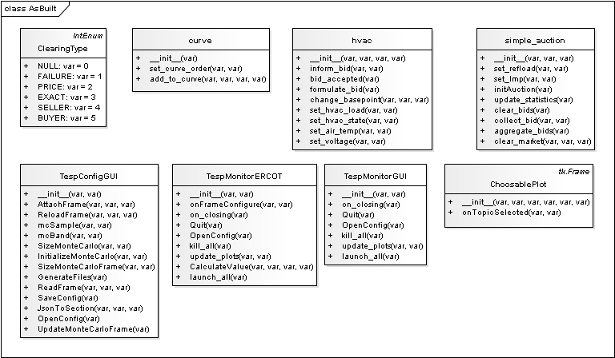
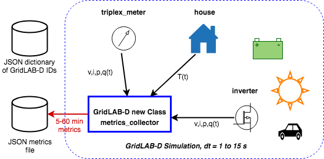
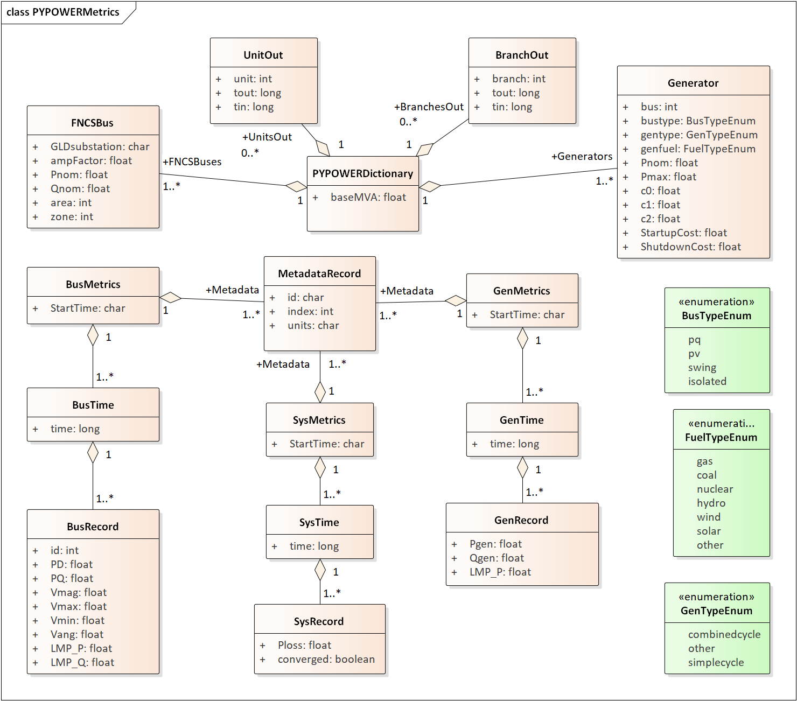
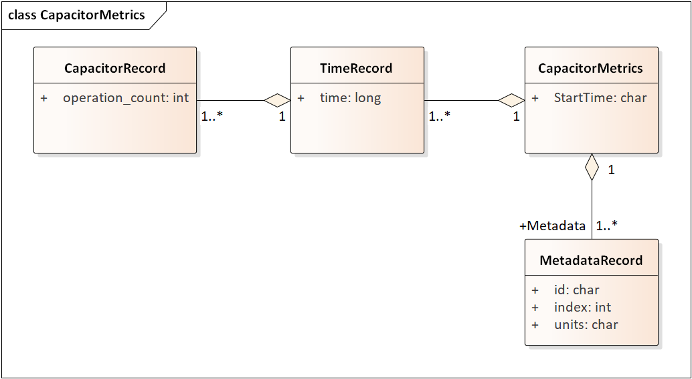
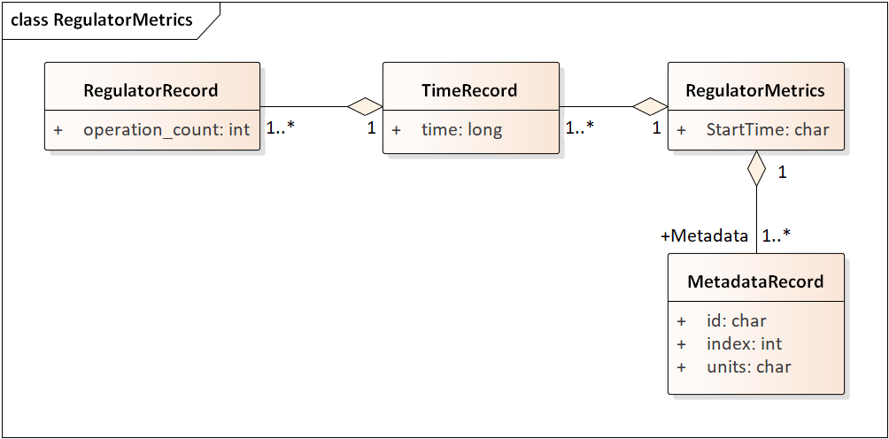
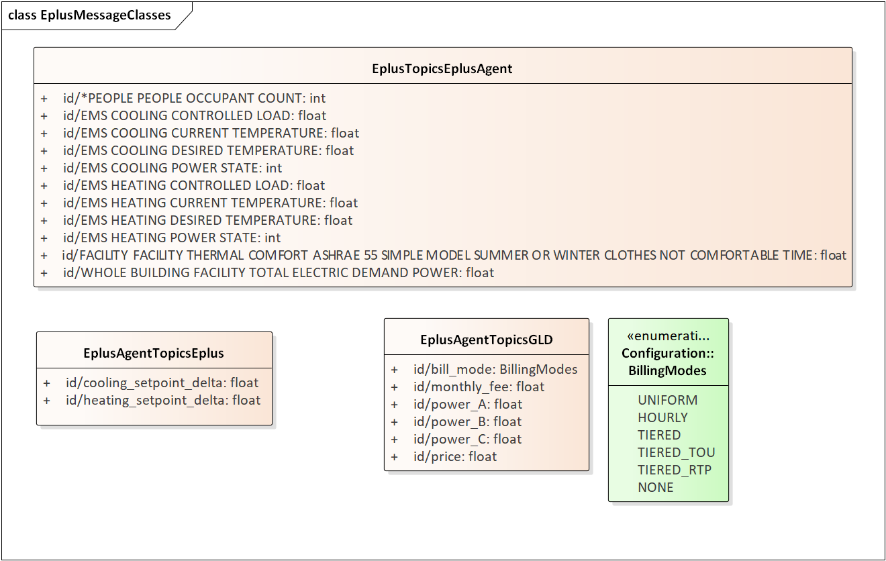
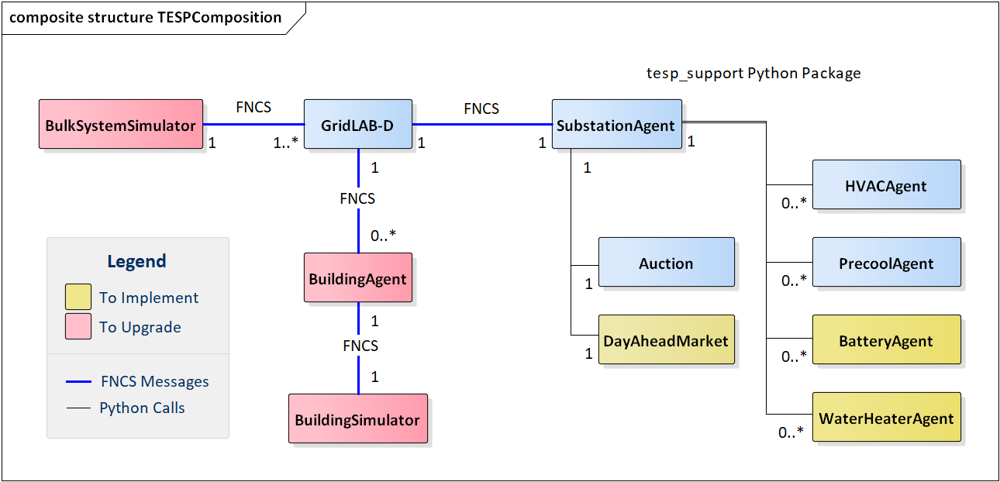

Design Reference
================

Messages between Simulators and Agents
--------------------------------------

TESP simulators exchange the sets of messages shown in
Figure 3 and Figure 4.

|image2|

Figure 3a. Message Schemas for GridLAB-D, PYPOWER and residential agents

|image22|

Figure 3b. Message Schemas for EnergyPlus and large-building agents

These messages route through FNCS in a format like
“topic/keyword=value”. In Figure 3, the “id” would refer to a specific
feeder, house, market, or building, and it would be the message topic.
Once published via FNCS, any other FNCS simulator can access the value
by subscription. For example, PYPOWER publishes two values, the
locational marginal price (LMP) at a substation bus and the positive
sequence three-phase voltage at the bus. GridLAB-D subscribes to the
voltage, using it to update the power flow solution. The double-auction
for that substation subscribes to the LMP, using it to represent a
seller in the next market clearing interval. In turn, GridLAB-D
publishes a distribution load value at the substation following each
significantly different power flow solution; PYPOWER subscribes to that
value for its next optimal power flow solution.

|image3|

Figure 4a. Message Flows for Simulators and Transactive Agents

|image23|

Figure 4b. Message Flows for Solution Monitoring

EnergyPlus publishes three phase power values after each of its
solutions (currently on five-minute intervals). These are all
numerically equal, at one third of the total building power that
includes lights, office equipment, refrigeration and HVAC loads.
GridLAB-D subscribes in order to update its power flow model at the
point of interconnection for the building, which is typically at a 480-V
or 208-V three-phase transformer. EnergyPlus also subscribes to the
double-auction market’s published clearing price, using that value for a
real-time price (RTP) response of its HVAC load.

Message flows involving the thermostat controller, at the center of
Figure 4, are a little more involved. From the associated house within
GridLAB-D, it subscribes to the air temperature, HVAC power state, and
the HVAC power if turned on. The controller uses this information to
help formulate a bid for electric power at the next market clearing,
primarily the price and quantity. Note that each market clearing
interval will have its own market id, and that re-bidding may be allowed
until that particular market id closes. When bidding closes for a market
interval, the double-auction market will settle all bids and publish
several values, primarily the clearing price. The house thermostat
controllers use that clearing price subscription, compared to their bid
price, to adjust the HVAC thermostat setpoint. As noted above, the
EnergyPlus building also uses the clearing price to determine how much
to adjust its thermostat setting. Figure 3 shows several other keyword
values published by the double-auction market and thermostat
controllers; these are mainly used to define “ramps” for the controller
bidding strategies. See the GridLAB-D documentation, or TESP design
documentation, for more details.

These message schemas are limited to the minimum necessary to operate
Version 1, and it’s expected that the schema will expand as new TEAgents
are added. Beyond that, note that any of the simulators may subscribe to
any values that it “knows about”, i.e., there are no security and access
control emulations. This may be a layer outside the scope of TESP.
However, there is also no provision for enforcement of bid compliance,
i.e. perfect compliance is built into the code. That’s clearly not a
realistic assumption, and is within the scope for future versions as
described in Section 3.

TESP for Agent Developers
-------------------------

The left-hand portion of Figure 4c shows the main simulators running in 
TESP and communicating over FNCS.  For the DSO+T study, PYPOWER will be 
upgraded to AMES and EnergyPlus will be upgraded to a Modelica-based 
large-building simulator.  The large-building agent will also be updated.  
The current large-building agent is written in C++.  It's functionality is 
to write metrics from EnergyPlus, and also to adjust a thermostat slider 
for the building.  However, it does not formulate bids for the building.  
The right-hand portion of Figure 4c shows the other transactive agents 
implemented in Python.  These communicate directly via Python function 
calls, i.e., not over FNCS.  There are several new agents to implement for 
the DSO+T study, and this process will require four main tasks: 
  
1 - Define the message schema for information exchange with GridLAB-D, AMES or other FNCS federates. The SubstationAgent will actually manage the FNCS messages, i.e., the agent developer will not be writing FNCS interface code.

2 - Design the agent initialization from metadata available in the GridLAB-D or other dictionaries, i.e., from the dictionary JSON files.

3 - Design the metadata for any intermediate metrics that the agent should write (to JSON files) at each time step.

4 - Design and implement the agent code as a Python class within tesp_support. The SubstationAgent will instantiate this agent class at runtime, and call the class as needed in a time step.

|image24|

Figure 4c. Composition of Federates in a Running TESP Simulation

Figure 4d shows the sequence of interactions between GridLAB-D, the 
SubstationAgent (encapsulating HVAC controllers and a double-auction 
market) and PYPOWER.  The message hops over FNCS each consume one time 
step.  The essential messages for market clearing are highlighted in red.  
Therefore, it takes 3 FNCS time steps to complete a market clearing, from 
the collection of house air temperatures to the adjustment of thermostat 
setpoints.  Without the encapsulating SubstationAgent, two additional FNCS 
messages would be needed.  The first would occur between the self-messages 
AgentBids and Aggregate, routed between separate HVACController and 
Auction swimlanes.  The second would occur between ClearMarket and 
AdjustSetpoints messages, also routed between separate Auction and 
HVACController swimlanes.  This architecture would produce additional FNCS 
message traffic, and also increase the market clearing latency from 3 FNCS 
time steps to 5 FNCS time steps.  

Before and after each market clearing, GridLAB-D and PYPOWER will 
typically exchange substation load and bus voltage values several times, 
for each power flow (PF) solution.  These FNCS messages are indicated in 
black; they represent much less traffic than the market clearing messages.
  
Some typical default time steps are:
  
1 - 5 seconds, for FNCS, leading to a market clearing latency of 15 seconds
  
2 - 15 seconds, for GridLAB-D and PYPOWER's regular power flow (PF)
  
3 - 300 seconds, for spot-market clearing, PYPOWER's optimal power flow (OPF), EnergyPlus (not shown in Figure 4d) and the metrics aggregation.

|image25|

Figure 4d. FNCS Message Hops around Market Clearing Time

Figure 4e shows the class structure of tesp_support.  For details, see the :ref:`code-reference-label`.  

|image26|

Figure 4e. Class structure of the tesp_support package

Output Metrics to Support Evaluation
------------------------------------

TESP will produce various outputs that support comparative evaluation of
different scenarios. Many of these outputs are non-monetary, so a user
will have to apply different weighting and aggregation methods to
complete the evaluations. This is done in the Evaluation Script, which
is written in Python. These TESP outputs all come from the Operational
Model, or from the Growth Model applied to the Operational Model. For
efficiency, each simulator writes intermediate metrics to Javascript
Object Notation (JSON) files during the simulation, as shown in Figure
5. For example, if GridLAB-D simulates a three-phase commercial load at
10-second time steps, the voltage metrics output would only include the
minimum, maximum, mean and median voltage over all three phases, and
over a metrics aggregation interval of 5 to 60 minutes. This saves
considerable disk space and processing time over the handling of
multiple CSV files. Python, and other languages, have library functions
optimized to quickly load JSON files.

|image4|

Figure 5. Partitioning the valuation metrics between simulation and
post-processing

To support these intermediate metrics, two new classes were added to the
“tape” module of GridLAB-D, as shown in Figure 6. The volume and variety
of metrics generated from GridLAB-D is currently the highest among
simulators within TESP, so it was especially important here to provide
outputs that take less time and space than CSV files. Most of the
outputs come from billing meters, either single-phase triplex meters
that serve houses, or three-phase meters that serve commercial loads.
The power, voltage and billing revenue outputs are linked to these
meters, of which there may be several thousand on a feeder. Houses,
which always connect to triplex meters, provide the air temperature and
setpoint deviation outputs for evaluating occupant comfort. Inverters,
which always connect to meters, provide real and reactive power flow
outputs for connected solar panels, battery storage, and future DER like
vehicle chargers. Note that inverters may be separately metered from a
house or commercial building, or combined on the same meter as in net
metering. Feeder-level metrics, primarily the real and reactive losses,
are also collected by a fourth class that iterates over all transformers
and lines in the model; this substation-level class has just one
instance not shown in Figure 6. An hourly metrics output interval is
shown, but this is adjustable.

|image5|

Figure 6. New metrics collection classes for GridLAB-D

The initial GridLAB-D metrics are detailed in five UML diagrams, so we
begin the UML metric descriptions with PYPOWER, which is much simpler.
During each simulation, PYPOWER will produce two JSON files, one for
all of the generators and another for all of the FNCS interface buses to
GridLAB-D. A third JSON file, called the dictionary, is produced before
the simulation starts from the PYPOWER case input file. The dictionary
serves as an aid to post-processing. Figure 7 shows the schema for all
three PYPOWER metrics files.

The PYPOWER dictionary (top of Figure 7) includes the system MVA base
(typically 100) and GridLAB-D feeder amplification factor. The
amplification factor is used to scale up the load from one simulated
GridLAB-D feeder to represent many similar feeders connected to the same
PYPOWER bus. Each generator has a bus number (more than one generator
can be at a bus), power rating, cost function
f(P) = c :sub:`0` + c :sub:`1` P + c :sub:`2` P :sup:`2`, startup cost, shutdown cost, and
other descriptive information. Each FNCSBus has nominal P and Q that
PYPOWER can vary outside of GridLAB-D, plus the name of a GridLAB-D
substation that provides additional load at the bus. In total, the PYPOWER dictionary contains four JSON objects;
the *ampFactor*, the *baseMVA*, a dictionary (map) of Generators keyed
on the generator id, and a dictionary (map) of FNCSBuses keyed on the
bus id. In PYPOWER, all id values are integers, but the other
simulators use string ids.

|image6|

Figure 7. PYPOWER dictionary with generator and FNCS bus metrics

The GenMetrics file (center of Figure 7) includes the simulation
starting date, time and time zone as *StartTime*, which should be the
same in all metrics output files from that simulation. It also contains
a dictionary (map) of three MetadataRecords, which define the array
index and units for each of the three generator metric output values.
These are the real power *LMP*, along with the actual real and reactive
power outputs, *Pgen* and *Qgen*. At each time for metrics output, a
GenTime dictionary (map) object will be written with key equal to the
time in seconds from the simulation *StartTime*, and the value being a
dictionary (map) of GenRecords.

The GenRecord keys are generator numbers, which will match the
dictionary. The GenRecord values are arrays of three indexed output
values, with indices and units matching the Metadata. This structure
minimizes nesting in the JSON file, and facilitates quick loading in a
Python post-processor program. Valuation may require the use of both
metrics and the dictionary. For example, suppose we need the profit
earned by a generator at a time 300 seconds after the simulation
starting time. The revenue comes from the metrics as *LMP\_P \* Pgen*.
In order to find the cost, one would start with cost function
coefficients obtained from the dictionary for that generator, and
substitute *Pgen* into that cost function. In addition, the post
processing script should add startup and shutdown costs based on *Pgen*
transitions between zero and non-zero values; PYPOWER itself does not
handle startup and shutdown costs. Furthermore, aggregating across
generators and times would have to be done in post-processing, using
built-in functions from Python’s NumPy package. The repository includes
an example of how to do this.

Turning to more complicated GridLAB-D metrics, Figure 8 provides the
dictionary. At the top level, it includes the substation transformer
size and the PYPOWER substation name for FNCS connection. There are
four dictionaries (maps) of component types, namely houses, inverters,
billing meters and feeders. While real substations often have more than
one feeder, in this model only one feeder dictionary will exist,
comprising all GridLAB-D components in that model. The reason is that
feeders are actually distinguished by their different circuit breakers
or reclosers at the feeder head, and GridLAB-D does not currently
associate components to switches that way. In other words, there is one
feeder and one substation per GridLAB-D file in this version of TESP.
When this restriction is lifted in a future version, attributes like
*feeder\_id*, *house\_count* and *inverter\_count* will become helpful.
At present, all *feeder\_id* attributes will have the same value, while
*house\_count* and *inverter\_count* will simply be the length of their
corresponding JSON dictionary objects. Figure 8 shows that a
BillingMeter must have at least one House or Inverter with no upper
limit, otherwise it would not appear in the dictionary. The
*wh\_gallons* attribute can be used to flag a thermostat-controlled
electric waterheater, but these are not yet treated as responsive loads
in Version 1. Other attributes like the inverter’s *rated\_W* and the
house’s *sqft* could be useful in weighting some of the metric outputs.

Figure 9 shows the structure of substation metrics output from
GridLAB-D, consisting of real power and energy, reactive power and
energy, and losses from all distribution components in that model. As
with PYPOWER metrics files, the substation metrics JSON file contains
the *StartTime* of the simulation, Metadata with array index and units
for each metric value, and a dictionary (map) of time records, keyed on
the simulation time in seconds from *StartTime*. Each time record
contains a dictionary (map) of SubstationRecords, each of which contains
an array of 18 values. This structure, with minimal nesting of JSON
objects, was designed to facilitate fast loading and navigation of
arrays in Python. The TESP code repository includes examples of working
with metrics output in Python. Figures 10 and 11 show how capacitor
switching and regulator tap changing counts are captured as metrics.

Figure 12 shows the structure of billing meter metrics, which is very
similar to that of substation metrics, except that each array contains
30 values. The billing meter metrics aggregate real and reactive power
for any houses and inverters connected to the meter, with several
voltage magnitude and unbalance metrics. The interval bill is also
included, based on metered consumption and the tariff that was input to
GridLAB-D. In some cases, revenues may be recalculated in
post-processing to explore different tariff designs. It’s also possible
to re-calculate the billing determinants from metrics that have been
defined.

|image7|

Figure 8. GridLAB-D dictionary

The Range A and Range B metrics in Figure 12 refer to ANSI C84.1
[`11 <#_ENREF_11>`__]. For service voltages less than 600 V, Range A is
+/- 5% of nominal voltage for normal operation. Range B is -8.33% to
+5.83% of nominal voltage for limited-extent operation. Voltage
unbalance is defined as the maximum deviation from average voltage,
divided by average voltage, among all phases present. For three-phase
meters, the unbalance is based on line-to-line voltages, because that is
how motor voltage unbalance is evaluated. For triplex meters, unbalance
is based on line-to-neutral voltages, because there is only one
line-to-line voltage. In Figure 10, *voltage\_* refers to the
line-to-neutral voltage, while *voltage12\_* refers to the line-to-line
voltage. The *below\_10\_percent* voltage duration and count metrics
indicate when the billing meter has no voltage. That information would
be used to calculate reliability indices in post-processing, with
flexible weighting and aggregation options by customer, owner, circuit,
etc. These include the System Average Interruption Frequency Index
(SAIFI) and System Average Interruption Duration Index (SAIDI)
[`12 <#_ENREF_12>`__, `13 <#_ENREF_13>`__]. This voltage-based approach
to reliability indices works whether the outage resulted from a
distribution, transmission, or bulk generation event. The voltage-based
metrics also support Momentary Average Interruption Frequency Index
(MAIFI) for shorter duration outages.

|image8|

Figure 9. GridLAB-D substation metrics

|image19|

Figure 10. GridLAB-D capacitor switching metrics

|image20|

Figure 11. GridLAB-D regulator tap changing metrics

|image9|

Figure 12. GridLAB-D billing meter metrics

The house metric JSON file structure is shown in Figure 13, following
the same structure as the other GridLAB-D metrics files, with 18 values
in each array. These relate to the breakdown of total house load into
HVAC and waterheater components, which are both thermostat controlled.
The house air temperature, and its deviation from the thermostat
setpoint, are also included. Note that the house bill would be included
in billing meter metrics, not the house metrics. Inverter metrics in
Figure 14 include 8 real and reactive power values in the array, so the
connected resource outputs can be disaggregated from the billing meter
outputs, which always net the connected houses and inverters. In Version
1, the inverters will be net metered, or have their own meter, but they
don’t have transactive agents yet.

|image10|

Figure 13. GridLAB-D house metrics

|image11|

Figure 14. GridLAB-D inverter metrics

Figure 15 shows the transactive agent dictionary and metrics file
structures. Currently, these include one double-auction market per
substation and one double-ramp controller per HVAC. Each dictionary
(map) is keyed to the controller or market id. The Controller dictionary
(top left) has a *houseName* for linkage to a specific house within the
GridLAB-D model. In Version 1, there can be only one Market instance per
GridLAB-D model, but this will expand in future versions. See the
GridLAB-D market module documentation for information about the other
dictionary attributes.

There will be two JSON metrics output files for TEAgents during a
simulation, one for markets and one for controllers, which are
structured as shown at the bottom of Figure 15. The use of *StartTime*
and Metadata is the same as for PYPOWER and GridLAB-D metrics. For
controllers, the bid price and quantity (kw, not kwh) is recorded for
each market clearing interval’s id. For auctions, the actual clearing
price and type are recorded for each market clearing interval’s id. That
clearing price applies throughout the feeder, so it can be used for
supplemental revenue calculations until more agents are developed.

|image12|

Figure 15. TEAgent dictionary and metrics

The EnergyPlus dictionary and metrics structure in Figure 16 follows
the same pattern as PYPOWER, GridLAB-D and TEAgent metrics. There are
42 metric values in the array, most of them pertaining to heating and
cooling system temperatures and states. Each EnergyPlus model is
custom-built for a specific commercial building, with detailed models of
the HVAC equipment and zones, along with a customized Energy Management
System (EMS) program to manage the HVAC. Many of the metrics are
specified to track the EMS program performance during simulation. In
addition, the occupants metric can be used for weighting the comfort
measures; EnergyPlus estimates the number of occupants per zone based on
hour of day and type of day, then TESP aggregates for the whole
building. The *electric\_demand\_power* metric is the total three-phase
power published to GridLAB-D, including HVAC and variable loads from
lights, refrigeration, office equipment, etc. The *kwhr\_price* will
correspond to the market clearing price from Figure 15. Finally, the
*ashrae\_uncomfortable\_hours* is based on a simple standardized model,
aggregated for all zones [`14 <#_ENREF_14>`__].

|image13|

Figure 16. EnergyPlus dictionary and metrics

GridLAB-D Enhancements
----------------------

The TSP simulation task includes maintenance and updates to GridLAB-D in
support of TESP. This past year, the GridLAB-D enhancements done for
TESP have included:

1. Extraction of the double-auction market and double-ramp controller
   into separate modules, with communication links to the internal
   GridLAB-D houses. This pattern can be reused to open up other
   GridLAB-D controller designs to a broader community of
   developers.

2. Porting the FNCS-enabled version of GridLAB-D to Microsoft Windows.
   This had not been working with the MinGW compiler that was
   recently adopted for GridLAB-D on Windows, and it will be
   important for other projects.

3. Implementing the JSON metrics collector and writer classes in the
   tape module. This should provide efficiency and space benefits to
   other users who need to post-process GridLAB-D outputs.

4. Implementing a JSON-based message format for agents running under
   FNCS. Again, this should provide efficiency benefits for other
   projects that need more complicated FNCS message structures.

Developing Valuation Scripts
----------------------------

In order to provide new or customized valuation scripts in Python, the
user should first study the provided examples. These illustrate how to
load the JSON dictionaries and metrics described in Section 1.5,
aggregate and post-process the values, make plots, etc. Coupled with
some experience or learning in Python, this constitutes the easiest
route to customizing TESP.

Developing Agents
-----------------

The existing auction and controller agents provide examples on how to 
configure the message subscriptions, publish values, and link with FNCS at 
runtime.  Section 1.4 describes the existing messages, but these 
constitute a minimal set for Version 1.  It’s possible to define your own 
messages between your own TEAgents, with significant freedom.  It’s also 
possible to publish and subscribe, or “peek and poke”, any named object / 
attribute in the GridLAB-D model, even those not called out in Section 
1.4.  For example, if writing a waterheater controller, you should be able 
to read its outlet temperature and write its tank setpoint via FNCS 
messages, without modifying GridLAB-D code.  You probably also want to 
define metrics for your TEAgent, as in Section 1.5.  Your TEAgent will run 
under supervision of a FNCS broker program.  This means you can request 
time steps, but not dictate them.  The overall pattern of a FNCS-compliant 
program will be: 

1. Initialize FNCS and subscribe to messages, i.e. notify the broker.

2. Determine the desired simulation *stop\_time*, and any time step size
   (*delta\_t*) preferences. For example, a transactive market mechanism
   on 5-minute clearing intervals would like *delta\_t* of 300 seconds.

3. Set *time\_granted* to zero; this will be under control of the FNCS
   broker.

4. Initialize *time\_request*; this is usually *0 + delta\_t*, but it
   could be *stop\_time* if you just wish to collect messages as they
   come in.

5. While *time\_granted* < *stop\_time*:

   a. Request the next *time\_request* from FNCS; your program then
      blocks.

   b. FNCS returns *time\_granted*, which may be less than your
      *time\_request.* For example, controllers might submit bids
      up to a second before the market interval closes, and you
      should keep track of these.

   c. Collect and process the messages you subscribed to. There may not be any if your time request has simply come up. On the other hand, you might receive bids or other information to store before  taking action on them.

   d. Perform any supplemental processing, including publication of values through FNCS. For example, suppose 300 seconds have elapsed since the last market clearing. Your agent should settle all the bids, publish the clearing price (and other values), and set up for the next market interval.

   e. Determine the next *time\_request*, usually by adding *delta\_t*
      to the last one. However, if *time\_granted* has been coming
      irregularly in 5b, you might need to adjust *delta\_t* so that
      you do land on the next market clearing interval. If your
      agent is modeling some type of dynamic process, you may also
      adapt *delta\_t* to the observed rates of change.

   f. Loop back to 5a, unless *time\_granted* ≥ *stop\_time*.

6. Write your JSON metrics file; Python has built-in support for this.

7. Finalize FNCS for an orderly shutdown, i.e. notify the broker that
   you’re done.

The main points are to realize that an overall “while loop” must be used
instead of a “for loop”, and that the *time\_granted* values don’t
necessarily match the *time\_requested* values.

Developers working with C/C++ will need much more familiarity with
compiling and linking to other libraries and applications, and much more
knowledge of any co-simulators they wish to replace. This development
process generally takes longer, which represents added cost. The
benefits could be faster execution times, more flexibility in
customization, code re-use, etc.

tesp_support Package Design
---------------------------

|uml0|

Classes in the tesp_support package.

Development Work Flow for tesp_support
--------------------------------------

This is the main code repository for Python-based components of TESP, 
including the transactive agents, case configuration and post processing.  
Currently, there are three kinds of transactive agent implemented here: 

1. double-auction spot market, typically runs every 5 to 15 minutes
2. an electric cooling controller based on the Olympic Peninsula double-ramp method
3. an electric pre-cooling controller used to mitigate overvoltages in the NIST TE Challenge Phase 2

To develop a new agent, you may choose to copy an example Python file from 
this directory into your own test directory, to serve as a starting point.  
When finished, you should integrate the agent into this tesp_support 
package, so it will be available to other TESP developers and users.  In 
this re-integration process, you also need to modify api.py so that other 
Python code can call your new agent, and test it that way before 
re-deploying tesp_support to PyPi.  Also review setup.py in the parent 
directory to make sure you've included any new dependencies, including 
version updates.  
  
A second method is to create your new file(s) in this directory, which 
integrates your new agent from the start.  There will be some startup 
effort in modifying api.py and writing the script/batch files to call your 
agent from within your working test directory.  It may pay off in the end, 
by reducing the effort and uncertainty of code integration at the end.  

Suggested sequence of test cases for development:

1. 30-house example at https://github.com/pnnl/tesp/tree/master/examples/te30. This includes one large building, one connection to a 9-bus/4-generator bulk system, and a stiff feeder source. The model size is suited to manual adjustments, and testing the interactions of agents at the level of a feeder or lateral. There are effectively no voltage dependencies or overloads, except possibly in the substation transformer. This case runs on a personal computer in a matter of minutes.
2. 8-bus ERCOT example at https://github.com/pnnl/tesp/tree/master/ercot/case8. This includes 8 EHV buses and 8 distribution feeders, approximately 14 bulk system units, and several thousand houses. Use this for testing your agent configuration from the GridLAB-D metadata, for large-scale interactions and stability, and for interactions with other types of agent in a less controllable environment. This case runs on a personal computer in a matter of hours.
3. 200-bus ERCOT example, when available. This will have about 600 feeders with several hundred thousand houses, and it will probably have to run on a HPC. Make sure the code works on the 30-house and 8-bus examples first.

* From this directory, 'pip install -e .' points Python to this cloned repository for any calls to tesp_support functions
* See the https://github.com/pnnl/tesp/tree/master/src/tesp_support/tesp_support for a roadmap of existing Python source files, and some documentation.  Any changes or additions to the code need to be made in this directory.  
* Run tests from any other directory on this computer
* When ready, edit the tesp_support version number and dependencies in setup.py
* To deploy, 'python setup.py sdist upload' 
* Any user gets the changes with 'pip install tesp_support --upgrade'
* Use 'pip show tesp_support' to verify the version and location on your computer

.. |image2| image:: ./media/MessageClasses.png
.. |image3| image:: ./media/MessageFlows.png
.. |image4| image:: ./media/IntermediateMetrics.png

.. |image7| image:: ./media/GLDDictionary.png
.. |image8| image:: ./media/SubstationMetrics.png
.. |image9| image:: ./media/BillingMeterMetrics.png
.. |image10| image:: ./media/HouseMetrics.png
.. |image11| image:: ./media/InverterMetrics.png
.. |image12| image:: ./media/AgentMetrics.png
.. |image13| image:: ./media/EplusMetrics.png

.. |image23| image:: ./media/MonitorFlows.png

.. |image25| image:: ./media/ClearingSequence.png

