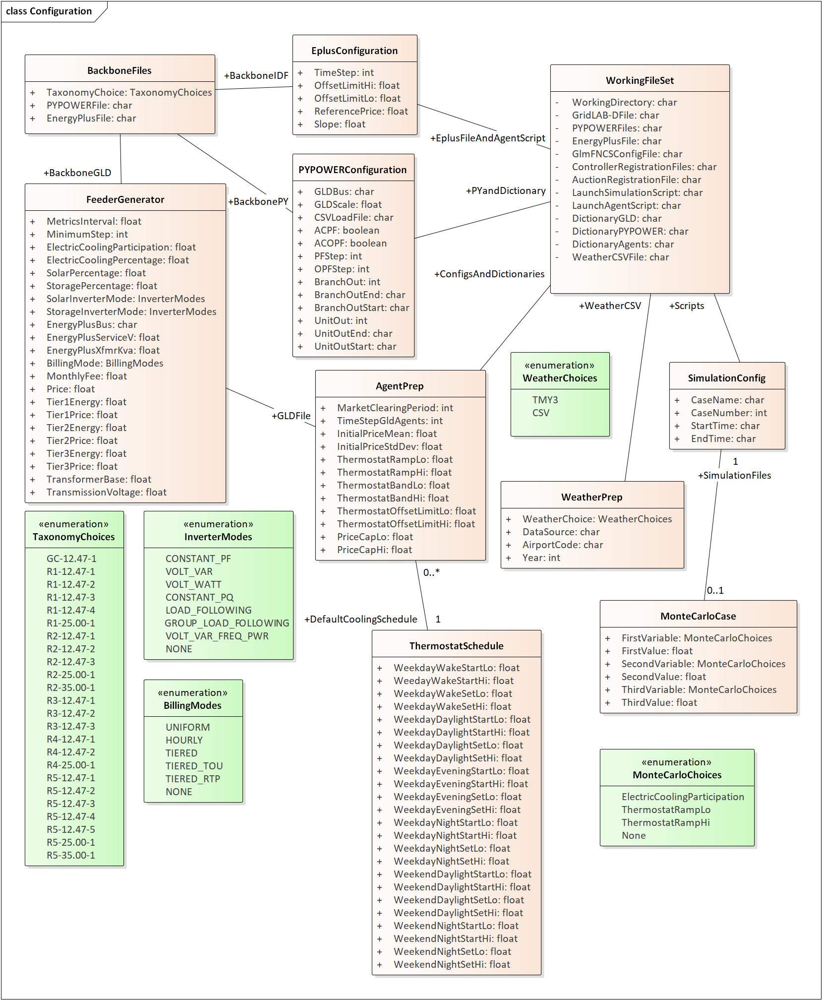

Planning for the Next TESP Version
==================================

At this stage, TESP comprises a basic framework to conduct design and
evaluation of transactive mechanisms, and it is open for use by others
on Windows, Linux and Mac OS X. The next version of TESP should rapidly
expand its capabilities, by building on the established framework.

New TEAgents
------------

These are arguably the most important, as they add key features that are
directly in TESP’s scope, and likely not available elsewhere integrated
into a single platform. The more examples we provide, the easier it
should be for others to write their own (better) TEAgents.

1. VOLTTRON is a standard for building automation and management
   systems, and it has been used to implement build-level transactive
   mechanisms for electricity, air and chilled water in co-simulation
   with EnergyPlus [`5 <#_ENREF_5>`__]. A TEAgent based on VOLTTRON
   could manage the building-level transactive system, and also
   participate in the feeder-level or substation-level electricity
   markets on behalf of the building loads and resources. The work
   involves porting the Python-based VOLTTRON program to interface with
   EnergyPlus via FNCS instead of EnergyPlus’s built-in Building Control
   Virtual Test Bed (BCVTB). Then, the VOLTTRON program will need to
   construct bid curves for the grid market.

2. PowerMatcher is a transactive mechanism implemented by the
   Netherlands Organisation for Applied Scientific Research (TNO)
   [`19 <#_ENREF_19>`__]. The existing code is in Java, with a custom
   API and message schema. TNO would have to undertake the work of
   interfacing PowerMatcher to the TESP, with technical support from
   PNNL.

3. TeMix is another transactive mechanism that has been implemented by a
   California-based company [`20 <#_ENREF_20>`__], and selected for some
   pilot projects. TeMix would have to undertake the work of interfacing
   its product to the TESP, with technical support from PNNL.

4. Passive Controller (Load Shedding) – GridLAB-D includes a built-in
   passive controller, and switches that can isolate sections of a
   circuit. This function would be extracted into a separate TEAgent
   that implements load shedding in response to a message from PYPOWER.
   If the bulk system capacity margin falls below minimum, or worse, if
   the optimal power flow fails to converge, the bulk system operator
   would have to invoke load shedding. In TESP, the PYPOWER simulator
   would initiate load shedding a few seconds prior to the market
   clearing time, which initiates a new GridLAB-D power flow and reduced
   substation load published to PYPOWER. Load shedding is a traditional
   approach that will reduce the system reliability indices, whereas
   transactive mechanisms could maintain resource margins without
   impacting the reliability indices.

5. Passive Controller (Demand Response) – the GridLAB-D passive
   controller already simulates various forms of price-responsive or
   directly-controlled loads. These would be extracted into a separate
   TEAgent for control of waterheaters and other loads, complementing
   the transactive dual ramp controller for HVAC.

6. Generator Controller – GridLAB-D has a built-in generator controller
   that is tailored for conventional (i.e. dispatchable) generators with
   operating, maintenance and capital recovery costs included. This has
   not been completely developed, but it would be useful in TESP as a
   separate TEAgent so that cogeneration may be included. For example,
   several teams are developing 1-kW generators for co-generation with
   residential gas furnaces (the ARPA-E GENSETS program).

7. Storage Controller – GridLAB-D’s built-in battery only implements a
   load-following mode with state-of-charge and charge/discharge
   thresholds. We expect to develop a more capable battery controller
   during 2017 as part of a Washington State Clean Energy Fund (CEF)
   project in collaboration with Avista Utilities and Washington State
   University. This new agent would be implemented and tested in TESP.

The enhancements 1, 2 and 3 are probably the most important. A VOLTTRON
agent is strategic because it enables intrabuilding-to-grid
transactions. It also fills a weakness in GridLAB-D’s own commercial
building models, which are adequate for small-box establishments and
strip malls, but not for larger buildings like the school in Section
2.3. The PowerMatcher and TeMix agents are strategic because they would
show usability of TESP by others, and facilitate cross-vendor
experiments.

Usability Enhancements
----------------------

These are also important for usability and widespread adoption of TESP.

1. :numref:`case_config` shows the data structure beneath a new case configuration
   graphical user interface.

2. TE Challenge Message Schemas – NIST has defined several classes and
   message schemas for the TE Challenge project [`2 <#_ENREF_2>`__].
   Many of these tie directly to GridLAB-D, so they are already
   supported via FNCS. We will continue to review all of them to ensure
   that TESP remains compatible with TE Challenge to the extent
   possible.

3. Solution Monitor – at present, TESP is configured and launched via
   script-building utilities and console commands, which are adequate
   for developers. The two-day simulations described in this report
   finish within an hour or two, but that will increase as the time
   horizons and system sizes increase. We plan to provide a graphical
   user interface (GUI) with spreadsheet interfaces for configuring
   TESP, live strip charts to indicate solution progress, and more
   convenient methods to stop a simulation.

4. Valuation GUI – the post-processing scripts for valuation also run
   from the command line, which is adequate for developers. We plan to
   provide a GUI that presents results in formatted tables and lists,
   plots variables that are selected from lists, etc. Both the solution
   monitor and post-processing GUIs will be implemented in Python using
   the Tkinter package that comes with it. This makes the GUIs portable
   across operating systems, and allows for user customization, just as
   with the Python-based TEAgents.

5. IEEE 1516 [`21-23 <#_ENREF_21>`__] is a comprehensive family of
   standards for co-simulation, sometimes referred to as High-Level
   Architecture (HLA). As part of Grid Modernization Lab Consortium
   (GMLC) project 1.4.15, “Development of Integrated Transmission,
   Distribution and Communication (TDC) Models”, FNCS and other National
   Lab co-simulation frameworks are evolving toward greater compliance
   with IEEE 1516. We plan to adopt a reduced-profile, lightweight
   version of FNCS or some other framework in TESP, so that it will be
   fully compliant with IEEE 1516. This fosters interoperability among
   simulators and agents developed by others. However, compared to some
   other HLA frameworks that we have evaluated, FNCS is much more
   efficient, handling thousands of federated processes. For TESP, we’ll
   need to maintain that level of performance in the new
   standards-compliant framework.

6. Intermediate Time Aggregations – for a single feeder as described in
   Section 2.3, a two-day simulation produces about 1 GB in JSON metrics
   before compression. (CSV files would be even larger). To mitigate the
   growth of these files, we plan to implement aggregation in time for
   yearly and multi-year simulations, in which metrics are aggregated by
   hour of the day, season, weekday vs. weekend or holiday, and by year
   of the simulation. No accuracy would be lost in cumulative metrics,
   and it would still be possible to identify metrics for individual
   stakeholders.

	Case Configuration Parameters for One Feeder and One Building

The enhancements listed in sections 3.1 and 3.2 are of known complexity,
and could be implemented within the next year, subject to resource
availability (including external parties TNO and TeMix). We expect to do
some prioritization at a TESP pre-release workshop on April 27, and
implement the selected enhancements over a series of two six-month
release cycles.

Some important longer-term enhancements are described in the next four
subsections. Work on them will begin, but most likely not be completed
over the next year. We are also considering a faster building simulator
than EnergyPlus, and federating ns-3 to simulate communication networks.
For now, both of those appear to be less important than the enhancements
listed in sections 3.1 and 3.2.

Growth Model
------------

The growth model described in sections 1.3 and 2.4 follows a pre-defined
script, with some random variability. This is adequate for short
horizons, up to a few years. Over longer terms, we’ll need an
intelligent growth model that mimics the analytics and heuristics used
by various stakeholders to make investment decisions. For example, the
TESP user may wish to evaluate impacts from a policy initiative that
will have a ten-year lifetime. That policy initiative may influence
investments that have a twenty-year lifetime. It’s not possible to
realistically script that kind of growth model ahead of time. Instead,
we need growth model agents that will make investment decisions
appropriate to the system as it evolves.

Agent Learning Behaviors
------------------------

Participants in any market will naturally try to optimize their
outcomes, or “game the system” depending on the observer’s perspective.
In designing brand-new market mechanisms for transactive energy, it’s
critically important to account for this human behavior, otherwise
undesired and unanticipated outcomes will occur. It’s up to the
policymakers to design market rules so that, with enforcement of the
rules, undesired outcomes don’t occur. Currently, our agents take
algorithmic and sometimes probabilistic approaches to transactions, but
they aren’t smart enough to “game the system” as a human would. We have
teamed with Iowa State University to investigate these agent learning
behaviors beginning this year.

Stochastic Modeling
-------------------

TESP currently uses random input variables, but the simulations are
deterministic and in full detail (e.g. every house, every HVAC
thermostat, every waterheater, etc.) It would be more efficient, and
perhaps more realistic, to have stochastic simulations on reduced-order
models as an option. This opens the door to more use of sensitivity
analysis and automatic optimization routines than is currently
practical. We have teamed with University of Pittsburgh to investigate
the subject beginning this year, building on previous work in circuit
model order reduction and probabilistic modeling.

Testing and Validation
----------------------

Testing and validation will be a continuous process throughout the life
of TESP. Some opportunities will arise through past and future pilot
projects in transactive energy. Other test cases will have to be
created. We expect to team with Dartmouth College in formalizing this
process, and also to work with Case Western University in modeling their
transactive campus project with NASA.

