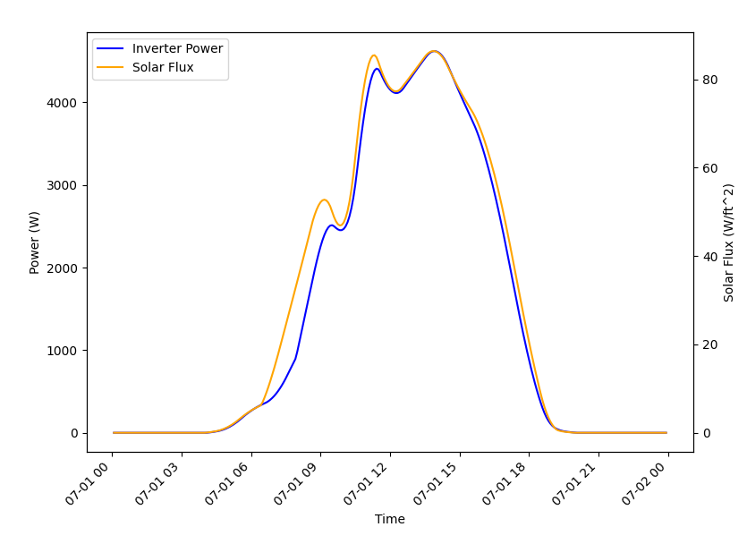

..
    _ Copyright (C) 2023 Battelle Memorial Institute
    _ file: datastore.rst

.. _datastore:

=======================
Datastore Demonstration
=======================

Introduction
~~~~~~~~~~~~
The TESP data store provides a way to collect simulation data (input and output data sets) for use outside the compute space in which it was created. For example, a particular transactive study may require above-average computational resources and thus is run on a dedicated server. Once the simulation is complete, the TESP datastore capability can be used to collect the relavant results and then handed off to an analyst to perform the post-processing. Using the datastore allows the relevant files to be extracted from the place they were created in the file system and distributed to the end user in consistent file structure. This allows the paths to the relevant files to be fixed and allow post-processing to be developed and run by any user that is given the data store.

The remainder of this page will describe who to use the datastore capability in TESP, both for getting data into the store and pulling it out to use. We'll be using data produced by the TE30 example as it can be run relatively quickly but has a diverse set of data that can be used.

Storing Data
~~~~~~~~~~~~
The TESP datastore has two parts:

* A ZIP file with all raw data collected
* A metadata JSON that shows the contents of each file

The construction of these two files for the store are done independently but are obviously related. Though there are exceptions, it is likely that most of the time you will want to both add a file to the ZIP as well as add metadata about that file to the JSON. Most users of the datastore you make will want access to both the data itself as well as the metadata so they can better understand the data and how best to use it.

Adding Files to the ZIP
.......................
The TESP datastore API provides two general strategies for adding files to the ZIP:

* Add a directory to the store and recurse down through the file hierarchy adding all files and sub-directories to the ZIP
* Add individual files

Both approaches allow some degree of locating files in the ZIP file/folder hierarchy differently than in the file/folder hierarchy from which they come. When adding individual files this freedom is absolute; the source path for the data and the destination path are independently defined. When adding an entire folder (and its contents) only the new root location for this folder can be defined; the file/folder hierarchy beneath this is preserved. 

Adding Metadata to JSON
.......................
The TESP datastore API can only store data that is tabular in nature (as of this writing). Generally the simulators/tools that produce data in TESP are able to satisfy this requirement and given the time-series nature of transactive system analysis supported by TESP, it is likely that any custom tools or code could be made to produce similar tabular data.

The TESP datastore API is able to automatically find the tables in the data file. The "table" concept is native to the HDF5 and SQL-style database files. For comma-separated-value (CSV) files, it is assumed all the data present is in one table (with perhaps some header lines). Once the tables are found, the API allows the person adding files to the metadata to define the location in the data of the timestamp data and the labels for the columns. This data is added to the metadata JSON to allow the user of the datastore to inspect the metadata as a guide or aid in performing the post-processing

Quick Example
.............

The TESP installation includes a full working example with data from the TE30 example (discussed more below) but here's a quick and dirty overview of the APIs in action::
	
	import tesp_support.api.store as store
	
	store = store.Store("*file name of store*") # Create store
	os_data_path = store.add_path("*OS path to data*", "*name of path for metadata*")
	zip_dir_path = os_data_path.set_includeDir("*ZIP path to data*", *recurse?[bool]*)
	
	# Adding file to metadata JSON
	data_file = store.add_file("*OS file path + name relative to current working dir*", 
									"*name in store*", 
									"*description string for data*")
	table_list = data_file.get_tables()
	# Just doing the first table to keep it simple
	data_file.get_columns(table_list[0]) 
	data_file.set_date_bycol(table_list[0], "*column name with timestamp information*")
	
	# Adding files to ZIP in previously created directory in ZIP
	store.set_includeFile(zip_dir_path, "*OS path to file to include*")
	
	
Retrieving and Using Data
~~~~~~~~~~~~~~~~~~~~~~~~~
The datastore is intended to allow portability of data to allow post-processing scripts the ability to work from data in a known location (that is, relative to the datastore), inspecting the schema of the stored data, and providing data import and conversion into pandas DataFrames for ease of processing.

Quick Example
.............
The essential APIs for using the data store are pretty simple.::
	import tesp_support.api.store as store
	store = store.Store(*store name*)
	schema = store.get_schema(*data filename*)
	tables = schema.tables
	columns = schema.columns
	df = schema.get_series_data(*table name*, *start time*, *stop time*)

Example - TE30
~~~~~~~~~~~~~~
The example provided with TESP uses the TE30 example as it runs fairly quickly (minutes instead of hours) and produces a diversity of data. 

The use of the datastore is always split into two parts: creating the datastore from results files and using the datastore to analyze results. In this example, to save time, we've run the TE30 simulation for you and created the datastore already. After running the simulation (when the results files were created, filled with data, and finalized), the "makestore.py" script in the TE30 example folder was run and it created two files: "te30_store.json" and "te30_store.zip". These files can then be moved around and then a post-processing script, like "te30_ustestore.py" can be used to access and manipulate the data.

makestore.py
............
To emulate the case where the TE30 example is run on a different computer than the post-processing takes place, "makestore.py" resides in the "examples/capabilities/te30" folder and should be run after the TE30 case has been run and the output data is produced.

First, we create the datastore and add a directory to the metadata and .zip.::
	
	my_store = fle.Store(case_name)
	...
    my_path = my_store.add_path("../te30", "TE30 Directory")
    sub = my_path.set_includeDir(".", False)	

The data being ingested by the store is from GridLAB-D and is in HDF5 format. Due to the way the data collection in GridLAB-D using HDF5 in the TE30 example is implemented, a number of results files are created with many of them being effectively empty. This is due to the fact that none of those object exist in the GridLAB-D model but results files are generated by GridLAB-D regardless of which types of objects exist in the GridLAB-D model. In this example we're just looking at the data collected from the billing meters, houses, inverters. 

For each of the GridLAB-D data files being added, add it to the metadata JSON and to the ZIP. Again, particular to the way GridLAB-D records its data using HDF5, for each simulated day GridLAB-D generates a new table in the HDF5 file. Thus, the files is added to the ZIP only once but the metadata for each day is added to the JSON separately.::

	my_file = my_store.add_file(name, name[i], names[i] + ' for ' + challenge)
    my_path.set_includeFile(sub, name)
    tables = my_file.get_tables()
    if len(tables) > 1:
        columns = my_file.get_columns(tables[1])
        my_file.set_date_bycol(tables[1], 'date')
        columns = my_file.get_columns(tables[2])
        my_file.set_date_bycol(tables[2], 'date')
        
As mentioned previously, the TESP datastore API assumes all data in a CSV is effectively a single table and thus is added singly. The second parameter in the .get_columns() method is optional but is particularly useful for CSVs that have header lines at the top of the file (such as these used in this example). The second parameter is the number of header lines to skip before getting to the row that defines the names of the columns.::

	my_file = my_store.add_file(challenge + ".csv", challenge,'CSV for TE_ChallengeH')
    tables = my_file.get_tables()
    if len(tables):
        columns = my_file.get_columns(tables[0], 0)
        my_file.set_date_bycol(tables[0], 't[s]')
    my_path.set_includeFile(sub, challenge + ".csv")

For completeness sake, a number of JSONs with simulation metadata are included in the ZIP but NOT cataloged in the metadata JSON. Including this simulation metadata will be useful for those post-processing the results but as it is not time-series, it is not cataloged in the datastore metadata JSON.::

	names = ['agent_dict', '_glm_dict', 'model_dict']
    for i in range(len(names)):
        my_path.set_includeFile(sub, challenge + names[i] + ".json")

te30_usestore.py
................
To run the "te30_usestore.py" example, first copy "te30_store.zip" to the "te30_store" folder. This is emulating somebody handing over data they produced by running TESP on another machine for you to post-process. Open up the .zip, allowing it to expand and giving you access to the datafile the user of "makestore.py" zipped up.

Once setting up the post-processing to define the time-range we're going to analyze and potentially change the working directory to that of the folder containing the unzipped files, we first create a datastore object.::

	te30_store = store.Store(case_name)
	
If you don't have a good sense of the data being passed to you in the .zip, you can get a list of the schemas in the datastore.::

	    for item in te30_store.get_schema():
        print(f"\t{item}")
        
Note that this is not necessarily a list of the files themselves. This is a list of the datafiles that have a defined schema in the datastore metadata. There could be other files that have not had schemas created but have been distributed in the zip.

To look at the specific data in a schema, we can make a call to get the schema and then look at the tables in a schema and the columns associated with each table.::

	weather_schema = te30_store.get_schema("weather")
	# If you're not evaluating the schema interactively you can print it to console
	print(f"Weather tables {pp.pformat(weather_schema.tables)}")
    print(f"Weather columns {pp.pformat(weather_schema.columns)}")
    ...
    inverter_schema = te30_store.get_schema("inverter_TE_ChallengeH_metrics")
    
Then we pull the data out.::
	
	weather_data = weather_schema.get_series_data("weather", start_date_1, end_date_1)
	...
	inverter_data = inverter_schema.get_series_data("index1", start_date_1, end_date_1)

TESP uses pandas DataFrames as the standard format for time-series data, regardless of the source data format (*e.g.* .csv, .h5); the conversion is handled by the TESP APIs. In this case, the weather data was from a .csv and the inverter data was from an HDF5 file generated by GridLAB-D. When properly indexed so the timestamps for the data are recognized as such, pandas takes care of aligning the data in time so actions like plotting are much easier.::

	weather_data = weather_data.set_index("timestamp")
	inverter_data = inverter_data.set_index("date")
	
Unfortunately, the GridLAB-D data contains all inverter data in the same table and since we're going to look at the output of a single inverter, we have to filter the table to only show us the data for that inverter.

	houseA11_inv = inverter_data.loc[(inverter_data["name"] == b"inv_F1_house_A11")]
    inverter_time = houseA11_inv["date"]
    # If the date is typed as a string instead of a datetime object, we need to 
    # convert it to a datetime object to allow for indexing.
    if isinstance(inverter_time.iloc[0], str):
        inverter_time = inverter_time.str[:-4]
        inverter_time = pd.to_datetime(inverter_time, format="%Y-%m-%d %H:%M:%S")
    # Making a new DataFrame for convenience
    inverter_data = pd.concat([inverter_time.T, houseA11_inv["real_power_avg"]], axis=1)

For this example, we're going to be confirming that the simulation shows a strong correlation between the solar flux (as recorded in the weather data) and the rooftop solar production power (as recorded by GridLAB-D). If all the models and the co-simulation are working right (and they better be because we're using it as an example for TESP), then we would expect good agreement between the two time-series datasets.

Once we've got the data from the two sources as DataFrames, the rest is just using pandas and Matplotlib to make our graph and visually evaluate the data as shown in :numref:`fig_datastore_solar_inverter`.

	
	Comparison of solar flux and rooftop solar inverter output from TE30 example.

As expected, a strong correlation does exist and all is well.

Copyright (c) 2023, Battelle Memorial Institute

License: https://github.com/pnnl/tesp/blob/main/LICENSE

