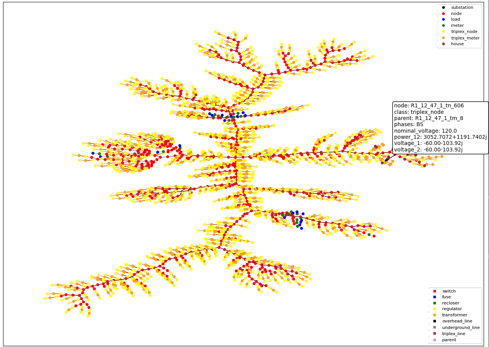

..
    _ Copyright (C) 2023 Battelle Memorial Institute
    _ file: gld_modifier.rst

============================
GridLAB-D Model Modification
============================

For many transactive energy analysis, detailed modeling of the distribution system is an important part of the analysis and GridLAB-D is often chosen as the modeling tool. It is not unusual, though, for a given GridLAB-D model to be non-ideal for the particular analysis scenario to be modeled and need modification in some way: adding rooftop solar, replacing the existing heat pumps with higher efficiency models, changing voltage regulator settings, etc. To aid in this, TESP includes a GridLAB-D modification API to provides a class- and object-oriented way of manipulating the model that we hope provides a (relatively) painless process for editing GridLAB-D models.

GLMModifier Philosophy
~~~~~~~~~~~~~~~~~~~~~~
There have been several other scripts previously developed that provide GridLAB-D model modification. Most of these are text-line-based where the model is read in line-by-line and at appropriate points lines are editing before being printed out to file or additional lines are inserted before moving through the model (for example, adding rooftop solar). Though these have been used for over a decade they always presented a challenge in that model modifications could not be made holistically as the entire model was not parsed  but rather remained as text that could be manipulated.

TESP's GLMModifier overcomes these shortcomings by providing an internal data structure that the model can be read and parsed into. By doing so, the modeler has the ability to evaluate the entire model, manipulate the necessary portions, and then write out the entire model to file. For example, after GLMModifier reads in the model parses it into its data structure, it is possible to count the number of houses that use gas heating, convert them to use heat pumps, and upgrade any necessary transformers and power lines to handle the increased load.

There are two primary ways to access the model using GLMModifier:

* Object- or class-based - GLMModifier's data structure allows for evaluation and modification of GridLAB-D objects based on their class. For example, all GridLAB-D "house" objects are easily accessible and their parameters editable.
* Graph-based - GLMModifier uses the `networkx library <https://networkx.org/>`_ to create a graph of the electrical network. Using this library its possible to evaluate the GridLAB-D model in terms of electrical connectivity and modify in more specific ways. For example networkx allows the modeler to identify which components lie between a newly added load and the substation so their capacity can be evaluated and potentially increased.

GLMModifier API Example Walk-Through
~~~~~~~~~~~~~~~~~~~~~~~~~~~~~~~~~~~~
The following is a walk-through of an example use of the GLMModifier API ("gld_modifier.py") in the TESP "examples/capabilities" folder.

GLMModifier is Python-based so the first step (after installing TESP) is importing the appropriate libraries.::

    from tesp_support.api.modifier import GLMModifier
    from tesp_support.api.data import feeders_path

Then create a GLMModifier object to do the manipulation::

    glmMod = GLMModifier()

With the modifier, we can read the GridLAB-D model into the GLMModifier data structure for manipulation::

    glmMod.model.read('path/to/model.glm')

GridLAB-D split their functionality into various modules and for this example, we're going to be adding houses to the model which means we need to make sure the "residential" module gets added to the model file.::

    glmMod.add_module('residential', [])

GLMModifier makes it easy to get the names of all of the objects of a given class and in this case, to add houses, we need to look for GridLAB-D's "triplex_meters" to attach the houses to.::

    tp_meter_names = glmMod.get_object_names('triplex_meter')

If we wanted the objects themselves we would instead call::

    tp_meter_objs = glmMod.get_object('triplex_meter').instance

``tp_meter_objs`` is then a Python dictionary with the keys being the object names and the value being an Python dictionary of the object parameters and values.

Adding Objects
--------------

``tp_meter_names`` is a list of the names of the GridLAB-D ``triplex_meter`` objects as strings. Using those names we can build up a Python dictionary that defines the parameters of another ``triplex_meter`` object we're going to add to the model. The dictionary is called "meter_params" and has three members all defined by the data from an existing specific ``triplex_meter`` in the model.::

    meter_params = {
              'parent': tp_meter_names[house_num],
              'phases': glmMod.get_object('triplex_meter').instance[f'{tp_meter_names[house_num]}']['phases'],
              'nominal_voltage': glmMod.get_object('triplex_meter').instance[tp_meter_names[house_num]]['nominal_voltage']
    }

The ``phases`` and ``nominal_voltage`` show a common practice with the GLMModifier: ask GLMModifier for all objects of a certain type in the model and then ask for a specific one from that list by name. This shows up as a ``.get_objects("name of GridLAB-D class").instance("object name")``. ``.instance()`` returns a Python dictionary with all the GridLAB-D parameters as members. Alternatively, there is a specific API that does the same thing: ``glmMod.get_object_named_instance("name of GridLAB-D class", "object name")``

Once the Python dictionary with the GridLAB-D object parameters are defined, it can simply be added to the model.::

    glmMod.add_object('triplex_meter', billing_meter_name, meter_params)

``.add_objects()`` has three parameters: the type of object, the name of the object (which the API uses to define the ``name`` parameter of the object behind the scenes), and the dictionary with the object parameters. 

Adding and Modifying Existing Object Parameter Values
-----------------------------------------------------
Further down in the example, there's an example of how to modify an existing object. In this case, the ``.add_object()`` method returns the the GridLAB-D object (effectively a Python dictionary). Its also possible to get the same object using the ``.get_objects().instance()``. Using either method, once you have the GridLAB-D object, its easy to modify any of its properties such as::

    house_obj['floor_area'] = 2469

This exact syntax is also valid for adding a parameter that is undefined to an existing GridLAB-D object.

Deleting Existing Object Parameter Values
-----------------------------------------
To delete a GridLAB-D object parameter value there is a dedicated API call::

    glmMod.del_object_attr('house', house_name, 'Rroof')

Note that GridLAB-D requires some parameters to be defined to run its simulations. Removing the parameter will remove it from the GridLAB-D model file that gets created (.glm) but may effectively force GridLAB-D to use its internal default value.

Deleting Existing Objects
-------------------------
Its possible to delete an object and all its parameter values::

    glmMod.del_object('house', house_to_delete)

To prevent problems with electrical continuity of the models, by default this method will delete children objects.

networkx APIs
-------------
`networkx library <https://networkx.org/>`_ is a general graph Python library and it utilized by TESP to store the topology of the electrical network in GridLAB-D. The core GLMModifier APIs are oriented around the GridLAB-D classes and their objects in the model and from these the topology of the electrical circuit can be derived but not easily or quickly. To make topology-based modifications easier, we've done the hard work of parsing the model and building the networkx graph. With this graph, modelers can more easily and comprehensively explore and edit the model. 

First, if any edits have been made to the GridLAB-D model since importing it, the networkx object needs to be updated prior to include those changes. Conveniently, this also returns the networkx graph object::

    graph = glmMod.model.draw_network()

As you can see, the networkx graph is a property of the GLMModifier.model object and the above line of code simply makes a more succinct reference to it.

After that, you can use networks APIs to explore the model. For example, starting at a particular node, traverse the graph in a breadth-first manner::

    for edge in nx.bfs_edges(graph, "starting bus name"):

For each edge you, the modeler, can look at the properties of each edge (GridLAB-D link objects) to see if it is of particular interest and modify it in a specific way.

Plotting Model
--------------
GLMModifier includes the capability of creating a visual representation of the network for manual inspection. This allows the user to evaluate the model and make sure the changes made are as expected and has the topology expected. To create the plot of the graph of the model a simple API is used::

    glmMod.model.plot_model()

Under the hood, this API makes an update to the networkx graph and then automatically lays it out and plots it on screen, as shown below.

Mousing over the nodes of the system shows some of the metadata associated with them; in the example image shown above one of the houses is selected. As of this writing, this metadata is not available for the links/edges in the graph but we're anticipating adding that data soon. The layout chosen is algorithmic and does not respect coordinates that may be present in the imported .glm. For larger networks, it can take tens (or many tens) of seconds for the layout to complete; creating the graph is a blocking call in the script and the rest of the script will not run until the plotting window is closed.

Writing Out Final Model
-----------------------
Once all the edits to the model have been made, the model can be written out to file as a .glm and run in GridLAB-D.::

    glmMod.write_model("output file path including file name.glm")

GLMModifier House Object Population
~~~~~~~~~~~~~~~~~~~~~~~~~~~~~~~~~~~
Previous GridLAB-D model modification tools also included methods by which to choose the parameters for some objects (the house object in particular). The re-implementation of these features using updated data and methodologies are currently being implemented in what we are calling a "reference implementation" to show others one possible way of defining values for all these parameters. We want to not only provide an empirically-based method but also clearly document it so that other users can better understand what we did and customize or modify it to better suit their needs.

Future work
~~~~~~~~~~~~
We've put in a lot of work to support all of GridLAB-D syntax but are not quite there yet. In particular, the last remaining element we haven't been able to capture well in our data structure are the ``#ifdef`` C-like conditionals GridLAB-D supports. `This feature is under active development <https://github.com/pnnl/tesp/issues/104>`_.

Currently, when GLMModifier writes out the model it does so in a manner that groups all the classes together. Alternative methods of writing out this non-linear data structure need to be evaluated so that human-readers of the file have an easier time (at least in some cases). `This is on our to-do list <https://github.com/pnnl/tesp/issues/105>`_.