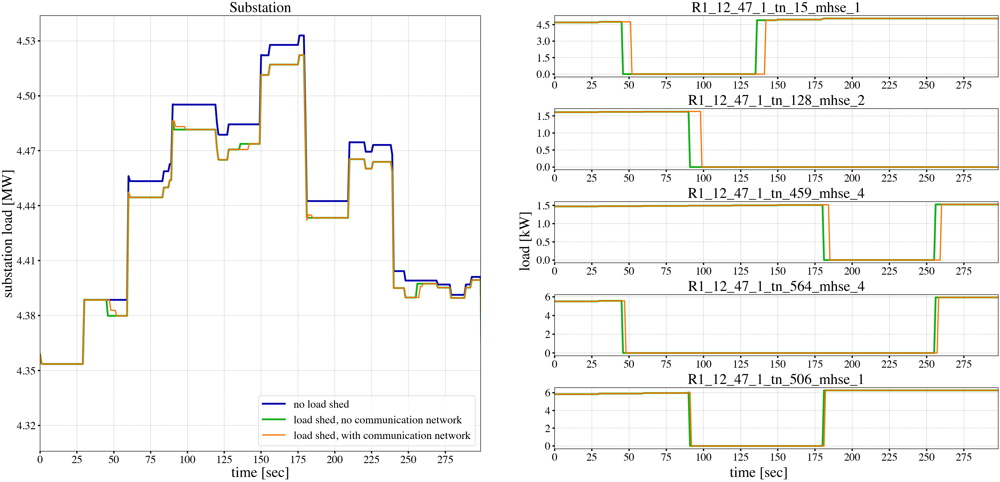
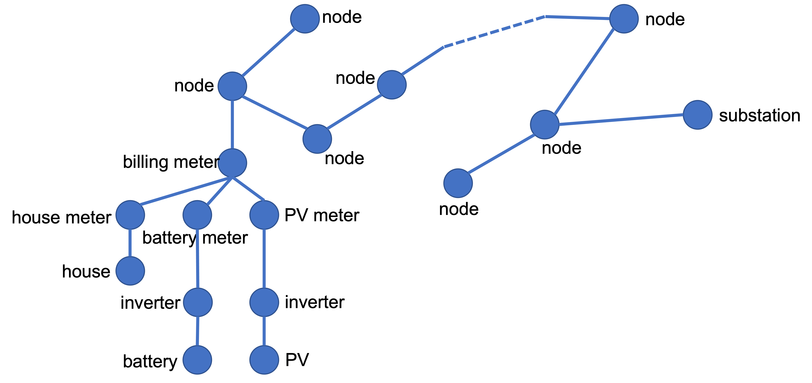
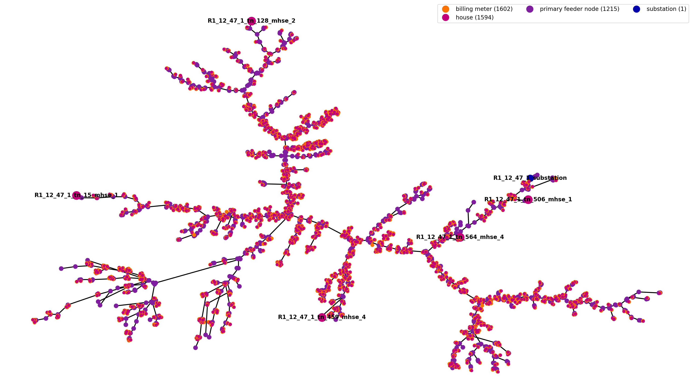

..
    _ Copyright (c) 2021-2023 Battelle Memorial Institute
    _ file: loadshed-taxonomy-feeder-doc.rst

loadshed - Prototypical Feeder with Point-to-Point Communication Network
************************************************************************

This particular version of the *loadshed* example offers the ability to build a point-to-point communication network for a prototypical feeder :cite:`osti_1040684`. It has been developed to introduce a manageable communication network modeled in ns-3, which could include as nodes any of the nodes in a populated prototypical feeder. This allowed to build a communication network of smaller or larger size to study the scalability of the ns-3 models for large power distribution systems applications, and the impact the size of the communication network has on their performance.

Scope of the example
====================

This particular example wants to demonstrate the following capabilities of TESP:

- Integrate a communication simulator, that is ns-3, that would allow modelling the cyber communication layer of a distribution system.
- Allow for a customizable communication network model built through an ns-3 model considering the distribution topology as an entry point.
- Demonstrate how the communication network structure affects the expected response of the distribution system, due to latencies and distance between communication nodes.

Co-Simulation Architecture
==========================

The directory structure for this example follows the structure:

- *R1-12.47-1* folder contains:

  - *R1-12.47-1_processed.glm* - the populated prototypical feeder GridLAB-D model, obtained by running the *feederGenerator.py* script;
  - *R1-12.47-1_gridlabd.json* - the HELICS configuration file for the GridLAB-D model containing the subscription, publications, or the end points that allow the GridLAB-D federate to interact with other federates. In this particular case, several end points corresponding to particular loads in the system publish their current power demand and subscribe to the command on their connection status, that is either to stay *IN_SERVICE* or go *OUT_OF_SERVICE* when load needs to be dropped.
  - *recorders.glm* - the recorder objects to save measurements in corresponding CSV files, at the level of each of the nodes communicating through HELICS.
  - Folders to store the results of the simulations in CSV format, that is the content of the files written using the recorder objects in GridLAB-D. These folders have been manually created to save and distinguish among the different simulated scenarios:

    - *outputs_noNS3_noLoadShed* contains the results of a stand alone GridLAB-D simulation, in which the system is not subject to any external commands to shed load.
    - *outputs_noNS3_LoadShed* contains the results of the scenario in which ideal communication is established between the Python federate emulating load shed control and GridLAB-D, that is there will be no delay between the moment the command to shed load is initiated and the corresponding load is actually disconnected from the grid and/or later reconnected.
    - *outputs_withNS3_LoadShed* contains the results of the simulation run using a cyber-communication network following the distribution network topology to route the load shedding commands from the substation level down to the loads.

- *R1-12.47-1-substation* folder contains:

  - *R1-12.47-1_substation.py* - the substation federate running at the level of the distribution model substation node, monitoring points in the network, and deciding when and what loads should be dropped.
  - *R1-12.47-1_HELICS_substConf.json* - the HELICS configuration file for the substation federate.
  - *loadshedScenario.json* - the load shed scenario given in dictionary format to suggest when and what loads are to be taken offline and/or brought back online. For example, the following dictionary entry

  .. code::

    {
      [...],
      "180":
      {
        "R1_12_47_1_tn_459_mhse_4": "OUT_OF_SERVICE",
        "R1_12_47_1_tn_506_mhse_1": "IN_SERVICE"
      },
      [...]
    }

  is interpreted by the substation federate to command at second 180 in the co-simulation to *R1_12_47_1_tn_459_mhse_4* to go offline, while *R1_12_47_1_tn_506_mhse_1* is brought online.

  **Caveat:** The names of the assets in *loadshedScenario.json* file need to be exactly the same as the names in the GridLAB-D model, and in order for the outcome to be as expected, these particular assets need to be among the ones listed as HELICS subscribers for GridLAB-D model.

- *R1-12.47-1-communication* folder contains:

  - *loadshed-p2p-network.cc* - the ns-3 model that builds a point-to-point (p2p) network between a series of nodes in the distribution system that require to communicate. The model is written to allow for an interactive way of selecting which nodes of the distribution system to be nodes in the communication network. However, keep in mind that due to the linked hierarchy in the distribution network, some nodes might be mandatory to make sure there is a path between two communicating ones.

  **Caveat:** Before running the co-simulation including the communication network, or any time after a modification is made to the model file, the model needs to be compiled using the provided *Makefile*, by running:

  .. code::

    make clean
    make

  The following configuration parameters are given to the model through a JSON file, that is *R1-12.47-1_simConfig.json*:

  .. code::

    {
      "Simulation": {
        "Simulation_Duration": 300,
        "Verbose": "true",
        "Case_Name": "R1-12.47-1_HELICS",
        "ns3_Network_Config": "./R1-12.47-1_ns3.json",
        "ns3_EP_Config": "./R1-12.47-1_HELICS_ns3Conf.json",
        "Anim_File": "./R1-12.47-1_HELICS_anim_P2P.xml",
        "Routing_File": "./R1-12.47-1_HELICS_route_P2P.xml",
        "Err_Log_File": "./R1-12.47-1_HELICS_P2P.log",
        "Node_Loc_File": "./R1-12.47-1_HELICS_P2P_nodes_reduced.txt",
        "Links_Loc_File": "./R1-12.47-1_HELICS_P2P_links.txt",
        "Node_List_File": "./R1-12.47-1_HELICS_P2P.lst"
      }
    }

  It specifies:

  - The duration of the simulation in seconds as *Simulation_Duration*.
  - Whether the ns-3 simulator should detail debugging information through the flag *Verbose*.
  - A name for the model as *Case_Name*.
  - The network configuration file as *ns3_Network_Config*. This file in JSON format has been built based on the distribution network topology and specifies all nodes in the system and how they are linked, depending on the case design.
  - The ns-3 federate HELICS configuration file as *ns3_EP_Config*. This file lists the points in the communication network model that are going to participate in information exchange through HELICS.
  - The output animation file as *Anim_File*, if the model is set to save an output of the network dynamics.
  - The routing table output file as *Routing_File*, if the model is set to save the network routing table.
  - An error logging file as *Err_Log_File* to account for possible mistakes in building the communication network.
  - A list of all selected nodes with their names and location as *Node_Loc_File*.
  - A list of all the links between the selected nodes as *Links_Loc_File*.
  - A list of all existing node categories in the current feeder as *Node_List_File*.

Running the demonstration
=========================

The three scenarios studied comparatively in this example require running different numbers of simulators federated or not using HELICS. The following paragraphs details on how to run each of them. Keep in mind that the TESP repository already contains previously obtained results for this case study, which are presented below while introducing the co-simulation workflow.

Establishing baseline results
~~~~~~~~~~~~~~~~~~~~~~~~~~~~~

The first scenario establishes a baseline for the subsequent studies. It involves only the GridLAB-D model and therefore it can be run independently, without the use of a HELICS-based co-simulation platform.

1. Inside TESP, navigate to the folder containing the GridLAB-D model, that is *R1-12.47-1* folder in this case, e.g.

.. code::

  ${HOME}/tesp/examples/capabilities/loadshed-prototypical-communication/R1-12.47-1

2. Inside this folder, at the terminal, run:

.. code::

  gridlabd R1-12.47-1_processed.glm

3. The following set of files are going to be generated inside the current directory:

  - *substation_load.csv* - total load of the system measured at the substation level, at 1-second resolution, in *W*. The baseline for the load at the substation level is shown in :numref:`loadshed-results` in blue.
  - *R1_12_47_1_tn_15_mhse_1_rec.csv, R1_12_47_1_tn_128_mhse_2_rec.csv, R1_12_47_1_tn_459_mhse_4_rec.csv, R1_12_47_1_tn_506_mhse_1_rec.csv, R1_12_47_1_tn_564_mhse_4_rec.csv* - recorded load for several system loads in *W*, and their status (*IN SERVICE* or *OUT OF SERVICE*, meaning the load is connected to, or disconnected from the grid, respectively) at 1-second resolution. For the baseline case, all loads are considered to be connected to the grid the entire simulation period.

.. _loadshed-results:

  Loadshed with prototypical feeder example results

Load shedding control without communication network
~~~~~~~~~~~~~~~~~~~~~~~~~~~~~~~~~~~~~~~~~~~~~~~~~~~

This scenario emulates a load shedding scenario where the decision to shed specific loads is taken at the substation level and the signals to disconnect and then, later, possibly re-connect loads are sent directly to the affected assets without engaging any communication infrastructure. This in the ideal case when no network latency is present. This scenario runs under TESP as a 2-federate co-simulation: the GridLAB-D running the feeder model, and a Python federate that sends the disconnect/connect signals to certain loads.

1. Inside TESP, navigate to the example folder, e.g.

.. code::

  ${HOME}/tesp/examples/capabilities/loadshed-prototypical-communication

2. At the terminal, using the HELICS Command Line Interface (CLI), run

.. code::

  helics run --path=./R1-12.47-1_broker_conf_noNS3.json

The file *R1-12.47-1_broker_conf_noNS3.json* configures the co-simulation.

.. _broker_conf_noNS3:
.. code::

  {
    "broker": true,
    "name": "LoadshedFederation",
    "federates": [
      {
        "name": "R1-12.47-1-federate",
        "host": "localhost",
        "directory": "./R1-12.47-1",
        "exec": "gridlabd -D USE_HELICS R1-12.47-1_processed.glm"
      },
      {
        "name": "R1-12.47-1-substation-federate",
        "host": "localhost",
        "directory": "./R1-12.47-1-substation",
        "exec": "python3 R1-12.47-1_substation.py --config R1-12.47-1_HELICS_substConf.json --simTime 300"
      }
    ]
  }

This configuration file identifies:

- The number of federates as the length of the *federates* vector (e.g. 2 in this case),
- Each federate with a name, specific folder to run in, and the command to execute to launch the federate.

Specifically, the Python federate emulating a control and decision center runs with:

- *--config* or *-c* flags followed by the HELICS configuration file *R1-12.47-1_HELICS_substConf.json*.
- *--simTime* or *-t* flags followed by an integer representing the number of seconds for how long the federate should run in co-simulation.

As seen in :numref:`loadshed-results` in the right-hand side graphs in green, five loads are being disconnected from the grid at different times, and then some of them are reconnected. Because the control signal reaches the controlled loads instantaneously as there is no communication network between them and the substation, the distribution network sees a change in overall load immediately and as expected (depicted in green in the left-hand side graphs).

Load shedding control over communication network
~~~~~~~~~~~~~~~~~~~~~~~~~~~~~~~~~~~~~~~~~~~~~~~~

The third scenario introduces ns-3 as the simulation federate for the communication layer realizing the cyber-connected node infrastructure of the distribution network. In this particular case, as shown in :numref:`generic-network-topology`, there exists a realizable path from the substation to any other node in the distribution network and down to any load and DER (PV or battery).

.. _generic-network-topology:

  Generic distribution network topology

The ns-3 model is set to either:

- Allow for interactive selection of which node category (substation, node, billing meter, house meter, house, battery meter, battery, solar meter, PV, or inverter) to be considered in building the ns-3 point-to-point network model, or
- Fix the communication network nodes through the ns-3 model file (requires re-compilation after any change made).

As this example requires control of the house loads from the substation level, the following node categories are fixed to be considered when building the ns-3 communication model to make sure each house load is reached from the substation:

- substation,
- node,
- billing meter, 
- house meter.

This implies that from a total of 7,590 connected points in the distribution feeder (7,589 links), only 4,412 (4,411 links) are considered. The final communication network developed for this example considering the prototypical feeder *R1-12.47-1* in :cite:`osti_1040684` is shown in :numref:`ns3-topology`, which also highlights the location of the substation and the 5 controlled loads.

.. _ns3-topology:

  Communication network topology

To run this scenario, follow the steps:

1. Inside TESP, navigate to the example folder, e.g.

.. code::

  ${HOME}/tesp/examples/capabilities/loadshed-prototypical-communication

2. At the terminal, using the HELICS Command Line Interface (CLI), run

.. code::

  helics run --path=./R1-12.47-1_broker_conf_withNS3.json

The file *R1-12.47-1_broker_conf_withNS3.json* configures the co-simulation.

.. _broker_conf_withNS3:
.. code::

  {
    "broker": true,
    "name": "LoadshedFederation",
    "federates": [
      {
        "name": "R1-12.47-1-federate",
        "host": "localhost",
        "directory": "./R1-12.47-1",
        "exec": "gridlabd -D USE_HELICS R1-12.47-1_processed.glm"
      },
      {
        "name": "R1-12.47-1-substation-federate",
        "host": "localhost",
        "directory": "./R1-12.47-1-substation",
        "exec": "python3 R1-12.47-1_substation.py --config R1-12.47-1_HELICS_substConf.json --simTime 300"
      },
      {
        "name": "R1-12.47-1-communication",
        "host": "localhost",
        "directory": "./R1-12.47-1-communication",
        "exec": "./loadshed-p2p-network --simConfigFile=R1-12.47-1_simConfig.json"
      }
    ]
  }

The extra entry in this configuration file compared to the one in the previous scenario is related to the ns-3 federate that is set to run in the communication network folder with *R1-12.47-1_simConfig.json* as the federate configuration file.

In :numref:`loadshed-results` the results of this scenario are shown in the orange color. In this example, for study purpose only, the delay on all point-to-point channels has been set to *100 ms*. This leads to a delayed response from the controlled loads going offline or online, as seen when compared to the their response when the control signals are not transmitted through a communication network. Moreover, when compared among the controlled loads, the latencies are variable as they also depend on the distance between the source and destination in the communication network and the number of hops the signal has to go through, fact corroborated by the physical distances between substation and controlled loads in :numref:`ns3-topology`.

.. Bibliography
.. ============

.. .. bibliography:: ../references/refs.bib
..    :all:
..    :style: plain

Copyright (c) 2017-2023 Battelle Memorial Institute

License: https://github.com/pnnl/tesp/blob/main/LICENSE