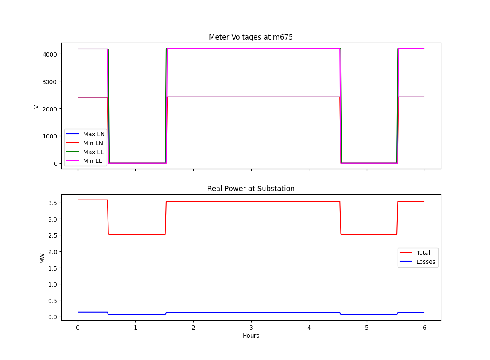

..
    _ Copyright (C) 2021-2022 Battelle Memorial Institute
    _ file: loadshed.rst

========
loadshed
========

Co-Simulation Architecture
~~~~~~~~~~~~~~~~~~~~~~~~~~
This directory contains Python and Java versions of a loadshed example on the 13-bus IEEE test feeder, modeled in GridLAB-D. In this model, a stand-alone external controller (`helicshed.py` and `helicshed.java`) send "OPEN" and "CLOSED" commands to a switch in the GridLAB-D model (`loadshed.glm`) through a simple two-node communication model in ns-3 (`loadshedCommNetwork.cc`).

.. image:: ../media/loadshed/loadshed_co-sim_diagram.png
    :width: 800

Running the Demonstration
~~~~~~~~~~~~~~~~~~~~~~~~~

loadshed - verify GridLAB-D, ns-3 and Python over HELICS 
........................................................
::

 cd ~/tesp/repository/tesp/examples/capabilities/loadshedh
 ./clean.sh # Removes any left-over results and log files
 ./runhpy.sh
 ./plot.sh

loadshed - Python without ns-3
........................................................
::

 cd ~/tesp/repository/tesp/examples/capabilities/loadshedh
 ./clean.sh # Removes any left-over results and log files
 ./runhpy0.sh
 ./plot.sh

loadshed - verify GridLAB-D, ns3 and Java over HELICS
........................................................
::

 cd ~/tesp/repository/tesp/examples/capabilities/loadshedh
 ./clean.sh
 ./runhjava.sh
 ./plot.sh

Results
~~~~~~~
Running any of the above versions and plotting the results will yield the following graph.

File Listing
~~~~~~~~~~~~
It differs from the other examples, in not using the *tesp_support* Python package. Instead, three local source files have been provided as possible starting points in developing your own source files in Python or Java.

* *clean.sh* - shell script that deletes any existing results and log file in the current directory.
* *helics_gld_msg0.json* - GridLAB-D configuration file when running without ns-3. 
* *helics_gld_msg.json* - GridLAB-D configuration file when running with ns-3.
* *helics_gld_msg_no_pub.json* 
* *helics_gld_msg_old_island.json* 
* *helicshed0.py* is the same loadshedding agent, implemented in Python for HELICS. Test with *runhpy0.sh*
* *helicshed.java* is the same loadshedding agent, implemented in Java for HELICS. Test with *runhjava.sh*
* *helicshed.py* is the same loadshedding agent, implemented in Python for HELICS with ns-3. Test with *runhpy.sh*
* *helicsRecorder.json* - HELICS configuration file for the helics_recorder used to capture the switch commands.
* *loadshedCommNetwork.cc* - ns-3 federate source code. Note that ns-3 logging is enabled only if ns-3 was built in debug mode.
* *loadshedCommNetworkConfig.json* - HELICS configuration file for the ns-3 federate.
* *loadshedConfig.json* - HELICS configuration file for the Python or Java federate
* *loadshed_dict.json*
* *loadshed.glm* - GridLAB-D model of the IEEE 13-bus feeder containing the switch being controlled by the Python or Java controllers.
* *Makefile* - defines the build process for the ns-3 model
* *plot_loadshed.py* - plotting program for the simulation results
* *plot.sh* - shell script used to plot the results
* *README.rst* - This file
* *runjava.sh* - launcher script for running the loadshed demo using a Java loadshed agent.
* *runhpy0.sh* - launcher script for running the loadshed demo using a Python agent without using the ns-3 communication network model.
* *runhpy.sh* - launcher script for running the loadshed demo using a Python agent include the ns-3 communication model.

Copyright (c) 2017-2022, Battelle Memorial Institute

License: https://github.com/pnnl/tesp/blob/main/LICENSE

