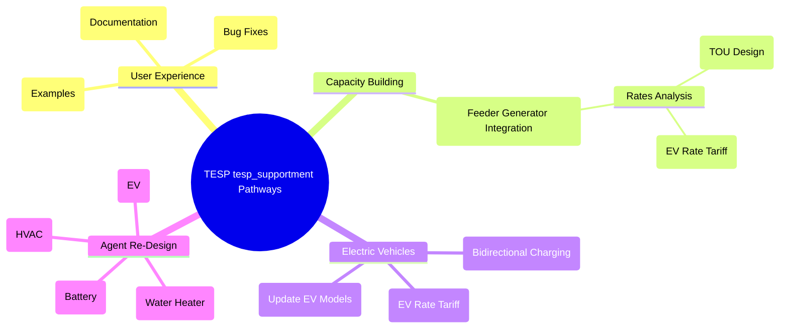
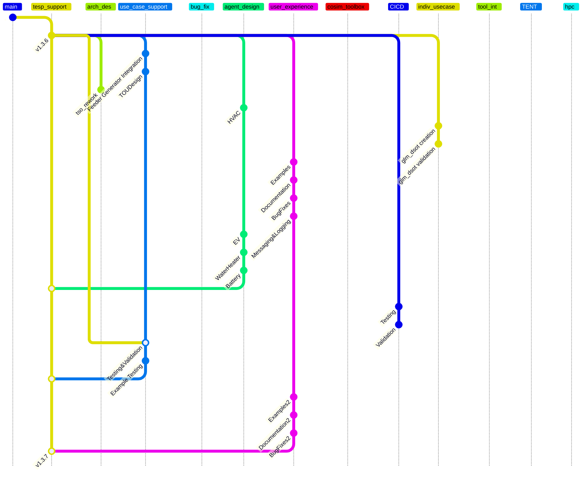

# TESP tesp_supportment Pathways

## MindMap Style

```mermaid
mindmap
  root((TESP tesp_supportment Pathways))
    User Experience
      (Examples)
      (Documentation)
      (Bug Fixes)
    Capacity Building
        (Feeder Generator Integration)
            Rates Analysis
                (TOU Design)
                (EV Rate Tariff)
    Electric Vehicles
        (Bidirectional Charging)
        (EV Rate Tariff)
        (Update EV Models)
    Agent Re-Design
        (HVAC)
        (EV)
        (Water Heater)
        (Battery)
```

## GitGraph Style

```mermaid
%%{init: { 'logLevel': 'debug',  'gitGraph': {'rotateCommitLabel': 'false'}, 'themeVariables': {'commitLabelFontSize': '16px'}} }%%
gitGraph TB:
    commit id: " "
    branch tesp_support
    commit id: "v1.3.6"
    branch arch_des
    branch use_case_support
    branch bug_fix
    branch agent_design
    branch user_experience
    branch cosim_toolbox
    branch CICD
    branch indiv_usecase
    branch tool_int
    branch TENT
    branch hpc
    checkout use_case_support
        commit id: "Feeder Generator Integration"
        checkout use_case_support
            commit id: "TOUDesign"
    
    checkout arch_des
        commit id: "tso_rework"

    checkout agent_design
        commit id: "HVAC"
    
    checkout indiv_usecase
      commit id: "glm_dsot creation"
      commit id: "glm_dsot validation"

    checkout user_experience
      commit id: "Examples"
      commit id: "Documentation"
      commit id: "BugFixes"
      commit id: "Messaging&Logging"

    checkout agent_design
        commit id: "EV"
        commit id: "WaterHeater"
        commit id: "Battery"
    checkout tesp_support
    merge agent_design
    checkout CICD
      commit id: "Testing"
      commit id: "Validation"
    
    checkout use_case_support
        
        merge cosim_toolbox id: "Testing&Validation"
        commit id: "Example Testing"
    checkout tesp_support
    merge use_case_support

    
    checkout user_experience
      commit id: "Examples2"
      commit id: "Documentation2"
      commit id: "BugFixes2"
    checkout tesp_support
    merge user_experience id: "v1.3.7"

```