..
    _ Copyright (C) 2021-2022 Battelle Memorial Institute
    _ file: DSOT_Study.rst

Distribution System Operator and Transactive (DSO+T) Study 
===========================================================

The Pacific Northwest National Laboratory completed a multi-year study where a transactive energy system was implemented to allow a number of distribution system assets to participate in an integrated retail and wholesale real-time and day-ahead energy markets. The study had the following specific objectives

* Does the large-scale transactive coordination produce stable, effective control?
* Is a DSO+T deployment of flexible assets at-scale cost effective, particularly comparing batteries vs flexible loads and deployments in moderate- vs high-renewable power systems?
* How much could a DSO+T implementation benefit and save consumers, looking at comparisons between those that participate in the transactive system and those that don't and residential versus commercial customers.

For this study, an ERCOT-spanning electrical power system model was constructed that reached in scope from bulk power system generation to individual customer loads. This included modeling 10,000s of thousands of customers with unique residential, load, and market-participating device models, as shown in Figure :numref: `fig_dsot_scope_scale`.

.. _fig_dsot_scope_scale:
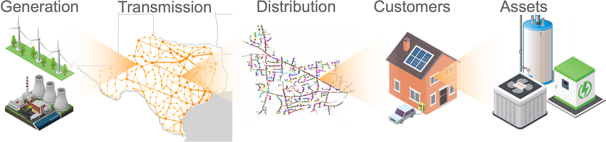

	DSO+T modeled infrastructure

Some fraction of the customer-owned assets (HVAC, electric water heaters, and batteries) were implemented such that they participated in a retail energy market run by the modeled distribution system operators (DSOs). These DSOs aggregated the price-responsiveness of the assets and presented this flexibility to the wholesale market being run by the transmission system operator (TSO). Both entities ran real-time and day-ahead energy markets.

The simulations were run on models not only replicating the state of the ERCOT power system today but also considering a number of alternative futures scenarios. Specifically, a high-renewable generation mix with increased utility-scale wind and both increased utility-scale and distributed rooftop solar was modeled. On the load side, the transactive mechanism was compared using just flexible loads as well as just using customer-owned batteries. 

An entire calendar year was simulated to capture the effects of peak loads that may occur in summar or winter, depending on the geographic location within the system. 

The documentation of the system provided here is a summary of the extensive documentation produced by the DSO+T analysis team. The version of codebase included here in TESP is similar to but not identical to that used to perform the study. Results produced by this codebase will likewise be similar but not identical. Comprehensive documentation of the study can be found in the following reports:

*  `Distribution System Operator with Transactive (DSO+T) Study Volume 1: Main Report.`_
* `DSO+T: Integrated System Simulation DSO+T Study: Volume 2`_
* `DSO+T: Transactive Energy Coordination Framework DSO+T Study: Volume 3`_
* `DSO+T: Valuation Methodology and Economic Metrics DSO+T Study: Volume 4`_

Software Architecture
---------------------
The DSO+T analysis, though run on a single local compute node, has a relatively complex software architecture. There are a number of software entities that interact through a variety of means, as shown in Figure :numref:`fig_dsot_architecture`.

.. _fig_dsot_architecture:
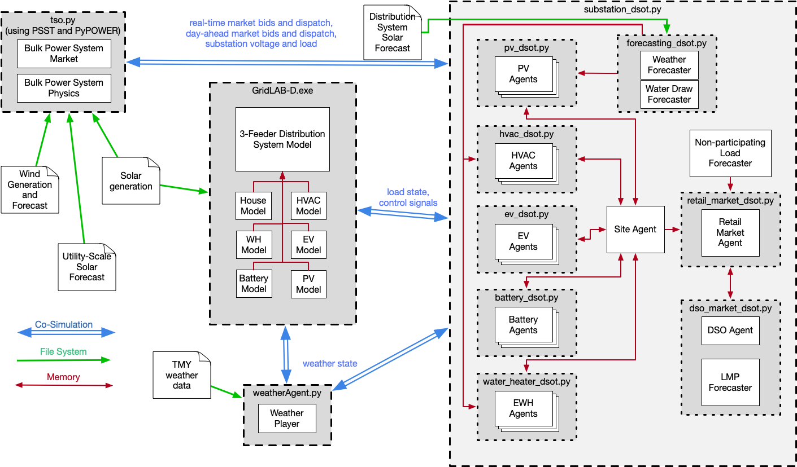

	High-level DSO+T software architecture diagram
	
Each of the gray dashed-outlined boxes represents a key executable in performing the DSO+T analysis. Some of these executables use other software entities from the same codebase to perform specific functions. For example, GridLAB-D has specific function written to allow it to implement models of water heaters, HVAC systems, and residential structures. Similarly, the substation_dsot.py calls other Python scripts to implement control agents for the loads modeled in GridLAB-D. These interactions are shown in dark-red arrows to indicate the data exchange between the software entities is happening in-memory and is largely invisible to the analyst running the simulation.

Another form of data-exchange is realized through simple file-system access. There are a number of static data files that are fed into the simulation. These largely consist of weather data that is used by a number of the software entities as they perform their functions. These interactions are indicated by green arrows from the files on disk to the software entities that use them.

The last interaction is perhaps the most complex: co-simulation. Utilizing the `HELICS co-simulation platform`_, all the software entities have been written to allow run-time data exchange, enabling the operation of one entity to affect another during execution. This functionality is essential to modeling the scale and complexity of the the system under analysis. The labels on the blue co-simulation data-exchange arrows summarize the data exchanged between the indicated entities.

Market Structure and Interactions
---------------------------------
The market structure for the transactive system implemented for the DSO+T was split into two portions: wholesale and retail. The DSO+T study had as a design requirement that the design of the retail market could not require changes to the wholesale market architecture or operation patterns. Thus the market architecture shown in Figure :numref:`fig_dsot_wholesale_market_structure` was used as representative of many of the wholesale market structures in the United States.

.. _fig_dsot_wholesale_market_structure:
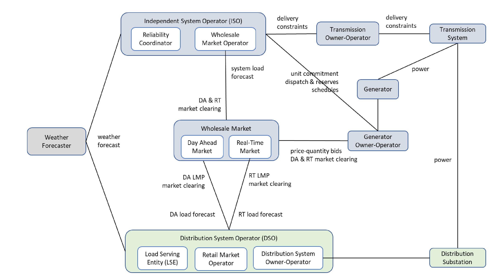

	Overview of the wholesale market architecture in the DSO+T study.

The DSO provided load forecasts to the wholesale market (from the retail market it was running) in both the day-ahead and real-time energy markets. The wholesale market treated this as fixed quantity demand bids and with the generator marginal cost bids ran a security constrained unit commitment (day-ahead market only) and/or a security constrained economic dispatch. The former was used to to provide hourly dispatches to the market participants and the later was used to provide five-minute dispatches. 

The retail market was designed specifically for the DSO+T study and its structure can be see in Figure :numref:`fig_dsot_retail_market_structure`

.. _fig_dsot_retail_market_structure:
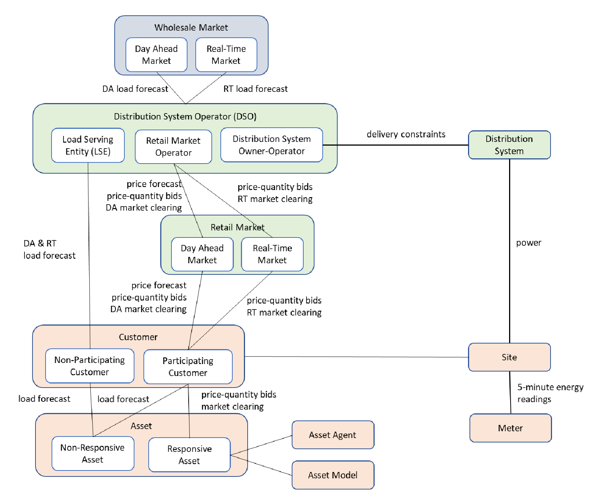

    Overview of the retail market architecture in the DSO+T study
    
The DSO had the responsibility of providing market/load forecast information for all customers in it's jurisdiction and thus had to estimate loads for those not participating the in the transactive system as well as receiving bid information for those participating. Since the communication with the day-ahead market occurred at a specific time and was not communicated as a price-responsive bid curve but a fixed demand quantity, the retail day-ahead market operated in an iterative manner to allow all retail market participants to converge on a day-ahead bid that accounted for their expected flexibility. This iterative process also used weather and solar production forecasts as well as a generic wholesale market marginal cost curve that acted as a wholesale price estimator. After the wholesale markets cleared (day-ahead and real-time), the DSO adjusts these prices to cover their fixed and non-energy marginal costs and communicates these to the market participants. Non-participating customers payed a flat rate that was calculated offline prior to the simulation.

Further details on the market and transactive system design can be found in `DSO+T: Transactive Energy Coordination Framework DSO+T Study: Volume 3`_.

Transmission System Model
-------------------------
A simplified 8-bus transmission model was used for the analysis, as shown in Figure :numref:`fig_dsot_ercot_8_bus`. A higher-fidelity 200-bus model was used to validate the 8-bus model with similar results. Both models used the same generation fleet where the location of the generators in the 200-bus model were modified to fit the locations available in the 8-bus model. For the high-renewables scenario the existing thermal fleet was maintained while the wind generation capacity was doubled to 32.6 GW, 14.8 GW of utility-scale solar 
and 21.3 GW of rooftop solar were added (though the rooftop-solar was implemented in the distribution system models). The generation mix for both scenarios are shown in :numref:`table_dsot_generation_mix`.

.. _fig_dsot_ercot_8_bus:
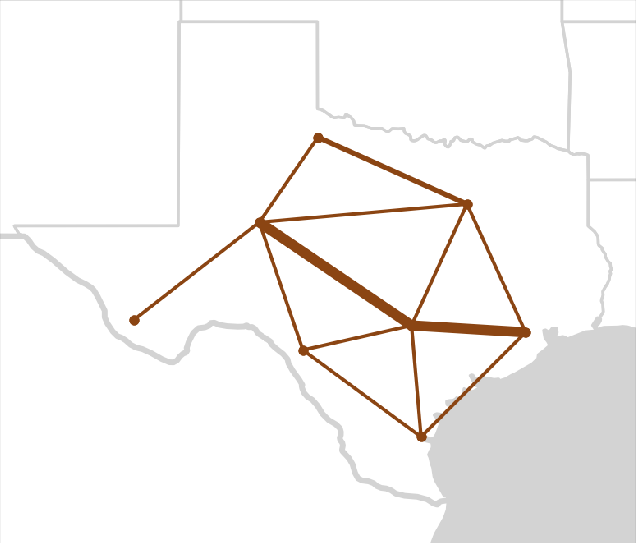

    Topology of the simplified 8-bus bulk power system model utilized.

.. _table_dsot_generation_mix:
.. table:: ERCOT Generation Mix Modeled in DSO+T

    ========================================= ============================
    Generation Type                           Generation Capacity (MW) 
    ========================================= ============================
    Coal                                      21,900                     
    Natural gas combined cycle                40,100                    
    Natural gas internal combustion engine    1,800                    
    Natural gas steam turbine                 13,000                    
    Nuclear                                   5,100                     
    Wind  (MR/HR)                             16,300/32,600             
    Solar (utility scale, HR only)            14,800                    
    Solar (distributed, MR only)              21,300                                Total  (MR/HR)                            98,300/150,600            
    ========================================= ============================

Further details on the transmission system modeling can be found in Sections 2
and 3 of the `DSO+T: Integrated System Simulation DSO+T Study: Volume 2`_

Distribution System Models
--------------------------
The prototypical feeder models (`Github feeder repository`_, `feeder development report`_) were used as the basis of the distribution system models in DSO+T. Each transmission node with load defined in the transmission system model had one to three of these models combined with a single common substation. These models had their static ZIP loads converted to GridLAB-D house objects to model residential and  commercial buildings (less than 30,000 square feet). (Industrial loads were modeled as a constant load directly attached to the transmission system bus.) Extensive literature review was done to help define building and occupant parameters for the models such as building envelope parameters, thermal mass, plug loads and internal gain schedules, HVAC schedules, and water heater types and setpoints.

For the customers participating in the transactive system the HVAC systems, electric water heaters, and EV charging were modeled as the participating loads as these are the highest-power loads. Some of the scenarios also included batteries which, when present, participated in the transactive system. In the high-renewables scenarios some customers had rooftop solar which did not participate as a generator in the transactive system but whose output was considered when estimating the power required by each participant.

Each GridLAB-D model at a given transmission bus used a corresponding TMY3 weather file, resulting in some distribution systems being summer-peaking and some being winter-peaking. The solar production data was calculated using the `National Solar Radiation Database`_.

Figures :numref:`fig_dsot_peak_load_correlation` and :numref:`fig_dsot_min_load_correlation` show the results for a representative weeks with maximum and minimum load. The gray dashed line shows the actual historic load as measured by ERCOT and the solid black line shows the total simulated load. (The gap between the itemized color load and the black total system load represents system losses.) Though not perfect, the correlation is reasonable and shows that the loads being modeled in the distribution system are generally capturing the behavior of the customer's they represent.

.. _fig_dsot_peak_load_correlation:
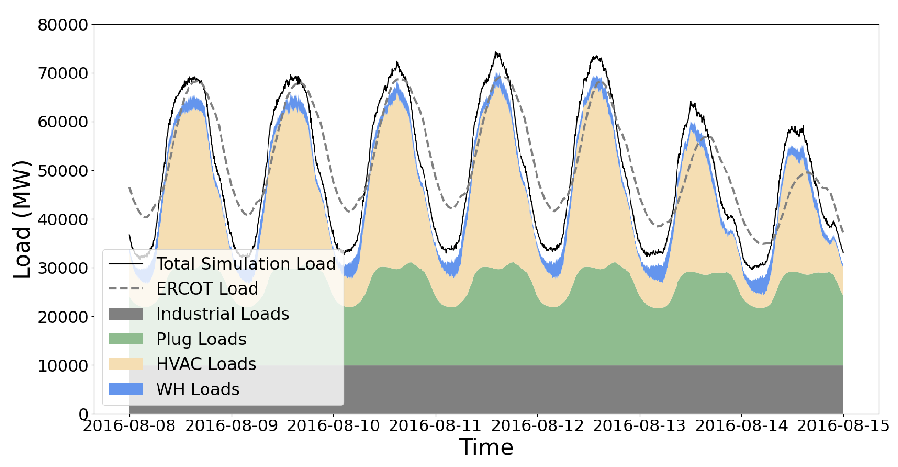
    
    Modeled and historical peak load for ERCOT

.. _fig_dsot_min_load_correlation:
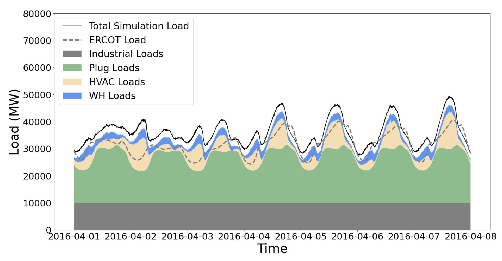
    
    Modeled and historical minimum load for ERCOT

Running DSO+T Example
---------------------
Due to the scope and scale of the analysis, the DSO+T analysis typically takes several days to simulate a whole month. Setting the simulation duration to a single week will reduce the simulation time to 12-24 hours though the built-in post-processing scripts called by 'postprocess.sh' will not function properly.

Start by downloading supporting data that is not stored in the repository due to its size and static nature. This will add a "data" folder alongside the existing "code" folder from the repository.
.. code-block:: sh
    cd tesp/repository/tesp/examples/analysis/dsot/code
    ./dsotData.sh
    
Open up "8_system_case_config.json" and confirm/change the following parameters:
.. code-block:: sh
    "StartTime": "2016-08-01 00:00:00"
    "EndTime": "2016-08-31 00:00:00"
    "Tmax":<calculate number of seconds in above defined start time>
    "caseName": <arbitrary name>
    "dsoPopulationFile": "8-metadata-lean.json"
- prepare_case_dsot.py - pre-defined cases are shown; these are the ones used for DSO+T -creates directory in "code"
- postprocess.sh

Results
-------
Below are a sample of the standard plots that are created using the built-in post-processing scripts for this case.  These scripts are designed to work on one calendar month of data though the simulation can be configured to run on much shorter periods of time; to process those results custom post-processing scripts will need to be created. 

.. _fig_dsot_results_base_fuel_mix:
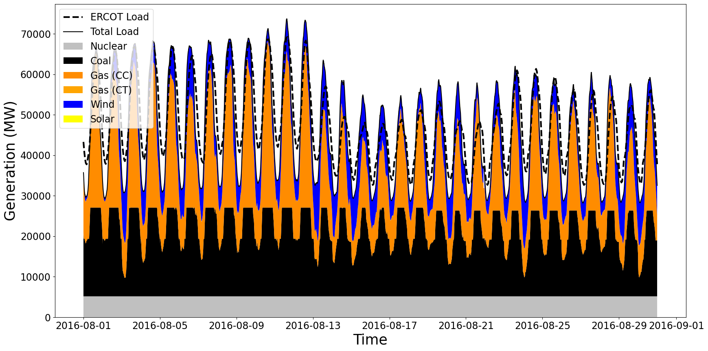
    
    Fuel source for bulk power system generation for the month of August.
    
.. _fig_dsot_results_battery_fuel_mix:
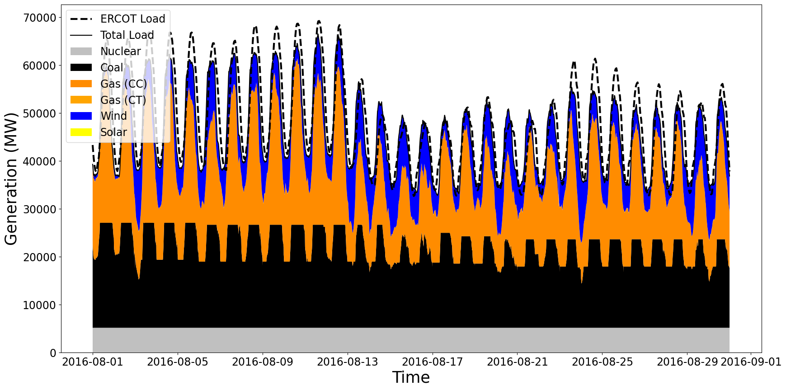
    
    Fuel source for bulk power system generation for the month of August when batteries are installed in the distribution system and participate in a transactive system.
    
.. _fig_dsot_results_base_energy_quantity:
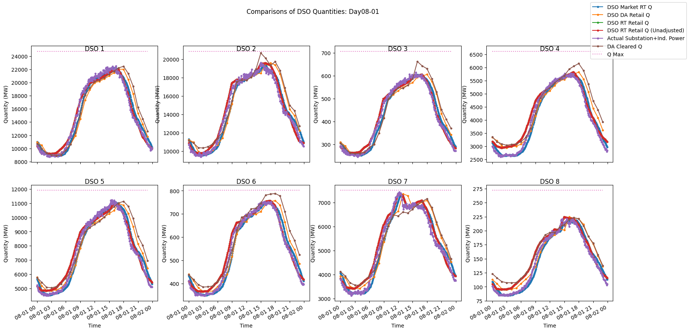
    
    Quantity of energy purchased by each of the eight modeled DSOs in the month of August in the base case.
    
.. _fig_dsot_results_battery_energy_quantity:
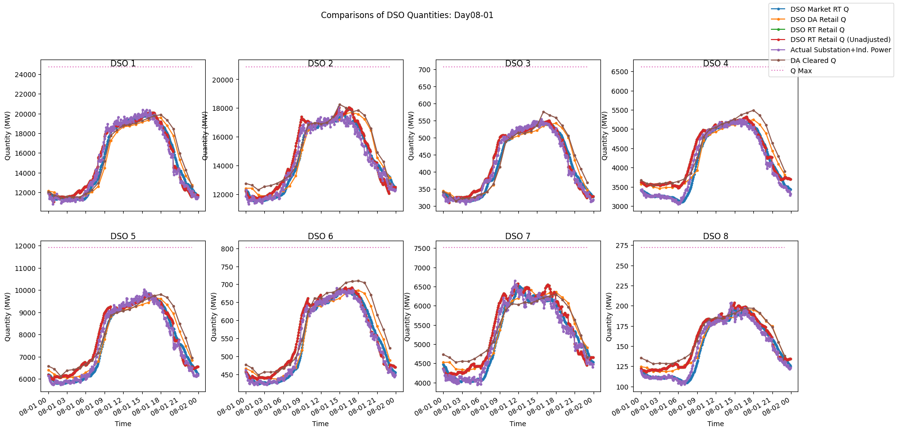
    
    Quantity of energy purchased by each of the eight modeled DSOs in the month of August when batteries are installed in the distribution system and participate in a transactive system.

.. _`ERCOT Directory Readme`: https://github.com/pnnl/tesp/blob/develop/ercot/README.md
.. _`ERCOT Bulk System Model Readme`: https://github.com/pnnl/tesp/blob/develop/ercot/bulk_system/README.md
.. _`ERCOT Feeder Model Readme`: https://github.com/pnnl/tesp/blob/develop/ercot/dist_system/README.md
.. _`ERCOT 8-Bus TESP Example Readme`: https://github.com/pnnl/tesp/blob/develop/ercot/case8/README.md
.. _`Day-Ahead Battery Bidding`: https://github.com/pnnl/tesp/blob/develop/ercot/pdf/DayAheadBidsBattery.pdf
.. _`Transformer Lifetime Agent`: https://github.com/pnnl/tesp/blob/develop/ercot/pdf/Transformer_transactive_control.pdf
.. _`Stand-alone Agent Testing`: https://github.com/pnnl/tesp/blob/develop/ercot/pdf/MasterScriptDocumentation.pdf
.. _`Water Heater Model Gaps - Overview`: https://github.com/pnnl/tesp/blob/develop/ercot/pdf/Water_Heater_Model_Deficiency_for_B2G.pdf
.. _`Water Heater Model Gaps - Presentation`: https://github.com/pnnl/tesp/blob/develop/ercot/pdf/EWH_11_6_2018.pdf
.. _`Water Heater Stratified Layer Model`: https://github.com/pnnl/tesp/blob/develop/ercot/pdf/Fixed_Layers_Stratified_Water_Heater.pdf
.. _`Water Heater Agent`: https://github.com/pnnl/tesp/blob/develop/ercot/pdf/DSO%2BT_Water_Heater_Agent.pdf

.. _`Distribution System Operator with Transactive (DSO+T) Study Volume 1: Main Report.`: https://doi.org/10.2172/1842485
.. _`DSO+T: Integrated System Simulation DSO+T Study: Volume 2`: https://doi.org/10.2172/1842488
.. _`DSO+T: Transactive Energy Coordination Framework DSO+T Study: Volume 3`: https://doi.org/10.2172/1842489
.. _`DSO+T: Valuation Methodology and Economic Metrics DSO+T Study: Volume 4`: https://doi.org/10.2172/1842491

.. _`HELICS co-simulation platform`: https://helics.org
.. _`Github feeder repository`: https://github.com/gridlab-d/Taxonomy_Feeders
.. _`feeder development report`: http://www.pnnl.gov/main/publications/external/technical_reports/PNNL-18035.pdf
.. _`National Solar Radiation Database`: https://nsrdb.nrel.gov
