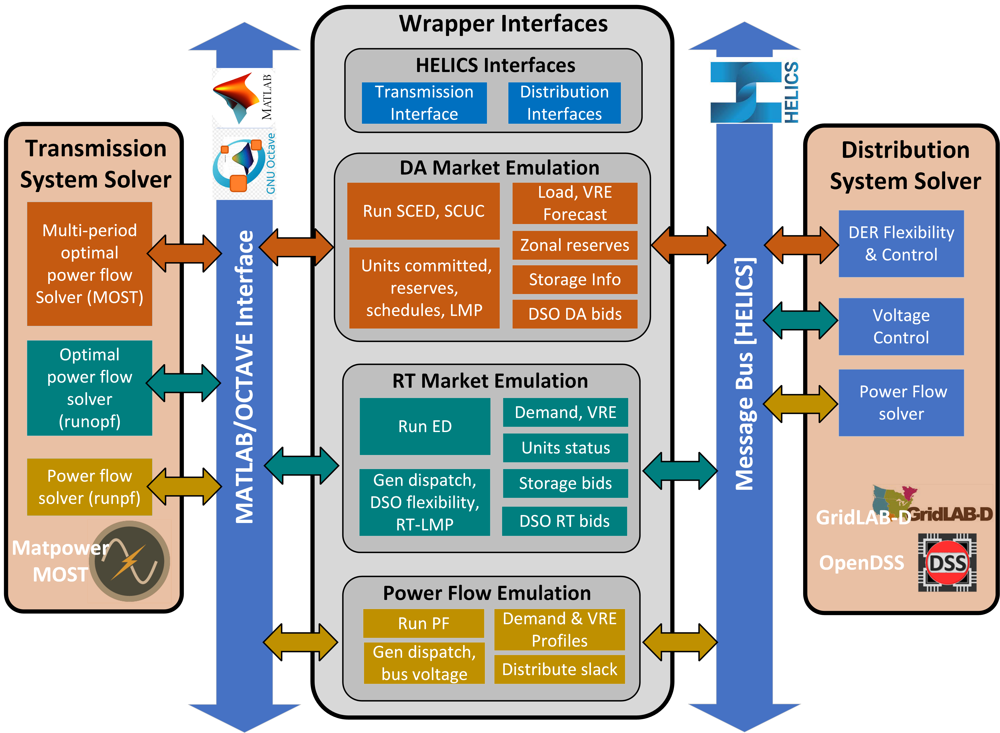

..
    _ Copyright (c) 2021-2023 Battelle Memorial Institute
    _ file: MatPowerWrapper.rst

MatPower Wrapper - Example and Documents
===============================================================

This work presents wrapper-based interfaces to integrate industry modeling tools targeted to specific functions within co-simulation (co-sim). These interfaces leverage MATPOWER-MOST, developed to minimize the barrier for simulating wholesale market operations and thereby facilitate comprehensive evaluation of candidate DER coordination schemes for providing grid services.  The  wrapper presented herein contains several programming language functions (PLFs) that encapsulate the complex formatting and coordination requirements between market processes and organizes the co-sim-based information exchange with other platforms working in tandem.  The wrapper aims to provide open-source easy-to-use configurable interfaces for researchers and students to  reduce the modeling complexity inherent to market operations while maintaining detailed emulation of the system. The wrapper-based interfaces are implemented on an 8-bus test system representing ERCOT to demonstrate its capabilities to model wholesale market operations and evaluate the impact of flexible resources such as DERs.This tool utilizes the existing open-source tool, Matpower, which is compatible with both MatLab and Octave. Hereafter, references to MatLab can be considered to also apply to Octave unless explicitly stated.

It is assumed that a user for this tool has already installed:

* Matpower
* MOST
* HELICS
* Either GUROBI or Mosek (optional, but running unit commitment is not advised without these; GUROBI reccomended)

Wrapper Architecture
--------------------
The wrapper itself contains functions to facilitate day-ahead (DA) and real-time (RT) market emulations as well as power flow emulations and functions to help interact with the co-simulation platform HELICS. These components are outlined in Figure :numref:`fig_wrapper_architecture`. 

.. _fig_wrapper_architecture:

	High-level wrapper architecture diagram
	
Initial Setup
-------------
The wrapper uses a few setup files to define the settings for the simulation being run.

The "wrapper_startup.m" file is where the user can define the needed paths for Matpower, HELICS, and whichever solver they wish to use (Mosek, GUROBI, etc.). 

The "helics_config.json" file is automatically generated by the prepare_helics_config function based on which components are defined to used in this simulation. "Publications" define the data being sent from the MatLab side. These are likely things such as clearing price for a market or voltage setpoints for a powerflow. "Subscriptions" defines the data being sent to the market simulator from an external source. These likely include energy bids or updated loads due to a decision made about a battery control; anything that would impact an upcoming market interval.

The "wrapper_config.json" file is the primary configuration file for the wrapper and contains the majority of the settings available. This is where the user defines elements such as the location of the data used to set up the model used in the simulation as well as any load or generation profiles to be used. The basic settings are also contained in this file, including the timeframe to be simulated, which emulations should be included (powerflow, RT Market, and/or DA market) and how often they should run. This file contains the settings for utilizing HELICS for co-simulation or to include a locally-defined storage component.

The "storage_config.json" file allows for user-defined storage elements to be added to the simulation; defining energy capacity, power capacity, round-trip efficiency, and location (via bus number).

Day-Ahead Market
----------------

* get_DAM_bids_from_wrapper: Used when not relying on co-simulation for DA generator bids. Bids are taken from local files.
* get_DA_forecast: Forecasted load values for the next day are taken from local files.
* create_DAM_profile: Combines the load forecasts with any other profiles to compile a DA profile before running the "most" function.

Real-Time Market
----------------

* get_RTM_bids_from_wrapper: Used when not relying on co-simulation for RT generator bids. Bids are taken from local files.
* run_RT_market: Runs a RT market with the current wrapper configuration.

Power Flow
----------

* run_power_flow: Runsa power flow with the current wrapper configuration.

HELICS Interfaces
-----------------

* prepare_helics_config: Creates the "helics_config.json" file based on your settings in other configuration files.
* start_helics_federate: Beings the federate, allowing communication through HELICS to begin.
* get_storage_from_helics: Reads in storage specs from the co-simulation rather than using the values defined in storage_config.json.
* get_loads_from_helics: Receives updated load information for the current time for the defined co-simulation bus(es) as defined in wrapper_config.json.
* send_voltages_to_helics: Sends cleared voltages for the defined co-simulation bus(es) from the last power flow. 
* get_RTM_bids_from_helics: Receives generator bids for the real-time market sent from HELICS.
* get_DAM_bids_from_helics: Receives generator bids for the day-ahead market sent from HELICS.
* send_DA_allocations_to_helics: Sends the generator allocations from the last day-ahead market to HELICS.
* send_RTM_allocations_to_helics: Sends the generator allocations from the last real-time market to HELICS.
