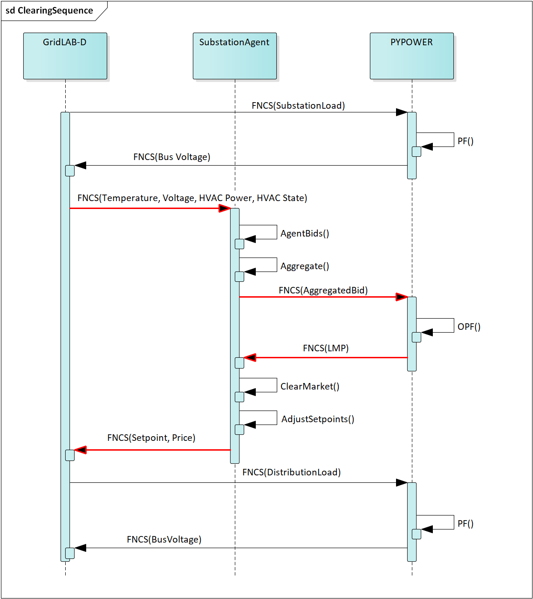

SGIP Analysis Example
======================

Problem Description and Analysis Goals
--------------------------------------

The Smart Grid Interoperability Panel (SGIP), as a part of its work, defined a number of scenarios for use in understanding ways in which transactive energy can be applicable. The first of these (hereafter referred to as "SGIP1") is a classic use case for transactive energy :cite:`15`:

   The weather has been hot for an extended period, and it has now reached an afternoon extreme temperature peak. Electricity, bulk-generation resources have all been tapped and first-tier DER resources have already been called. The grid operator still has back-up DER resources, including curtailing large customers on interruptible contracts. The goal is to use TE designs to incentivize more DER to participate in lowering the demand on the grid.

To flesh out this example the following additions and/or assumptions were made:

     - The scenario will take place in Tucson Arizona where hot weather events that stress the grid are common.
     - The scenario will span two days with similar weather but the second day will include a bulk power system generator outage that will drive real-time prices high enough to incentivize participation by transactively enabled DERs.
     - Only HVACs will be used to respond to transactive signals
     - Roughly 50% of the HVACs on one particular feeder will participate in the transactive system. All other feeders will be modeled by a loadshape that is not price-responsive. **TODO: Determine how much of the total system load is price-responsive.**
     

The goal of this analysis are as follows:

    - Evaluate the effectiveness of using transactively enabled DERs for reducing peak load.
    - Evaluate the value exchange for residential customers in terms of comfort lost and monetary compensation.
    - Demonstrate the capabilities of TESP to perform transactive system co-simulations.

Valuation Model
---------------

Value Flow Diagram
..................

Transactive Mechanism Flowchart (Sequence Diagram)
..................................................

Key Performance Metrics Definitions
...................................

Some (but not all) of the key performance metrics used in this analysis are as follows. The entire metric list can be found in :cite:`Hammerstrom:2017ta`

.. Social Welfare:

    .. math::

    SW = \sum_{i=1}^{N_L}U_i(p_i^L) - \sum_{j=1}^{N_G}C_j(p_j^G)
 
     where 
    :math: `U_i()` are the utility functions of the individual loads
    :math: `C_j()` are the utility functions of the individual generators 
    :math: `p_i^L` is the power consumption of the individual loads
    :math: `p_j^G` is the power generation of the individual generators
    :math: `N_L` is the total number of loads
    :math: `N_G` is the total number of generators
    
Electrical energy per day
,,,,,,,,,,,,,,,,,,,,,,,,
    
.. math::
    
    EE_{day} = \sum_{t=0}^{t_{day}} P_{sub}
    
where

    :math:`t` is simulation time
    
    :math:`t_{day}` is the last simulated time for each day
    
    :math:`P_{sub}` is the real power for the feeder as measured at the substation
    
    

Electrical energy per day per customer:
,,,,,,,,,,,,,,,,,,,,,,,,,,,,,,,,,,,,,,,
 
.. math::
 
    EE_{cust \cdot day} = EE_{day} / N_c

where

    :math:`N_c` is the number of customers
    
    
    
Electrical energy fee per day:
,,,,,,,,,,,,,,,,,,,,,,,,,,,,,,

.. math::

    EF_{day} =  \sum_{t=0}^{t_{day}} LMP_{sub}
    
where

    :math:`t` is simulation time
    
    :math:`t_{day}` is the last simulated time for each day
    
    :math:`LMP_{sub}` is the real power for the feeder as measured at the substation
    
    
    
Electrical energy per day per customer:
,,,,,,,,,,,,,,,,,,,,,,,,,,,,,,,,,,,,,,
 
.. math::
 
    EF_{cust \cdot day} = EF_{day} / N_c

where

    :math:`N_c` is the number of customers

Analysis Design Model
---------------------

Description of the planned analysis process showing how all the various analysis steps lead towards the computation of the key performance metrics. 

Also include definitions of the validation metrics and shows the analysis process that will lead to their calculation.

The level of detail is somewhat subjective and up to those leading the analysis. There must be sufficient detail to avoid the biggest surprises when planning the execution of the analysis but a highly detailed plan is likely to be more effort than it is worth.

Simulated System Model
----------------------

:numref:`fig_sgip1` shows the types of assets and stakeholders considered for the
use cases in this version. The active market participants include a
double-auction market at the substation level, the bulk transmission and
generation system, a large commercial building with one-way responsive HVAC
thermostat, and single-family residences that have a two-way responsive HVAC
thermostat. Transactive message flows and key attributes are indicated
in **orange**.

In addition, the model includes PV and storage resources at some of the
houses, and waterheaters at many houses. These resources can be
transactive, but are not in this version because the corresponding
separate TEAgents have not been implemented yet. Likewise, the planned
new TEAgent that implements load shedding from the substation has not
yet been implemented.

.. figure:: ../media/SGIP1system.png
	:name: fig_sgip1

	SGIP-1 system configuration with partial PV and storage adoption

The Circuit Model
.................

:numref:`fig_pp_sgip1` shows the bulk system model in PYPOWER. It is a small system
with three generating units and three load buses that comes with
PYPOWER, to which we added a high-cost peaking unit to assure
convergence of the optimal power flow in all cases. In SGIP-1
simulations, generating unit 2 was taken offline on the second day to
simulate a contingency. The GridLAB-D model was connected to Bus 7, and
scaled up to represent multiple feeders. In this way, prices, loads and
resources on transmission and distribution systems can impact each
other.

.. figure:: ../media/PYPOWERsystem.png
	:name: fig_pp_sgip1

	Bulk System Model with Maximum Generator Real Power Output Capacities

:numref:`fig_taxonomy` shows the topology of a 12.47-kV feeder based on the western
region of PNNL’s taxonomy of typical distribution feeders
:cite:`16`. We use a MATLAB feeder generator script that
produces these models from a typical feeder, including random placement
of houses and load appliances of different sizes appropriate to the
region. The model generator can also produce small commercial buildings,
but these were not used here in favor of a detailed large building
modeled in EnergyPlus. The resulting feeder model included 1594 houses,
755 of which had air conditioning, and approximately 4.8 MW peak load at
the substation. We used a typical weather file for Arizona, and ran the
simulation for two days, beginning midnight on July 1, 2013, which was a
weekday. A normal day was simulated in order for the auction market
history to stabilize, and on the second day, a bulk generation outage
was simulated. See the code repository for more details.

:numref:`fig_school` shows the building envelope for an elementary school model
that was connected to the GridLAB-D feeder model at a 480-volt,
three-phase transformer secondary. The total electric load varied from
48 kW to about 115 kW, depending on the hour of day. The EnergyPlus
agent program collected metrics from the building model, and adjusted
the thermostat setpoints based on real-time price, which is a form of
passive response.

.. figure:: ../media/FeederR1_1.png
	:name: fig_taxonomy

	Distribution Feeder Model (http://emac.berkeley.edu/gridlabd/taxonomy\_graphs/)

.. figure:: ../media/School.png
	:name: fig_school

	Elementary School Model

The Growth Model
................

This version of the growth model has been implemented for yearly
increases in PV adoption, storage adoption, new (greenfield) houses, and
load growth in existing houses. For SGIP-1, only the PV and storage
growth has actually been used. A planned near-term extension will cover
automatic transformer upgrades, making use of load growth more robust
and practical.

:numref:`tbl_sgip1` summarizes the growth model used in this report for SGIP-1. In
row 1, with no (significant) transactive mechanism, one HVAC controller
and one auction market agent were still used to transmit PYPOWER’s LMP
down to the EnergyPlus model, which still responded to real-time prices.
In this version, only the HVAC controllers were transactive. PV systems
would operate autonomously at full output, and storage systems would
operate autonomously in load-following mode.

.. table:: Growth Model for SGIP-1 Simulations
  :name: tbl_sgip1

  +---------------+--------------+------------------------+--------------------+------------------+-----------------------+
  | **Case**      | **Houses**   | **HVAC Controllers**   | **Waterheaters**   | **PV Systems**   | **Storage Systems**   |
  +===============+==============+========================+====================+==================+=======================+
  | (a) No TE         | 1594         | 1                      | 1151               | 0                 | 0                     |
  +---------------+--------------+------------------------+--------------------+------------------+-----------------------+
  | (b) Year 0        | 1594         | 755                    | 1151               | 0                 | 0                     |
  +---------------+--------------+------------------------+--------------------+------------------+-----------------------+
  | (c) Year 1        | 1594         | 755                    | 1151               | 159              | 82                    |
   +---------------+--------------+------------------------+--------------------+------------------+-----------------------+
  | (d) Year 2        | 1594         | 755                    | 1151               | 311               | 170                   |
  +---------------+--------------+------------------------+--------------------+------------------+-----------------------+
  | (e) Year 3        | 1594         | 755                    | 1151               | 464               | 253                   |
  +---------------+--------------+------------------------+--------------------+------------------+-----------------------+

Simulation Architecture Model
-----------------------------

**TODO: Provides details into the design of the software to execute the analysis, leading to the ability to calculate the key performance and validation metrics.**

Simulated Functionalities
.........................

The functionalities shown in :numref:`fig_sgip1` are implemented in simulation through a collection of software entities. Some of these entities perform dual roles (such as PYPOWER), solving equations that define the physical state of the system (in this case by solving the powerflow problem) and in also performing market operations to define prices (in this case by solving the optimal power flow problem).

    -  **GridLAB-D**
        - Simulates the physics of the electrical distribution system by solving the power flow of the specified distribution feeder model. To accomplish this it must provide the total distribution feeder load to PYPOWER (bulk power system simulator) and receives from it the substation input voltage.
        - Simulates the thermodynamics and HVAC thermostat control for all residential buildings in the specified distribution feeder model. Provides thermodynamic state information to the Substation Agent to allow formation of real-time energy bids.
    - **Substation Agent**
        - Contains all the transactive agents for the residential customers. Using the current state of the individual customers' residences (*e.g.* indoor air temperature) These agents form real-time energy bids for their respective customers and adjust HVAC thermostat setpoints based on the cleared price.
        - Aggregates all individual HVAC agents' real-time energy bids to form a single bid to present to the wholesale real-time energy market.
    - **EnergyPlus**
        - Simulates the thermodynamics of a multi-zone structure (an elementary school in this case)
        - Simulates the integrated controller of said structure
        - Communicates electrical load of said structure to GridLAB-D for its use in solving the powerflow of the distribution feeder model.
    - **PYPOWER**
        - After collecting the load information from GridLAB-D (and scaling it up to a value representative of an entire node in the transmission model) solves the bulk power system power flow to define the nodal voltages, communicating the appropriate value to GridLAB-D.
        - Using the bid information from the generation natively represented in the bulk power system model and the price-responsive load bids provided by the Substation Agent, find the real-time energy price for each node the bulk power system (the LMP) by solving the optimal power flow problem to find the least-cost dispatch for generation and flexible load. Communicate the appropriate LMP to the Substation Agent.

	Sequence of operations to clear market operations
	
Figure :numref:`fig_clearing_sequence` is a sequence diagram showing the order of events and communication of information between the software entities. 

Due to limitations in the load modeling provided by Energy+, some expected interactions are not included in this system model. Specifically:
    - The loads modeled internally in Energy+ are not responsive to voltage and thus the interaction between it and GridLAB-D is only one way: Energy+ just provides a real power load; GridLAB-D does not assume a power factor and the the Energy Plus Agent (which is providing the value via FNCS) does not assume one either.
    - The Energy Plus agent is only price responsive and does not provide a bid for real-time energy. **TODO: why?**

Data Collection
...............
**TODO: Is this important? Just link the in the UML class diagrams and highlight the particularly important parts? Generally discuss how metrics collection works in TESP? That should probably be saved for general discussion of the API**
 

Analysis Results - Model Validation
-----------------------------------

Using the metrics and data presentations previously defined, demonstrate that the behavior of the model is reasonable.

Analysis Results - Key Performance Metrics
------------------------------------------

Summary metrics results, likely in tabular form. May copy results from publications

Related Publications
--------------------

This use of TESP to perform the SGIP1 analysis resulted in the following related publications:

    S. E. Widergren, D. J. Hammerstrom, Q. Huang, K. Kalsi, J. Lian, A. Makhmalbaf, T. E. McDermott, D. Sivaraman, Y. Tang, A. Veeramany, and J. C. Woodward. Transactive Systems Simulation and Valuation Platform Trial Analysis. Technical Report PNNL-26409, Pacific Northwest National Laboratory (PNNL), Richland, WA (United States), Richland, WA, Apr. 2017. DOI: 10.2172/1379448. Available at: http://www.osti.gov/servlets/purl/1379448/
    
    Q. Huang, T. McDermott, Y. Tang, A. Makhmalbaf, D. Hammerstrom, A. Fisher, L. Marinovici, and T. D. Hardy. Simulation-Based Valuation of Transactive Energy Systems. Power Systems, IEEE Transactions on, May 2018. DOI: 10.1109/TPWRS.2018.2838111. Available at: https://ieeexplore.ieee.org/document/8360969/

