..
    _ Copyright (C) 2021 Battelle Memorial Institute
    _ file: SGIP1_Example.rst

SGIP1 Analysis Example
======================

Problem Description and Analysis Goals
--------------------------------------

The Smart Grid Interoperability Panel (SGIP), as a part of its work, defined a number of scenarios for use in understanding ways in which transactive energy can be applicable. The first of these (hereafter referred to as "SGIP1") is a classic use case for transactive energy :cite:`15`:

   The weather has been hot for an extended period, and it has now reached an afternoon extreme temperature peak. Electricity, bulk-generation resources have all been tapped and first-tier DER resources have already been called. The grid operator still has back-up DER resources, including curtailing large customers on interruptible contracts. The goal is to use TE designs to incentivize more DER to participate in lowering the demand on the grid.

To flesh out this example the following additions and/or assumptions were made:

     - The scenario will take place in Tucson Arizona where hot weather events that stress the grid are common.
     - The scenario will span two days with similar weather but the second day will include a bulk power system generator outage that will drive real-time prices high enough to incentivize participation by transactively enabled DERs.
     - Only HVACs will be used to respond to transactive signals
     - Roughly 50% of the HVACs on one particular feeder will participate in the transactive system. All other feeders will be modeled by a loadshape that is not price-responsive.

The goal of this analysis are as follows:

    - Evaluate the effectiveness of using transactively enabled DERs for reducing peak load.
    - Evaluate the value exchange for residential customers in terms of comfort lost and monetary compensation.
    - Evaluate the impacts of increasing rooftop solar PV penetration and energy storage on the transactive system performance.
    - Demonstrate the capabilities of TESP to perform transactive system co-simulations.

Valuation Model
---------------

Use Case Diagram
................
A Use Case Diagram is helpful in providing a broad overview of the activities taking place in the system being modeled. It shows the external actors and the specific use cases in which each participates as well as any sequencing between specific use cases.

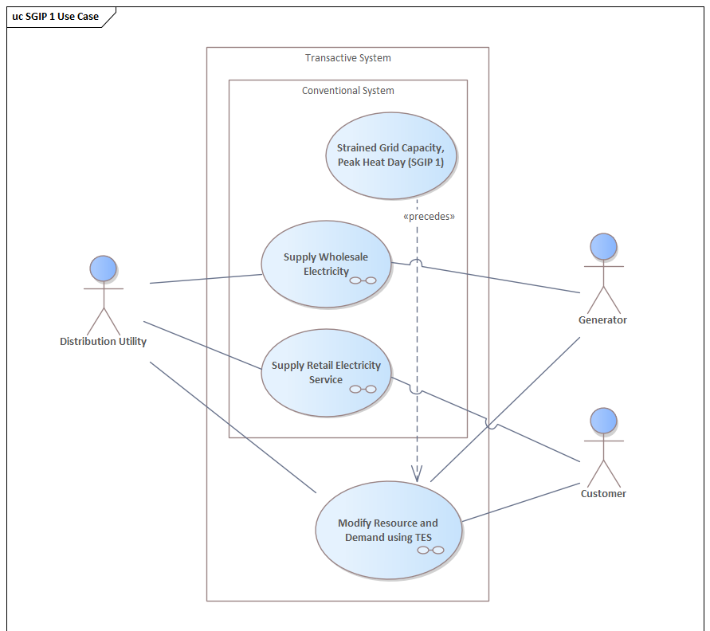

	Definition of the use cases being modeled in the system under analysis.

Value Flow Diagram
..................
Value flows define the exchanges between actors in the system. For transactive systems, these value exchanges are essential in defining and enabling the transactive system to operate effectively. These value exchanges are often used when defining the key valuation metrics used to evaluate the performance of the system. The diagrams below show the key value exchanges modeled in this system.

.. figure:: ../media/SGIP1/ValueModel-WholesaleElectricityServiceValue.png
	:name: fig_value_model_wholesale

	Value exchanges modeled in the wholesale market

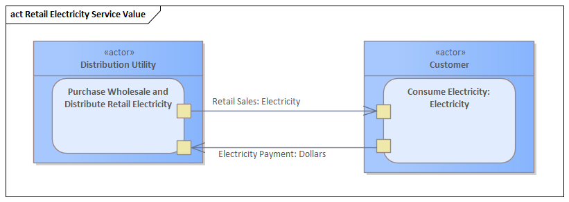

	Value exchanges modeled in the retail market

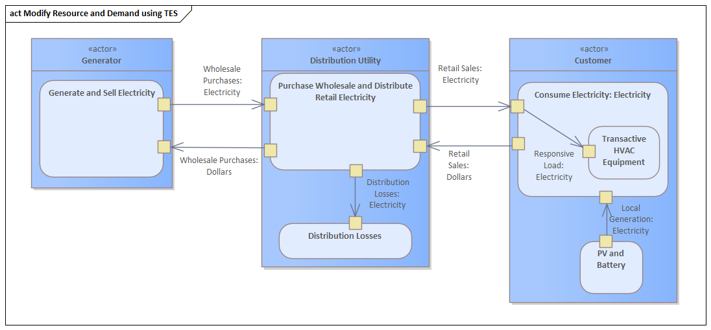

Metrics Identification
......................
To guide the development of the analysis, it is important that key metrics are identified in the value model. The diagram below shows the specific metrics identified as sub-elements of the Accounting Table object. Though this diagram does not define the means by which these metrics are calculated, it does define the need for such a defintion, leading to a data requirement from the analysis process.

Value exchanges modeled during the transactive system operation

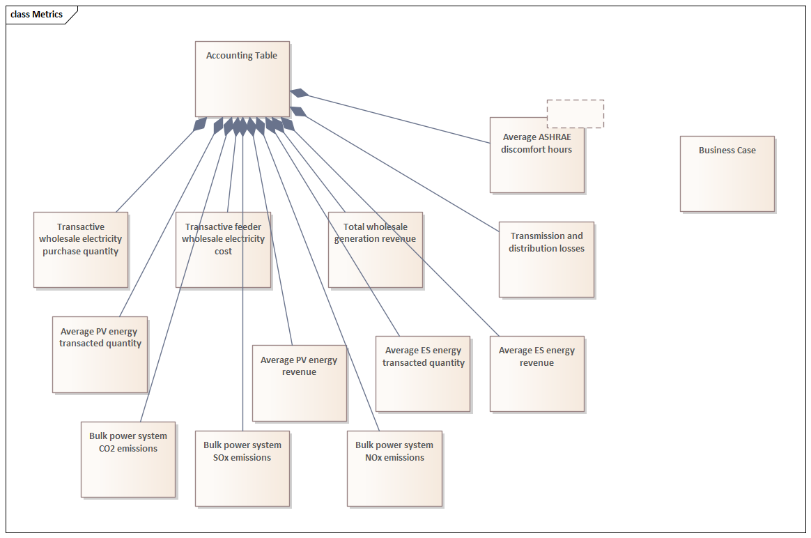

	Identification of the specific metrics to be included in the Accounting Table.

Transactive Mechanism Flowchart (Sequence Diagram)
..................................................

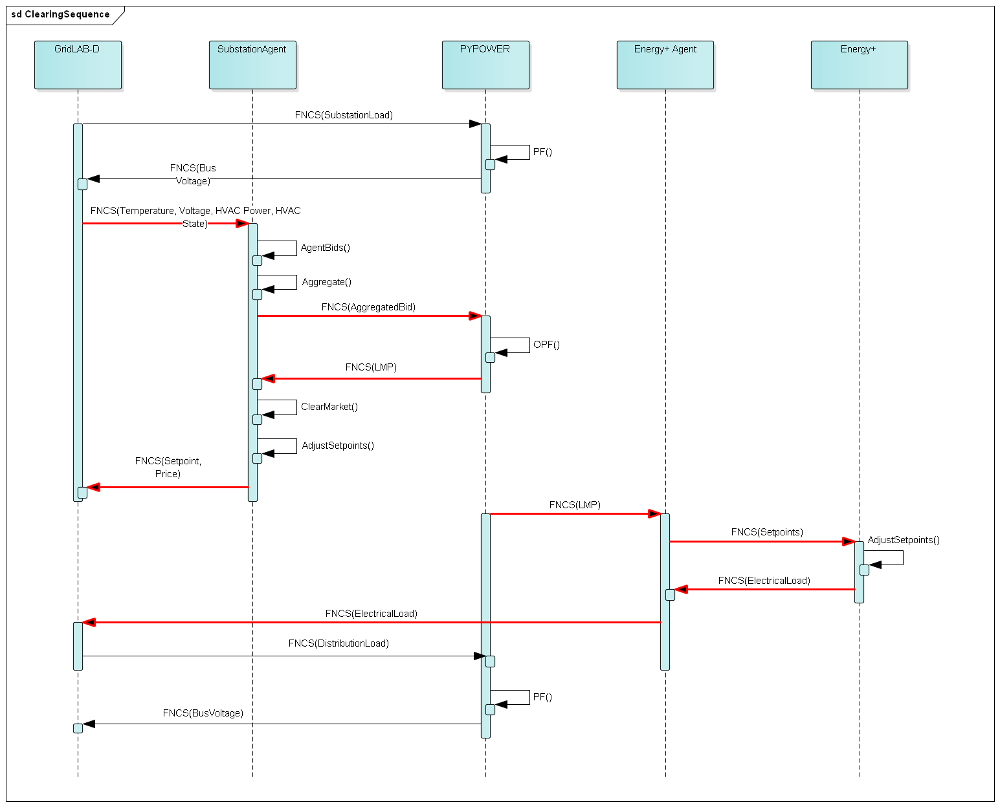

	Transactive mechanism sequence diagram showing the data exchange between participants

Key Performance Metrics Definitions
...................................

Some (but not all) of the key performance metrics used in this analysis are as follows. A list of the final metrics collected can be found in tabular form in Appendix C of :cite:`Hammerstrom:2017ta`.

Social Welfare:

.. math::

    SW = \sum_{i=1}^{N_L}U_i(p_i^L) - \sum_{j=1}^{N_G}C_j(p_j^G)

where

    * :math:`U_i()` are the utility functions of the individual loads
    * :math:`C_j()` are the utility functions of the individual generators
    * :math:`p_i^L` is the power consumption of the individual loads
    * :math:`p_j^G` is the power generation of the individual generators
    * :math:`N_L` is the total number of loads
    * :math:`N_G` is the total number of generators

Electrical energy per day
,,,,,,,,,,,,,,,,,,,,,,,,,

.. math::

    EE_{day} = \sum_{t=0}^{t_{day}} P_{sub}

where

    * :math:`t` is simulation time
    * :math:`t_{day}` is the last simulated time for each day
    * :math:`P_{sub}` is the real power for the feeder as measured at the substation

Electrical energy per day per customer:
,,,,,,,,,,,,,,,,,,,,,,,,,,,,,,,,,,,,,,,

.. math::

    EE_{cust \cdot day} = EE_{day} / N_c

where

    * :math:`N_c` is the number of customers

Electrical energy fee per day:
,,,,,,,,,,,,,,,,,,,,,,,,,,,,,,

.. math::

    EF_{day} =  \sum_{t=0}^{t_{day}} LMP_{sub}

where

    * :math:`t` is simulation time
    * :math:`t_{day}` is the last simulated time for each day
    * :math:`LMP_{sub}` is the real power for the feeder as measured at the substation

Electrical energy per day per customer:
,,,,,,,,,,,,,,,,,,,,,,,,,,,,,,,,,,,,,,,

.. math::

    EF_{cust \cdot day} = EF_{day} / N_c

where

    * :math:`N_c` is the number of customers

Accounting Table Metrics Definitions
....................................

The following equations were used to produce the metrics calculated for the Accounting Table. These equations use the following definitions:

Accounting Table Variable Definitions:
,,,,,,,,,,,,,,,,,,,,,,,,,,,,,,,,,,,,,,

.. math::

    \Delta t & = \text{time step} \\
    n_{\text{obs}} & = \text{number of daily observations} \\
    n_{\text{days}} & = \text{number of days} \\
    E_\text{purchase} & = \text{wholesale energy purchased at substation test feeder per day, [MWh/d]} \\
    P_{\text{sub}} & = \text{power consumed at substation test feeder, [W]} \\
    P_{\text{generation}} & = \text{power generated at generation substations, [MW]} \\
    aF & = \text{amp factor} \\
    E_\text{cost} & = \text{wholesale energy purchase cost per day, [\$/d]} \\
    LMP_\text{purchase} & = \text{wholesale purchase price, [\$/kWh]} \\
    LMP_\text{sell} & = \text{wholesale revenue price, [\$/kWh]} \\
    R_\text{generation} & = \text{wholesale generation revenue per day, [\$/d]} \\
    E_\text{generation} & = \text{wholesale energy generated per day, [MWh/d]} \\
    L & = \text{losses at substation, [W]} \\
    TnD & = \text{transmission and distribution losses, [\% of MWh generated]} \\
    P_\text{PV} & = \text{PV power (positive only), [kW]} \\
    P_\text{ES} & = \text{ES power (positive and negative), [KW]} \\
    Y & = \text{retail clearing price, [\$/kWh]} \\
    E_\text{PV} & = \text{average PV energy transacted, [kWh/d]} \\
    R_\text{PV} & = \text{average PV energy revenue, [\$/d]} \\
    E_\text{ES} & = \text{average ES energy transacted, [kWh/d]} \\
    R_\text{ES} & = \text{average ES energy revenue, [\$/d]} \\
    g & = \text{number of generator types in system which emit GHG out of coal, combined cycle, and single cycle} \\
    \bf{R} & = \text{3$\times g$ matrix of emission rates for CO$_2$, SO$_\text{x}$, and NO$_\text{x}$ by generator type for coal, combined cycle, and single cycle} \\
    \bf{G} & = \text{$g\times (n_\text{obs}\cdot n_\text{days})$ matrix of MWh by generator type for coal, combined cycle, and single cycle for each interval over the study period} \\
    \bf{K} & = \text{1$\times$3 matrix of emission conversion from lb to MT (CO$_2$) and kg (SO$_\text{x}$, NO$_\text{x}$)} \\
    \bf{E} & = \text{3$\times$1 matrix of total emissions by GHG type (CO$_2$, SO$_\text{x}$,  NO$_\text{x}$) over study period}

Wholesale electricity purchases for test feeder (MWh/d):
,,,,,,,,,,,,,,,,,,,,,,,,,,,,,,,,,,,,,,,,,,,,,,,,,,,,,,,,

.. math::

    E_\text{purchase} & = \Delta t\cdot \frac{aF}{1\times 10^6} \cdot
       \sum_{i=1}^{n_{\text{days}}}{
       \sum_{j=1}^{n_{\text{obs}}}{
       P_{\text{sub},i,j} }}

Wholesale electricity purchase cost for test feeder ($/day)
,,,,,,,,,,,,,,,,,,,,,,,,,,,,,,,,,,,,,,,,,,,,,,,,,,,,,,,,

.. math::

    E_\text{cost} & = \Delta t\cdot \frac{aF}{1\times 10^3} \cdot
           \sum_{i=1}^{n_{\text{days}}}{
           \sum_{j=1}^{n_{\text{obs}}}{
           P_{\text{sub},i,j}\cdot LMP_{\text{purchase},i,j} }}

Total wholesale generation revenue ($/day)
,,,,,,,,,,,,,,,,,,,,,,,,,,,,,,,,,,,,,,,,,,,,,,,,,,,,,,,,

.. math::

    R_\text{generation} & = \Delta t\cdot 1\times 10^3 \cdot
           \sum_{i=1}^{n_{\text{days}}}{
           \sum_{j=1}^{n_{\text{obs}}}{
           P_{\text{generation},i,j}\cdot LMP_{\text{sell},i,j} }}

Transmission and Distribution Losses (% of MWh generated):
,,,,,,,,,,,,,,,,,,,,,,,,,,,,,,,,,,,,,,,,,,,,,,,,,,,,,,,,,,

.. math::

    TnD & = \sum_{i=1}^{n_{\text{days}}}{
            \sum_{j=1}^{n_{\text{obs}}}{
            \frac{L_{i,j}}{P_{\text{sub},i,j}}
             }}

Average PV energy transacted (kWh/day):
,,,,,,,,,,,,,,,,,,,,,,,,,,,,,,,,,,,,,,,

.. math::

    E_\text{PV} & = \frac{\Delta t}{n_\text{obs}} \cdot
           \sum_{i=1}^{n_{\text{days}}}{
           \sum_{j=1}^{n_{\text{obs}}}{
           P_{\text{PV},i,j}
           }}

Average PV energy revenue ($/day):
,,,,,,,,,,,,,,,,,,,,,,,,,,,,,,,,,,

.. math::

    R_\text{PV} & = \frac{\Delta t}{n_\text{obs}} \cdot
           \sum_{i=1}^{n_{\text{days}}}{
           \sum_{j=1}^{n_{\text{obs}}}{
           Y_{i,j}\cdot P_{\text{PV},i,j}
           }}

Average ES energy transacted (kWh/day):
,,,,,,,,,,,,,,,,,,,,,,,,,,,,,,,,,,,,,,,

.. math::

    E_\text{ES} & =  \frac{\Delta t}{n_\text{obs}} \cdot
           \sum_{i=1}^{n_{\text{days}}}{
           \sum_{j=1}^{n_{\text{obs}}}{
           P_{\text{ES},i,j}
           }}

Average ES energy net revenue:
,,,,,,,,,,,,,,,,,,,,,,,,,,,,,,

.. math::

    R_\text{ES} & = \frac{\Delta t}{n_\text{obs}} \cdot
           \sum_{i=1}^{n_{\text{days}}}{
           \sum_{j=1}^{n_{\text{obs}}}{
           Y_{i,j}\cdot P_{\text{ES},i,j}
           }}

Emissions:
,,,,,,,,,,

.. table:: Emissions Concentrations by Technology Type
  :name: tbl_emissions

  +----------------+-----------+---------+----------+
  |                | CO2       | SOX     | NOX      |
  +================+===========+=========+==========+
  | coal           | 2074.2013 | 1.009   | 0.6054   |
  +----------------+-----------+---------+----------+
  | combined cycle | 898.0036  | 0.00767 | 0.057525 |
  +----------------+-----------+---------+----------+
  | single cycle   | 1331.1996 | 0.01137 | 0.085275 |
  +----------------+-----------+---------+----------+

.. table:: Conversion from lb to MT (CO2) and kg (SOx, NOx)
  :name: tbl_conv

  +-------+-------------+
  |       |  K          |
  +=======+=============+
  | CO2   | 0.000453592 |
  +-------+-------------+
  | SOx   | 0.453592    |
  +-------+-------------+
  | NOx   | 0.453592    |
  +-------+-------------+

Total CO2, SOx, NOx emissions (MT/day, kg/day, kg/day):
,,,,,,,,,,,,,,,,,,,,,,,,,,,,,,,,,,,,,,,,,,,,,,,,,,,,,,,

.. math::

    \mathbf{E} & =
            \sum_{i=1}^{n_{\text{days}}}{
            \sum_{j=1}^{n_{\text{obs}}}{
            \sum_{k=1}^{g}{
            \mathbf{G}_{i,j,k}\times \mathbf{R}_{k}\times \mathbf{K}
            }}}

Analysis Design Model
---------------------

The analysis design model is a description of the planned analysis process showing how all the various analysis steps lead towards the computation of the key performance metrics. The data requirements of the valuation and validation metrics drive the definition of the various analysis steps that must take place in order to be able to calculate these metrics.

The level of detail is in this model is somewhat subjective and up to those leading the analysis. There must be sufficient detail to avoid the biggest surprises when planning the execution of the analysis but a highly detailed plan is likely to be more effort than it is worth. The analysis design model supports varying levels of fidelity by allowing any individual activity block to be defined in further detail through the definition of subactivities

Top Level
.........

The top level analysis diagram (shown in :numref:`fig_AD_top_level`) is the least detailed model and shows the analysis process at the coarsest level. On the left-hand side of the diagram is the source data (which includes assumptions) and is the only analysis activity with no inputs. The analysis activity blocks in the middle of the diagram show the creation of various outputs from previously created inputs with the terminal activities being the presentation of the final data in the form of tables, graphs, and charts.

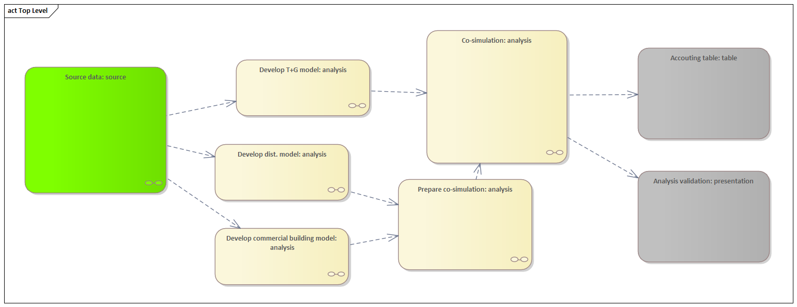

	Top level view of the analysis design model

Source Data
...........

The green source data block in the top level diagram (see :numref:`fig_AD_top_level`) is defined in further detail in a sub-diagram shown in :numref:`fig_AD_data_sources`. Many of these items are more than single values and are more complex data structures themselves.

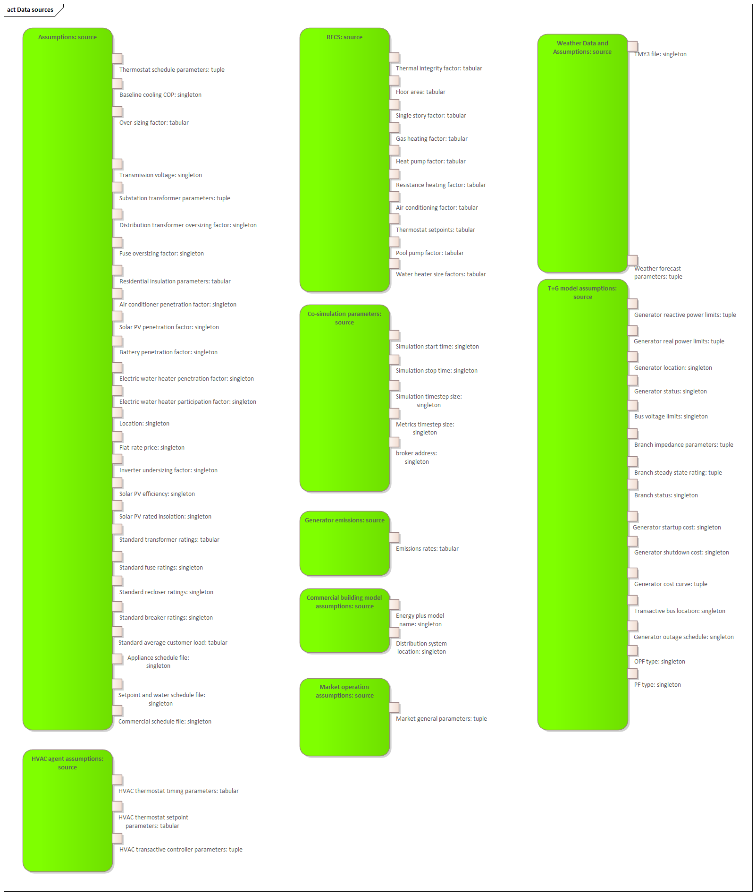

	Detailed view of the data sources necessary to the SGIP1 analysis.

Develop Transmission and Generation Model
.........................................
The "Develop T+G model" activity block in the top level diagram (see :numref:`fig_AD_top_level`) is defined in further detail in a sub-diagram shown in :numref:`fig_AD_develop_tg_model`. The diagram shows that both generation and transmission network information is used to create a PYPOWER model.

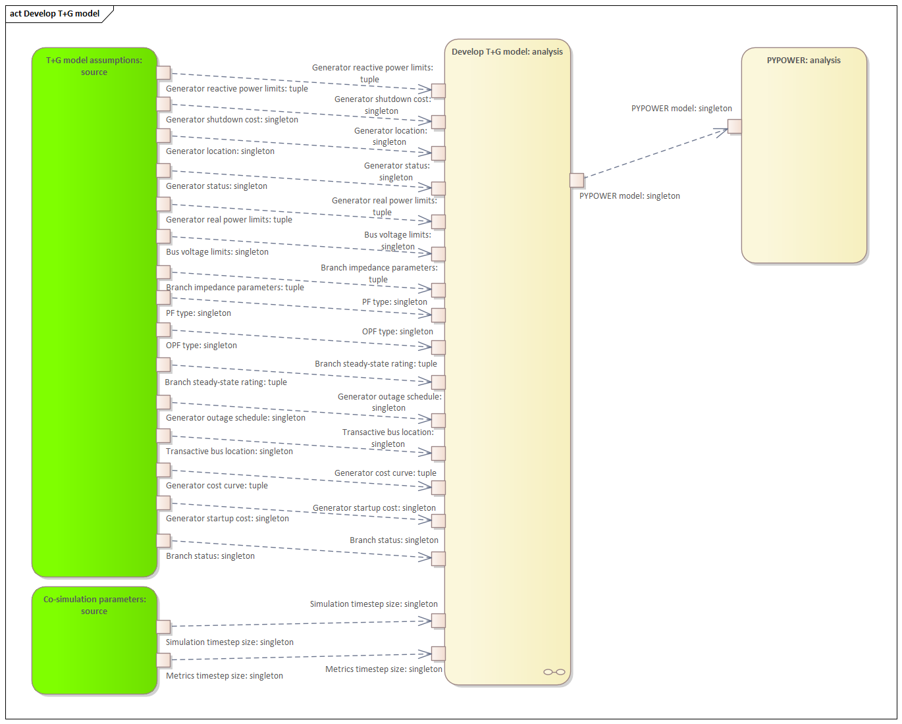

	Detailed model of the development process of the transmission and generation system model.

Develop Distribution Model
..........................
The "Develop dist. model" activity block in the top level diagram (see :numref:`fig_AD_top_level`) is defined in further detail in a sub-diagram shown in :numref:`fig_AD_develop_distribution_model`. The distribution model uses assumptions and information from the Residential Energy Consumer Survey (RECS) to define the properties of the modeled houses as well as the inclusion of rooftop solar PV and the participation in the transactive system. These inputs are used to generate a GridLAB-D model.

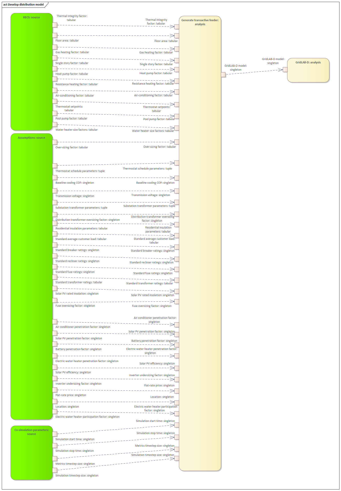

	Detailed model of the development process of the distribution system model.

Develop Commercial Building Model
.................................
The "Develop commercial building model" activity block in the top level diagram (see :numref:`fig_AD_top_level`) is defined in further detail in a sub-diagram shown in :numref:`fig_AD_develop_commercial_building_model`. The commercial building model is a predefined Energy+ model paired with a particular TMY3 weather file (converted to EPW for use in Energy+).

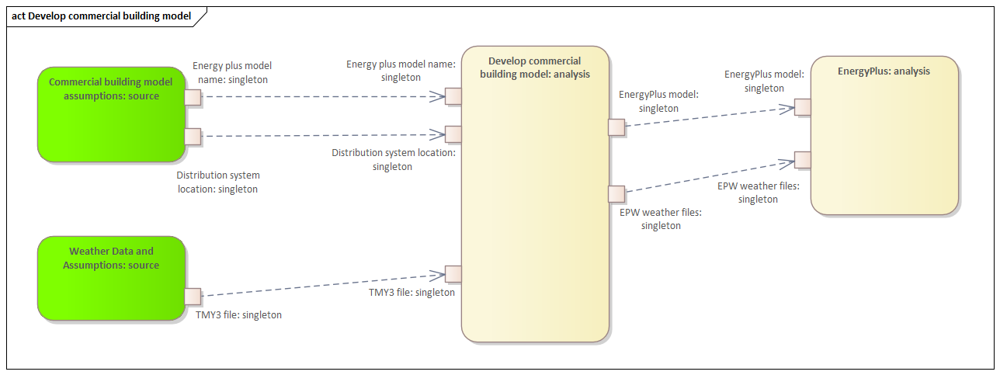

	Detailed model of the development process of the commercial building.

Prepare co-simulation
.....................
The "Prepare co-simulation" activity block in the top level diagram (see :numref:`fig_AD_top_level`) is defined in further detail in a sub-diagram shown in :numref:`fig_AD_prepare_co-simulation`. The core activity is the "Create co-sim config files" which are used by their respective simulation tools. Additionally, a special metadata file is created from the GridLAB-D model and is used by several of the metrics calculations directly.

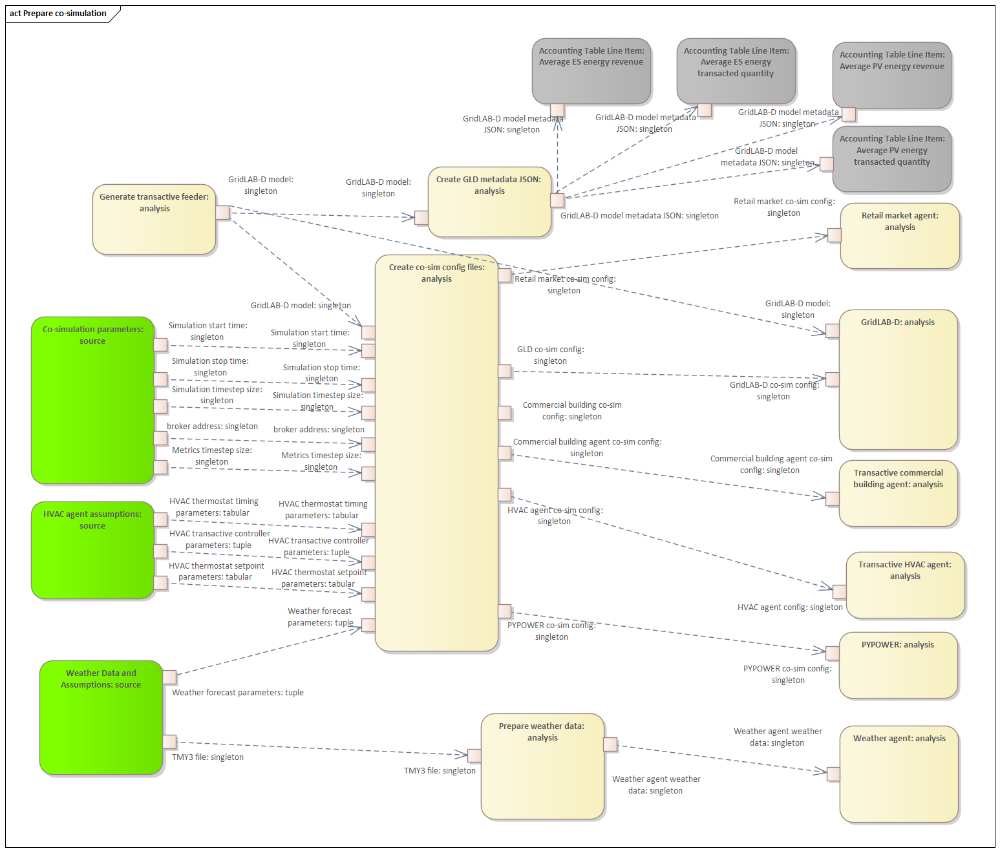

	Detailed model of the co-simulation configuration file creation.

Co-simulation
..............
The "Co-simulation" activity block in the top level diagram (see :numref:`fig_AD_top_level`) is defined in further detail in a sub-diagram shown in :numref:`fig_AD_co-simulation`. The GridLAB-D model plays a central role as a significant portion of the modeling effort is centered around enabling loads (specifically HVACs) to participate in the transactive system. In addition to the previously shown information flows between the activities the dynamic data exchange that takes place during the co-simulation run; this is shown by the "<<flow>>" arrows.

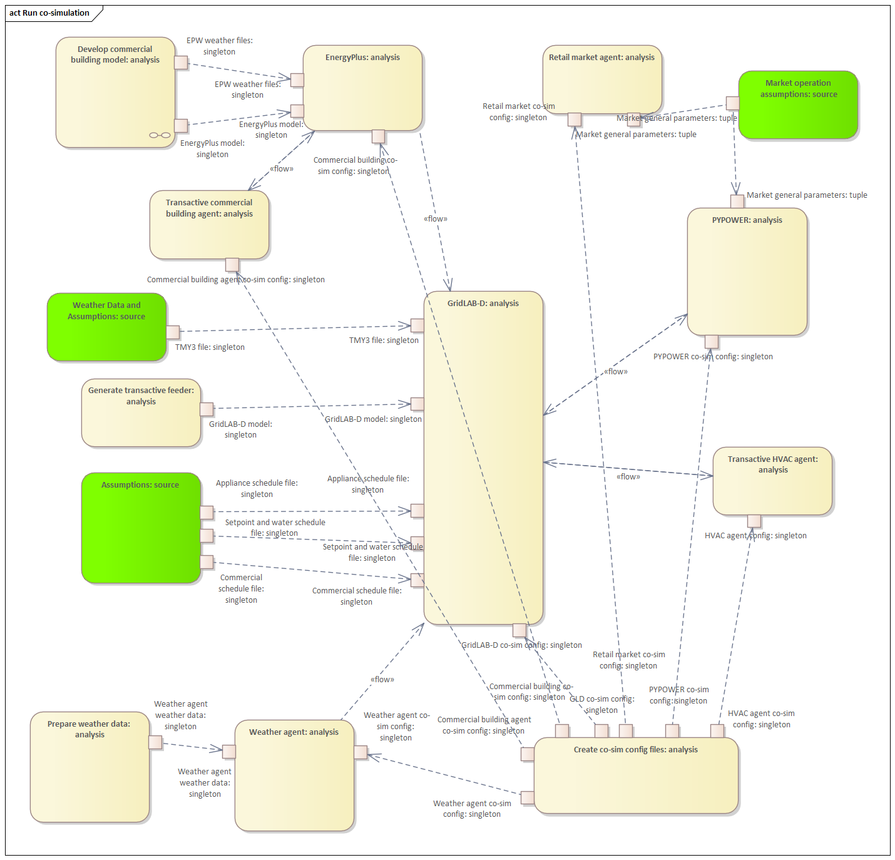

	Detailed model of the co-simulation process showing the dynamic data exchanges with "<<flow>>" arrows.

Accounting table
................
The "Accounting table" presentation block in the top level diagram (see :numref:`fig_AD_top_level`) is defined in further detail in a series of sub-diagrams shown below. Each line of the accounting table shown in :numref:`fig_value_model_metrics` is represented by a gray "presentation" block, showing the required inputs to produce that metric.

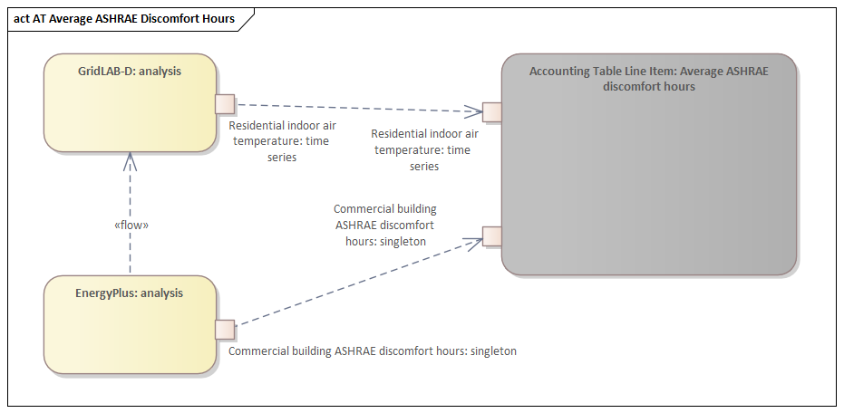

	Average ASHRAE discomfort hours metric data flow

.. figure:: ../media/SGIP1/AT_Bulk_Power_System.png
	:name: fig_AT_bulk_power_system

	Bulk power system (T+G) metrics data flows

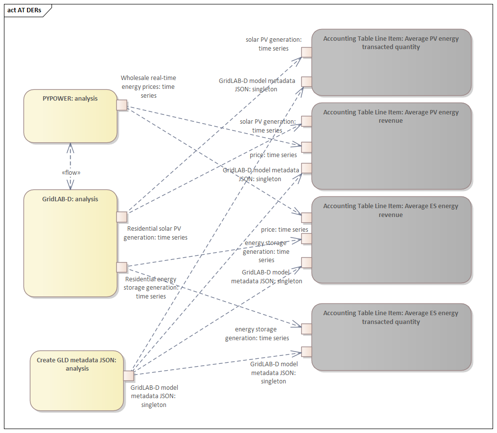

	Distributed energy resources (DERs) metrics data flows

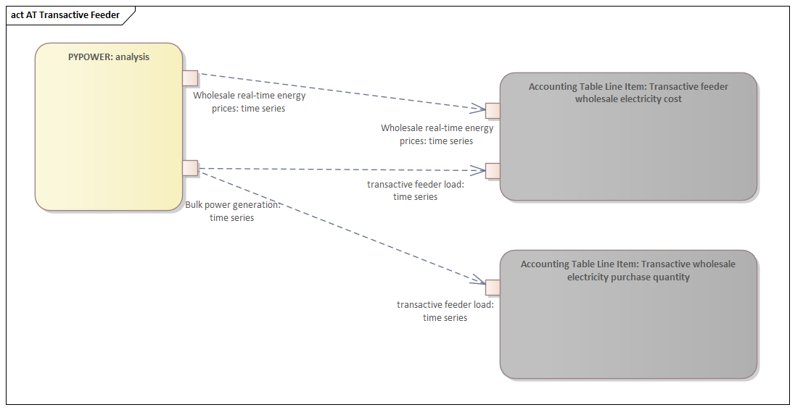

	Transactive feeder metric data flows

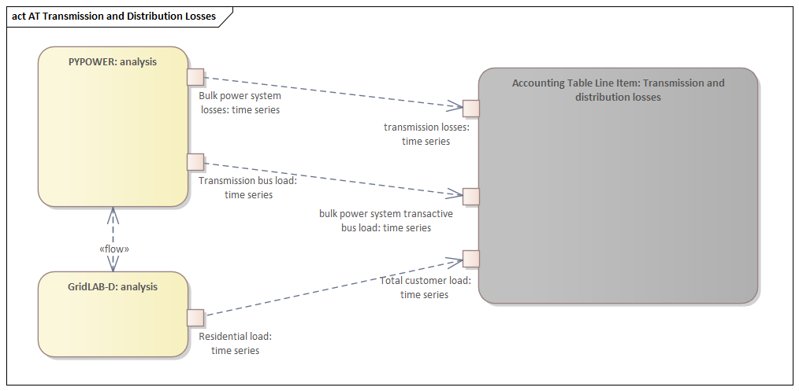

	Transmission and distribution network losses metric data flows

Analysis Validation
...................
The "Analysis validation" presentation block in the top level diagram (see :numref:`fig_AD_top_level`) is defined in further detail in a series of sub-diagrams shown below. These are metrics similar to those in the :ref:`Accounting Table` section but they are not necessarily defined by the value exchanges and thus fall outside the value model. These metrics are identified by the analysis designer in cooperation with analysis team as a whole and are used to validate the correct execution of the analysis.

.. figure:: ../media/SGIP1/AV_Bulk_Power_System.png
	:name: fig_AV_bulk_power_system

	Bulk power system metrics data flows

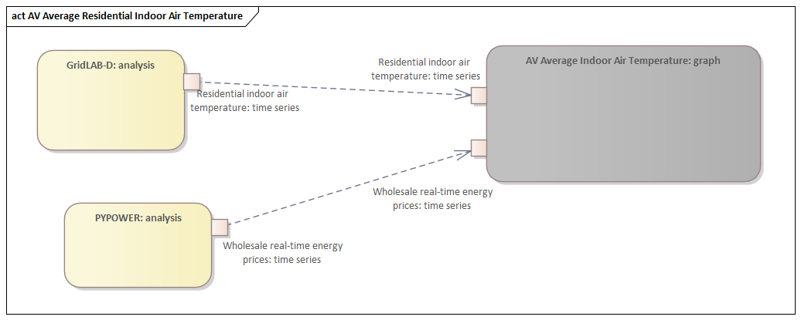

	Residential indoor air temperature metric data flows

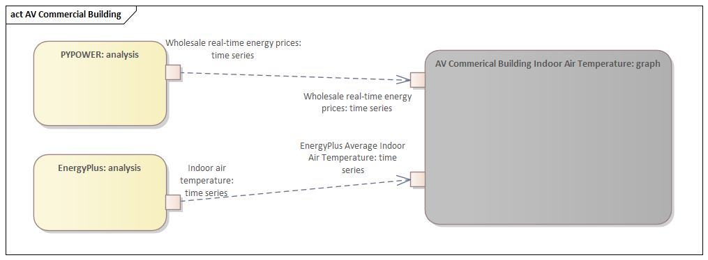

	Commercial indoor air temperature metric data flows

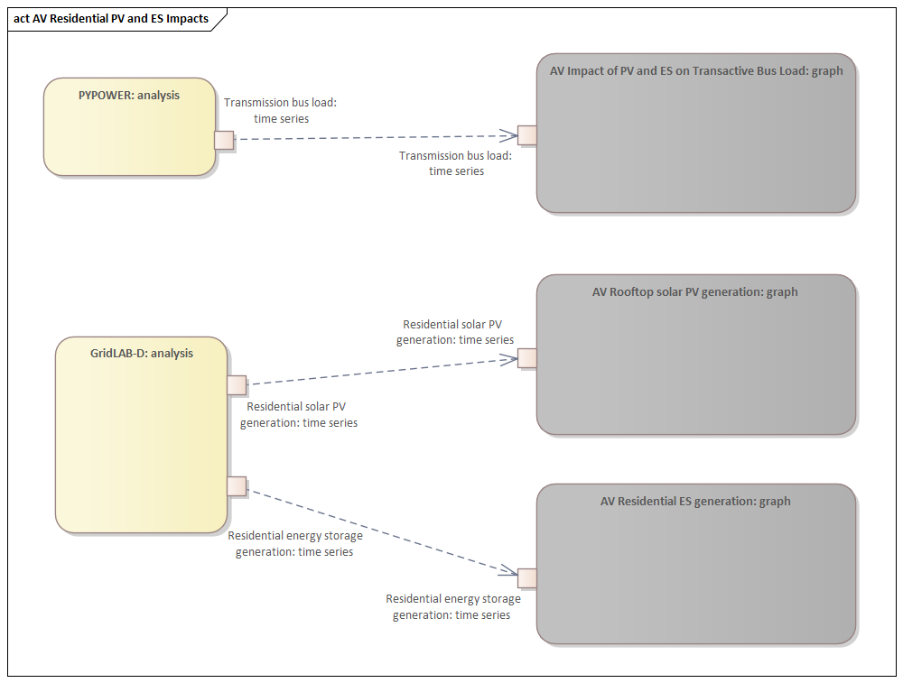

	Residential rooftop solar PV and energy storage metrics data flows

Simulated System Model
----------------------

:numref:`fig_sgip1` shows the types of assets and stakeholders considered for the use cases in this version. The active market participants include a double-auction market at the substation level, the bulk transmission and generation system, a large commercial building with one-way (price-responsive only) HVAC thermostat, and single-family residences that have a two-way (fully transactive) HVAC thermostat. Transactive message flows and key attributes are indicated in **orange**.

In addition, the model includes residential rooftop solar PV and electrical energy storage resources at some of the houses, and waterheaters at many houses. These resources can be transactive, but are not in this version. The rooftop solar PV has a nameplate efficiency of 20% and inverters with 100% efficiency. inverters are set to operate at a constant power factor of 1.0. The rated power of the rooftop solar PV installations varies from house to house and ranges from roughly 2.7 kW to 4.5 kW.

The energy storage devices also have inverters with 100% efficiency and operate in an autonomous load-following mode that performs peak-shaving and valley-filling based on the total load of the customer's house to which it is attached. All energy storage devices are identical with a capacity of 13.5 kWh and a rated power of 5 kW (both charging and discharging). The batteries are modeled as lithium-ion batteries with a round-trip efficiency of 86%. Other details can be found in :numref:`tbl_sgip1`.

.. figure:: ../media/SGIP1/SGIP1system.png
	:name: fig_sgip1

	SGIP-1 system configuration with partial PV and storage adoption

The Circuit Model
.................

:numref:`fig_pp_sgip1` shows the bulk system model in PYPOWER. It is a small system with three generating units and three load buses that comes with
PYPOWER, to which we added a high-cost peaking unit to assure convergence of the optimal power flow in all cases. In SGIP-1 simulations, generating unit 2 was taken offline on the second day to simulate a contingency. The GridLAB-D model was connected to Bus 7, and scaled up to represent multiple feeders. In this way, prices, loads and resources on transmission and distribution systems can impact each other.

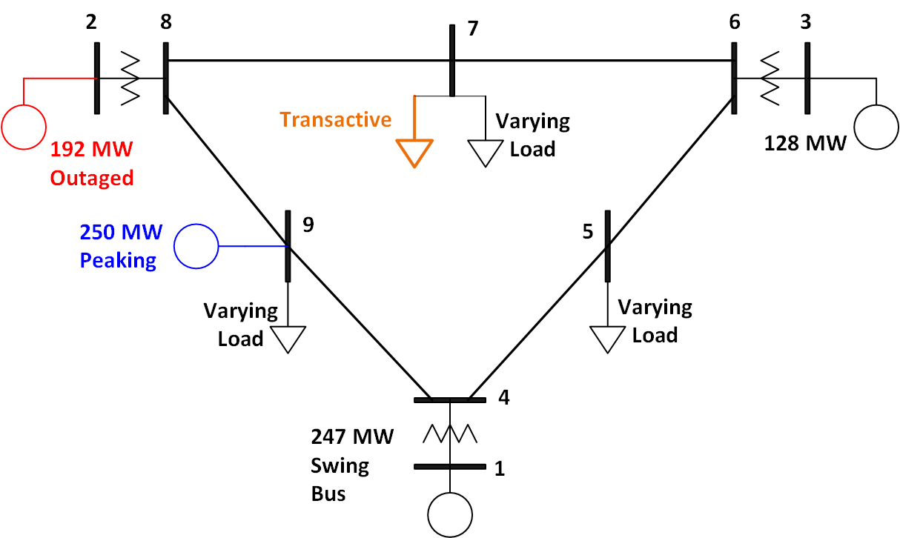

	Bulk System Model with Maximum Generator Real Power Output Capacities

:numref:`fig_taxonomy` shows the topology of a 12.47-kV feeder based on the western
region of PNNL’s taxonomy of typical distribution feeders
:cite:`16`. We use a MATLAB feeder generator script that
produces these models from a typical feeder, including random placement
of houses and load appliances of different sizes appropriate to the
region. The model generator can also produce small commercial buildings,
but these were not used here in favor of a detailed large building
modeled in EnergyPlus. The resulting feeder model included 1594 houses,
755 of which had air conditioning, and approximately 4.8 MW peak load at
the substation. We used a typical weather file for Arizona, and ran the
simulation for two days, beginning midnight on July 1, 2013, which was a
weekday. A normal day was simulated in order for the auction market
history to stabilize, and on the second day, a bulk generation outage
was simulated. See the code repository for more details.

:numref:`fig_school` shows the building envelope for an elementary school model
that was connected to the GridLAB-D feeder model at a 480-volt,
three-phase transformer secondary. The total electric load varied from
48 kW to about 115 kW, depending on the hour of day. The EnergyPlus
agent program collected metrics from the building model, and adjusted
the thermostat setpoints based on real-time price, which is a form of
passive response.

.. figure:: ../media/SGIP1/FeederR1_1.png
	:name: fig_taxonomy

	Distribution Feeder Model (http://emac.berkeley.edu/gridlabd/taxonomy\_graphs/)

.. figure:: ../media/SGIP1/School.png
	:name: fig_school

	Elementary School Model

The Growth Model
................

This version of the growth model has been implemented for yearly
increases in PV adoption, storage adoption, new (greenfield) houses, and
load growth in existing houses. For SGIP-1, only the PV and storage
growth has actually been used. A planned near-term extension will cover
automatic transformer upgrades, making use of load growth more robust
and practical.

:numref:`tbl_sgip1` summarizes the growth model used in this report for SGIP-1. In
row 1, with no (significant) transactive mechanism, one HVAC controller
and one auction market agent were still used to transmit PYPOWER’s LMP
down to the EnergyPlus model, which still responded to real-time prices.
In this version, only the HVAC controllers were transactive. PV systems
would operate autonomously at full output, and storage systems would
operate autonomously in load-following mode.

.. table:: Growth Model for SGIP-1 Simulations
  :name: tbl_sgip1

  +---------------+--------------+------------------------+--------------------+------------------+-----------------------+
  | **Case**      | **Houses**   | **HVAC Controllers**   | **Waterheaters**   | **PV Systems**   | **Storage Systems**   |
  +===============+==============+========================+====================+==================+=======================+
  | (a) No TE     | 1594         | 1                      | 1151               | 0                | 0                     |
  +---------------+--------------+------------------------+--------------------+------------------+-----------------------+
  | (b) Year 0    | 1594         | 755                    | 1151               | 0                | 0                     |
  +---------------+--------------+------------------------+--------------------+------------------+-----------------------+
  | (c) Year 1    | 1594         | 755                    | 1151               | 159              | 82                    |
  +---------------+--------------+------------------------+--------------------+------------------+-----------------------+
  | (d) Year 2    | 1594         | 755                    | 1151               | 311              | 170                   |
  +---------------+--------------+------------------------+--------------------+------------------+-----------------------+
  | (e) Year 3    | 1594         | 755                    | 1151               | 464              | 253                   |
  +---------------+--------------+------------------------+--------------------+------------------+-----------------------+

Simulation Architecture Model
-----------------------------
The SGIP1 analysis, being a co-simulation, has a multiplicity of executables that are used to set-up the co-simulation, run the co-simulation, and process the data coming out of the co-simulation. The  :ref:`Analysis Design Model` provides hints at which tools are used and how they interact but is not focused on how the tools fit together but rather how they can be used to achieve the necessary analysis objectives. This section fleshes out some of those details so that users are better able to understand the analysis process without having to resort to looking at the scripts, configuration files, and executable source code to understand the execution flow of the analysis.

Simulated Functionalities
.........................

The functionalities shown in :numref:`fig_sgip1` are implemented in simulation through a collection of software entities. Some of these entities perform dual roles (such as PYPOWER), solving equations that define the physical state of the system (in this case by solving the powerflow problem) and in also performing market operations to define prices (in this case by solving the optimal power flow problem).

    -  **GridLAB-D**

        - Simulates the physics of the electrical distribution system by solving the power flow of the specified distribution feeder model. To accomplish this it must provide the total distribution feeder load to PYPOWER (bulk power system simulator) and receives from it the substation input voltage.
        - Simulates the thermodynamics and HVAC thermostat control for all residential buildings in the specified distribution feeder model. Provides thermodynamic state information to the Substation Agent to allow formation of real-time energy bids.
        - Simulates the production of the solar PV panels and their local controller (for the cases that include such devices).
        Simulates the physics of the energy storage devices and the behavior of their local controllers.

    - **Substation Agent**
        - Contains all the transactive agents for the residential customers. Using the current state of the individual customers' residences (*e.g.* indoor air temperature) These agents form real-time energy bids for their respective customers and adjust HVAC thermostat setpoints based on the cleared price.
        - Aggregates all individual HVAC agents' real-time energy bids to form a single bid to present to the wholesale real-time energy market.
    - **EnergyPlus**
        - Simulates the thermodynamics of a multi-zone structure (an elementary school in this case)
        - Simulates the integrated controller of said structure
        - Communicates electrical load of said structure to GridLAB-D for its use in solving the powerflow of the distribution feeder model.
    - **PYPOWER**
        - After collecting the load information from GridLAB-D (and scaling it up to a value representative of an entire node in the transmission model) solves the bulk power system power flow to define the nodal voltages, communicating the appropriate value to GridLAB-D.
        - Using the bid information from the generation natively represented in the bulk power system model and the price-responsive load bids provided by the Substation Agent, find the real-time energy price for each node the bulk power system (the LMP) by solving the optimal power flow problem to find the least-cost dispatch for generation and flexible load. Communicate the appropriate LMP to the Substation Agent.

	Sequence of operations to clear market operations

Figure :numref:`fig_clearing_sequence` is a sequence diagram showing the order of events and communication of information between the software entities.

Due to limitations in the load modeling provided by Energy+, some expected interactions are not included in this system model. Specifically:

    - The loads modeled internally in Energy+ are not responsive to voltage and thus the interaction between it and GridLAB-D is only one way: Energy+ just provides a real power load; GridLAB-D does not assume a power factor and the the Energy Plus Agent (which is providing the value via FNCS) does not assume one either.
    - The Energy Plus agent is only price responsive and does not provide a bid for real-time energy.

Software Execution
..................
As is common in many analysis that utilize co-simulation, the SGIP1 analysis contains a relatively large number of executables, input, and output files. Though there are significant details in the :ref:`Analysis Design Model` showing the software components and some of the key data flows and interactions between them, it does not provide details of how the software is executed and interacts with each other. These details are provided below, focusing on the input and output files created and used by each executable.

Software Architecture Overview
,,,,,,,,,,,,,,,,,,,,,,,,,,,,,,
Figure :numref:`fig_SA_top_level` provides the broadest view of the analysis execution. The central element is the "runSGIPn.sh" script which handles the launching of all individual co-simulation elements. To do this successfully, several input and configuration files need to be in place; some of these are distributed with the example and others are generated as a part of preparing for the analysis. Once the co-simulation is complete, two different post-processing scripts can be run to process and present that results.

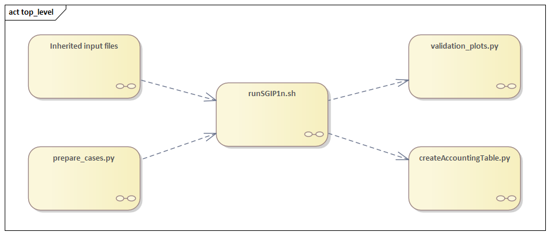

	Overview of the software execution path

Inherited Files
,,,,,,,,,,,,,,,
Figure :numref:`fig_SA_inherited_input_files` provides a simple list of files that are distributed with the analysis and are necessary inputs. The provenance of these files is not defined and thus this specific files should be treated as blessed for the purpose of the SGIP1 analysis.

.. figure:: ../media/SGIP1/SA_inherited_input_files.png
	:name: fig_SA_inherited_input_files

	List of files distributed with the SGIP1 analysis that are required inputs.

prepare_cases.py
,,,,,,,,,,,,,,,,
Figure :numref:`fig_SA_prepare_cases` shows the process by which the co-simulation-specific files are generated. The weather agent uses a specially-formatted weather file that is generated by the "weathercsv" method in "TMY3toCSV.py". After this completes the "glm_dict.py" script executes to create the GridLAB-D metadata JSON. Lastly, the "prep_substation.py" script runs to create co-simulation configuration files. "prepare_cases.py" does this for all the cases that the SGIP1 analysis supports.

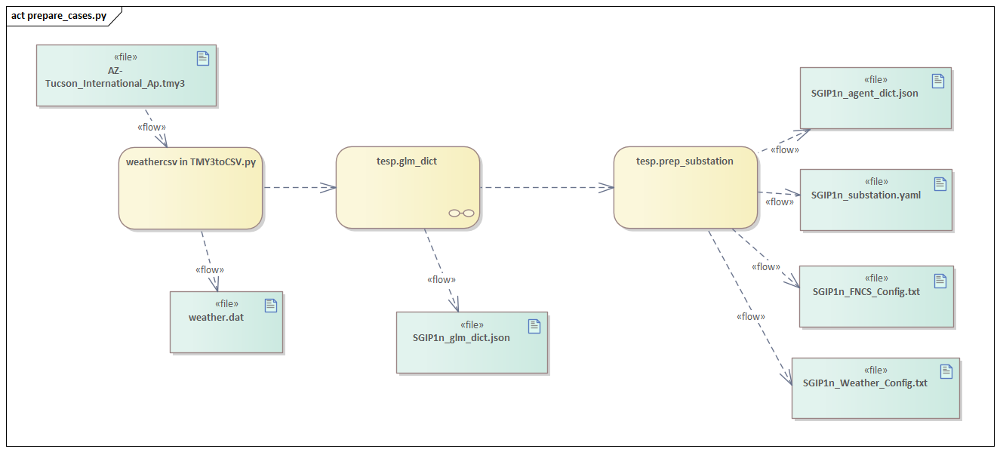

	Co-simulation files generated by "prepare_cases.py" in preparation of performing the analysis proper.

runSGIPn.sh
,,,,,,,,,,,,
Figure :numref:`fig_SA_runSGIP1n` shows series of executables launched to run the SGIP1 co-simulation analysis. All of the activity blocks denote a specific executable with all being run in parallel to enable co-simulation. Each executable has its own set of inputs and outputs that are required and generated (respectively). Though most of these inputs are files (as denoted by the file icon), a few are parameters that are hard-coded into this script (*e.g.* the EnergyPlus Agent). Some input files have file dependencies of their own and these are shown as arrows without the "<<flow>>" tag. The outputs generated by each executable generally consist of a log file and any data collected in a metrics file.

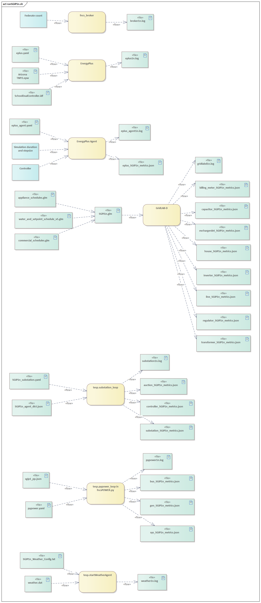

	Co-simulation executables launched by "runSGIP1n.sh" and their output metrics files

validation_plot.py
,,,,,,,,,,,,,,,,,,
Figure :numref:`fig_SA_validation_plots` shows the inputs files generated by the co-simulation that are used to generate plots used to validate the correct operation of the co-simulation. TESP provides scripts for post-processing the metrics files produced by the simulation tools and these are used to create Python dictionaries which can be manipulated to produce the validation plots.

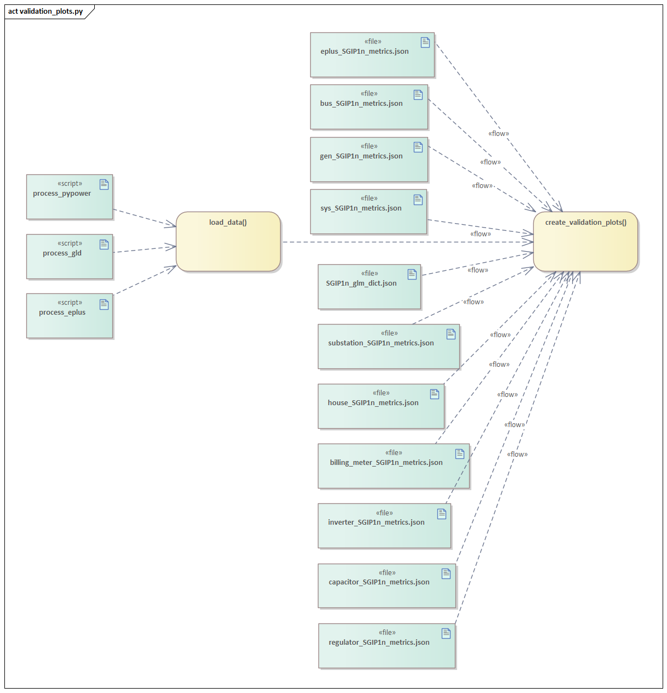

	Post-processing of the output metrics files to produce plots to validate the correct execution of the co-simulation.

createAccountingTable.py
,,,,,,,,,,,,,,,,,,,,,,,,
Figure :numref:`fig_SA_createAccountingTable` shows the input metrics files to used to calculate the final accounting table output from the metrics identified by the :ref:`Valuation Model`.

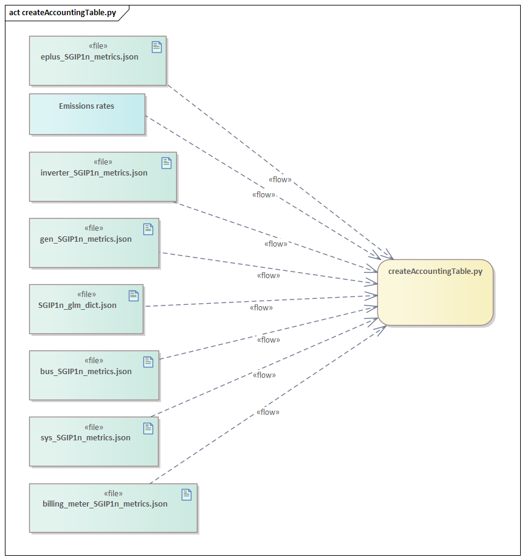

	Post-processing of the output metrics files to produce the necessary metrics for the accounting table.

Data Collection
...............
The data collection for TESP is handled in a largely standardized way. Each simulation tool produces an output dataset with key measurements. This data is typically stored in a JSON file (with an exception or two where the datasets are large and HDF5 is used). The specific data collected is defined in the :ref:`metrics section<design_reference_metrics>` of the TESP  :ref:`design_reference`.

The JSON data files are post-processed by Python scripts (one per simulation tool) to produce Python dictionaries that can then be queried to further post-process the data or used directly to create graphs, charts, tables or other presentations of the data from the analysis. Metadata files describing the models used in the analysis are also used when creating these presentations.

Running the Example
-------------------

As shown in :numref:`tbl_sgip1`, the SGIP1 example is actually a set of five separate co-simulation runs. Performing each run takes somewhere around two hours (depending on the hardware) though they are entirely independent and thus can be run in parallel if sufficient computation resources are available. To avoid slowdowns due to swapping, it is recommended that each run be allocated 16Gb of memory.

To launch one of these runs, only a few simple commands are needed::

    cd ~/tesp/examples/sgip1
    python3 prepare_cases.py # Prepares all SGIP1 cases
    # run and plot one of the cases
    ./runSGIP1b.sh

``./runSGIP1b.sh`` will return a command prompt with the co-simulation running in the background. To check how far along the co-simulation monitoring one of the output files is the most straight-forward way::

    tail -f SGIP1b.csv

The first entry in every line of the file is the number of seconds in the co-simulation that have been completed thus far. The co-simulation is finished at 172800 seconds. After that is complete, a set of summary plots can be created with the following command::

    python3 plots.py SGIP1b

Analysis Results - Model Validation
-----------------------------------
The graphs below were created by running ``validation_plots.py`` (**TODO:** Update default path to match where the data will be) to validate the performance of the models in the co-simulation. Most of these plots involve comparisons across the cases evaluated in this study (see :numref:`tbl_sgip1`).

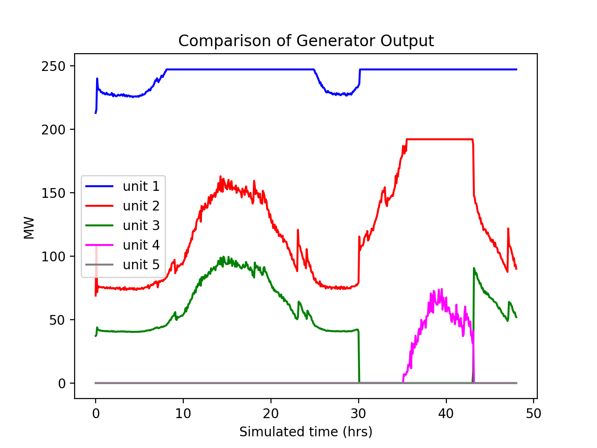

	Generator outputs of bulk power system, showing the loss of Unit 3 on the second day.

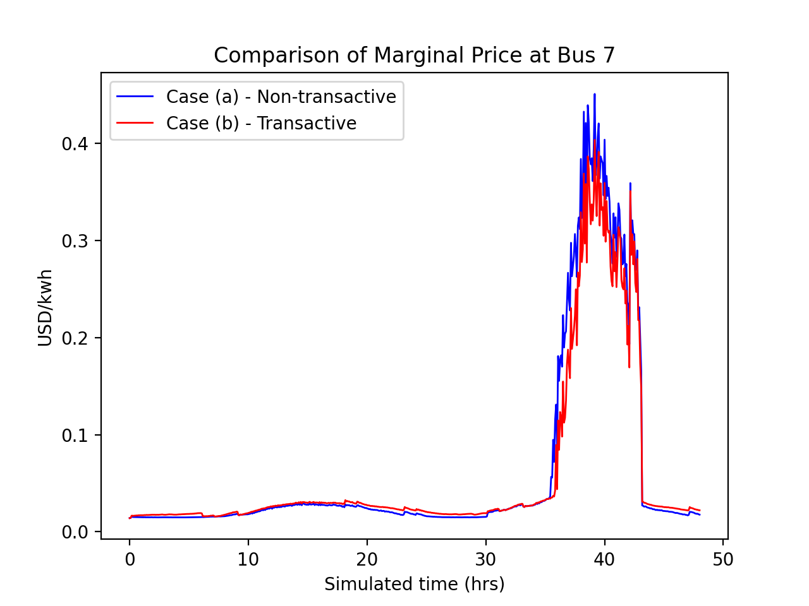

	Wholesale market prices (LMPs) for base and transactive cases, showing lower prices during the peak of the day as transactively participating loads respond.

.. figure:: ../media/SGIP1/validation_transactive_bus_loads2.png
	:name: fig_validation_transactive_bus_loads4

	Total load for transactive feeder in base and transactive case. Should show peak-shaving, valley-filling, and snapback as prices come down off their peak.

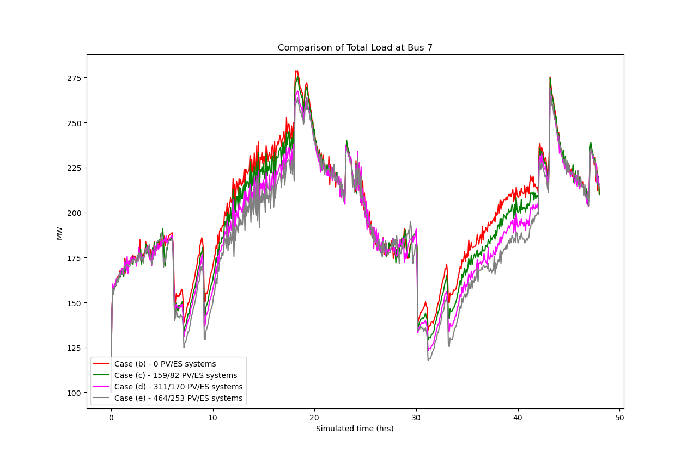

	Total load for transactive feeder in for four transactive cases with increasing levels of rooftop solar PV and energy storage penetration.

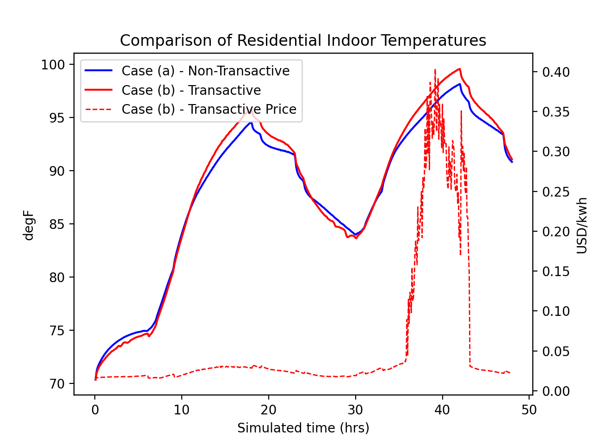

	Average residential indoor air temperature for all houses in both base and transactive case. The effect of the transactive controller for the HVACS drives lower relatively lower temperatures during low price periods and relatively higher prices during higher periods.

.. figure:: ../media/SGIP1/validation_commercial_building_indoor_temperature.png
	:name: fig_validation_commercial_building_indoor_temperature

	Commercial building (as modeled in Energy+) indoor air temperature for the base and transactive case. Results should be similar to the residential indoor air temperature with lower temperatures during low-price periods and higher temperatures during high-price periods.

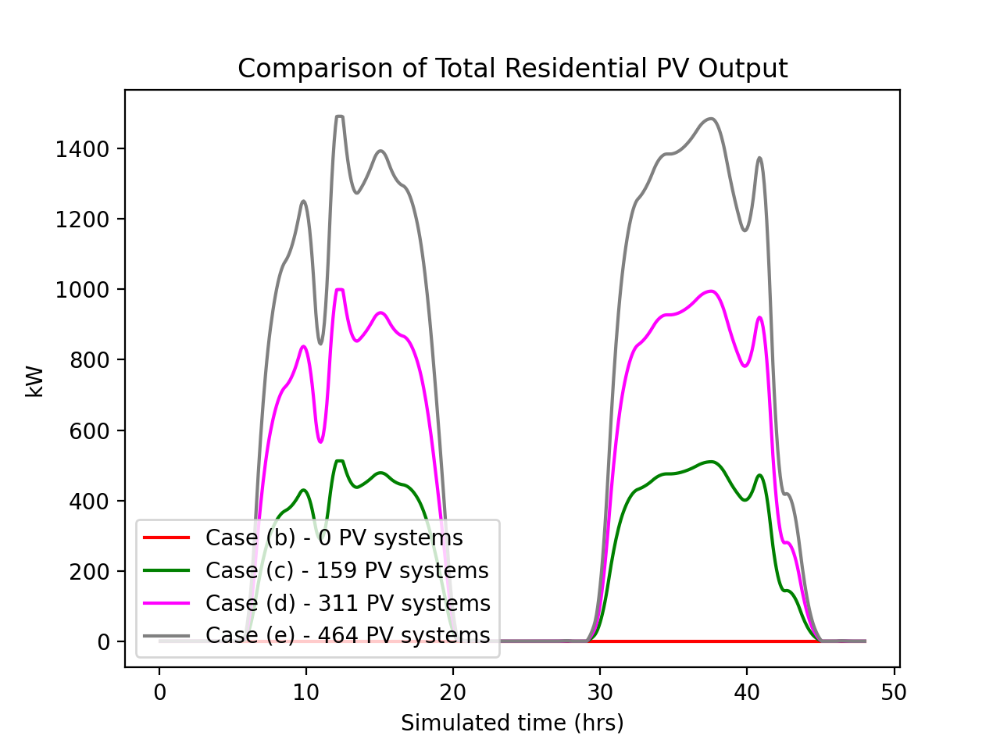

	Total residential rooftop solar output on the transactive feeder across the four cases within increasing penetration. The rooftop solar is not price responsive. As expected, increasing PV penetration showing increased PV production.

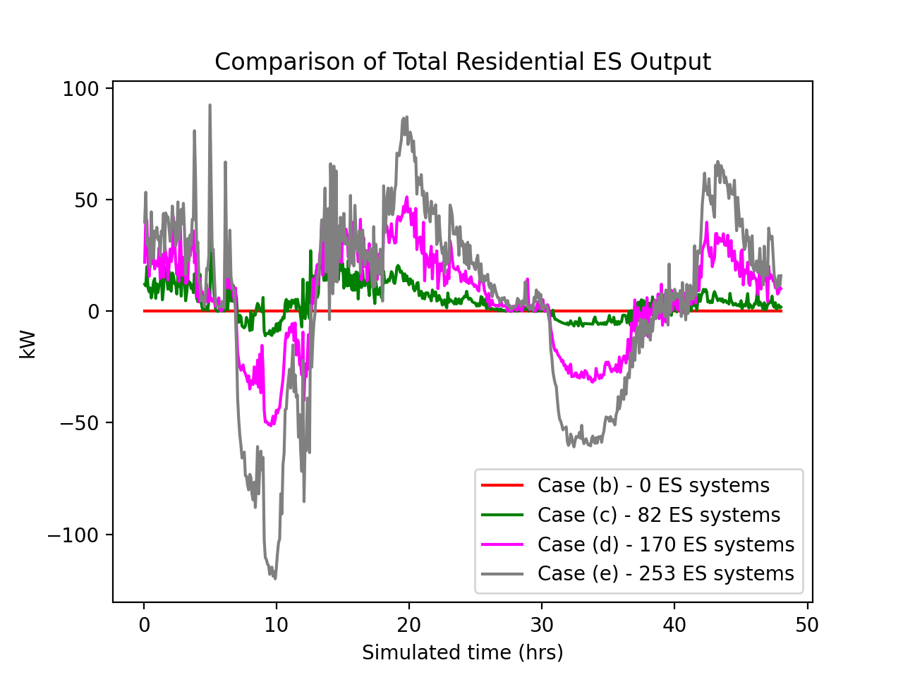

	Total residential energy storage output on the transactive feeder across the four cases within increasing penetration. The energy storage controller engages in peak-shaving and valley-filling based on the billing meter for the residential customer.

Analysis Results - Key Performance Metrics
------------------------------------------

The graphs below were created by running ``createAccountingTable.py`` and ``plotAccountingTable.py``, which calls the function ``lca_standard_graphs.py``. Most of these plots involve comparisons across the cases evaluated in this study (see :numref:`tbl_accounting_day1` and :numref:`tbl_accounting_day2`).

.. table:: Accounting Table
  :name: tbl_accounting_day1

  +---------------------------------------------------------------+--------------+--------------+--------------+--------------+--------------+
  | Metric   Description                                          | SGIP1a Day 1 | SGIP1b Day 1 | SGIP1c Day 1 | SGIP1d Day 1 | SGIP1e Day 1 |
  +===============================================================+==============+==============+==============+==============+==============+
  | Wholesale   electricity purchases for test feeder (MWh/d)     | 1394         | 1363         | 1261         | 1159         | 1065         |
  +---------------------------------------------------------------+--------------+--------------+--------------+--------------+--------------+
  | Wholesale   electricity purchase cost for test feeder ($/day) | $31,414.83   | $33,992.28   | $30,940.02   | $27,869.27   | $25,287.68   |
  +---------------------------------------------------------------+--------------+--------------+--------------+--------------+--------------+
  | Total   wholesale generation revenue ($/day)                  | $213,441.28  | $237,176.68  | $230,705.91  | $224,178.12  | $218,903.29  |
  +---------------------------------------------------------------+--------------+--------------+--------------+--------------+--------------+
  | Transmission   and Distribution Losses (% of MWh generated)   | 0.03         | 0.03         | 0.03         | 0.03         | 0.03         |
  +---------------------------------------------------------------+--------------+--------------+--------------+--------------+--------------+
  | Average   PV energy transacted (kWh/day)                      | 0.0          | 0.0          | 17.6         | 34.3         | 51.2         |
  +---------------------------------------------------------------+--------------+--------------+--------------+--------------+--------------+
  | Average   PV energy revenue ($/day)                           | $0.00        | $0.00        | $127.65      | $242.23      | $353.86      |
  +---------------------------------------------------------------+--------------+--------------+--------------+--------------+--------------+
  | Average   ES energy transacted (kWh/day)                      | 0.00         | 0.00         | 0.68         | 0.98         | 0.88         |
  +---------------------------------------------------------------+--------------+--------------+--------------+--------------+--------------+
  | Average   ES energy net revenue                               | $0.00        | $0.00        | $4.98        | $7.84        | $8.16        |
  +---------------------------------------------------------------+--------------+--------------+--------------+--------------+--------------+
  | Total   CO2 emissions (MT/day)                                | 0.70         | 0.79         | 0.78         | 0.76         | 0.75         |
  +---------------------------------------------------------------+--------------+--------------+--------------+--------------+--------------+
  | Total   SOx emissions (kg/day)                                | 0.01         | 0.01         | 0.01         | 0.01         | 0.01         |
  +---------------------------------------------------------------+--------------+--------------+--------------+--------------+--------------+
  | Total   NOx emissions (kg/day)                                | 0.05         | 0.05         | 0.05         | 0.05         | 0.05         |
  +---------------------------------------------------------------+--------------+--------------+--------------+--------------+--------------+

.. table:: Accounting Table
  :name: tbl_accounting_day2

  +---------------------------------------------------------------+---------------+--------------+--------------+--------------+--------------+
  | Metric   Description                                          | SGIP1a Day 2  | SGIP1b Day 2 | SGIP1c Day 2 | SGIP1d Day 2 | SGIP1e Day 2 |
  +===============================================================+===============+==============+==============+==============+==============+
  | Wholesale   electricity purchases for test feeder (MWh/d)     | 64            | 59           | 53           | 55           | 47           |
  +---------------------------------------------------------------+---------------+--------------+--------------+--------------+--------------+
  | Wholesale   electricity purchase cost for test feeder ($/day) | $166,254.07   | $128,845.80  | $94,489.84   | $67,207.80   | $45,545.65   |
  +---------------------------------------------------------------+---------------+--------------+--------------+--------------+--------------+
  | Total   wholesale generation revenue ($/day)                  | $1,006,250.16 | $828,363.84  | $654,001.74  | $500,031.51  | $362,912.27  |
  +---------------------------------------------------------------+---------------+--------------+--------------+--------------+--------------+
  | Transmission   and Distribution Losses (% of MWh generated)   | 0.00          | 0.00         | 0.00         | 0.00         | 0.00         |
  +---------------------------------------------------------------+---------------+--------------+--------------+--------------+--------------+
  | Average   PV energy transacted (kWh/day)                      | 0.0           | 0.0          | 0.9          | 1.7          | 2.6          |
  +---------------------------------------------------------------+---------------+--------------+--------------+--------------+--------------+
  | Average   PV energy revenue ($/day)                           | $0.00         | $0.00        | $539.65      | $792.16      | $834.53      |
  +---------------------------------------------------------------+---------------+--------------+--------------+--------------+--------------+
  | Average   ES energy transacted (kWh/day)                      | 0.00          | 0.00         | -0.60        | -0.90        | -0.86        |
  +---------------------------------------------------------------+---------------+--------------+--------------+--------------+--------------+
  | Average   ES energy net revenue                               | $0.00         | $0.00        | -$0.21       | $0.73        | $3.60        |
  +---------------------------------------------------------------+---------------+--------------+--------------+--------------+--------------+
  | Total   CO2 emissions (MT/day)                                | 2.91          | 2.42         | 1.94         | 1.51         | 1.11         |
  +---------------------------------------------------------------+---------------+--------------+--------------+--------------+--------------+
  | Total   SOx emissions (kg/day)                                | 0.02          | 0.02         | 0.02         | 0.01         | 0.01         |
  +---------------------------------------------------------------+---------------+--------------+--------------+--------------+--------------+
  | Total   NOx emissions (kg/day)                                | 0.19          | 0.16         | 0.12         | 0.10         | 0.07         |
  +---------------------------------------------------------------+---------------+--------------+--------------+--------------+--------------+

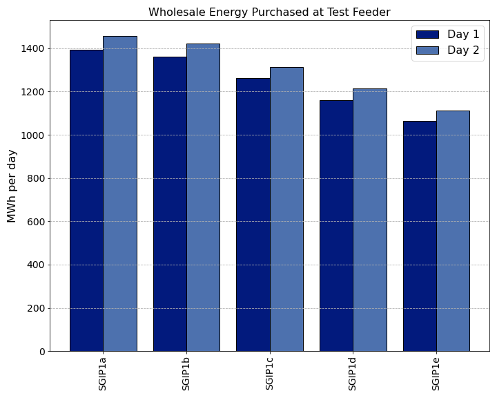

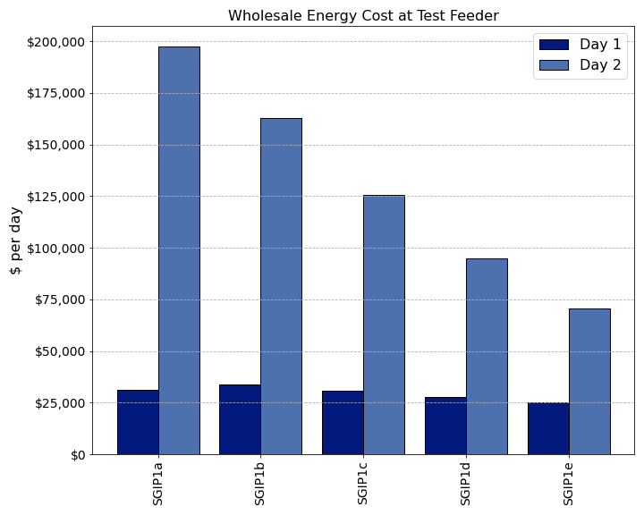

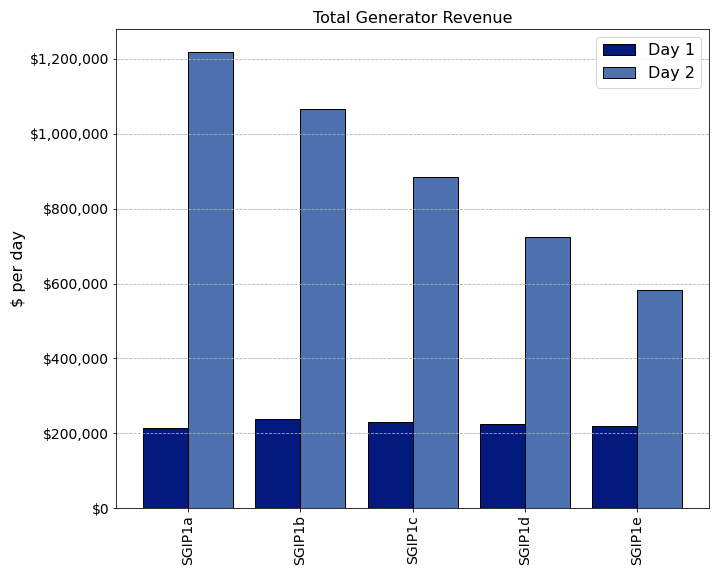

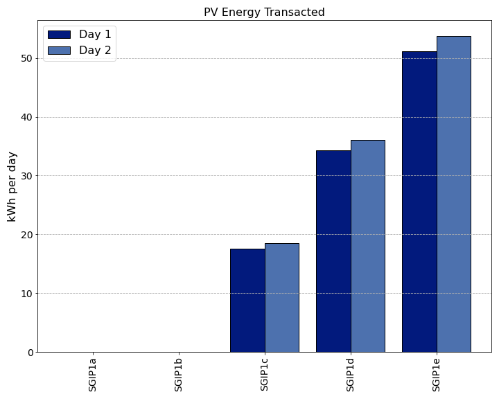

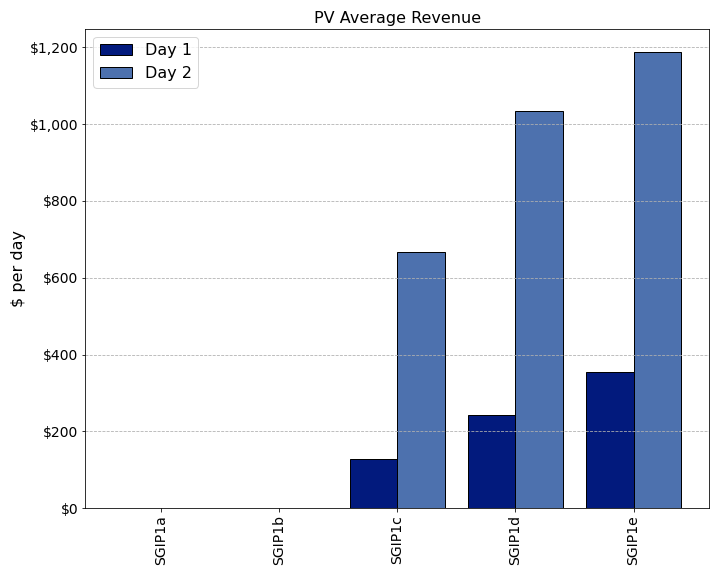

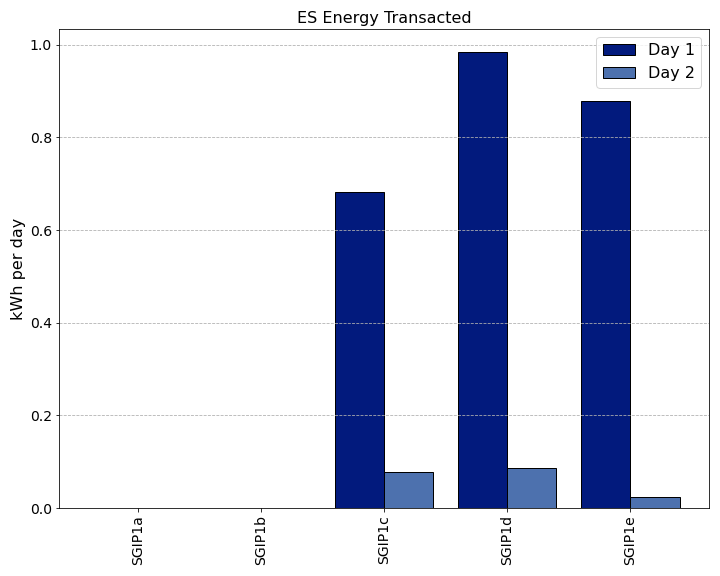

.. figure:: ../media/SGIP1/ES_Average_Revenue.png
	:name: fig_metrics_ES_revenue

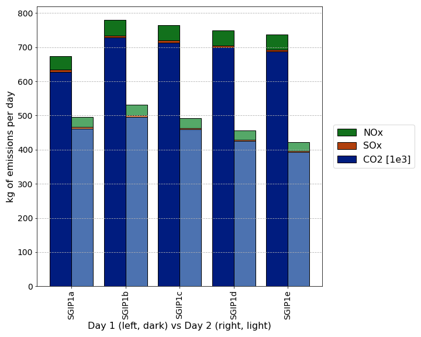

	description of plots.

Summary metrics results, likely in tabular form. May copy results from publications

Related Publications
--------------------

This use of TESP to perform the SGIP1 analysis resulted in the following related publications:

    S. E. Widergren, D. J. Hammerstrom, Q. Huang, K. Kalsi, J. Lian, A. Makhmalbaf, T. E. McDermott, D. Sivaraman, Y. Tang, A. Veeramany, and J. C. Woodward. Transactive Systems Simulation and Valuation Platform Trial Analysis. Technical Report PNNL-26409, Pacific Northwest National Laboratory (PNNL), Richland, WA (United States), Richland, WA, Apr. 2017. DOI: 10.2172/1379448. Available at: http://www.osti.gov/servlets/purl/1379448/

    Q. Huang, T. McDermott, Y. Tang, A. Makhmalbaf, D. Hammerstrom, A. Fisher, L. Marinovici, and T. D. Hardy. Simulation-Based Valuation of Transactive Energy Systems. Power Systems, IEEE Transactions on, May 2018. DOI: 10.1109/TPWRS.2018.2838111. Available at: https://ieeexplore.ieee.org/document/8360969/
