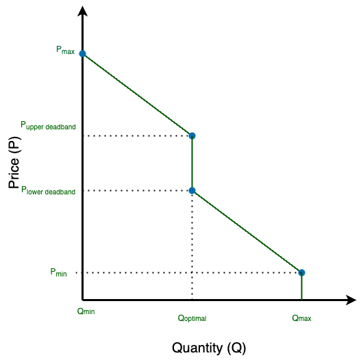

DSO+T Agent Bidding and Sliders
*******************************

This document seeks to capture all the ways that we've modeled the interation of agents and slider settings in the DSO+T work. Specifically, we're concerned how the slider setting impacts customer flexibility. As part of this, a brief overview of the four-point bidding formulation used in DSO+T will also be discussed followed by a summary of the actual code implemented to allow the impact on slider settings.

The "slider" is the co-efficient of flexibility (between 0 and 1, inclusive) that is used to define how sensitive a customer or device agent (controller) is price. Generally:

* slider = 1 - Maximum flexibility, prioritizes cost over comfort
* slider = 0 - Minimum flexibility, prioritizes comfort over cost

In the DSO+T analysis, slider settings were randomly assigned to each customer and all participating devices (*e.g.* HVACs, EV Chargers) inherited that slider setting.

DSO+T Four-Point Bidding
========================
As covered well in the `DSO+T Transactive Mechanism report <https://www.osti.gov/biblio/1842489>`_, all the agents participating in the market created a "four-point bid"; that is, a bid consisting of four price-quantity pairs (eight values in total) that were able to be interpretted to comprehensively define their price-responsiveness. Two of these points define the price-quantity limits for the bid. A convention was established to interpret the bid curve beyond these points; prices lower than Pmin have a quantity capped at Qmax and prices higher than Pmax have a quantity of Qmin.  Qmin is generally zero for flexible loads but may be a negative value for EVs and batteries as they are able to supply energy.

The central two points in the four-point bid are used to define a deadband in the price-responsiveness; cleared prices within this band will not adjust the cleared quantity and thus the operating state of the device. This deadband is helpful in reaching convergence over multiple bidding periods in the iterative retail day-ahead market. This deadband may have a slight slope to it.

    Generic load four-point bid; loads are never able to have a negative bid quantity as they only consume electrical energy.

.. figure:: ../../media/dsot/generic_battery_four_point_bid.png

    Generic battery or EV (V2G) four-point bid with negative bid quantities as they are able to supply electrical energy.

Converting Between Bid Quantity and Device Amenity Setting
----------------------------------------------------------
For the HVAC and water heaters, once informed of a cleared price the device needs to convert this into an amenity setting: a thermostat setpoint. (For batteries and EVs, the amenity is charging or discharging power and thus the cleared quantity can be used to directly set these values.) Directly from the `report <https://www.osti.gov/biblio/1842489>`_

    Using the retail real-time market-cleared price and the asset agent’s bid curve, the HVAC’s cleared quantity is extracted. To convert the cleared quantity into a temperature setpoint, an HVAC energy quantity versus temperature setpoint mapping curve is needed.

.. figure:: ../../media/dsot/dsot_vol3_fig33.png

    Example of the translation of cleared quantity to a thermostat setpoint performed by the HVAC agent.

The slider setting itself is also used in defining the conversion between the cleared price and the thermostat setting

Agent Configuration
===================

HVAC agent
----------
HVAC agents are instatiated in ``substation.py`` (l. 248) and it pulls in it's configuration from the ``hvac`` object in the ``config`` dictionary. This dictionary is loaded from "..._agent_dict.json". This dictionary defines the following values used by "hvac_agentp.py" to configure the hvac agent. The limit values shown are constant across all agents in the original DSOT while the slider value is randomized between zero and one.::

    ramp_high_limit = 5
    ramp_low_limit = 5
    range_high_limit = 5
    range_low_limit = 3
    slider = [0,1]

Agent Implementations
=====================

For each of the agents used in the DSO+T study, a section below outlines where the slider setting is used in the agent code 

EV Agent
--------

`DSO+T EV agent code is found on Github. <https://github.com/pnnl/tesp/blob/main/src/tesp_support/tesp_support/dsot/ev_agent.py>`_

* Sets the required `departure-from-home charge <https://github.com/pnnl/tesp/blob/1dcd35e58124764504f4ccb4f38d2f784e0e066e/src/tesp_support/tesp_support/dsot/ev_agent.py#L125>`_::
    
    self.home_depart_soc = self.Cmax + (just_enough_soc - self.Cmax) * self.slider

* Contributes to the objective function used in `forming the DA bids <https://github.com/pnnl/tesp/blob/1dcd35e58124764504f4ccb4f38d2f784e0e066e/src/tesp_support/tesp_support/dsot/ev_agent.py#L352>`_ (optimization problem)::

    return sum(
                self.slider * self.f_DA[i] * (m.E_DA_out[i] - m.E_DA_in[i])
                - self.slider * self.batteryLifeDegFactor * (1 + self.profit_margin) * (m.E_DA_out[i] + m.E_DA_in[i])
                - self.quad_fac * (m.E_DA_out[i] + m.E_DA_in[i]) ** 2 for i in self.TIME)
                   - sum((1 - self.slider) * 0.001 * (self.home_depart_soc - m.C[i]) for i in self.trans_hours)

* Determines the price-responsiveness (slope) when `formulating real-time bids <https://github.com/pnnl/tesp/blob/1dcd35e58124764504f4ccb4f38d2f784e0e066e/src/tesp_support/tesp_support/dsot/ev_agent.py#L505>`_::

    CurveSlope = ((max(self.f_DA) - min(self.f_DA)) / (-self.Rd - self.Rc)) / self.slider

Battery Agent
-------------

`DSO+T Battery agent code is found on Github. <https://github.com/pnnl/tesp/blob/main/src/tesp_support/tesp_support/dsot/battery_agent.py>`_

* Determines the price-responsiveness (slope) when `formulating day-ahead bids <https://github.com/pnnl/tesp/blob/1dcd35e58124764504f4ccb4f38d2f784e0e066e/src/tesp_support/tesp_support/dsot/battery_agent.py#L259>`_ ::

    CurveSlope[t] = ((max(self.f_DA) - min(self.f_DA)) / (-self.Rd - self.Rc)) / self.slider

* Determines the price-responsiveness (slope) when `formulating the real-time bids <https://github.com/pnnl/tesp/blob/1dcd35e58124764504f4ccb4f38d2f784e0e066e/src/tesp_support/tesp_support/dsot/battery_agent.py#L381>`_::

    CurveSlope = ((max(self.f_DA) - min(self.f_DA)) / (-self.Rd - self.Rc)) / self.slider

HVAC Agent
----------

`DSO+T HVAC agent code is found on Github. <https://github.com/pnnl/tesp/blob/main/src/tesp_support/tesp_support/dsot/hvac_agent.py>`_

The slider setting for the agent is used in the following ways in the agent code:

* Initializing the `ProfitMargin_slope <https://github.com/pnnl/tesp/blob/1dcd35e58124764504f4ccb4f38d2f784e0e066e/src/tesp_support/tesp_support/dsot/hvac_agent.py#L320>`_:: 

    self.ProfitMargin_slope = delta_DA_price / (Qmin - Qmax) / self.slider

which is used in formulating the `real-time bid <https://github.com/pnnl/tesp/blob/1dcd35e58124764504f4ccb4f38d2f784e0e066e/src/tesp_support/tesp_support/dsot/hvac_agent.py#L1620C14-L1620C101>`_::

    CurveSlope = (delta_DA_price / (0 - self.hvac_kw) * (1 + self.ProfitMargin_slope / 100))

and the `day-ahead bid <https://github.com/pnnl/tesp/blob/1dcd35e58124764504f4ccb4f38d2f784e0e066e/src/tesp_support/tesp_support/dsot/hvac_agent.py#L1753>`_::

    CurveSlope[t] = (delta_DA_price / (0 - self.hvac_kw) * (1 + self.ProfitMargin_slope / 100))

* Setting `thermostat temperature limits <https://github.com/pnnl/tesp/blob/1dcd35e58124764504f4ccb4f38d2f784e0e066e/src/tesp_support/tesp_support/dsot/hvac_agent.py#L464>`_::

            self.range_high_cool = self.range_high_limit * self.slider  
            self.range_low_cool = self.range_low_limit * self.slider  
            self.range_high_heat = self.range_high_limit * self.slider  
            self.range_low_heat = self.range_low_limit * self.slider  
            
    The range limits determine a customers `maximum and minimum acceptable temperatures <https://github.com/pnnl/tesp/blob/1dcd35e58124764504f4ccb4f38d2f784e0e066e/src/tesp_support/tesp_support/dsot/hvac_agent.py#L528>`_ ::

        self.temp_max_cool = cooling_setpt + self.range_high_cool  # - self.ramp_high_limit * (1 - self.slider)
        self.temp_min_cool = cooling_setpt - self.range_low_cool  # + self.ramp_low_limit * (1 - self.slider)
        self.temp_max_heat = heating_setpt + self.range_high_heat  # - self.ramp_high_limit * (1 - self.slider)
        self.temp_min_heat = heating_setpt - self.range_low_heat  # + self.ramp_low_limit * (1 - self.slider)

    These limits play a role in the `day-ahead energy market bidding <https://github.com/pnnl/tesp/blob/1dcd35e58124764504f4ccb4f38d2f784e0e066e/src/tesp_support/tesp_support/dsot/hvac_agent.py#L1099>`. There are multiple bidding strategies in forming the day-ahead energy market bids for the HVAC agent. Below is one but they are all constrained by this temperature limit::

             elif use_DA_curve:
                if self.thermostat_mode == "Cooling":
                    if self.cleared_price > self.price_forecast_0:
                        setpoint_tmp = self.temp_room[0] + (self.cleared_price - self.price_forecast_0) * \
                                       self.range_high_cool / self.price_delta
                    elif self.cleared_price < self.price_forecast_0:
                        setpoint_tmp = self.temp_room[0] + (self.cleared_price - self.price_forecast_0) * \
                                       self.range_low_cool / self.price_delta

* Setting the `price-responsiveness of the thermostat setpoint temperature <https://github.com/pnnl/tesp/blob/1dcd35e58124764504f4ccb4f38d2f784e0e066e/src/tesp_support/tesp_support/dsot/hvac_agent.py#L469>`_::

        if self.slider != 0:
            # cooling
            self.ramp_high_cool = self.ramp_high_limit * (1 - self.slider)  # 1+2*(1-self.slider) 
            self.ramp_low_cool = self.ramp_low_limit * (1 - self.slider)  # 1+2*(1-self.slider) 
            # heating
            self.ramp_high_heat = self.ramp_low_limit * (1 - self.slider)  # 1+2*(1-self.slider) 
            self.ramp_low_heat = self.ramp_high_limit * (1 - self.slider)  # 1+2*(1-self.slider) 

Water Heater Agent
------------------

`DSO+T water heater agent code is found on Github. <https://github.com/pnnl/tesp/blob/main/src/tesp_support/tesp_support/dsot/water_heater_agent.py>`_

* Determines the price-responsiveness (slope) when `formulating day-ahead bids <https://github.com/pnnl/tesp/blob/1dcd35e58124764504f4ccb4f38d2f784e0e066e/src/tesp_support/tesp_support/dsot/water_heater_agent.py#L517>`_::

    CurveSlope[t] = delta_DA_price / ((0 - self.Phw) * self.slider)

