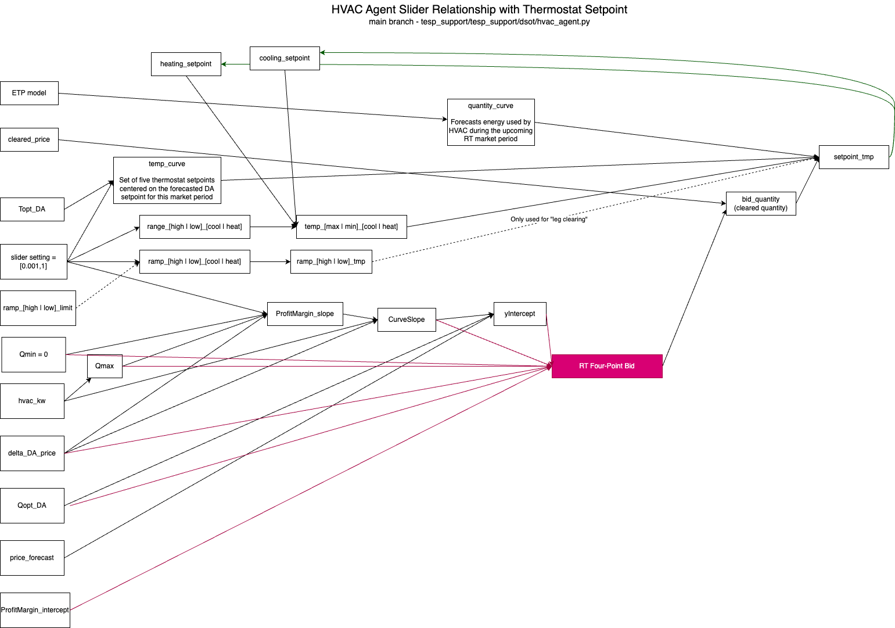
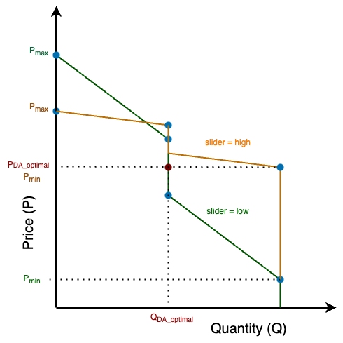

DSO+T HVAC Agent
****************

This is an proposed outline for the further documentation we need to do on the DSO+T HVAC agent.

DSO+T HVAC Agent Key Parameters
===============================
To aid in understanding the DSO+T HVAC agent, the code was examined and a diagram showing the data-flow through the model was created, showing the relationship between the various parameters of the model. Some of these parameters are externally provided through configuration (_e.g._ slider, hvac_kw) and others are internally calculated. The bottom portion of the figure is mostly related to the formation of the bid and the upper portion in translating the cleared price from the market into a thermostat setpoint.

    Relationship between parameters of the DSO+T HVAC agent.

``slider``
----------

``delta_DA_price``
------------------

``clearing_price``
------------------

``hvac_kw``
-----------

``Topt_DA`` and ``Qopt_DA``
---------------------------

``ProfitMargin_Intercept``
--------------------------

``y_intercept``
---------------

``hvac_kw``
-----------

``ramp_[high | low]_limit``
---------------------------

``range_[high | low]_[cool | heat]``
------------------------------------

``temp_[max | min]_[cool | heat]``
----------------------------------

``BID``
-------

``ProfitMargin_slope``
----------------------

``CurveSlope``
--------------

``CurveSlope`` is used by most agents to define their price responsiveness (along with the slider setting). Generally, ``CurveSlope`` is the ratio of the change in price (real-time or day-ahead) and the over the power consumption of the load; this ratio is then divided by the slider setting. Dividing by the slider setting affects the slope of the price responsiveness with lower values (those prioritizing comfort over cost) increasing the slope resulting in two impacts:

#. **Greater sensitivity to price** - the quantity of the energy bid changes more significantly as a function of price. Smaller changes in prices will produce larger changes in bid quantity.
#. **Smaller price-responsive price range** - Decreating the slider increases the value of ``CurveSlope`` and pulls Pmin and Pmax closer to a central value, putting more bid quantities at Qmax or Qmin, respectively. (Qmin is generally zero for flexible loads but may be a negative value for EVs and batteries as they are able to supply energy.) 

    Impact of adjusting the slider setting on the ``CurveSlope`` and corresponding four-point bid points.

Interactive HVAC Agent Model
============================

Included in this folder is a simplified model of the hvac agent that shows the bid curve and thermostat setpoint curve with the clearing quantity, clearing price (bid curve only) and cleared thermostat setpoint (thermostat curve only) only indicated. The model has a number of parameters exposed as sliders that can be adjusted and the impact on the bid curve and thermostat curve update in real time. The model is found in ``hvac_agent_standalone_demo.py`` with the interactive graph created simply by running that Python script.

Though the majority of the code used in this simplified model is directly lifted from the actual HVAC agent code used in DSO+T, the simplifications were necessary to allow it to operate independently of the the rest of the co-simulation, in particular the DSO market operation. Reasonable values were used to define these normally dynamic values. The model probably only works in "cooling" mode but should be able to be extended to "heating" with very modest effort.

The interactive model exhibits some unusual behavior and it is unclear if this accurately reflects the DSO+T HVAC agent operation or if the simplification process introduced some errors. Specifically:

* The thermostat curve is VERY flat, even for high slider settings (maximum flexibility).
* The bidding deadband is a function of both delta_DA_price and ProfitMargin_Intercept. This behavior is called out in the model (look ah the ``BID`` definition for ``P``)
* The low-quantity portion of the thermostat curves changes slope in response to the cleared price; should it?
* Not shown, but at very low slider settings (close to 0), the bid curve does not maintain it's downward slope. This one in particular feels like a simplification mistake.
