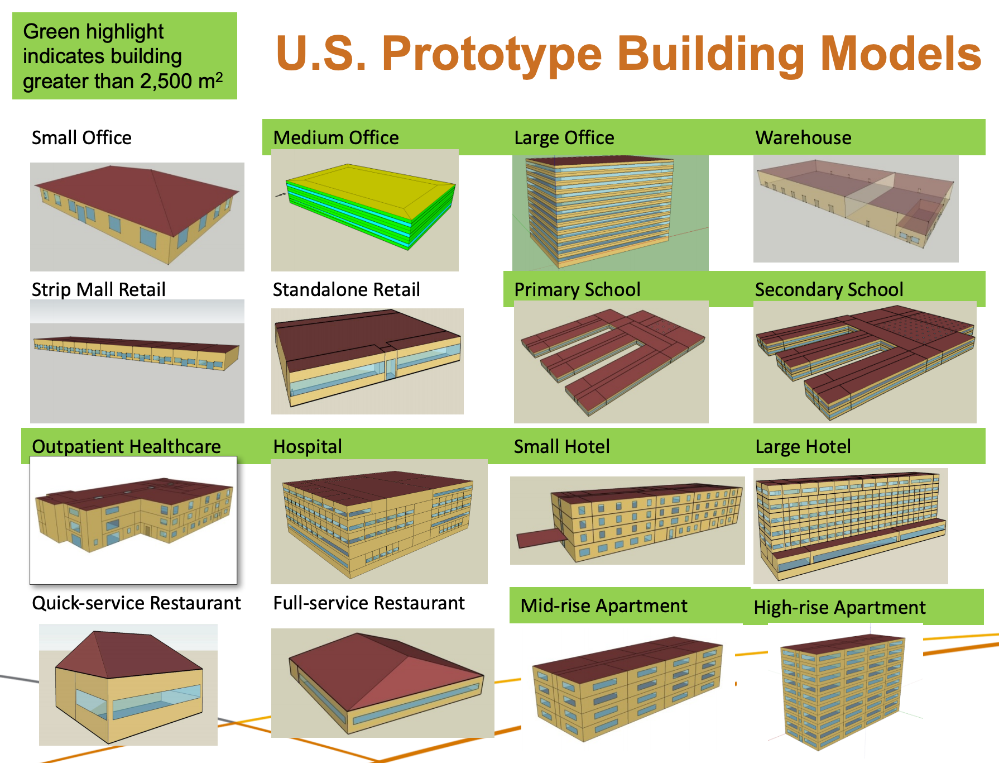

# Commercial Building Models for DSO+T Study

Copyright (c) 2019, Battelle Memorial Institute

These are post-1980 reference buildings for Houston, TX

See https://www.nrel.gov/docs/fy11osti/46861.pdf

Also see http://www.globalchange.umd.edu/data/bec/vietnam2016/Day2-AM-Presentation3_Overview_US_Prototype-Halverson.pdf, Slide 13 shown below.

