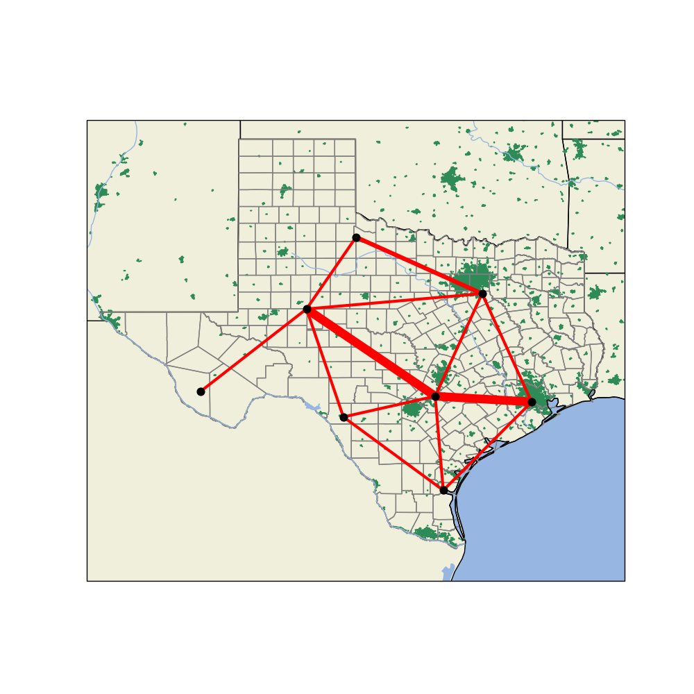
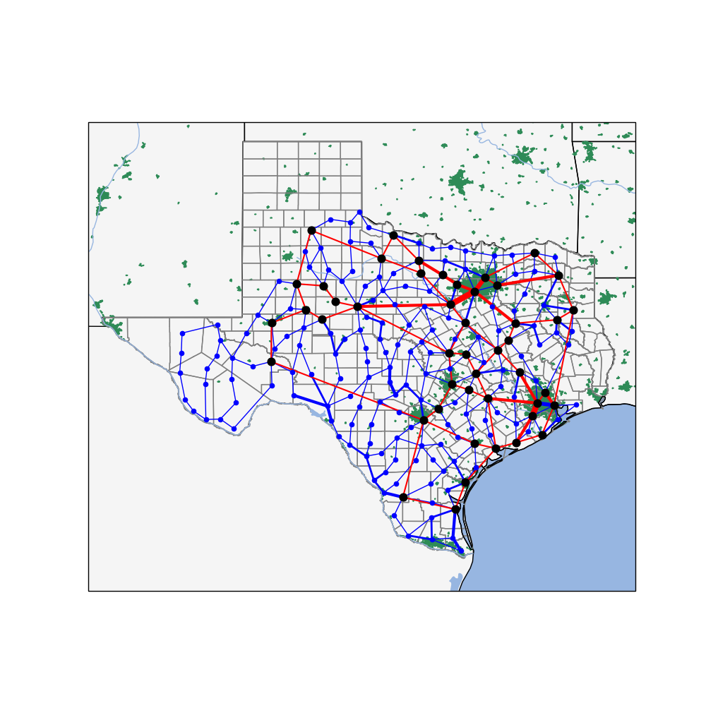

# 8-Bus and 200-Bus ERCOT Bulk System Models

Copyright (c) 2018-2020, Battelle Memorial Institute

This directory contains the baseline bulk generation and transmission model for 8-bus and 200-bus
versions of the ERCOT Test System. Changes should be tested here before use in the complete
ERCOT Test System, which is located in a sibling directory ../case8.

Stochastic wind generation is based on Chen et. al., "ARIMA-Based Time Series Model of Stochastic
Wind Power Generation," IEEE TPWRS, May 2010, https://doi.org/10.1109/TPWRS.2009.2033277

Directory of input and script files:

- *200NodesData.json*; clustered load, generation and bus coordinates
- *Buses.csv*; defines buses for the 200-bus model, but not all retained
- *Buses8.csv*; defines buses for the 8-bus model
- *Lines.csv*; defines lines for the 200-bus model, but not all retained
- *Lines8.csv*; defines lines for the 8-bus model
- *RetainedBuses.csv*; edited Buses.csv
- *RetainedLines.csv*; edited Lines.csv
- *RetainedTransformers.csv*; transformers and tap ratios for 200-bus model, originally created manually
- *Units.csv*; defines generators for the 200-bus model
- *Units8.csv*; defines generators for the 8-bus model
- *clean.bat*; removes temporary output files on Windows
- *clean.sh*; removes temporary output files on Linux or Mac OS X
- *ercot_200.json*; 200-bus model for PYPOWER
- *ercot_8.json*; 8-bus model for PYPOWER
- *loopERCOT.py*; runs a daily simulation of the 8-bus model with varying load and wind
- *make_case.py*; makes ercot_200.json from RetainedBuses.csv, RetainedLines.csv, RetainedTransformers.csv and Units.csv
- *make_case8.py*; makes ercot_8.json from Buses8.csv, Lines8.csv and Units8.csv
- *make_lines.py*; produce Lines.csv from 200NodesData.json
- *make_units.py*; produce Units.csv from 200NodesData.json
- *process_pypower.py*; plots the metrics from loopERCOT solution
- *run_ercot.py*; spot-check the regular or optimal power flow solution at peak load for either the 8-bus or 200-bus model
- *test_wind.py*; runs a yearly wind plant simulation; edit this file to change the plant size
- *update_gen8.py*; copies the generators (including costs and fuel types) from local ercot_8.json to ../case8/ercot_new_8.json, preserving other sections of that file
- *wind_plants.py*; runs a two-day output simulation of wind plants in the 8-bus model

To regenerate the 8-Bus Model:

    a. Edit Buses8.csv, Lines8.csv and Units8.csv. No transformers are included.
    b. Edit make_case8.py to change the generating unit disaggregation
    c. Run 'python3 make_case8.py'

To regenerate the 200-Bus Model:

    a. Edit RetainedBuses.csv, RetainedLines.csv, RetainedTransformers.csv and Units.csv.
    b. Run 'python3 make_case.py'

To run the 8-bus Model:

    a. edit run_ercot.py to make sure it runs ercot_8.json
    b. Run 'python3 run_ercot.py' to spot check the PF and OPF solutions at peak load.
    c. Run 'python3 loopERCOT.py' to run a time-stepping check with varying load.
    d. Run 'python3 process_pypower.py' to plot the results of loopERCOT.py

To run the 200-bus Model:

    a. edit run_ercot.py to make sure it runs ercot_200.json
    b. Run 'python3 run_ercot.py' to spot check the PF and OPF solutions at peak load.

To use an updated 8-bus Model in the complete ERCOT Test System:

    a. Regenerate the 8-Bus Model as described above, with changes to the network and/or generating unit disaggregation
    b. Run the 8-Bus Model as described above, to make sure it behaves as expected without GridLAB-D and transactive agents
    c. If only the unit disaggregation changed, run 'python3 update_gen8.py' to update just the generators in '../case8/ercot_new_8.json'.
    d. If any other network attributes changed, run 'cp ercot_8.json ../case8/ercot_new_8.json'
    e. Compare and reconcile changes between ercot_8.json and ercot_new_8.json in ../case8

loopERCOT.py and process_pypower.py have not been tested yet with the 200-bus model.

## Generating Maps

The map data in *Texas_SHP* subdirectory comes from https://www.depts.ttu.edu/geospatial/center/TexasGISData.html 
and https://gis-txdot.opendata.arcgis.com/datasets/6aeee12f605d4b0b9fc74b31d2ea4ea5_0

Maps are generated from shapefiles with matplotlib and cartopy. To install the supporting software:

    sudo apt-get install proj-bin
    sudo apt-get install libproj-dev
    sudo apt-get install libgeos-dev
    pip3 install shapely cartopy --no-binary shapely --no-binary cartopy

Test that cartopy works with:

    python3 test_cartopy.py

To plot the 8-bus and 200-bus test systems:

    python3 ercot8_map.py
    python3 ercot_map.py

### 8-Bus Test System

### 200-Bus Test System

