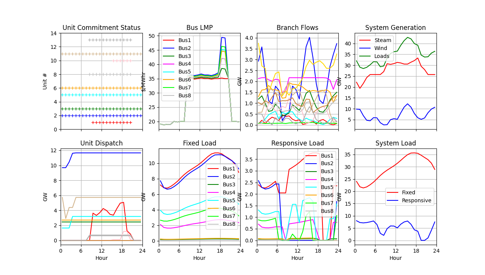
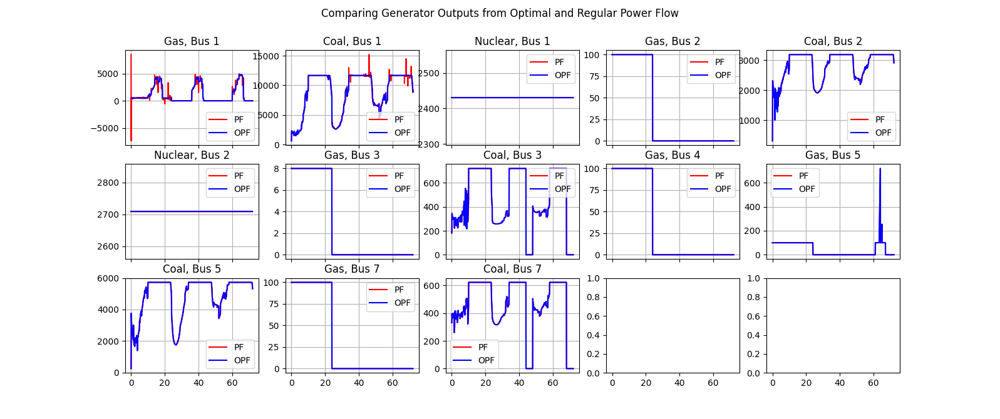
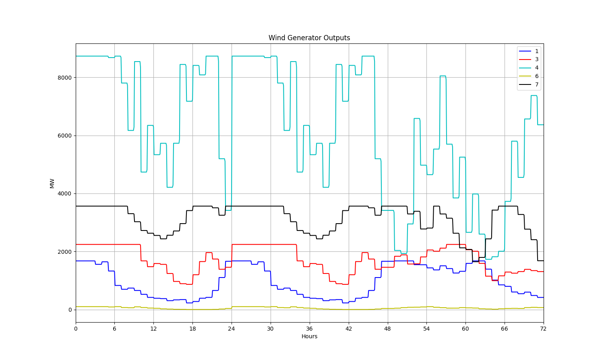

DSO+T Stub Simulation Files
---------------------------

Copyright (c) 2019-2020, Battelle Memorial Institute

This directory contains a test harness based on the ERCOT 8-bus case, with
one DSO emulator in place of the GridLAB-D and substation federates at each bus.
It provides a sandbox for integrating AMES with PYPOWER in a new TSO agent.
It invokes *fncsTSO.py* in the parent directory as the TSO agent, which uses PYPOWER
and optionally, MOST. The case definition in *ercot_8.json* has been copied
from the parent directory to run with local edits.

The DSO emulator is in a local *fncsDSO.py* file. It will bid a load equal to the
TSO non-responsive curve load, effectively doubling it. With a market, the DSO
splits its bid to be 50% responsive and 50% non-responsive. It will publish its
actual load as the non-responsive load, plus a cleared portion of the responsive load
based on the LMP received from the TSO. Without a market, the DSO bids 100% of its 
load as non-responsive, and publishes that same load as an emulated actual load.

The local *ercot_8.json* file has initial P and Q values in the FNCS array, intended
to provide a smoother startup of the TSO market. These initial P and Q values match
what the DSO is expected to bid at time zero, i.e., the initial value of the TSO
non-responsive curve load. If the loading assumptions are changed, the initial P
and Q values might also need to change.

Currently, some customizations are available at line 8 of *fncsDSO.py*. These may be
edited before running the simulation:

 - *bWantMarket* is True for the DSO to bid, and to use the LMP.
 - *bid_c2* is the C2 coefficient for the responsive load cost function. Must be negative.
 - *bid_c1* is the C1 coefficient for the responsive load cost function. Must be positive. If the LMP exceeds C1, the cleared responsive load will be zero.
 - *bid_deg* is the degree of the responsive load cost function polynomial. It should always be 2.

Directory of input and script files:

 - *clean.sh*; removes generated input and output files
 - *dso8.yaml*; FNCS subscriptions for the DSO emulator, matches the ../fncsTSO.py publications
 - *ercot_8.json*; bulk system model, copied from .. and then edited
 - *fncsDSO.py*; reads ercot_8.json and dso8.yaml to run the DSO emulator, publishing bids and actual loads at each bus, as if these came from GridLAB-D and substation agent federates
 - *kill5570.sh*; helper script to kill all FNCS processes
 - *plot_stub.py*; customization of process_pypower for the ERCOT model
 - *runstub.sh*; runs the bulk system (../fncsTSO.py) and a DSO emulator (fncsDSO.py)
 - *tso8stub.yaml*; FNCS subscriptions for the bulk_system, customized for fncsDSO.py publications, which have different FNCS simulator names than in the fully-federated case

Directory of generated output files (note: metadata is embedded in the json files):

 - *broker.log*; fncs_broker output log
 - *bus_ercot_8_metrics.json*; intermediate bulk system bus metrics, e.g. voltage and LMP
 - *dso_ercot_8_metrics.json*; intermediate DSO emulator metrics, e.g. bids and cleared loads
 - *dso8.log*; DSO emulator output log
 - *ercot_8_m_dict.json*; metadata for bulk system post processing, written by ../fncsTSO.py
 - *ercot_8_opf.csv*; optimal power flow solution summary at the market clearing interval, plot in Excel
 - *ercot_8_pf.csv*; regular power flow solution summary at the simulation time step, plot in Excel
 - *gen_ercot_8_metrics.json*; intermediate bulk system generating unit metrics
 - *sys_ercot_8_metrics.json*; intermediate bulk system-level metrics
 - *tso8.log*; PYPOWER output log, includes resource usage

To run and plot the 8-bus simulations:

 - "./runstub.sh" to launch the simulations
 - "tail ercot_8_opf.csv" to monitor progress from a terminal window; they should complete within a few minutes
 - "python plot_stub.py &" plots the bulk system with DSO emulator results
 - "python plot_wind.py &" plots the wind generator outputs

Three-day Simulation with MATPOWER/MOST
---------------------------------------

The DSO Stub simulation now includes a day-ahead unit commitment feature, which requires Matpower 7.1 and Octave 5.2:

 - get Octave 5.2.0 (or later) from the Ubuntu Software center in your VM (Note: on Ubuntu 18.04 LTS, "apt-get" installs Octave 4.4, which is not sufficient. On Ubuntu 20.04 LTS, "apt-get" may be used to install Octave 5.2.)
 - get the latest Matpower from https://matpower.org/ (Note: v7.1 has an important feature for this example)
 - from within Octave, install Matpower as described in their documentation. TESP requires **Option 3** to save the path. We also recommend that you run the Matpower and MOST tests when  installing Matpower.
 - from a Terminal, run "octave test_octave_cli.m" to make sure TESP can run Matpower/MOST

The DSO Stub example may also run with MATLAB, if you change "MostCommand" in "ercot_8.json" from "octave" to a command that will invoke MATLAB from the command line on your computer. Please note:

 - Octave comes with a mixed integer linear programming solver called GLPK, which is adequate to run the DSO Stub example. MATLAB doesn't come with such a solver, unless you also have the Optimization Toolbox.
 - This example has not actually been tested with MATLAB

### Summary of 3-Day Simulation with Wind

### System Totals with Wind

### Unit Commitment Solved on Day 3 for Day 4

### Comparing Power Flow and Optimal Power Flow: System Totals

### Comparing Power Flow and Optimal Power Flow: Generating Units

### Wind Plant Output Fluctuations

