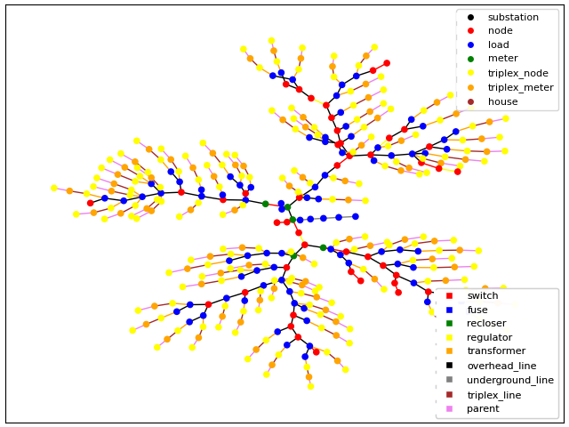
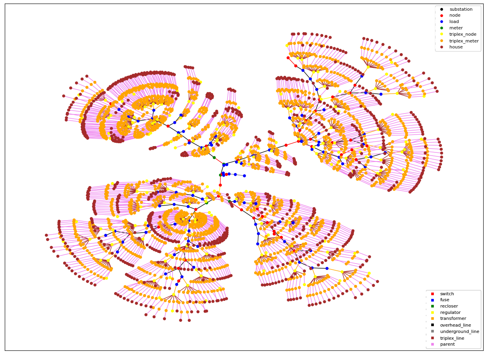

# Introduction: What's New?

The **Transactive Energy Simulation Platform** (TESP) simulates the electric power distribution grid with transactive control of loads and resources. In 2022, the Pacific Northwest National Laboratory published its 5-volume report detailing the multi-year study where a transactive energy system was implemented to allow a number of distribution system assets to participate in an integrated retail and wholesale real-time and day-ahead energy markets. To read that report, see the [DSO+T Study Project Page](https://www.pnnl.gov/projects/transactive-systems-program/dsot-study).

The DSO+T analysis was performed using the [TESP repo](https://github.com/pnnl/tesp), specifically in the following directory:

    $TESPDIR/tesp/examples/analysis/dsot/

The subdirectory `code` contains the scripts required to build and run the cases, and `data` contains the metadata those scripts utilize. 

You, however, are now in:

    $TESPDIR/tesp/examples/analysis/glm_dsot/

Why?

## glm_dsot

`glm_dsot` is the new anaylsis folder for running DSO+T-like analyses, currently focused on investigating new rate sceanarios and pilot utility demand-response programs. This updated DSO+T workflow is the result of the following improvements:

### GLMModifier

`GLMModifier` is an API that allows the user to read a base (unpopulated) feeder model (.glm) into memory and then modify it and write it back out to disk. This is the critical difference between DSO+T and glm_dsot. DSO+T built its feeders by painstakingly modifying the base feeder model with serial print-statements rather than using the parent-child hierarchy of GridLAB-D. In a DSO+T case, a house might look like this:

        object house {
            name R4_12_47_1_tn_1_Low_hse_1;
            parent R4_12_47_1_tn_1_mhse_1;
            groupid MOBILE_HOME;
            schedule_skew 2120;
            floor_area 1850;
            number_of_stories 1;
            ceiling_height 8;
            over_sizing_factor 0.1936;
            Rroof 26.00;
            Rwall 10.62;
            Rfloor 20.33;
            glazing_layers 2;
            glass_type 2;
            glazing_treatment 1;
            window_frame 2;
            Rdoors 2.75;
            airchange_per_hour 0.76;
            cooling_COP 4.1;
            air_temperature 69.95;
            mass_temperature 69.95;
            total_thermal_mass_per_floor_area 3.783;
            mass_solar_gain_fraction 0.5;
            mass_internal_gain_fraction 0.5;
            aspect_ratio 2.16;
            exterior_wall_fraction 1.00;
            exterior_floor_fraction 1.00;
            exterior_ceiling_fraction 1.00;
            window_exterior_transmission_coefficient 0.47;
            window_wall_ratio 0.15;
            breaker_amps 1000;
            hvac_breaker_rating 1000;
            heating_system_type RESISTANCE;
            cooling_system_type ELECTRIC;
            motor_model BASIC;
            motor_efficiency GOOD;
            cooling_setpoint 80.0;
            heating_setpoint 60.0;
            object ZIPload { // responsive
                schedule_skew 2120;
                base_power responsive_loads*0.96;
                heatgain_fraction 0.90;
                impedance_pf 1.00;
                current_pf 1.00;
                power_pf 1.00;
                impedance_fraction 0.20;
                current_fraction 0.40;
                power_fraction 0.40;
            };
            object ZIPload { // unresponsive
                schedule_skew 2120;
                base_power unresponsive_loads*0.86;
                heatgain_fraction 0.90;
                impedance_pf 1.00;
                current_pf 1.00;
                power_pf 1.00;
                impedance_fraction 0.20;
                current_fraction 0.40;
                power_fraction 0.40;
            };
            object waterheater {
                name R4_12_47_1_tn_1_wh_1;
                schedule_skew -5385;
                heating_element_capacity 4.5 kW;
                thermostat_deadband 1.0;
                location INSIDE;
                tank_diameter 1.5;
                tank_UA 2.5;
                water_demand small_1*0.99;
                tank_volume 50;
                waterheater_model MULTILAYER;
                discrete_step_size 60.0;
                lower_tank_setpoint 115.9;
                upper_tank_setpoint 125.9;
                T_mixing_valve 120.9;
                object metrics_collector {
                interval 300;
                };
            };
            object metrics_collector {
                interval 300;
            };
        }

Where the water heater, responsive, and unresponsive loads are nested within the house definition, directly attached to the house object by being in the same object definition. The `metrics_collector` object is also nested within the house definition. This structure is the basis upon which the entirety of DSOT operates (dropping the + from here on). 

**From preparing a case to populating a feeder to post-processing, every element of DSOT assumes that the GLM model files are built using these nested object definitions, the result of serial print statements on the base glm**.

However, `GLMModifier` is incredibly powerful, and allows us to not only to more easily build our feeder models, but also verify parent/child hierarchies and make changes to the model without breaking them. Using this API allows for a much more robust workflow from start to finish. To use `GLMModifier`, however, nearly every script that builds or post-processes a case in DSOT had to be updated. Let's walk through those changes.

### Feeder Generator

The backbone of DSOT, the feeder generator module, `gld_residential_feeder.py`, takes a model `[feeder].glm`, identifies existing transformers on the feeder with downstream load, determines how many houses each transformer can support based on the average house load in kVA, and adds that many houses and small ZIPloads. This module also adds commercial buildings and ZIP loads based on identified commercial loads. The newly populated feeder is saved as a separate .glm, which can be used for subsequent analysis in GridLAB-D.

The `gld_feeder_generator.py` is an updated feeder generator script that combines the functionality of the `residential_feeder_glm.py`, the `commercial_feeder_glm.py`, and the `copperplate_feeder_glm.py` into one.

This updated feeder generator model, as its name suggests, randomly generates a population of houses and DER on the feeder. Because this is an updated script from the three disparate feeder generators of DSOT, the resulting populated feeders **cannot be identical to a DSOT run**. Even if the functionality were reproduced *exactly*, they would differ due to the random calls within the script. The new `gld_residential_feeder.py`, as an aside, is also not an exact reproduction. During its creation, processes were streamlined, functions and parameter assignments were validated, and other minor improvements were made to its functionality to be more human-understandable. 

### glm_dictionary

First, it's worth noting that while the main scripts required to generate and run a case are in the `glm_dsot/code` folder, all the APIs those scripts call live in either `tesp/src/tesp_support/tesp_support/api` or `tesp/src/tesp_support/tesp_support/dsot`. The API folder contain non-case specific TESP APIs, whereas the DSOT folder are case specific to DSOT runs. The `glm_dict` function lives within the DSOT API folder.

DSOT used `glm_dict()`, which again relied on the case models being constructed with nested parent/child definitions. This function was re-written to utilize `GLMModifier` and to be compatible with the new feeder generator. The updated function is called `glm_diction()`, and it writes the JSON metadata file with the feeder information, used for post-processing. 

### case_merge

`glm_merge()` is the updated version of `merge_glm()`, updated for the same reason. This function combines the three output feeders from the feeder generator into one per DSO. Feeder 1, Feeder 2, and copperplate feeder are the result of feeder generator before `merge_glm()` combines those into Substation_N.glm and adds the substation node.

### Prepare Case

`prepare_case_glm_dsot.py` is the script that prepares an entire 8-DSO case for analysis. It calls feeder generator, creates the glm dictionary, and merges the individual feeder outputs, organized into folders by Substation or DSO number. This file is in the main working directory `examples/analysis/glm_dsot/code`. The original was in `dsot/code` and called simply `prepare_case.py`.

### The Config Files

The new glm_dsot workflow uses two main config files, a **case config** describing the simulation to be performed and a **system config** describing the underlying system that case will run in. The user should only need to modify the case config when preparing their analysis. An example case config is `rates_config.json5`. There is also a `default_config.json5` that you can build from. The system configs are named by the numeber of nodes in the case (8 or 200) and whether they are "hi" (wind + pv) or base. In DSOT, both wind and pv were considered high--this is now essentially the base case and is considered the default. 

### The Metadata Files

For the moment, glm_dsot and dsot runs essentially share all the same metadata files. Those therefore still live in the `dsot/data` folder, rather than in `glm_dsot/data`. Scripts that prepare and post-process cases expect those files to be in the dsot folder. If a glm_dsot release happend without dsot, then that should change. Otherwise, if glm_dsot and dsot folders both exist in `examples/analysis`, we'll keep it this way to preserve backwards compatability.

# How to Setup a Case

Before starting any runs, get necessary data:

Start by downloading supporting data that is not stored in the repository due to its size and static nature. This will add a “data” folder alongside the existing “code” folder from the repository. From the terminal:

    cd tesp/examples/analysis/dsot/code
    ./dsotData.sh

You also need to be sure that `tesp_support` is installed. Navigate to `tesp/src/tesp_support` and:

    pip install -e .

When you `pip list` after this, you should have a file path next to `tesp_support`. That will mean it installed successfully. If you have not already done so and you're on Windows, set the environment variable `TESPDIR` to the main tesp directory that you installed your repo.

Then navigate back to `tesp/examples/analysis/glm_dsot/code`:

These are the main files to edit in order to generate new runs:

- `rates_config.json5`
- `prepare_case_glm_dsot.py`
- `generate_case.py`

Note that TESP expects python3, so any python scripts are run like:

    python3 prepare_case_glm_dsot.py

The main APIs behind tesp, running the market, the agents, the substations, are located within
`TESP/src/tesp_support/tesp_support/dsot`

Now, the feeder generator API, `gld_residential_feeder.py`, takes a model `[feeder].glm` (GridLAB-D readable format), identifies existing transformers on the feeder with downstream load, determines how many houses each transformer can support based on the average house load in kVA, and adds that many houses and small ZIPloads. This module also adds commercial buildings and ZIP loads based on identified commercial loads. The newly populated feeder is saved as a separate .glm, which can be used for subsequent analysis in GridLAB-D.

The `gld_feeder_generator.py` is an updated feeder generator that combines 
the functionality of the `residential_feeder_glm.py`, the `commercial_feeder_glm.py`, 
and the `copperplate_feeder_glm.py`.

Before proceeding, please be sure you have successfully installed TESP.

## Quick Run (standalone feeder, not DSOT-style)

To quickly generate a feeder from the default taxonomy feeder, simply run the following command from the `tesp` directory. This will read in the default configuration file ([feeder_config.json5](https://github.com/pnnl/tesp/blob/main/examples/capabilities/feeder-generator/feeder_config.json5)), which specifies the default taxonomy feeder, user-defined feeder attributes, and required metadata files, and then generate a populated feeder based on that information.::

    python3 tesp/design/feeder_generator/gld_residential_feeder.py

This will result in a populated feeder model named "*test.glm*" unless otherwise specified, in the same directory as the input feeder. The console will also print out the number of houses, commercial buildings, and DERs added to the feeder.

## Understanding and Customizing the Feeder Generator

The feeder generator relies on seven classes: Config, Residential_Build, Commercial_Build, Battery, Solar, Electric_Vehicle, and Feeder, each of which are detailed below.

### Config

The Config class reads in the required user-defined configuration and metadata and makes them available to the other classes in the script. One of the things you should set in the config is which rate you are investigating.

#### Transactive (DSO+T) Rate

The default rate design uses the DSO+T rate, by setting `"rate": ""` within the system case config file. This enrolls all participating customers and devices in the transactive energy market. Set the DER percentages via the
`"dsoRECSAgentFile": "rates_analysis_case_config.json"`. This file lives in the `dsot/data` directory. For the rates scenario analysis, those parameters are:

    "TransactiveHousePercentage": 80,
    "SolarPercentage": 11,
    "StoragePercentage": 3,
    "EVPercentage": 8,

Where `TransactiveHousePercentage` defines the percentage of households that enroll all household DER devices in the transactive rate. This includes water heaters and programmable thermostats.

#### Flat Rate

The flat rate is the baseline case without a transactive market with a static price sent to all customers. To enable this rate, set `"market": false` in `8_hi_system_case_config.json`.

#### Time of Use

The Time of Use, or TOU rate, uses a scheduled, time-varying price for electricity, with high and low pricing windows coincident with peak and off-peak pricing, respectively. To enable this rate, select `"rate": "TOU"` in `8_hi_system_case_config.json`. To customize the TOU rate, see `tou.py`, in `src\tesp_support\tesp_support\dsot`.

TOU Options:

- Seasons
- Window timing
- Peak/Off-Peak Ratio
- Base price
- Step Size (5 min or 1 hour)

The `time_of_use_price_profile` within `tou.py` creates a year-long profile as a .csv. That profile is read as `tou_params` to be used by the `dso_rate_making.py`.

### Feeder Configuration

The `feeder_config.json5` or `rates_config.json5` file, depending on your case, contain the required configurations read in by the `Config` class and used by the rest of `gld_residential_feeder.py`. This config file is organized into the following sections for readability and ease of use.

- *Simulation Config*: the basic information to run a simulation, including start and stop times, timesteps, time zone, and the interval for the metrics collector.
- *Input and Outupt Files*: file names of the input `[feeder].glm`, a name for the output `[populated_feeder].glm`, case (folder) name, substation name, and the names of the required residential, commercial, battery, and electric vehicle metadata files obtained in the pre-req.

    **Note: this section is where you define the feeder model that you wish to populate. If using your own feeder, rather than one of PNNL's taxonomy feeders (see**  `tesp\data\feeders` **for available .glm files), the file path to your feeder must be specified with `in_file_glm`. If empty, a taxonomy feeder is used.**

- *RECS (Residential Energy Consumption Survey) Data*: required RECS metadata files and/or the parameters required to generate the RECS metadata using `recs_gld_house_parameters.py`. If these files do not yet exist, leave "recs_metadata_file" empty and specify the parameters in the "recs_parameters" section, which will call on `recs_gld_house_parameters.py` to generate the required metadata file.
- *Climate/Location*: the location of the feeder and appropriate weather file for the simulation.
- *Residential & Commercial Population*: desired characteristics of the populated feeder, including the average size of a residential and commercial building (in kVA), and the mix of customer classes along the feeder.
- *Distributed Energy Resources*: specifies whether DERs are populated on the feeder according to RECS income and building type distribution data, or according to user-defined distribution.
- *Solar Diction*: parameters defining the solar panels added to houses on the feeder, including panel type, efficiency, and tilt angle.
- *Simulation (continued)*: additional parameters required to run the simulation that the user is less likely to modify, such as the random number seed, included schedule files, sets, defines, etc.

### Residential Population Definition

The 2020 Residential Energy Consumption Survey data are the foundation of how TESP creates a realistic distribution of residential housing stock on the feeder. The `recs_gld_house_parameters.py` script responsible for creating the residential metadata file `RECS_residential_metadata.json` fetches this metadata based on `state`, `housing_density`, and `income_level`.

Consider the following test case, in which those parameters are:::

    "state": "VT"
    "housing_density": ['No_DSO_Type']
    "income_level": ['Low', 'Middle', 'Upper']

This information is used by the `generate_recs` function to assign the default commercial, residential, battery, solar, and ev metadata if that RECS metadata file does not already exist as specified in the configuration file. RECS data exists at state-level granularity.

### Residential_Build

The primary function of this class is to `add_houses` to the feeder. The dependent functions of `add_houses` are also contained in this class, such as those required to set the thermal properties, heating and cooling setpoints, and income level of the houses, based on RECS and `Config`. This class is also responsible for adding small ZIP loads to the houses. 

### Commercial_Build

The primary function of this class is to scan loads assigned with a 'C' class by the `buildingTypeLabel` function within the `Residential_Build` class and replace those with commercial building loads. Those identified commercial loads are then used to define and add commercial zones, buildings, and ZIP loads. If the feeder does not contain loads with the parameter `load_class` or if none are type 'C', no commercial loads will be added to the feeder.

### Battery

The primary function of this class is to define the battery and inverter objects to add to the houses via the `add_batt` function. 

### Solar

The primary function of this class is to define the solar and inverter objects to add to the houses via the `add_solar` function.

### Electric_Vehicle

The primary function of this class is to define the EV chargers to be added to the feeder as well as their corresponding vehicle's driving and charging behavior. This is achieved by first reading available driving data from the NHTS survey via `processs_nhts_data` and matching that data with a realistic driving schedule via `match_driving_schedule` based on the daily miles driven, work departure, and work arrival times. This class contains an additional check to ensure that the driving schedules have realistic timings, via `is_drive_time_valid`.

### Feeder

This class pulls everything together to read the input feeder (`readBackboneModel`) and populate it with the residential, commercial, battery, solar, and electric vehicle charging loads defined in the previous classes. This is primarily achieved via the `GLMModifier()` module, called with the shorthand `self.glm` throughout. Existing transformer configurations are modified to accomodate the new loads and then the feeder is populated. This is achieved via the functions `identify_xfmr_houses` and `identify_commercial_loads` which report the number of houses, small loads, and commercial feeders to be added by the rest of the module. 

### Populating your Feeder Model

To run the feeder generator, the `Config` class must first be initialized with the user-defined config file, after which `Feeder` reads that config, as such.::

    def _test1():
    config = Config("./feeder_config.json5")
    feeder = Feeder(config, "full")   

    if __name__ == "__main__":
        _test1()

#### Non-DSOT Case

`feeder_demo.py` in `tesp\examples\capbilities\feeder-generator` will do this for you using the default `feeder_config.json5`, which will output a populated feeder called `test.glm`.

#### DSOT Case

`prepare_case_dsot.py` will do this for you using your case config (i.e., `rates_config.json5`). To prep multiple months at once, use `generate_case.py` like:

    python3 generate_case.py 3 5

Where `arg[1]` is exclusive, `arg[2]` is inclusive. That would generate April and May cases.

The `Feeder` class has two options, "full", or "copperplate", specifying whether to populate a full-order feeder with both residential and commercial buildings, or a simplified copperplate feeder model that has limited commercial buildings. DSOT runs use "full".

Below is a sample output to console from running `feeder_demo.py` or similar.::

    User feeder not defined, using taxonomy feeder R1-12.47-2.glm
    Average House size: 4.5 kVA
    Results in a populated feeder with:
        4 small loads totaling 8.90 kVA
        247 houses added to 247 transformers
        157 single family homes, 82 apartments, and 8 mobile homes
    Average Commercial Building size: 30.0 kVA
    Results in a populated feeder with:
        84 commercial loads identified, 13 buildings added, approximately 3600 kVA still to be assigned.
        3 med/small offices with 3 floors, 5 zones each: 45 total office zones
        0 warehouses,
        2 big box retail with 6 zones each: 12 total big box zones
        0 strip malls,
        0 strip malls,
        1 education,
        2 food service,
        1 food sales,
        0 lodging,
        0 healthcare,
        2 low occupancy,
        2 low occupancy,
        2 streetlights
    DER added: 13 PV with combined capacity of 67.9 kW; 4 batteries with combined capacity of 54.7 kWh; and 4 EV chargers

## Visualizing the Results

An example test case with the user-defined IEEE-123.glm test feeder will yield the following graph.

**Figure 1. Unpopulated IEEE-123 Test Feeder**

**Figure 2. Populated IEEE-123 Test Feeder using gld_feeder_generator API**

# How to Run a Case

Once your case folder(s) have been created, to start, stop, and clean up
run files, the following commands can be run from the terminal [For windows 
users, in mobaxterm (rather than VSCode, as sometimes they don't queue 
correctly)]. From the desired case folder:

- `./run.sh` : runs a run
- `./kill.sh` : kills a run
- `./clean.sh` : cleans up run files if you need to restart a killed run

## Check on Run Status

From command line: 

- Check for errors (from the run folder):

        cat *.log | grep -i err
        cat */*.log | grep -i err

- Check processes with `htop`.

   - If very little computing power is being used, likely no runs are active. This also shows each process. Can be sorted by user, time, CPU%, etc.

- Check what is running with `ps -a`.

   - Used to make sure tesp install is successful. Occasionally GridLAB-D may not install correctly. If it is not listed after you've executed a run, try to reinstall it.

- Check `opf.csv` and `pf.csv` file sizes.

   - Refresh case file directory and check size of `opf.csv` and `pf.csv`. These should be growing in size as things are written.

- Check `tso.log`.

   - After run is completed, check the `tso.log` within the case file directory for any errors. Scroll to bottom to see that it finished successfully or exited with an error.

   - `tail -f tso.log` can be used to see whether the run is still in progress, or has completed. The last few lines of the `tso.log` from a successful run look like:

      ::

         INFO:root:entering to_frame, filename=bus_8_2016_03_pv_bt_fl_ev_metrics.h5
         INFO:root:entering to_frame, filename=gen_8_2016_03_pv_bt_fl_ev_metrics.h5
         INFO:root:entering to_frame, filename=sys_8_2016_03_pv_bt_fl_ev_metrics.h5
         INFO:root:entering to_frame, filename=da_lmp_8_2016_03_pv_bt_fl_ev_metrics.h5
         INFO:root:entering to_frame, filename=da_line_8_2016_03_pv_bt_fl_ev_metrics.h5
         INFO:root:entering to_frame, filename=da_gen_q_8_2016_03_pv_bt_fl_ev_metrics.h5
         INFO:root:entering to_frame, filename=da_q_8_2016_03_pv_bt_fl_ev_metrics.h5
         INFO:root:entering to_frame, filename=rt_line_8_2016_03_pv_bt_fl_ev_metrics.h5
         INFO:root:entering to_frame, filename=rt_q_8_2016_03_pv_bt_fl_ev_metrics.h5
         INFO:root:breaking out at 2764800
         INFO:root:finalize metrics writing
         INFO:root:closing files
         INFO:root:finalizing HELICS tso federate

### Troubleshooting Runs

- Address already in use:

   - Are you already running something? Make sure it's finished, i.e., don't try to postprocess and run something new at the same time.

- Infeasible solution/ No RT starting point:

   - `genPowerLevel` needs to be adjusted in `8_hi_system_config.json`

      - Defines the initial power output for generators when running the very first timestep. This allows them to be put in such a state that, when respecting ramp rates, they can reach a reasonable dispatch.

      - 0.6 - 0.7 usually works, for high-demand months, might need to go up to 0.85. Low-demand months might need to go to 0.45.

- Prepare case or generate case fails:

   - Did you update RECS parameters? If so, remember to re-run `recs_gld_house_parameters.py`

# How to run Post-Processing

You can post-process just one month, or an entire year. However, to post-process a full year of simulation data, each individual month must first be post-processed. 

## Monthly Case Post-Processing

At the end of each simulation (monthly run) automated post-processing is run on the results: `run_case_postprocessing.py`. The purpose of this initial analysis is to generate summary data and initial review plots (saved in the `/plots` folder within the month case folder) so not all data needs to be transferred prior to the annual analysis and review. This step enables parallel processing. 

Post-processing can be run either through the shell script, `./postprocesss.sh` or with the command:

    python3 ../run_case_postprocessing.py > postprocessing.log&

## Case Comparison and Reporting Exhibit Generation

At the end of the annual post-processing for each case (e.g., Flat, TOU, DSOT) comparison plots and tables can be generated for results review and reporting. The plotting typically relies on `plots.py` and `case_comparison_plots.py` and can be customized based on the scenarios, months, days, and variables 
compared.   
 
Typically, tables are created by pasting the results generated in .csv files (e.g., `DSO_loads_stats.csv` or `DSO_CSF_Summary.csv`) into excel workbooks to create bespoke table formats. 

The example script `plotting.py` shows example use of the plotting functions to generate useful visual outputs. Generally, plots are saved in the plots folder of the associated target scenario or month, but plots folders will/can exist at the case comparison, case, and month levels. 

## Results Validation and Verification Checks

- Check identical customer populations across cases (for example, in `RCI.csv` and `Master_Customer_Dataframe.csv`).

- Check identical date ranges and time periods of evaluation between cases (for example in `DSO_Total_Loads.csv`).

- Check that DSO revenues equal expenses (capital and operating) within cases in `DSO_CFS_summary.csv`.

## Move run files over to a sharefolder (FOR PNNL USERS ONLY):

If you would like to share your results with your team or access the run files from your PC:

1. Navigate to the folder one directory above the run folder you would like to move

2. `sudo mount -t cifs //pnnlfs09.pnl.gov/sharedata37_op$/DSOT  /mnt/dsot -o username=[USER]`

3. `sudo cp -r [run_folder] /mnt/dsot/run_outputs/Rates_Scenario/.`

*Note instructions will change based on mount location, folder, and target directory.*

If choosing to delete run folders to clear up room, do so from the mobaxterm terminal rather than VSCode to ensure they are cleared from the disk.