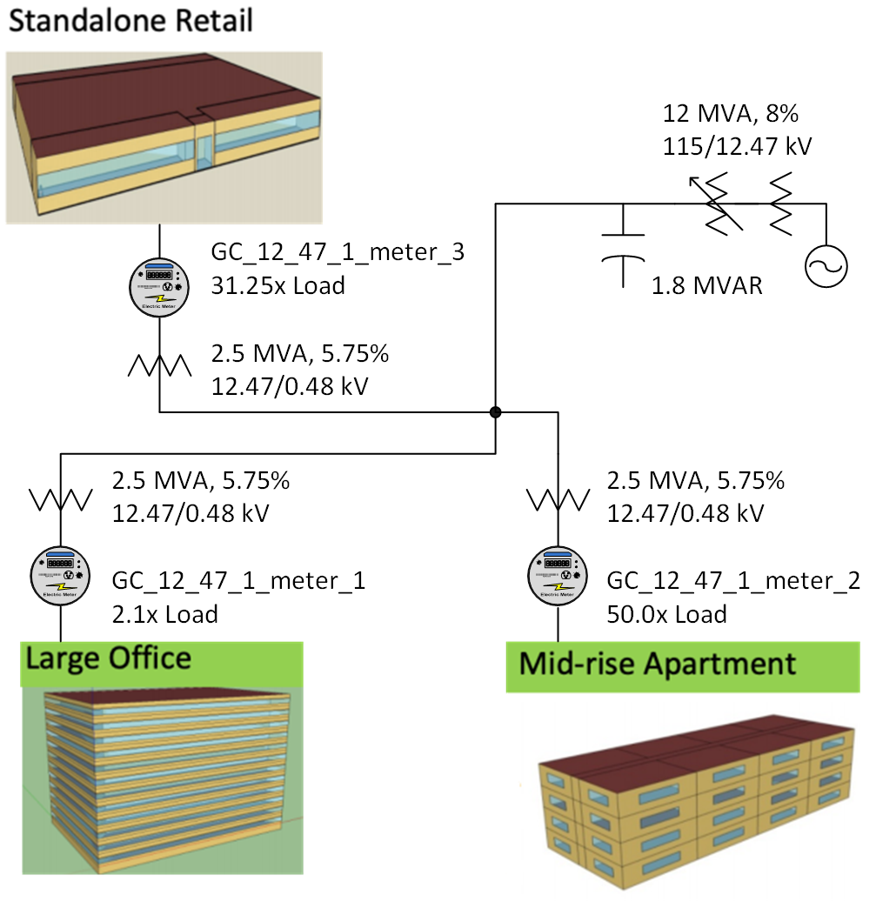
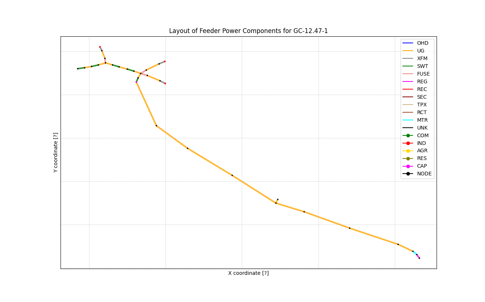
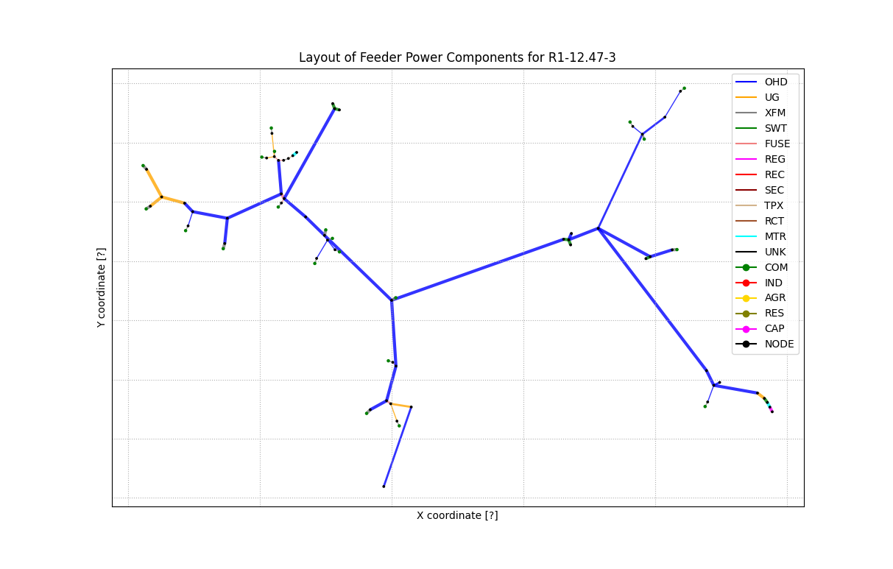
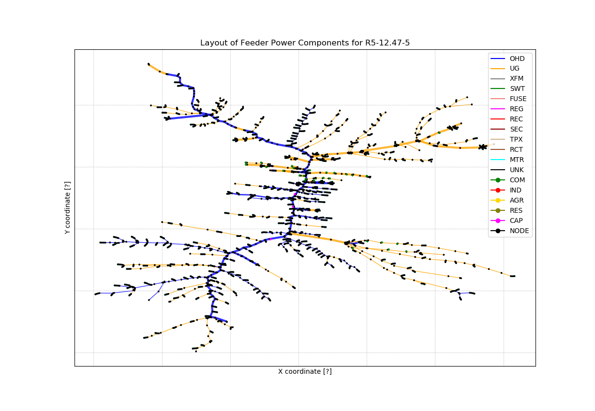

# Communication Network Example

This example will compare a transactive case with and without an external
communication network. To run and plot the base case without comms:

1. python3 make_comm_base.py
2. cd Nocomm_Base
3. chmod +x *.sh
4. ./run.sh
5. python3 plots.py Nocomm_Base

# Combined Feeder Example

This example combines three populated GridLAB-D taxonomy feeders to run as one federate
with one substation transformer. 

First, configure each feeder separately to have the house,
storage, solar and other populations as if they were part of a standalone TESP case. There 
will be a case configuration JSON file for each feeder. It's important that each JSON file
have a unique CaseName, e.g., *Feeder1*, but a common WorkingDirectory, e.g., *./CombinedCase*

Second, run the Python script that combines all feeders into a single TESP case. Following
the example provided in *combine_feeders.py*, notice that the substation transformer size
has been set at 20 MVA to serve all three feeders, compared to the original 12 MVA size in
each separate JSON file. Your own example may need a different substation transformer size, but
otherwise, the modifications to *combine_feeders.py* should be straightforward.

Third, you have to change run.sh to run the combined case, because the *combine_feeders.py*
script leaves them set up to run just the first feeder.  There are two example modified files provided,
with the changes marked in ***bold italic***.

Fourth, you might need to hand-edit the PYPOWER JSON file, e.g., *Feeder1_pp.json*, with adjustments to the GridLAB-D/FNCS
load scaling factor.

## runcombined.sh

(export FNCS_BROKER="tcp://*:5570" && export FNCS_FATAL=YES && exec fncs_broker 4 &> broker.log &)

(export FNCS_FATAL=YES && exec gridlabd -D USE_FNCS -D METRICS_FILE=***CombinedCase***_metrics.json ***CombinedCase***.glm &> gridlabd.log &)

(export FNCS_CONFIG_FILE=***CombinedCase***_substation.yaml && export FNCS_FATAL=YES && exec python3 -c "import tesp_support.substation as tesp;tesp.substation_loop('***CombinedCase***_agent_dict.json','***CombinedCase***')"  &> substation.log &)

(export FNCS_CONFIG_FILE=pypower.yaml && export FNCS_FATAL=YES && export FNCS_LOG_STDOUT=yes && exec python3 -c "import tesp_support.api.tso_PYPOWER_f as tesp;tesp.tso_pypower_loop_f('Feeder1_pp.json','***CombinedCase***')"  &> pypower.log &)

(export WEATHER_CONFIG=Feeder1_weather.json && export FNCS_FATAL=YES && export FNCS_LOG_STDOUT=yes && exec python3 -c "import tesp_support.weatherAgent as tesp;tesp.startWeatherAgent('weather.dat')"  &> weather.log &)

## Running CombinedCase

To set up and run CombinedCase:

1. python3 combine_feeders.py
2. cd CombinedCase
3. cp ../runcombined.sh .
4. chmod +x *.sh
5. ./runcombined.sh

## Consensus Mechanism Example

### File Directory

- *autotest.py*;
- *combine_feeders.py*; script that combines three taxonomy feeders into a self-contained TESP case in the CombinedCase subdirectory (creates and/or overwrites the subdirectory as needed)
- *Comm_GC_towers.json*;
- *CommDef.json*;
- *Eplus_Restaurant.json*;
- *Feeder1.json*; feeder configuration to use R3-12.47-2 in CombinedCase
- *Feeder2.json*; feeder configuration to use GC-12.47-1 in CombinedCase (this is a commercial feeder with three 2.5-MVA load connection points for large buildings in EnergyPlus/Modelica, or industrial loads defined in player files)
- *Feeder3.json*; feeder configuration to use R1-12.47-3 in CombinedCase
- *Feeder4.json*; feeder configuration to use R1-12.47-3, with batteries and PV in VOLT_VAR mode, in CombinedCase
- *GC_Feeder.png*;
- *make_comm_base.py*; script that reads Nocomm_Base.json and creates a self-contained TESP case in the Nocomm_Base subdirectory (creates and/or overwrites the subdirectory as needed)
- *make_comm_eplus.py*; script that reads CommDef.json and creates a self-contained TESP case, with GridLAB-D and three EnergyPlus federates, in the Comm_Eplus subdirectory (creates and/or overwrites the subdirectory as needed)
- *new_GC-12.47-1.json*;
- *Nocomm_Base.json*; case configuration for the R5-12.47-5 feeder with no large building and no communications network
- *R1-12.47-3.png*;
- *R3-12.47-2.png*;
- *R5-12.47-5.png*;
- *runcombined.sh*; example hand-edited script file to run CombinedCase with FNCS
- *runcombinedh.sh*; example hand-edited script file to run CombinedCase with HELICS
- *show_config.py*; script that shows the case configuration GUI; use to open, edit and save Nocomm_Base.json
- *tabulate_responses.py*; script that measures daytime kW vs. delta-Temperature setting on three EnergyPlus buildings

Layout of the full-order feeder models used in this example.

Copyright (c) 2017-2022, Battelle Memorial Institute

License: https://github.com/pnnl/tesp/blob/main/LICENSE
