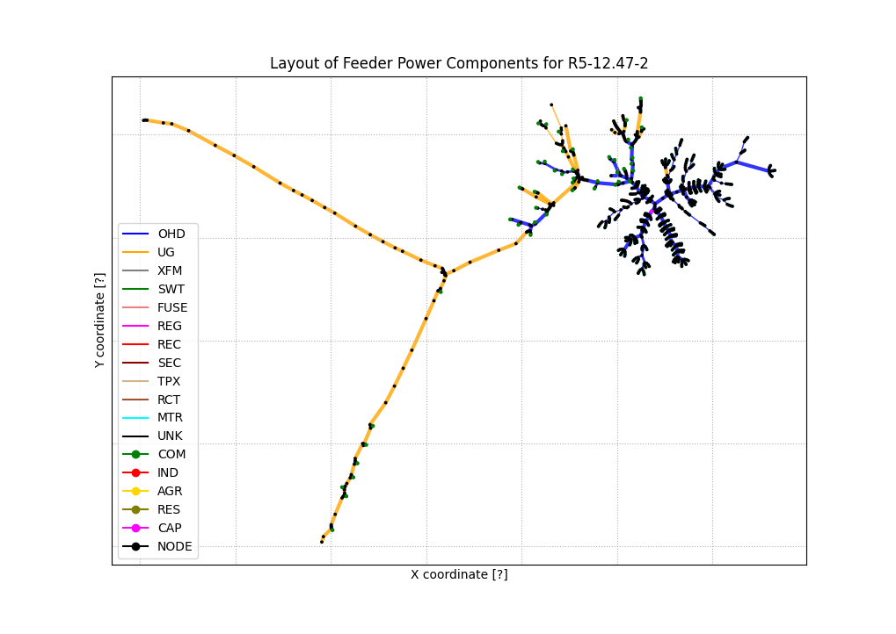
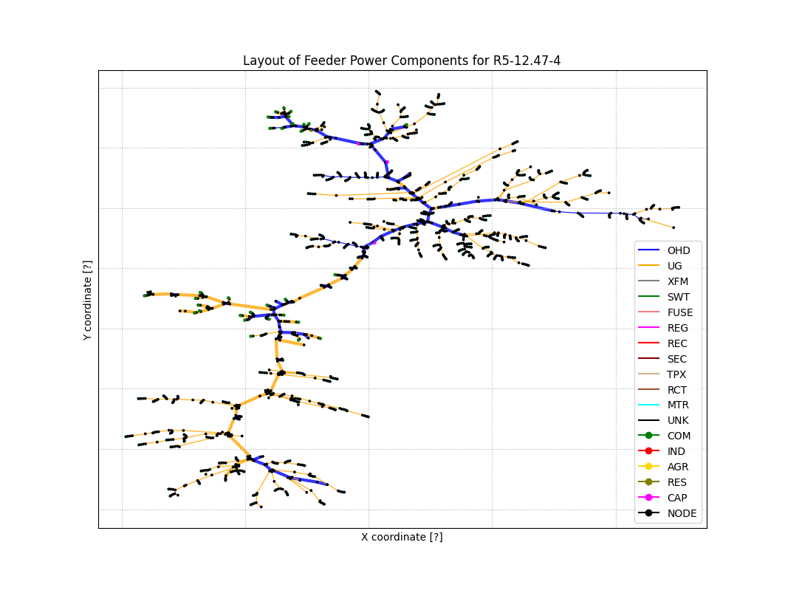
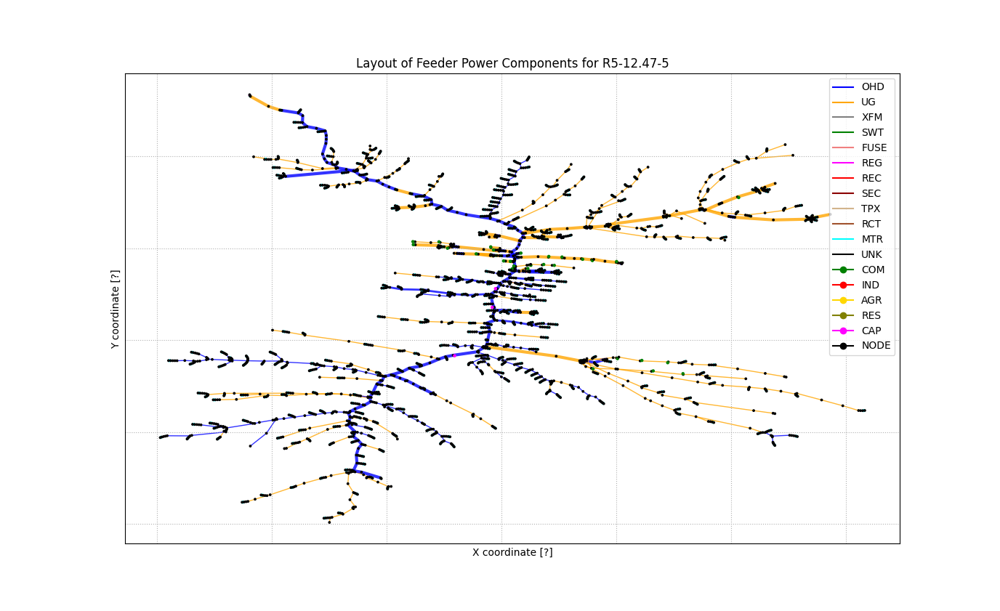

ERCOT Feeder Model Files
------------------------

Copyright (c) 2018-2022, Battelle Memorial Institute

Directory of input and script files:

 - *clean.sh*; removes temporary GridLAB-D output files
 - *populate_feeders.py*; writes 8 populated feeders to ../case8
 - *sim_R5-12.47-?.glm*; reduced-order primary feeder backbones
 - *test_parser.py*; tests the parsing of FNCS messages with units or complex numbers

To use these files:

	 a. edit populate_feeders.py to change such parameters as the percentage of air conditioners participating in a transactive system
	 b. "python3 populate_feeders.py" to write new feeder models to ../case8. This step overwrites any existing feeder models by the same name in ../case8

Layout of the full-order feeder models used in this example.

