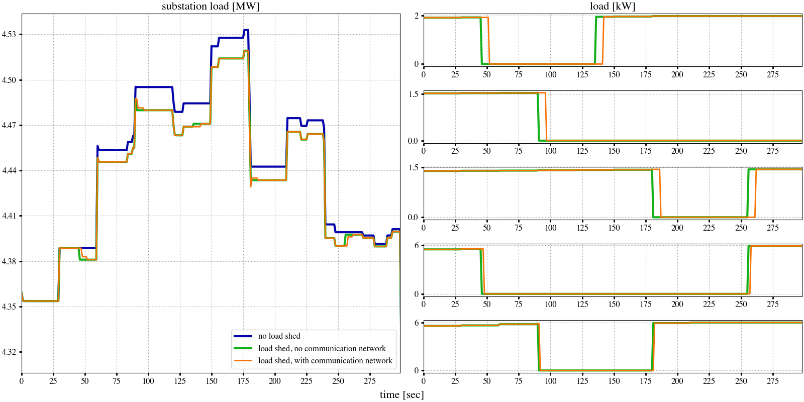

..
    _ Copyright (C) 2021-2022 Battelle Memorial Institute
    _ file: loadshed-taxonomy-feeder-doc.rst

*loadshed* on a Prototypical Feeder with Point-to-Point Communication Network
*****************************************************************************

This particular version of the *loadshed* example offers the ability to build a point-to-point communication network on top of a prototypical feeder :cite:`osti_1040684`. It has been developed to introduce a manageable communication network modeled in ns-3, which could include as nodes any of the nodes in a populated prototypical feeder. This allowed to build a communication network of smaller or larger size to study the scalability of the ns-3 models for large power distribution systems applications, and the impact the size of the communication network has on their performance.

Co-Simulation Architecture
==========================

The directory structure for this example follows the structure:

- *R1-12.47-1* folder contains:

  - *R1-12.47-1_processed.glm* - the populated prototypical feeder GridLAB-D model, obtained by running the *feederGenerator.py*`* script;
  - *R1-12.47-1_HELICS_gld_msg.json* - the HELICS configuration file for the GridLAB-D model containing the subscription, publications, or the end points that allow the GridLAB-D federate to interact with other federates. In this particular case, several end points corresponding to particular loads in the system publish their current power demand and subscribe ot command on their connection status, that is either to stay *IN_SERVICE* or go *OUT_OF_SERVICE* when load needs to be dropped.

- *R1-12.47-1-substation* folder contains:

  - *R1-12.47-1_substation.py* - the substation federate running at the level of the distribution model substation node, monitoring points in the network, and deciding when and what loads should be dropped.
  - *R1-12.47-1_HELICS_substConf.json* - the HELICS configuration file for the substation federate.
  - *loadshedScenario.json* - the load shed scenario given in dictionary format to suggest when and what loads are to be taken offline and/or brought back online. For example, the following dictionary entry

  .. code::

    {
      [...],
      "180":
      {
        "R1_12_47_1_tn_2_mhse_2": "OUT_OF_SERVICE",
        "R1_12_47_1_tn_562_mhse_2": "IN_SERVICE"
      },
      [...]
    }

  is interpreted by the substation federate to command at second 180 in the co-simulation to *R1_12_47_1_tn_2_mhse_2* to go offline, while *R1_12_47_1_tn_562_mhse_2* is brought online.

  **Caveat:** The names of the assets in *loadshedScenario.json* file need to be exactly the same as the names in the GridLAB-D model, and in order for the outcome to be as expected, these particular assets need to be among the ones listed as HELICS subscribers for GridLAB-D model.

- *R1-12.47-1-communication* folder contains:

  - *loadshed-p2p-network.cc* - the ns-3 model that builds a point-to-point (p2p) network between a series of nodes in the distribution system that required to communicate. The model is written to allow for an interactive way of selecting which nodes of the distribution system to be nodes in the communication network. However, keep in mind that due to the linked hierarchy in the distribution network, some nodes might be mandatory to make sure there is a path between two communicating ones.

  **Caveat:** Before running the co-simulation including the communication network, or any time after a modification is made to the model file, the model needs to be compiled using the provided *Makefile*, by running:

  .. code::

    make clean
    make

  .. code::

    {
      "Simulation": {
        "Simulation_Duration": 300,
        "Verbose": "true",
        "Case_Name": "R1-12.47-1_HELICS",
        "ns3_Network_Config": "./R1-12.47-1_ns3.json",
        "ns3_EP_Config": "./R1-12.47-1_HELICS_ns3Conf_5CtrlHouses.json",
        "Anim_File": "./R1-12.47-1_HELICS_anim_P2P.xml",
        "Routing_File": "./R1-12.47-1_HELICS_route_P2P.xml",
        "Err_Log_File": "./R1-12.47-1_HELICS_P2P.log",
        "Node_Loc_File": "./R1-12.47-1_HELICS_P2P_nodes_reduced.txt",
        "Links_Loc_File": "./R1-12.47-1_HELICS_P2P_links.txt",
        "Node_List_File": "./R1-12.47-1_HELICS_P2P.lst"
      }
    }

Running the demonstration
=========================

.. _loadshed-results:

  Loadshed example results

Bibliography
============

.. bibliography:: ../references/refs.bib
   :all:
   :style: plain