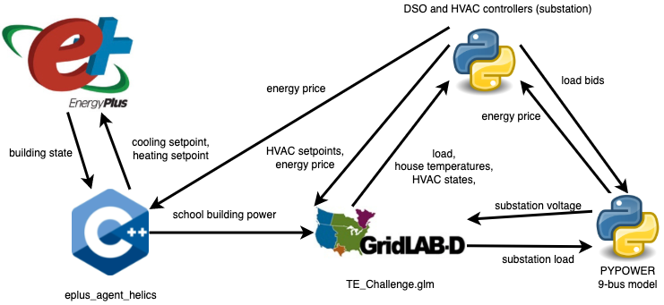
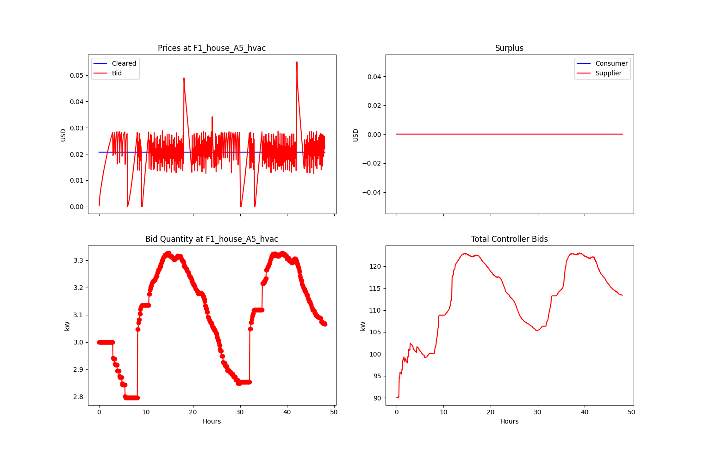
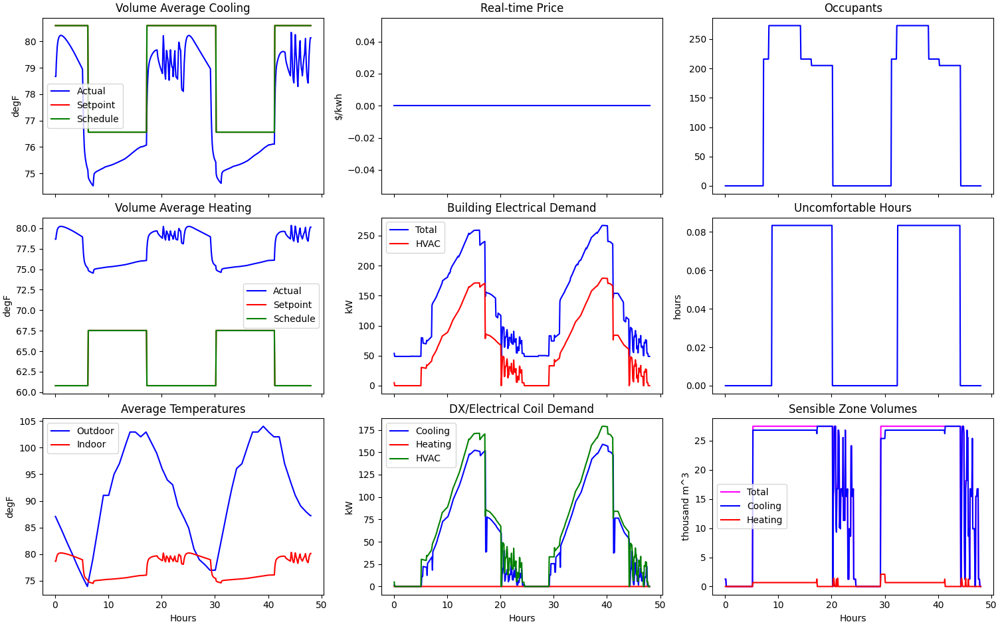
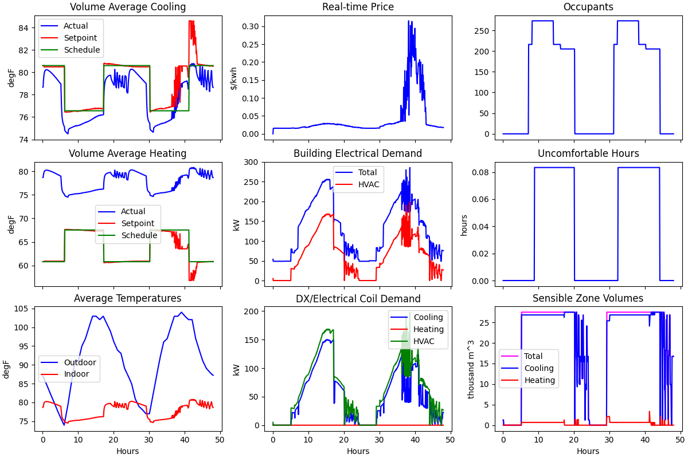
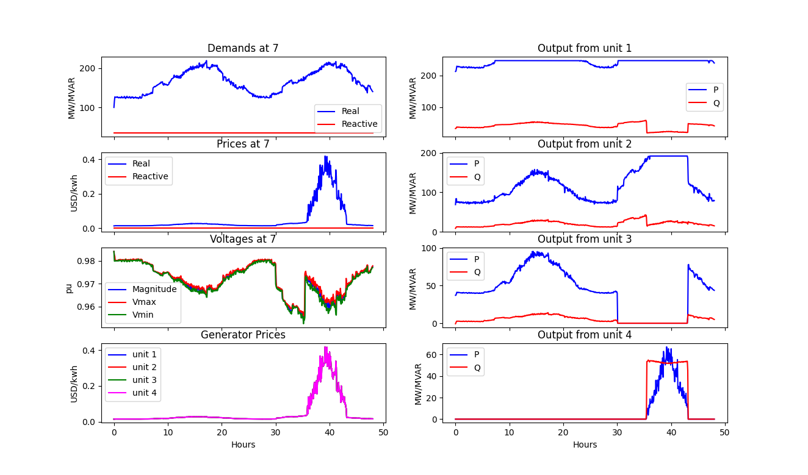
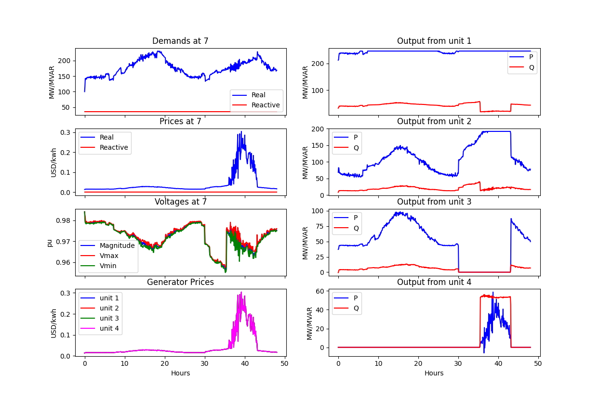
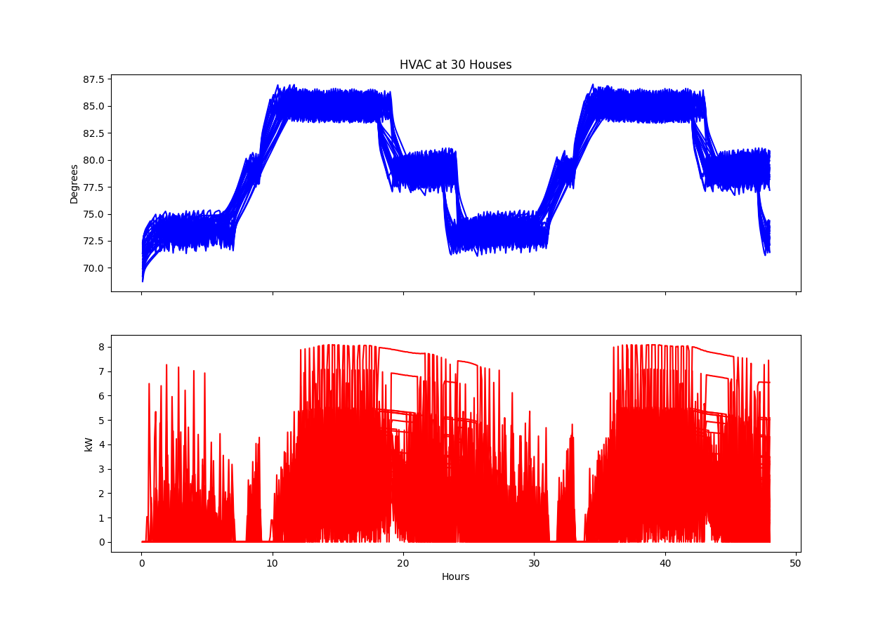
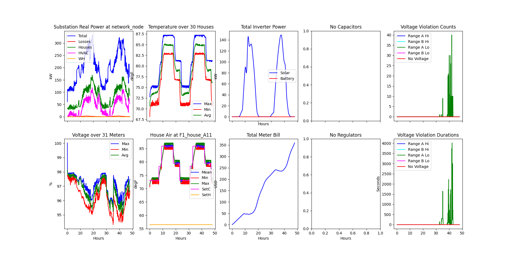
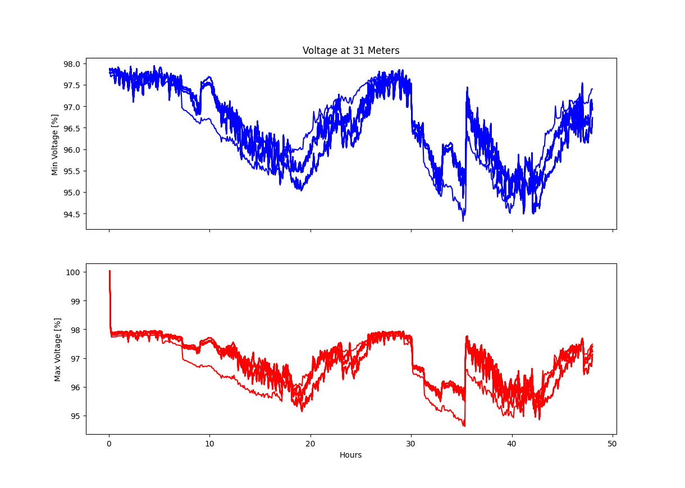

==================
TE30 Demonstration
==================

Co-Simulation Architecture
~~~~~~~~~~~~~~~~~~~~~~~~~~
The TE30 demonstration was developed as part of `NIST's TE Challenge <https://www.nist.gov/el/smart-grid/hot-topics/transactive-energy-modeling-and-simulation-challenge>`_ This example file comprises 30 houses and a school building on a small, stiff, distribution circuit. It provides a medium-level test case for multiple HVAC transactive agents, with or without the double-auction real-time energy market.

The co-simulation data-exchange architecture is shown in the figure below. EnergyPlus is used the model a school that is attached to the distribution system and has a transactive agent that receives building state information and based on market conditions, adjusts the HVAC system's setpoints. The power consumption of the building is also sent to GridLAB-D. 

GridLAB-D simulates the physics of the power system and and the houses, providing electrical state information to the bulk power system model and thermodynamic and electrical information on the houses in the model. Each house also has rooftop solar PV whose production is calculated by GridLAB-D. The distribution system operator (DSO) is modeled as an external python agent, and for performance reasons, the residential HVAC transactive agents are included in this code; this demonstration calls this the "substation" object. 

The HVAC transactive controllers collect information on the state of their constituent houses and use that to form bids for the real-time energy market. The DSO (substation) aggregates these bids and presents them to the bulk power system real-time energy market which is run by PYPOWER. PYPOWER collects these bids and performs an economic dispatch operation which defines the locational marginal price (LMP) for real-time energy at each transmission node, including the one to which the GridLAB-D model is attached; the LMP is communicated to the DSO. PYPOWER also calculates the physics of the bulk power system by running a powerflow which defines the voltage at the substation of the GridLAB-D model. 

Running the Demonstration
~~~~~~~~~~~~~~~~~~~~~~~~~

**NOTE:** This example can take several minutes to run.
After launching the appropriate "run" shell script check the status of the co-simulation by looking at the output of the "TE_ChallengeH0.csv" or "TE_ChallengeH.csv", depending on which run script is being used. This can be most easily done by running `tail -f TE_ChallengeH0.csv` and looking for new values to stop being written to the file. 

TE30 without the transactive market
...................................
::

    python3 prepare_case.py # creates additional configuration files, only needs to be run once
    ./runh0.sh
    python3 plots.py TE_ChallengeH0

TE30 with the transactive market
................................
::

    python3 prepare_case.py # not needed if already run for TE_ChallengeH0
    ./runh.sh 
    python3 plots.py TE_ChallengeH

Results
~~~~~~~

Running any of the above versions and plotting the results will yield the following graph.

Transactive HVAC Controllers
.............................
Base case

Transactive case

.. image:: ../../../doc/media/te30/te30_H1_Controllers.png
    :width: 800
    
    

School (EnergyPlus)
...................
Base case

Transactive case

Bulk Power System Generators (PYPOWER)
......................................
Base case

Transactive case

Residential HVAC (GridLAB-D)
............................
Base case

Transactive case

.. image:: ../../../doc/media/te30/te30_H1_HVACs.png
    :width: 800
    
    
Rooftop Solar PV (GridLAB-D)
............................
Base case

Transactive case

.. image:: ../../../doc/media/te30/te30_H1_Inverters.png
    :width: 800
    
    
Residential Votlage (GridLAB-D)
............................
Base case

Transactive case

.. image:: ../../../doc/media/te30/te30_H1_Voltages.png
    :width: 800

File Listing
~~~~~~~~~~~~

* *clean.sh* - script that removes output and temporary files
* *DeDeprecate.py*
* *gui.sh*
* *helics_eplus_agent.json* - HELICS configuration file for the EnergyPlus agent
* *helics_eplus.json* - HELICS configuration file for EnergyPlus
* *launch_pp.py* - helper script that launches PYPOWER from tesp_monitor
* *launch_substation.py* - helper script that launches the Python substation agents from tesp_monitor
* *NonGLDLoad.txt* - text file of non-responsive loads on transmission buses
* *outputs_te.glm* - defines GridLAB-D data to record
* *phase_A.player*
* *plots.py* -  makes 5 pages of plots for a case: eg 'python plots.py TE_Challenge'
* *prepare_case.py* -  sets up the dictionaries and GLD/Agent FNCS configurations for all cases
* *pypowerConfig.json* - HELICS configuration file for PYPOWER
* *README.md* - this file
* *runh.sh* - script for the case with  market
* *runh0.sh* - script for the case without transactive real-time energy market
* *TE_Challenge.glm* - GridLAB-D system definition
* *te30_pp.json* - PYPOWER bulk power system modle definition

Copyright (c) 2017-2022, Battelle Memorial Institute

License: https://github.com/pnnl/tesp/blob/master/LICENSE

